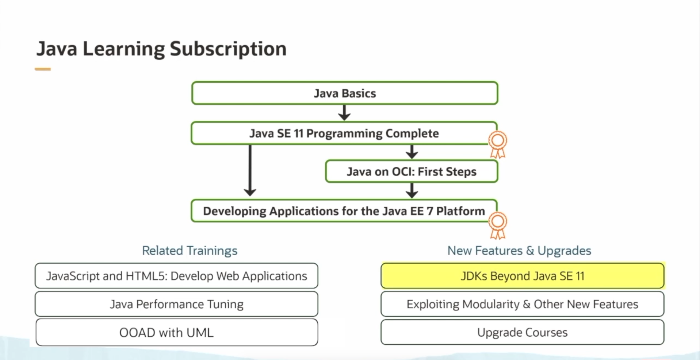

# 13. Continue Your Learning as a Java Programmer

DESCRIPTION

An overview of the Java Learning Subscription, Certification and digital+live sessions

## 01. What's Next 5m

Java Basics, What's Next. In this module, we'll learn a little bit more about the Java Learning Subscription from Oracle University, Java CE and EE certifications, methodology, tools, and techniques that are offered as part of the Java Learning Subscription, and the Digital+Live sessions. The Java Learning Subscription includes hundreds of hours of recorded training and education on Java and related topics. Right now, you're right here taking Java Basics. Once you sign up for the subscription, then you have access to the rest of our courses.

The first one you probably want to look at is Java SE 11 Programming Complete. This is a full-blown in-depth course for teaching you all the aspects of Java SE programming, and start getting you prepared for certification. From there, it really depends on what your path is, and what you want to do. We suggest Java on Oracle Cloud Infrastructure First Steps to see how to work with Java in the Oracle Cloud, and then if you're doing Enterprise applications, to go on to Developing Applications for the Java EE 7 Platform. Both Java SE 11 Programming Complete and Developing Applications for Java EE 7 lead to certification.

The Java Learning Subscription also includes training on related topics like JavaScript and HTML5 for developing the front ends for your web applications that will call your Java code, Java Performance Tuning, where you can learn tips and techniques to improve the performance of your Java code, and object-oriented analysis and design using UML, where you'll learn how to analyze problem domains, and then design and build the appropriate classes, data, and behaviors for the application. We also have courses on new features and upgrades, for example, the Java Development Kit Beyond Java EE 11, how to exploit modularity and other new features in the Java programming language, and other upgrade courses.

We also support Java certification and preparation for the certification. We support the Java EE certified professional certification, and the Java EE certified professional certification. We also have extensive courses that cover the design and analysis aspects of object-oriented programming. Topics include modeling systems for object-orientation-- and you already saw a little bit of that in this course when we talked about UML-- creating efficient algorithms and design patterns, using data structures and collections correctly, and practicing Java interviewing tips and techniques.

We also offer Digital+Live sessions. These are scheduled live sessions with instructors, product managers, consultants, and subject matter experts, SME's. This is an opportunity to learn more, and also to ask questions and interact live. Categories of topics include trending topics-- what's new-- how to do things, best practices, preparing for exams, and hearing about customer success stories.

So why Oracle's Java Learning Subscription? Well, first of all, there's hundreds of hours of high-quality video with the actual audio transcribed. So at times, for example, you may have found (LAUGHING) some of my presentation to be a little quick. I do tend to talk a little fast. But with the transcription, you can easily read and see what I was saying.

Oracle provides a configured lab environment for doing your lab exercises, set up and configured and ready to go. Now we didn't do that here in this course, because it was a free course. But in the Java Learning Subscription, we do provide the lab environments.

There are guided exercises with solutions, and additional open-ended workshops and case studies to extend your abilities. It's a one-stop shop for all your job education and training. And you can access the self-paced content at your leisure.

When you're ready to continue your Java education and training, take a look at the Java Learning Subscription, and within it, the different Java learning paths, one for Standard Edition, one for Enterprise Edition, and one for working with the Oracle Cloud. Also, look at the certification available as well. Click here to start your Java education and training.

## 02. Take me to the Java Learning Subscription - Content Link

Take me to the Java Learning Subscription

Continue your learning with the Java Learning Subscription

[View Content](https://github.com/adolfodelarosades/Java/blob/master/temarios/500-Java-Oracle-University/505-Java-Explorer.md)
