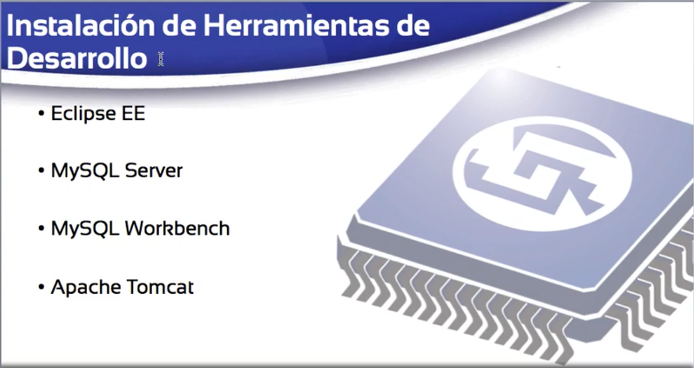
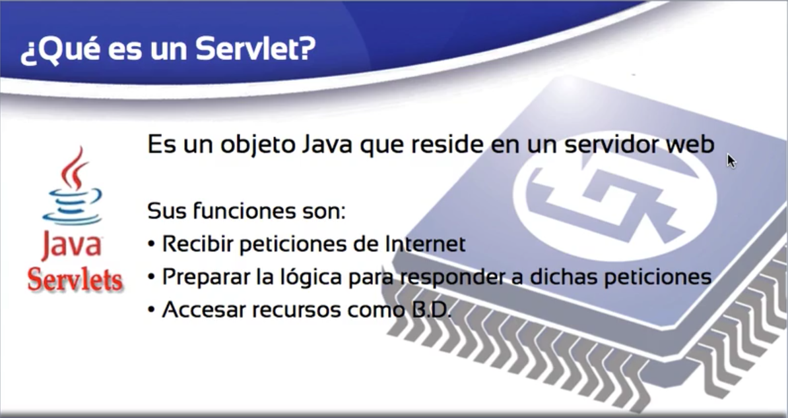
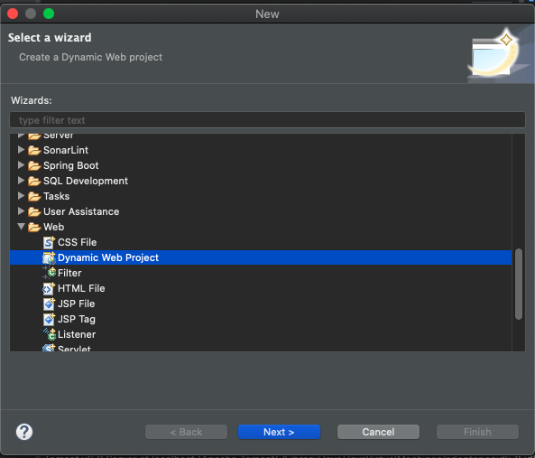
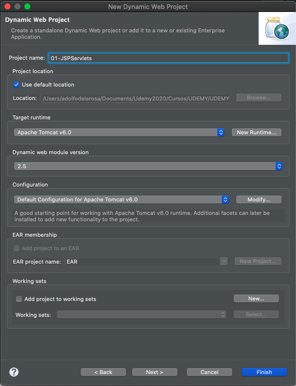
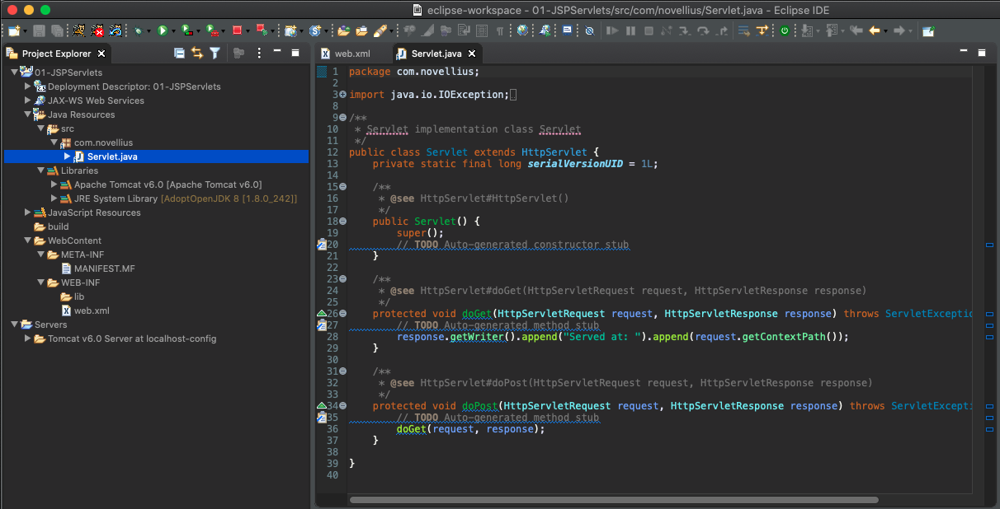
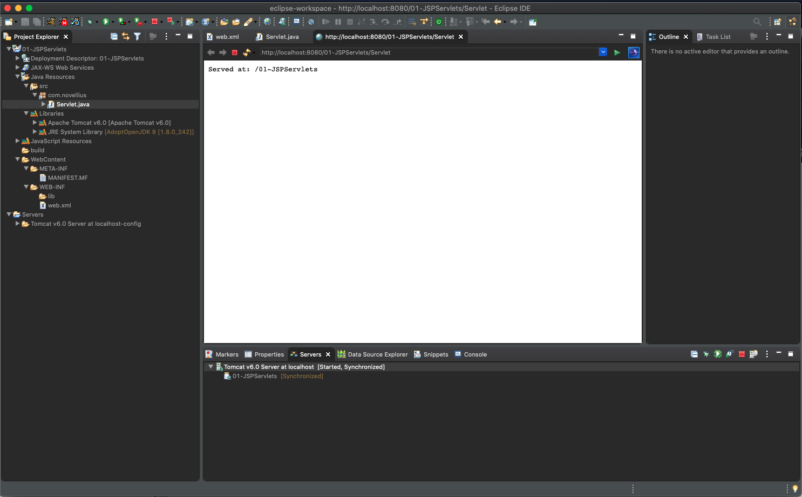

# 1. Introducción 40:13

* Instalación de las Herramientas de Desarollo 06:45
* Creación del primer Servlet 13:12
* Añadiendo contenido dinámico con JSP 07:47
* Diferencia en la ejecución de una página HTML y una JSP 04:37
* El Modelo 1 VS el Modelo Vista Controlador (MVC) 07:52

## Instalación de las Herramientas de Desarollo 06:45

En este curso vamos a desarrollar una aplicación web dinámica basada en *JSP* y *Servlets* implementando una arquitectura conocida como MVC Modelo Vista Controlador.

Al final de este curso vamos a desplegar nuestra aplicación en un servidor web gratuito para que conozcas cómo se configura y cómo desplegarlo con una URL real.



Vamos a instalar nuestras herramientas de desarrollo para nuestra aplicación web las cuales van a ser:

* [Eclipse](http://www.eclipse.org) 
* [MySQL](https://dev.mysql.com/downloads/mysql/)
* [Workbench](https://dev.mysql.com/downloads/workbench/)
* [Apache Tomcat](http://tomcat.apache.org/)

**NOTA**: El el video origina se instala todo en un Mac y *se ven todos los detallos para cada herramienta*.

## Creación del primer Servlet 13:12



Vamos a crear nuestro primer Servlet.






 Asegúrate de tener seleccionada la versión 2.5. Si no seleccionas la versión 2.5 no nos va a generar el archivo descriptor **web.xml** y va a usar anotaciones, para efectos de este curso usaremos el archivo **web.xml** así que vamos a usar la versión 2.5 en nombre del proyecto.


*Estructura del proyecto 01-JSPServlets*

En la carpeta **Java Resources** se almacenan todos los *Servlets* que almacenan la lógica o reglas de negocios de nuestra aplicación. 

En la carpeta **WebContent** se almacena toda la parte web es decir *JSPs*, *css*, *javascript*, etc. 

Vamos a crear un nuevo Servlet:


Introducimos el *nombre del paquete* y el *nombre de la clase*.



Un Servlet tiene un ciclo de vida y podemos ver información sobre esto en los siguientes enlaces:

* [Servlet Lifecycle](https://docs.oracle.com/javaee/6/tutorial/doc/bnafi.html)
* [Servlets - Life Cycle](https://www.tutorialspoint.com/servlets/servlets-life-cycle.htm)
* [Servlet Life Cycle](https://www.javatpoint.com/life-cycle-of-a-servlet)
* [Life Cycle of a Servlet](https://www.geeksforgeeks.org/life-cycle-of-a-servlet/)

Se generó el código para nuestro Servlet:

```java
package com.novellius;

import java.io.IOException;
import javax.servlet.ServletException;
import javax.servlet.http.HttpServlet;
import javax.servlet.http.HttpServletRequest;
import javax.servlet.http.HttpServletResponse;

/**
 * Servlet implementation class Servlet
 */
public class Servlet extends HttpServlet {
	private static final long serialVersionUID = 1L;
       
    /**
     * @see HttpServlet#HttpServlet()
     */
    public Servlet() {
        super();
        // TODO Auto-generated constructor stub
    }

	/**
	 * @see HttpServlet#doGet(HttpServletRequest request, HttpServletResponse response)
	 */
	protected void doGet(HttpServletRequest request, HttpServletResponse response) throws ServletException, IOException {
		// TODO Auto-generated method stub
		response.getWriter().append("Served at: ").append(request.getContextPath());
	}

	/**
	 * @see HttpServlet#doPost(HttpServletRequest request, HttpServletResponse response)
	 */
	protected void doPost(HttpServletRequest request, HttpServletResponse response) throws ServletException, IOException {
		// TODO Auto-generated method stub
		doGet(request, response);
	}

}
```
*Servlet.java*

Observaciones sobre el Servlet:

* El Servlet hereda de `HttpServlet`
* Cuenta con un constructor
* Tiene dos métodos:
   * `doGet()`
   * `doPost()`
   * Estos dos métodos tienen dos parámetros:
      * `request`
      * `response`

Podemos **ejecutar el servlet** de la siguiente manera:


Se nos pide que indiquemos en que servidor se va a ejecutar el Servlet. Una vez que pinchemos en *Finish* se carga nuestro servidor y se ejecuta nuestro Servlet.



También podemos cargar el URL `http://localhost:8080/01-JSPServlets/Servlet` en un navegador:


Vamos a hacer algunos cambios en el método `doGet()` para mostrar un HTML, ingrese el siguiente código en `doGet()`:

```java
protected void doGet(HttpServletRequest request, HttpServletResponse response) throws ServletException, IOException {
		// TODO Auto-generated method stub
		//response.getWriter().append("Served at: ").append(request.getContextPath());
		
		PrintWriter out = response.getWriter();
		
		out.println("<!DOCTYPE html>");
		out.println("<html>");
		out.println("<head>");
		out.println("<title>Page Title</title>");
		out.println("</head>");
		out.println("<body>");
		out.println("<h1>Primer Servlet</h1>");
		out.println("<p>Creación del primer Servlet.</p>");
		out.println("</body>");
		out.println("</html>");
	}
```

Al ejecutarlo tenemos:


## Añadiendo contenido dinámico con JSP 07:47

## Diferencia en la ejecución de una página HTML y una JSP 04:37

## El Modelo 1 VS el Modelo Vista Controlador (MVC) 07:52

