# 2. Creación de un Diseño MVC 55:43

* El archivo WEB.xml 06:35
* Añadiendo más vistas al controlador 06:57
* Control de parámetros HTTP GET con Scriplets 09:24
* Control de parámetros HTTP POST mediante el Servlet 05:29
* Paso de parámetros desde Servlet hacia una vista JSP 13:49
* Uso de parámetros iniciales en el Servlet 07:10
* Mejorando el Controlador con un nuevo método de redirección 06:19

## El archivo WEB.xml 06:35

Cuando creamos el proyecto de la lección anterior se creo el archivo **web.xml** con el siguiente contenido.

```html
<?xml version="1.0" encoding="UTF-8"?>
<web-app xmlns:xsi="http://www.w3.org/2001/XMLSchema-instance" xmlns="http://java.sun.com/xml/ns/javaee" xsi:schemaLocation="http://java.sun.com/xml/ns/javaee http://java.sun.com/xml/ns/javaee/web-app_2_5.xsd" id="WebApp_ID" version="2.5">
  <display-name>04-JSPServlet</display-name>
  <welcome-file-list>
    <welcome-file>index.html</welcome-file>
    <welcome-file>index.htm</welcome-file>
    <welcome-file>index.jsp</welcome-file>
    <welcome-file>default.html</welcome-file>
    <welcome-file>default.htm</welcome-file>
    <welcome-file>default.jsp</welcome-file>
  </welcome-file-list>
  <servlet>
    <description></description>
    <display-name>Servlet</display-name>
    <servlet-name>Servlet</servlet-name>
    <servlet-class>com.novellius.Servlet</servlet-class>
  </servlet>
  <servlet-mapping>
    <servlet-name>Servlet</servlet-name>
    <url-pattern>/Servlet</url-pattern>
  </servlet-mapping>
</web-app>
```

El tag `<welcome-file-list>` se creo cuando creamos nuestro proyecto, posteriormente al crear nuestro Servlet inserto los tags `servlet` y `servlet-mapping`.

En el tag `<servlet>` definimos lo siguiente:

* Descripción del Servlet
* Nombre que se muestra
* Nombre del Servlet
* Clase que lo define

En el tag `<servlet-mapping>` es muy importante por que nos permite mapear o añadir una **raíz de contexto** al Servlet, definimos lo siguiente:

* Nombre del Servlet
* URL

#### ¿Qué es la Raíz de Contexto?

Cuando ejecutamos un proyecto se carga un URL por ejemplo:

### `http://localhost:8080/04-JSPServlet/`

En este caso la ***raíz de contexto*** es **`/04-JSPServlet/`** la cual puede servir para identificar alguna sección de la aplicación Web. Ya habíamos mencionado que esta ra´z de contexto la podemos eliminar, vamos a hacerlo:


Simplemente borramos el Path:


Al ejecutar el proyecto nuestra URL ya no presenta la raíz de contexto. 

`http://localhost:8080/`


Volviendo a nuestro `web.xml` observemos nuestro tag `<servlet-mapping>` actual:

```html
<servlet-mapping>
    <servlet-name>Servlet</servlet-name>
    <url-pattern>/Servlet</url-pattern>
</servlet-mapping>
```

Podemos ver que el `<url-pattern>` esta mapeado con `/Servlet` por lo que si ejecutamos el URL `http://localhost:8080/Servlet` también se ejecutara nuestro proyecto:


Pero si usamos otro texto ya no encontrara nuestro Servlet y nos marcara lo siguiente:

`http://localhost:8080/OtraCosa`


En el mapeo que realicemos podemos poner un texto personalizado, si el Servlet lo usamos para Administrar nuestra web podríamos poner el siguiente mapeo:

```html
<servlet-mapping>
    <servlet-name>Servlet</servlet-name>
    <url-pattern>/admin/*</url-pattern>
</servlet-mapping>
```

Tenemos `/admin/*` vemos que este mapeo a añadido `/*` lo cual permite insertar cualquier cosa despues de `/admin` esto por ejemplo nos permitira enviar parámetros. 

Los siguientes enlaces nos cargarán nuestro proyecto.

`http://localhost:8080`


`http://localhost:8080/admin`


`http://localhost:8080/admin?accion=inicio`

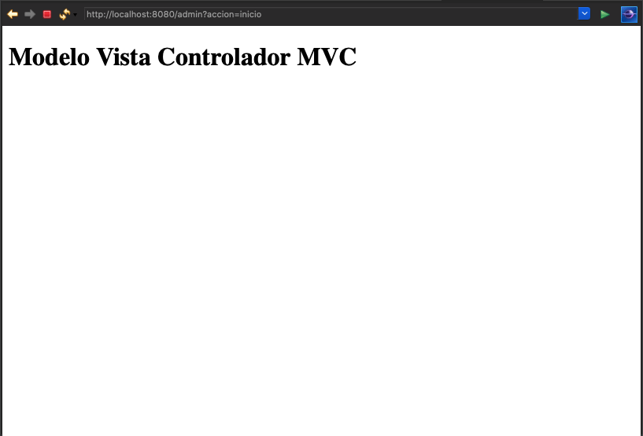

`http://localhost:8080/admin/contabilida`

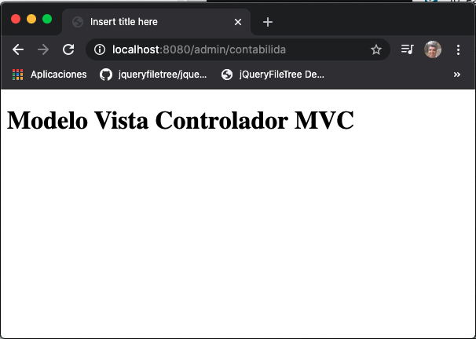

Pero si usamos `http://localhost:8080/admin2` tendremos problemas:


Si no quisiera tener ningún tipo de mapeo y me acepte cualquier cosa podemos poner simplemente:

```html
<servlet-mapping>
    <servlet-name>Servlet</servlet-name>
    <url-pattern>//*</url-pattern>
</servlet-mapping>
```

Con esto los únicos URL válidos son 

`http://localhost:8080`

`http://localhost:8080/`

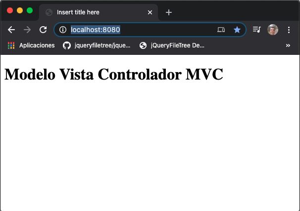

Cualquier otro URL no nos permitira cargar nuestro Servlet:

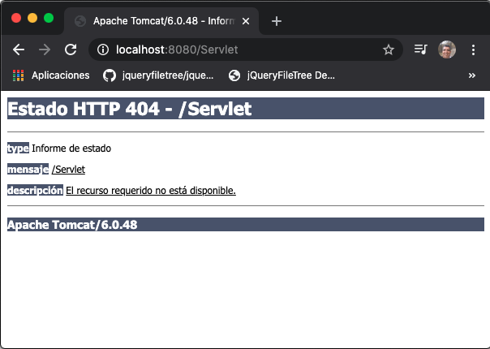

El descriptor `web.xml` también nos va a permitir acceso a JNDI que nos permite acceder a una BD de forma sencilla, recordemos que para tener el archivo `web.xml` debemos crear nuestro proyecto con la versión 2.5 para el **Dynamic web module version**, si selecciónamos la versión 3.0 en lugar de el archivo `web.xml` usaremos notaciones, esto lo permite a partir de Tomcat 7, con Tomcat 6 no se permiten versiones superiores a 2.5.

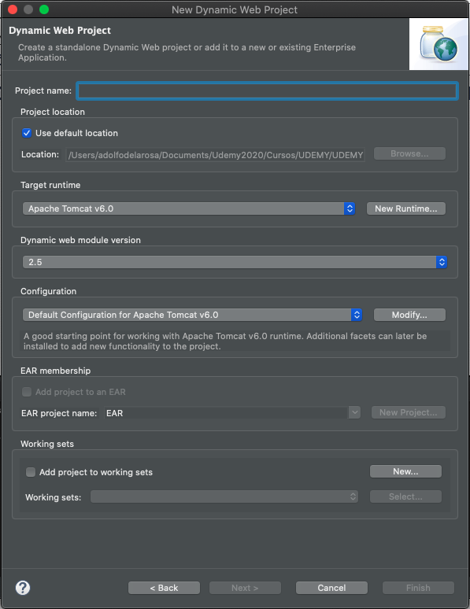

## Añadiendo más vistas al controlador 06:57

En esta lección vamos a añadir un segundo JSP llamado `login.jsp`, actualmente tenemos el JSP `index.jsp` dentro de la carpeta `WebContent`.


Para organizar un poco nuestros JSPs dentro de la carpeta `WebContent` crearemos la carpeta `jsp` dentro de la cual moveremos el JSP `index.jsp` y crearemos el nuevo JSP `login.jsp`.


Listo, lo que hara nuestra aplicación es iniciar con la vista `index.jsp` y desde aquí nos permita movernos a la vista `login.jsp` una vez aquí tenemos tener la posibilidad de regresar a la vista `index.jsp`, todo esto siempre controlado por nuestro "Controlador".

Por lo que el código de nuestros archivos es el siguiente:

```java
protected void doGet(HttpServletRequest request, HttpServletResponse response) throws ServletException, IOException {

   String accion = request.getParameter("accion");
		
   if (accion != null) {
      if(accion.equals("inicio")) {
         getServletContext().getRequestDispatcher("/jsp/index.jsp").forward(request, response);
      } else  if(accion.equals("login")) {
         getServletContext().getRequestDispatcher("/jsp/login.jsp").forward(request, response);
      }
		
   }else {
      getServletContext().getRequestDispatcher("/jsp/index.jsp").forward(request, response);
   }
}
```

*Servlet.java*

Con `String accion = request.getParameter("accion");` recuperamos el parámetro `accion` que se envie al Servlet, y de acuerdo al valor recuperado redirecciona a una u otra Vista. 


```java
<%@ page language="java" contentType="text/html; charset=UTF-8"
    pageEncoding="UTF-8"%>
<!DOCTYPE html>
<html>
<head>
   <meta charset="UTF-8">
   <title>Ménu</title>
</head>
<body>

   <h1 align="center">Ménu</h1>
 	
   <ol>
      <li><a href="?accion=login">Iniciar Sesión</a></li>
   </ol>
   
</body>
</html>
```

*index.jsp*

Con `href="?accion=login"` envíamos el parámetro `accion` con valor `login`.

```java
<%@ page language="java" contentType="text/html; charset=UTF-8"
    pageEncoding="UTF-8"%>
<!DOCTYPE html>
<html>
<head>
   <meta charset="UTF-8">
   <title>Iniciar Sessión</title>
</head>
<body>

   <h1 align="center">Iniciar Sessión</h1>
	
   <p>
      <a href="?accion=inicio">&#60;&#60; Regresar</a>
   </p>
   
</body>
</html>
```

*login.jsp*

Con `href="?accion=inicio"` envíamos el parámetro `accion` con valor `inicio`.

Al Ejecutar nuestra aplicación tenemos el siguiente flujo, observe los diferentes URLs:

`http://localhost:8080`


`http://localhost:8080/?accion=login`

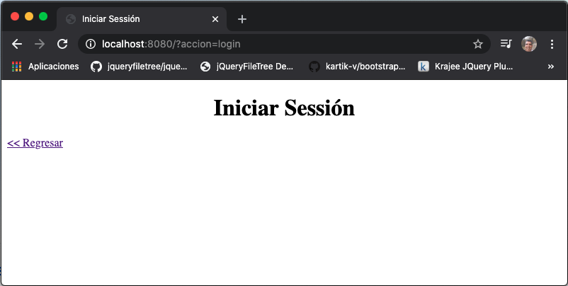

`http://localhost:8080/?accion=inicio`

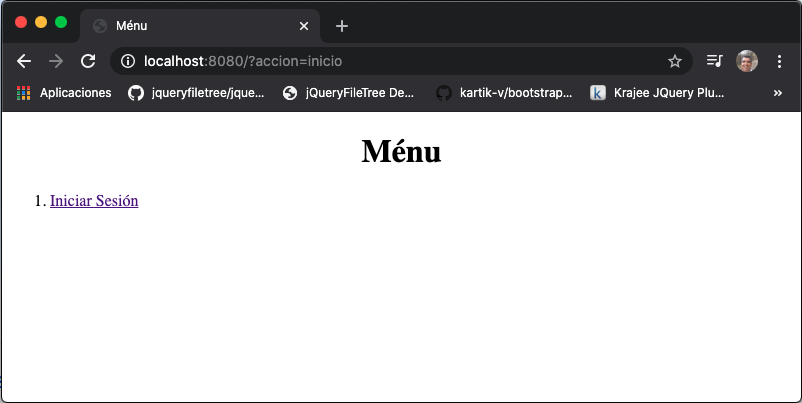

## Control de parámetros HTTP GET con Scriplets 09:24

En esta lección vamos a controlar el paso de parámetros HTTP GET con Scriplets dentro de una vista JSP.

Modificaremos nuestra vista `login.jsp` para que reciba un *usuario* y un *password* y cuando pulsemos el botón de aceptar nos lleve a una vista que nos muestre los datos introducidos, para lo cual también debemos modificar el controlador para que tenga una nueva opción para redireccionar a la nueva vista que llamaremos `postLogin.jsp`.

Vemos los códigos:

```java
protected void doGet(HttpServletRequest request, HttpServletResponse response) throws ServletException, IOException {

   String accion = request.getParameter("accion");
				
   if (accion != null) {
      if(accion.equals("inicio")) {
         getServletContext().getRequestDispatcher("/jsp/index.jsp").forward(request, response);
      } else  if(accion.equals("login")) {
         getServletContext().getRequestDispatcher("/jsp/login.jsp").forward(request, response);
      } else  if(accion.equals("iniciarSesion")) {
         getServletContext().getRequestDispatcher("/jsp/postLogin.jsp").forward(request, response);
      }
   }else {
      getServletContext().getRequestDispatcher("/jsp/index.jsp").forward(request, response);
   }
}
```

*Servlet.java*

Aquí solo hemos añadido un `else if` para el caso donde la `accion=iniciarSesion` nos rediriga a la vista `postLogin.jsp`.

```java
<%@ page language="java" contentType="text/html; charset=UTF-8"
    pageEncoding="UTF-8"%>
<!DOCTYPE html>
<html>
<head>
   <meta charset="UTF-8">
   <title>Iniciar Sessión</title>
</head>
<body>

   <h1 align="center">Iniciar Sessión</h1>
		
   <form method="get">
      <table>
         <tr>
	    <td>Usuario: </td>
	    <td><input type="text" name="usuario" /></td>
	 </tr>
	 <tr>
	    <td>Contraseña: </td>
	    <td><input type="password" name="contrasena" /></td>
	 </tr>
	 <tr>
	    <td><input type="hidden" name="accion" value="iniciarSesion"/></td>
	    <td><input type="submit" value="Iniciar Sesión" /></td>
	 </tr>
      </table>	
   </form>
	
   <p>
      <a href="?accion=inicio">&#60;&#60; Regresar</a>
   </p>
   
</body>
</html>
```

*login.jsp*

Aquí hemos añadido el formulario para leer los campos `usuario` y `contraseña`, además tenemos un campo adicional ***oculto** para envíar el párametro `accion` con el valor `iniciarSesion`.


```java
<%@ page language="java" contentType="text/html; charset=UTF-8"
    pageEncoding="UTF-8"%>
<!DOCTYPE html>
<html>
<head>
   <meta charset="UTF-8">
   <title>PostLogin</title>
</head>
<body>

   <h1>Sesión Iniciada</h1>
	
   <p>Los datos ingresados son:</p>
	
   <p>
   <%
      out.println("Usuario: " + request.getParameter("usuario"));
   %>
   </p>
	
   <!--  Otra forma de imprimir en un Scripler es la siguiente -->
   <p><%= "Contraseña: " + request.getParameter("contrasena") %></p>

</body>
</html>
```

*postLogin.jsp*

En esta vista mostramos los datos que se ingresarón en la vista `login.jsp` y que se mandan como parámetros a esta vista, si observamos el URL generado podemos verlos todos ya que se estan mandado a través de un método *get*. Otra cosa a recalcar se muestran dos formas de imprimir datos dentro de los de los scriplers, `<%= ...  %>` implicitamente tiene un `out.println` por lo que no es necesario ponerlo.

Al ejecutar nuestra aplicación tenemos:

`http://localhost:8080/`


`http://localhost:8080/?accion=login`


`http://localhost:8080/?usuario=adolfo%40gmail.com&contrasena=1234ABC&accion=iniciarSesion`

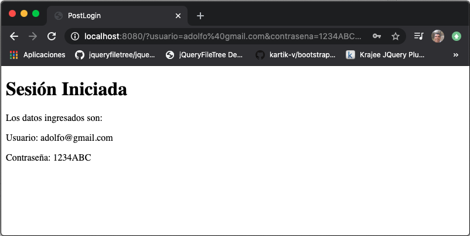

## Control de parámetros HTTP POST mediante el Servlet 05:29

En está lección vamos a ver como pasar parámetros HTTP POST al Servlet. Por lo cual tendremos que modificar nuestra vista `login.jsp` para que en lugar de usar el método `get` usar el método `post`, además de algunos cambios mas.

Vemos los códigos:

```html
<%@ page language="java" contentType="text/html; charset=UTF-8"
    pageEncoding="UTF-8"%>
<!DOCTYPE html>
<html>
<head>
   <meta charset="UTF-8">
   <title>Iniciar Sessión</title>
</head>
<body>
   
   <h1 align="center">Iniciar Sessión</h1>
		
   <form method="post" action="?accion=iniciarSesion">
      <table>
         <tr>
	    <td>Usuario: </td>
	    <td><input type="text" name="usuario" /></td>
	 </tr>
	 <tr>
	    <td>Contraseña: </td>
	    <td><input type="password" name="contrasena" /></td>
	 </tr>
	 <tr>
	    <td>&nbsp;</td>
	    <td><input type="submit" value="Iniciar Sesión" /></td>
	 </tr>
      </table>	
   </form>
	
   <p>
      <a href="?accion=inicio">&#60;&#60; Regresar</a>
   </p>
   
</body>
</html>
```

*login.jsp*

Básicamente hemos realizado dos cambios, cambiar el método `get` por `post` y hemos puesto el atributo `action="?accion=iniciarSesion"` dentro de el tag `form` por lo que eliminamos el campo oculto que hacia esa labor con `get`.


```java
protected void doGet(HttpServletRequest request, HttpServletResponse response) throws ServletException, IOException {

   String accion = request.getParameter("accion");
		
   if (accion != null) {
      if(accion.equals("inicio")) {
         getServletContext().getRequestDispatcher("/jsp/index.jsp").forward(request, response);
      } else  if(accion.equals("login")) {
         getServletContext().getRequestDispatcher("/jsp/login.jsp").forward(request, response);
      }
   }else {
      getServletContext().getRequestDispatcher("/jsp/index.jsp").forward(request, response);
   }
}

protected void doPost(HttpServletRequest request, HttpServletResponse response) throws ServletException, IOException {
		
      String accion = request.getParameter("accion");
				
      if (accion != null) {
         if(accion.equals("iniciarSesion")) {
	    System.out.println("Usuario: " + request.getParameter("usuario"));
	    System.out.println("Contraseña: " + request.getParameter("contrasena"));
	 }
      }else {
         getServletContext().getRequestDispatcher("/jsp/index.jsp").forward(request, response);
      }
		
}
```

*Servlet.java*

Aquí hemos eliminado del `doGet()` el manejo de la acción `iniciarSesion` que hemos implementado dentro del método `doPost()`, en caso de que esa opción sea invocada se pintarán en la conosola los parámetros `usuario` y `contrasena`, **no estamos redirigiendo a ninguna vista**.

Al ejecutar nuestra aplicación tenemos:

`http://localhost:8080/`


`http://localhost:8080/?accion=login`


Al pulsar el botón `Iniciar Sesión` invocamos el método `post` para el URL `http://localhost:8080/?accion=iniciarSesion`, es importante observar que como se esta usando el método `post` los parárametros `usuario` y `contrasena` ya no se muestran en el URL, solo se muestra `?accion=iniciarSesion` que es el valor del atributo `action` del tag `form`.

`http://localhost:8080/?accion=iniciarSesion`


Esta vista esta totalmente en blanco por que realmente no se invoco ningun JSP, solo se mando pintar los parámetros recibidos en la consola como podemos ver en la siguiente imágen.

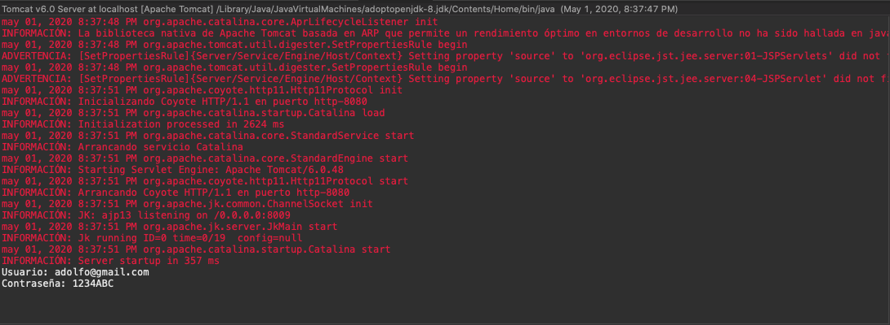

## Paso de parámetros desde Servlet hacia una vista JSP 13:49

En esta lección vamos a ver como pasar parámetros desde el Servlet a los JSPs, de tres formas distintas:

* Paso de parámetros por el ***Ambito del Request***, los parámetros solo estan disponibles para una petición 
* Paso de parámetros por el ***Ambito de la Session***, los parámetros estarán disponibles mientras la ventana del navegador este abierta o hasta destruir la sesión 
* Paso de parámetros por el ***Ambito del contexto o la aplicación***, los parámetros estarán disponibles hasta que el Servlet no ejecute el método `destroyer`

Vemos los códigos:

```java
protected void doPost(HttpServletRequest request, HttpServletResponse response) throws ServletException, IOException {
		
   String accion = request.getParameter("accion");
				
   if (accion != null) {
			
      if(accion.equals("iniciarSesion")) {
				
         //System.out.println("Usuario: " + request.getParameter("usuario"));
	 //System.out.println("Contraseña: " + request.getParameter("contrasena"));
				
	 String usuario = request.getParameter("usuario");
	 String contrasena = request.getParameter("contrasena");
				
	 // Ámbito Request
	 request.setAttribute("usuario", usuario);
	 request.setAttribute("contrasena", contrasena);
				
	 // Ámbito Sesión
	 HttpSession sesion = request.getSession();
	 sesion.setAttribute("usuario", usuario);
	 sesion.setAttribute("contrasena", contrasena);
				
	 // Ámbito Contexto
	 ServletContext contexto = getServletContext();
	 contexto.setAttribute("usuario", usuario);
	 contexto.setAttribute("contrasena", contrasena);
				
	 getServletContext().getRequestDispatcher("/jsp/postLogin.jsp").forward(request, response);
      }
			
   }else {
      getServletContext().getRequestDispatcher("/jsp/index.jsp").forward(request, response);
   }
		
}
```

*Servlet.java*

Hemos modificado el método `doPost()`, recuperamos los parámetros, los ponemos en los ambitos del request, sesión y contexto con el método `setAttribute` posteriormente redirigimos a la vista `postLogin.jsp`.


```html
<%@ page language="java" contentType="text/html; charset=UTF-8"
    pageEncoding="UTF-8"%>
<!DOCTYPE html>
<html>
<head>
<meta charset="UTF-8">
<title>PostLogin</title>
</head>
<body>
	<h1>Sesión Iniciada</h1>
	
	<p>Los datos ingresados son:</p>
	
	<h2>Request</h2>
	
	<p>
	<%
		out.println("Usuario: " + request.getAttribute("usuario"));
	%>
	</p>
	
	<!--  Otra forma de imprimir en un Scripler es la siguiente -->
	<p><%= "Contraseña: " + request.getAttribute("contrasena") %></p>
	
	<h2>Sesión</h2>
	
	<p>
	<%
		out.println("Usuario: " + session.getAttribute("usuario"));
	%>
	</p>
	
	<!--  Otra forma de imprimir en un Scripler es la siguiente -->
	<p><%= "Contraseña: " + session.getAttribute("contrasena") %></p>
	
	
	<h2>Contexto</h2>
	
	<p>
	<%
		out.println("Usuario: " + application.getAttribute("usuario"));
	%>
	</p>
	
	<!--  Otra forma de imprimir en un Scripler es la siguiente -->
	<p><%= "Contraseña: " + application.getAttribute("contrasena") %></p>

</body>
</html>
```

*postLogin.jsp*

En esta vista recuperamos los parametros para cada ámbito con el método `getAttribute()`. Recordemos que cuando pasabamos los paarámetros a través del método `doGt()` para recuperarlos en la vista usamos `getParameter` ya que los parámetros se pasaban en la URL. Al usar `doPost` no podemos usar `getParameter` por que los parámetros no viajan en la URL, lo que hacemos es ponerlos en el ambito ya sea del Request, Sesión o Contexto y desde la vista podemos recuperarlos con el método `getAttribute()`.

Al ejecutar nuestra aplicación tenemos:

`http://localhost:8080/`


`http://localhost:8080/?accion=login`


`http://localhost:8080/?accion=iniciarSesion`


Si refrescamos el navegador o volvemos a cargar directamete el URL `http://localhost:8080/?accion=iniciarSesion` ¿Por qué
 nos muestra la vista en blanco?

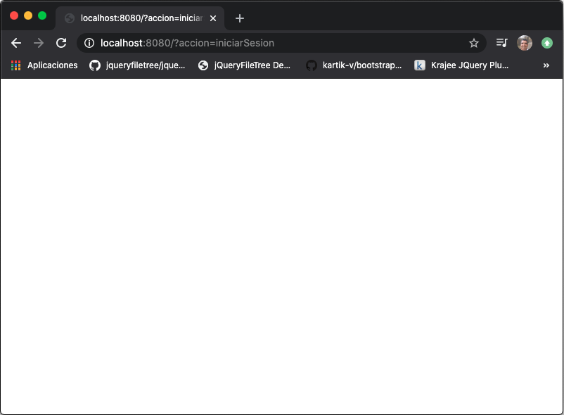

Esto sucede por que estamos haciendo una petición GET y en nuestro método `doGet` no tenemos ninguna redirección a ninguna vista.  

#### Nota 

Una cosa importante al modificar nuestro código en la parte de los **src** será necesario reiniciar el servidor para que tome los cambios, cuando las modificaciones las hagamos en la sección **WebContent** con recargar el navegador será suficiente.

## Uso de parámetros iniciales en el Servlet 07:10

En esta lección veremos el uso de parámetros iniciales en el Servlet, los cuales se definen el descriptor `web.xml` y nos van a permitir definir constantes con valores especificos, algunos ejemplos pueden ser nombre de la base de datos, nombre de usuario y password, puerto, etc. valores que generalmente no cambian pero que si fuera necesario solo cambiariamos su valor en nuestro `web.xml` y se reflejara en toda la aplicación.

Nosotros vamos a definir un parámetros iniciales para la ruta donde tenemos almacenados todos los JSPs, esto se hace a través de una clave (`param-name`) y valor (`param-value`) usando el tag `<init-param>` la cual se debe insertar dentro del tag `<servlet>`.

```html
<init-param>
   <param-name>rutaJsp</param-name>
   <param-value>/jsp/</param-value>
</init-param>
```

Una vez hecho este cambio en `web.xml`, debemos modificar nuestro `Servlet.java` para que use este parámetro inicial. Dentro del ciclo de vida de un Servlet tenemos el método `init` el cual se ejecuta solo una vez y es allí donde recuperaremos el parámetro inicial, para poder usarlo a través del código del Servlet.

Eclipse nos ayuda a insertar el método `init` para lo cual en nuestro archivo `Servlet.java` nos posicionamos después del constructor y pulsamos un click derecho y seleccionamos *Source > Override/Implement Methods*

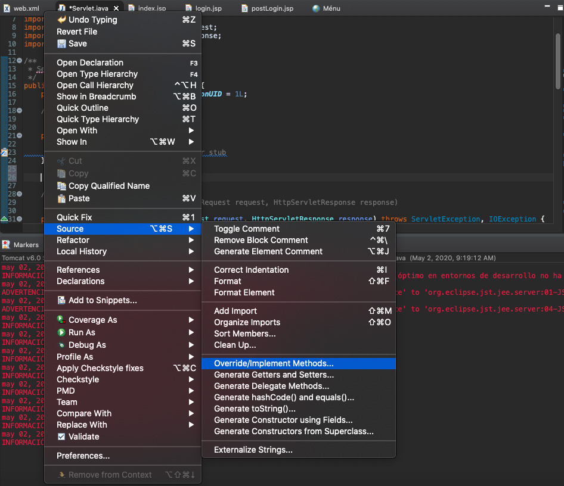

De las opciones que nos salen seleccionamos *GenericServlet > init(ServletConfig)*:

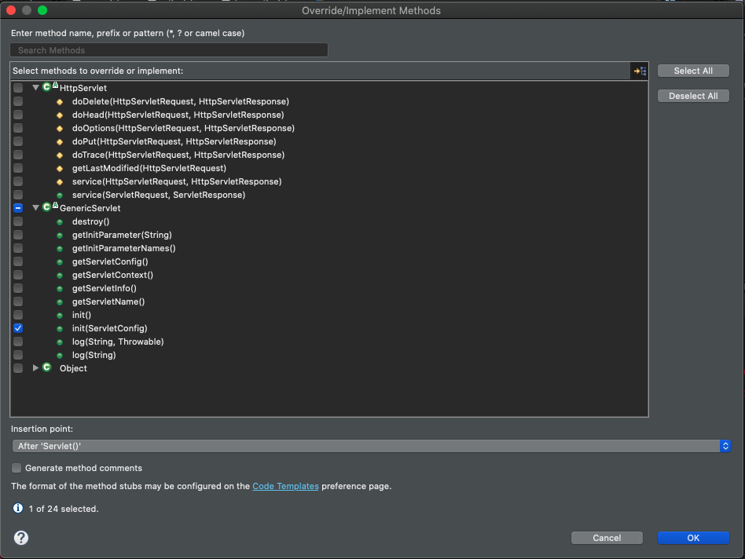

Esto nos inserta la implementación del método `init(ServletConfig)`:

```java
@Override
public void init(ServletConfig config) throws ServletException {
   // TODO Auto-generated method stub
   super.init(config);
}
```

Para empezar simplemente vamos añadir una instrucción a este método para que imprima nuestro parámetro inicial:

```java
@Override
public void init(ServletConfig config) throws ServletException {
   // TODO Auto-generated method stub
   super.init(config);
   System.out.println(config.getInitParameter("rutaJsp"));
}
```

El método `getInitParameter("rutaJsp")` del objeto `config` nos permite recuperar el valor del párametro que le pasemos. El método `init(ServletConfig config)` solo se ejecuta la primera vez que se carga la aplicación así que ejecutemosla para ver si imprime el valor del parámetro inicial.

Efectivamente al ejecutar nuestra aplicación en la consola se muestra el valor recuperado:


Pues lo que sigue será asignar ese valor a una variable y usarla en todos los sitios donde hayamos puesto HardCodedo ese valor. 

Vemos los códigos de los dos archivos cambiados:

```html
<?xml version="1.0" encoding="UTF-8"?>
<web-app xmlns:xsi="http://www.w3.org/2001/XMLSchema-instance" xmlns="http://java.sun.com/xml/ns/javaee" xsi:schemaLocation="http://java.sun.com/xml/ns/javaee http://java.sun.com/xml/ns/javaee/web-app_2_5.xsd" id="WebApp_ID" version="2.5">
  <display-name>04-JSPServlet</display-name>
  <welcome-file-list>
    <welcome-file>index.html</welcome-file>
    <welcome-file>index.htm</welcome-file>
    <welcome-file>index.jsp</welcome-file>
    <welcome-file>default.html</welcome-file>
    <welcome-file>default.htm</welcome-file>
    <welcome-file>default.jsp</welcome-file>
  </welcome-file-list>
  <servlet>
    <description></description>
    <display-name>Servlet</display-name>
    <servlet-name>Servlet</servlet-name>
    <servlet-class>com.novellius.Servlet</servlet-class>
    <init-param>
    	<param-name>rutaJsp</param-name>
    	<param-value>/jsp/</param-value>
    </init-param>
  </servlet>
  <servlet-mapping>
    <servlet-name>Servlet</servlet-name>
    <url-pattern>//*</url-pattern>
  </servlet-mapping>
</web-app>
```

*web.xml*

```java
package com.novellius;

import java.io.IOException;

import javax.servlet.ServletConfig;
import javax.servlet.ServletContext;
import javax.servlet.ServletException;
import javax.servlet.http.HttpServlet;
import javax.servlet.http.HttpServletRequest;
import javax.servlet.http.HttpServletResponse;
import javax.servlet.http.HttpSession;

/**
 * Servlet implementation class Servlet
 */
public class Servlet extends HttpServlet {
   private static final long serialVersionUID = 1L;
	
   private String rutaJsp;
       
    /**
     * @see HttpServlet#HttpServlet()
     */
    public Servlet() {
        super();
        // TODO Auto-generated constructor stub
    }

    @Override
    public void init(ServletConfig config) throws ServletException {
	// TODO Auto-generated method stub
	super.init(config);
		
	//System.out.println(config.getInitParameter("rutaJsp"));
	rutaJsp = config.getInitParameter("rutaJsp");
   }

   /**
   * @see HttpServlet#doGet(HttpServletRequest request, HttpServletResponse response)
   */
   protected void doGet(HttpServletRequest request, HttpServletResponse response) throws ServletException, IOException {

      String accion = request.getParameter("accion");
		
      if (accion != null) {
         if(accion.equals("inicio")) {
	    getServletContext().getRequestDispatcher(rutaJsp +  "index.jsp").forward(request, response);
         } else  if(accion.equals("login")) {
            getServletContext().getRequestDispatcher(rutaJsp +  "login.jsp").forward(request, response);
         }
      }else {
         getServletContext().getRequestDispatcher(rutaJsp +  "index.jsp").forward(request, response);
      }
   }

   /**
   * @see HttpServlet#doPost(HttpServletRequest request, HttpServletResponse response)
   */
   protected void doPost(HttpServletRequest request, HttpServletResponse response) throws ServletException, IOException {
		
      String accion = request.getParameter("accion");
			
      if (accion != null) {
         if(accion.equals("iniciarSesion")) {	
	    //System.out.println("Usuario: " + request.getParameter("usuario"));
	    //System.out.println("Contraseña: " + request.getParameter("contrasena"));
				
	    String usuario = request.getParameter("usuario");
	    String contrasena = request.getParameter("contrasena");
				
	    // Ámbito Request
	    request.setAttribute("usuario", usuario);
	    request.setAttribute("contrasena", contrasena);
				
	    // Ámbito Sesión
	    HttpSession sesion = request.getSession();
	    sesion.setAttribute("usuario", usuario);
	    sesion.setAttribute("contrasena", contrasena);
				
	    // Ámbito Contexto
	    ServletContext contexto = getServletContext();
	    contexto.setAttribute("usuario", usuario);
	    contexto.setAttribute("contrasena", contrasena);
				
	    getServletContext().getRequestDispatcher(rutaJsp +  "postLogin.jsp").forward(request, response);
	}
			
      }else {
         getServletContext().getRequestDispatcher(rutaJsp +  "index.jsp").forward(request, response);
      }	
   }
}
```

*Servlet.java*

La ventaja de usar un parámetro inicial en lugar de un valor fijo es que si decidieramos cambiar el nombre de la carpeta donde se almacenan los JSPs solo tendríamos que hacer un cambio y se haría extensivo a toda la aplicación.

Si ejecutamos la aplicación todo sigue funcionando exactamente igual.

`http://localhost:8080/`


`http://localhost:8080/?accion=login`


`http://localhost:8080/?accion=iniciarSesion`


## Mejorando el Controlador con un nuevo método de redirección 06:19

En esta lección vamos a crear un método para la redirección de nuestro Servlet para no estrar una instrucción tan larga cada que necesitamos hacer una redirección de una vista como por ejemplo:

`getServletContext().getRequestDispatcher(rutaJsp +  "index.jsp").forward(request, response);`

El método que vamos a crear regresará un objeto RequestDispatcher al cual le aplicaremos el método `forward(request, response)`.

```java
public RequestDispatcher setRespuestaControlador(String vista) {
   String url = rutaJsp + vista + ".jsp";
   return getServletContext().getRequestDispatcher(url);
}
```

Ahora remplacemos el uso de nuestro método `setRespuestaControlador` por esas extensas redirecciones.


Vemos el código de nuestro Servlet:

```java
package com.novellius;

import java.io.IOException;

import javax.servlet.RequestDispatcher;
import javax.servlet.ServletConfig;
import javax.servlet.ServletContext;
import javax.servlet.ServletException;
import javax.servlet.http.HttpServlet;
import javax.servlet.http.HttpServletRequest;
import javax.servlet.http.HttpServletResponse;
import javax.servlet.http.HttpSession;

/**
 * Servlet implementation class Servlet
 */
public class Servlet extends HttpServlet {
   private static final long serialVersionUID = 1L;
	
   private String rutaJsp;
       
   /**
   * @see HttpServlet#HttpServlet()
   */
   public Servlet() {
      super();
      // TODO Auto-generated constructor stub
   }

   @Override
   public void init(ServletConfig config) throws ServletException {
      // TODO Auto-generated method stub
      super.init(config);
		
      //System.out.println(config.getInitParameter("rutaJsp"));
      rutaJsp = config.getInitParameter("rutaJsp");
  }

   /**
   * @see HttpServlet#doGet(HttpServletRequest request, HttpServletResponse response)
   */
   protected void doGet(HttpServletRequest request, HttpServletResponse response) throws ServletException, IOException {

      String accion = request.getParameter("accion");
				
      if (accion != null) {
         if(accion.equals("inicio")) {
            setRespuestaControlador("index").forward(request, response);
	 } else  if(accion.equals("login")) {
	    setRespuestaControlador(accion).forward(request, response);
	 }
      }else {
         setRespuestaControlador("index").forward(request, response);
      }
   }

   /**
   * @see HttpServlet#doPost(HttpServletRequest request, HttpServletResponse response)
   */
   protected void doPost(HttpServletRequest request, HttpServletResponse response) throws ServletException, IOException {
		
      String accion = request.getParameter("accion");
			
      if (accion != null) {
			
         if(accion.equals("iniciarSesion")) {
				
	    //System.out.println("Usuario: " + request.getParameter("usuario"));
	    //System.out.println("Contraseña: " + request.getParameter("contrasena"));
				
	    String usuario = request.getParameter("usuario");
	    String contrasena = request.getParameter("contrasena");
				
	    // Ámbito Request
	    request.setAttribute("usuario", usuario);
	    request.setAttribute("contrasena", contrasena);
				
	    // Ámbito Sesión
	    HttpSession sesion = request.getSession();
	    sesion.setAttribute("usuario", usuario);
	    sesion.setAttribute("contrasena", contrasena);
				
	    // Ámbito Contexto
	    ServletContext contexto = getServletContext();
	    contexto.setAttribute("usuario", usuario);
	    contexto.setAttribute("contrasena", contrasena);
			
	    setRespuestaControlador("postLogin").forward(request, response);
	 }
	   
      }else {
	 setRespuestaControlador("index").forward(request, response);
      }		
   }
	
   public RequestDispatcher setRespuestaControlador(String vista) {
      String url = rutaJsp + vista + ".jsp";
      return getServletContext().getRequestDispatcher(url);
   }
}
```

*Servlet.java*

Si ejecutamos la aplicación todo sigue funcionando exactamente igual.

`http://localhost:8080/`


`http://localhost:8080/?accion=login`


`http://localhost:8080/?accion=iniciarSesion`


