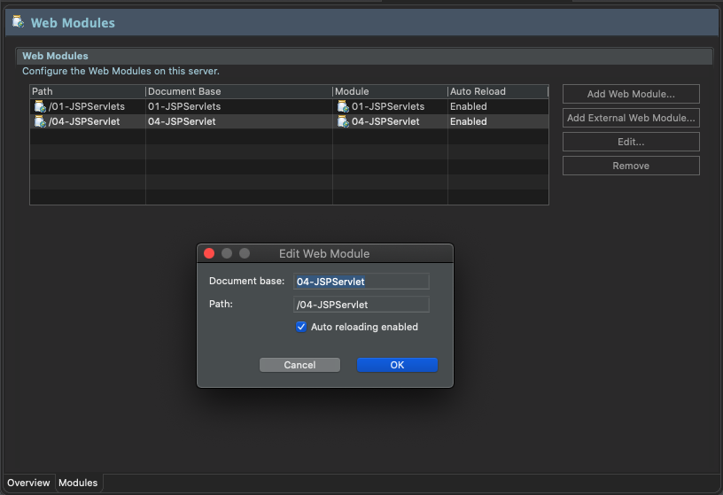
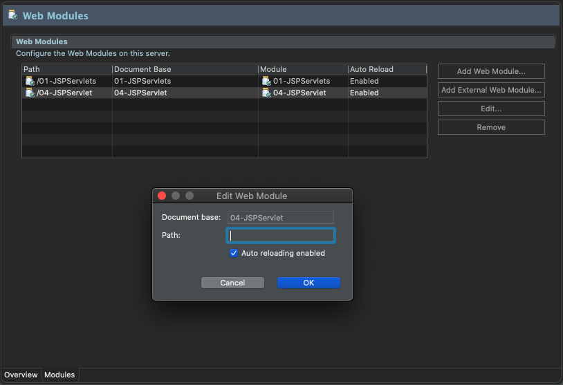
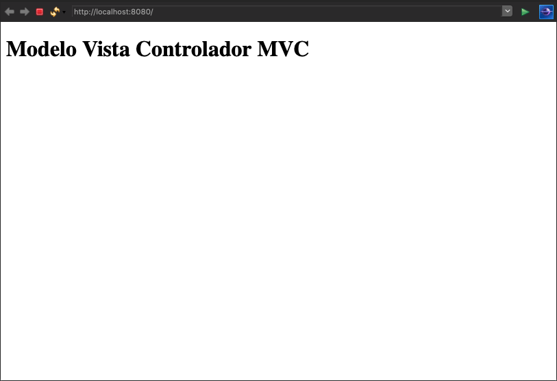
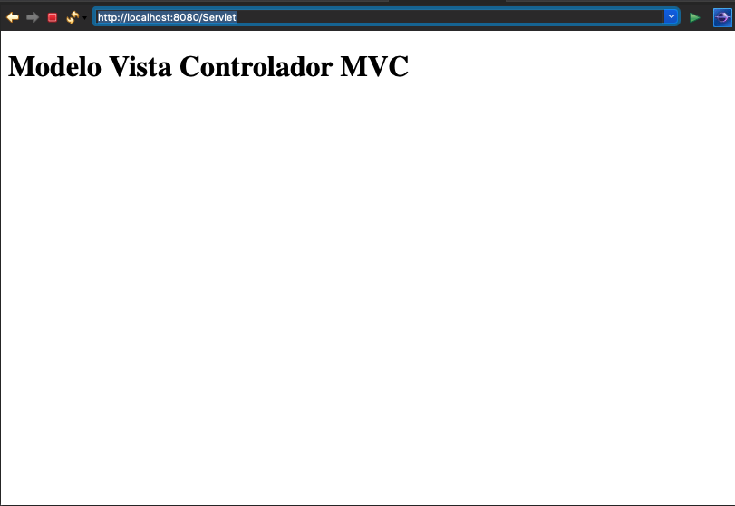
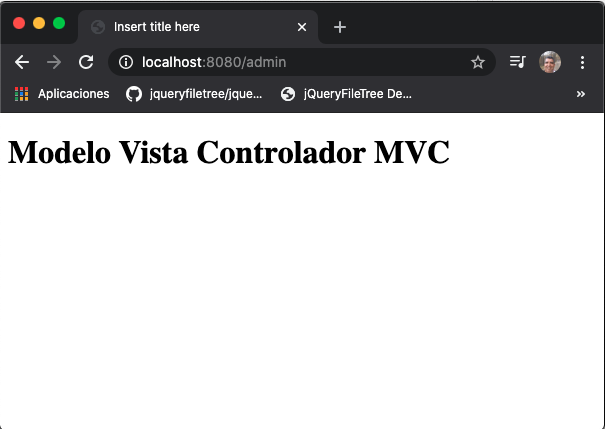
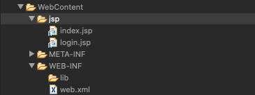

# 2. Creación de un Diseño MVC 55:43

* El archivo WEB.xml 06:35
* Añadiendo más vistas al controlador 06:57
* Control de parámetros HTTP GET con Scriplets 09:24
* Control de parámetros HTTP POST mediante el Servlet 05:29
* Paso de parámetros desde Servlet hacia una vista JSP 13:49
* Uso de parámetros iniciales en el Servlet 07:10
* Mejorando el Controlador con un nuevo método de redirección 06:19

## El archivo WEB.xml 06:35

Cuando creamos el proyecto de la lección anterior se creo el archivo **web.xml** con el siguiente contenido.

```xml
<?xml version="1.0" encoding="UTF-8"?>
<web-app xmlns:xsi="http://www.w3.org/2001/XMLSchema-instance" xmlns="http://java.sun.com/xml/ns/javaee" xsi:schemaLocation="http://java.sun.com/xml/ns/javaee http://java.sun.com/xml/ns/javaee/web-app_2_5.xsd" id="WebApp_ID" version="2.5">
  <display-name>04-JSPServlet</display-name>
  <welcome-file-list>
    <welcome-file>index.html</welcome-file>
    <welcome-file>index.htm</welcome-file>
    <welcome-file>index.jsp</welcome-file>
    <welcome-file>default.html</welcome-file>
    <welcome-file>default.htm</welcome-file>
    <welcome-file>default.jsp</welcome-file>
  </welcome-file-list>
  <servlet>
    <description></description>
    <display-name>Servlet</display-name>
    <servlet-name>Servlet</servlet-name>
    <servlet-class>com.novellius.Servlet</servlet-class>
  </servlet>
  <servlet-mapping>
    <servlet-name>Servlet</servlet-name>
    <url-pattern>/Servlet</url-pattern>
  </servlet-mapping>
</web-app>
```

El tag `<welcome-file-list>` se creo cuando creamos nuestro proyecto, posteriormente al crear nuestro Servlet inserto los tags `servlet` y `servlet-mapping`.

En el tag `<servlet>` definimos lo siguiente:

* Descripción del Servlet
* Nombre que se muestra
* Nombre del Servlet
* Clase que lo define

En el tag `<servlet-mapping>` es muy importante por que nos permite mapear o añadir una **raíz de contexto** al Servlet, definimos lo siguiente:

* Nombre del Servlet
* URL

#### ¿Qué es la Raíz de Contexto?

Cuando ejecutamos un proyecto se carga un URL por ejemplo:

### `http://localhost:8080/04-JSPServlet/`

En este caso la ***raíz de contexto*** es **`/04-JSPServlet/`** la cual puede servir para identificar alguna sección de la aplicación Web. Ya habíamos mencionado que esta ra´z de contexto la podemos eliminar, vamos a hacerlo:



Simplemente borramos el Path:



Al ejecutar el proyecto nuestra URL ya no presenta la raíz de contexto. 

`http://localhost:8080/`




Volviendo a nuestro `web.xml` observemos nuestro tag `<servlet-mapping>` actual:

```xml
<servlet-mapping>
    <servlet-name>Servlet</servlet-name>
    <url-pattern>/Servlet</url-pattern>
</servlet-mapping>
```

Podemos ver que el `<url-pattern>` esta mapeado con `/Servlet` por lo que si ejecutamos el URL `http://localhost:8080/Servlet` también se ejecutara nuestro proyecto:



Pero si usamos otro texto ya no encontrara nuestro Servlet y nos marcara lo siguiente:

`http://localhost:8080/OtraCosa`


En el mapeo que realicemos podemos poner un texto personalizado, si el Servlet lo usamos para Administrar nuestra web podríamos poner el siguiente mapeo:

```xml
<servlet-mapping>
    <servlet-name>Servlet</servlet-name>
    <url-pattern>/admin/*</url-pattern>
</servlet-mapping>
```

Tenemos `/admin/*` vemos que este mapeo a añadido `/*` lo cual permite insertar cualquier cosa despues de `/admin` esto por ejemplo nos permitira enviar parámetros. 

Los siguientes enlaces nos cargarán nuestro proyecto.

`http://localhost:8080`


`http://localhost:8080/admin`



`http://localhost:8080/admin?accion=inicio`


`http://localhost:8080/admin/contabilida`


Pero si usamos `http://localhost:8080/admin2` tendremos problemas:


Si no quisiera tener ningún tipo de mapeo y me acepte cualquier cosa podemos poner simplemente:

```xml
<servlet-mapping>
    <servlet-name>Servlet</servlet-name>
    <url-pattern>//*</url-pattern>
</servlet-mapping>
```

Con esto los únicos URL válidos son 

`http://localhost:8080`

`http://localhost:8080/`


Cualquier otro URL no nos permitira cargar nuestro Servlet:


El descriptor `web.xml` también nos va a permitir acceso a JNDI que nos permite acceder a una BD de forma sencilla, recordemos que para tener el archivo `web.xml` debemos crear nuestro proyecto con la versión 2.5 para el **Dynamic web module version**, si selecciónamos la versión 3.0 en lugar de el archivo `web.xml` usaremos notaciones, esto lo permite a partir de Tomcat 7, con Tomcat 6 no se permiten versiones superiores a 2.5.


## Añadiendo más vistas al controlador 06:57

En esta lección vamos a añadir un segundo JSP llamado `login.jsp`, actualmente tenemos el JSP `index.jsp` dentro de la carpeta `WebContent`.


Para organizar un poco nuestros JSPs dentro de la carpeta `WebContent` crearemos la carpeta `jsp` dentro de la cual moveremos el JSP `index.jsp` y crearemos el nuevo JSP `login.jsp`.



Listo, lo que hara nuestra aplicación es iniciar con la vista `index.jsp` y desde aquí nos permita movernos a la vista `login.jsp` una vez aquí tenemos tener la posibilidad de regresar a la vista `index.jsp`, todo esto siempre controlado por nuestro "Controlador".

Por lo que el código de nuestros archivos es el siguiente:

```java
protected void doGet(HttpServletRequest request, HttpServletResponse response) throws ServletException, IOException {

   String accion = request.getParameter("accion");
		
   if (accion != null) {
      if(accion.equals("inicio")) {
         getServletContext().getRequestDispatcher("/jsp/index.jsp").forward(request, response);
      } else  if(accion.equals("login")) {
         getServletContext().getRequestDispatcher("/jsp/login.jsp").forward(request, response);
      }
		
   }else {
      getServletContext().getRequestDispatcher("/jsp/index.jsp").forward(request, response);
   }
}
```
*Servlet.java*

```java
<%@ page language="java" contentType="text/html; charset=UTF-8"
    pageEncoding="UTF-8"%>
<!DOCTYPE html>
<html>
<head>
   <meta charset="UTF-8">
   <title>Ménu</title>
</head>
<body>

   <h1 align="center">Ménu</h1>
 	
   <ol>
      <li><a href="?accion=login">Iniciar Sesión</a></li>
   </ol>
   
</body>
</html>
```
*index.jsp*

```java
<%@ page language="java" contentType="text/html; charset=UTF-8"
    pageEncoding="UTF-8"%>
<!DOCTYPE html>
<html>
<head>
   <meta charset="UTF-8">
   <title>Iniciar Sessión</title>
</head>
<body>

   <h1 align="center">Iniciar Sessión</h1>
	
   <p>
      <a href="?accion=inicio">&#60;&#60; Regresar</a>
   </p>
   
</body>
</html>
```
*login.jsp*

Al Ejecutar nuestra aplicación tenemos el siguiente flujo, observe los diferentes URLs:

`http://localhost:8080`


`http://localhost:8080/?accion=login`


`http://localhost:8080/?accion=inicio`


## Control de parámetros HTTP GET con Scriplets 09:24

## Control de parámetros HTTP POST mediante el Servlet 05:29

## Paso de parámetros desde Servlet hacia una vista JSP 13:49

## Uso de parámetros iniciales en el Servlet 07:10

## Mejorando el Controlador con un nuevo método de redirección 06:19
