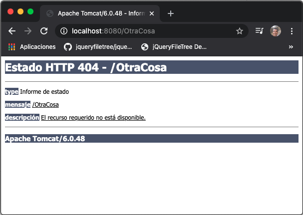
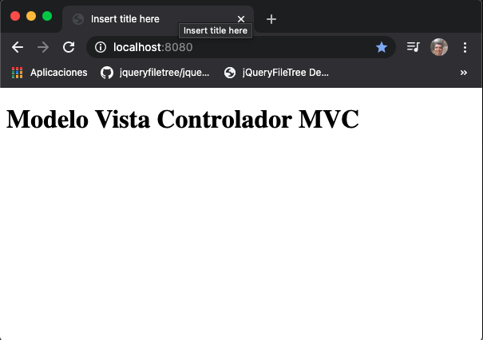

# 2. Creación de un Diseño MVC 55:43

* El archivo WEB.xml 06:35
* Añadiendo más vistas al controlador 06:57
* Control de parámetros HTTP GET con Scriplets 09:24
* Control de parámetros HTTP POST mediante el Servlet 05:29
* Paso de parámetros desde Servlet hacia una vista JSP 13:49
* Uso de parámetros iniciales en el Servlet 07:10
* Mejorando el Controlador con un nuevo método de redirección 06:19

## El archivo WEB.xml 06:35

Cuando creamos el proyecto de la lección anterior se creo el archivo **web.xml** con el siguiente contenido.

```xml
<?xml version="1.0" encoding="UTF-8"?>
<web-app xmlns:xsi="http://www.w3.org/2001/XMLSchema-instance" xmlns="http://java.sun.com/xml/ns/javaee" xsi:schemaLocation="http://java.sun.com/xml/ns/javaee http://java.sun.com/xml/ns/javaee/web-app_2_5.xsd" id="WebApp_ID" version="2.5">
  <display-name>04-JSPServlet</display-name>
  <welcome-file-list>
    <welcome-file>index.html</welcome-file>
    <welcome-file>index.htm</welcome-file>
    <welcome-file>index.jsp</welcome-file>
    <welcome-file>default.html</welcome-file>
    <welcome-file>default.htm</welcome-file>
    <welcome-file>default.jsp</welcome-file>
  </welcome-file-list>
  <servlet>
    <description></description>
    <display-name>Servlet</display-name>
    <servlet-name>Servlet</servlet-name>
    <servlet-class>com.novellius.Servlet</servlet-class>
  </servlet>
  <servlet-mapping>
    <servlet-name>Servlet</servlet-name>
    <url-pattern>/Servlet</url-pattern>
  </servlet-mapping>
</web-app>
```

El tag `<welcome-file-list>` se creo cuando creamos nuestro proyecto, posteriormente al crear nuestro Servlet inserto los tags `servlet` y `servlet-mapping`.

En el tag `<servlet>` definimos lo siguiente:

* Descripción del Servlet
* Nombre que se muestra
* Nombre del Servlet
* Clase que lo define

En el tag `<servlet-mapping>` es muy importante por que nos permite mapear o añadir una **raíz de contexto** al Servlet, definimos lo siguiente:

* Nombre del Servlet
* URL

#### ¿Qué es la Raíz de Contexto?

Cuando ejecutamos un proyecto se carga un URL por ejemplo:

### `http://localhost:8080/04-JSPServlet/`

En este caso la ***raíz de contexto*** es **`/04-JSPServlet/`** la cual puede servir para identificar alguna sección de la aplicación Web. Ya habíamos mencionado que esta ra´z de contexto la podemos eliminar, vamos a hacerlo:


Simplemente borramos el Path:


Al ejecutar el proyecto nuestra URL ya no presenta la raíz de contexto. 

`http://localhost:8080/`


Volviendo a nuestro `web.xml` observemos nuestro tag `<servlet-mapping>` actual:

```xml
<servlet-mapping>
    <servlet-name>Servlet</servlet-name>
    <url-pattern>/Servlet</url-pattern>
</servlet-mapping>
```

Podemos ver que el `<url-pattern>` esta mapeado con `/Servlet` por lo que si ejecutamos el URL `http://localhost:8080/Servlet` también se ejecutara nuestro proyecto:


Pero si usamos otro texto ya no encontrara nuestro Servlet y nos marcara lo siguiente:

`http://localhost:8080/OtraCosa`



En el mapeo que realicemos podemos poner un texto personalizado, si el Servlet lo usamos para Administrar nuestra web podríamos poner el siguiente mapeo:

```xml
<servlet-mapping>
    <servlet-name>Servlet</servlet-name>
    <url-pattern>/admin/*</url-pattern>
</servlet-mapping>
```

Tenemos `/admin/*` vemos que este mapeo a añadido `/*` lo cual permite insertar cualquier cosa despues de `/admin` esto por ejemplo nos permitira enviar parámetros. 

Los siguientes enlaces nos cargarán nuestro proyecto.

`http://localhost:8080`



`http://localhost:8080/admin`


`http://localhost:8080/admin?accion=inicio`


`http://localhost:8080/admin/contabilida`


El Servlet puede enmascarar esta ruta para que sea sustituida por otro texto que deseemos 
 
## Añadiendo más vistas al controlador 06:57

## Control de parámetros HTTP GET con Scriplets 09:24

## Control de parámetros HTTP POST mediante el Servlet 05:29

## Paso de parámetros desde Servlet hacia una vista JSP 13:49

## Uso de parámetros iniciales en el Servlet 07:10

## Mejorando el Controlador con un nuevo método de redirección 06:19
