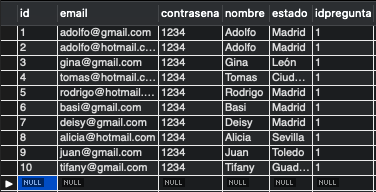
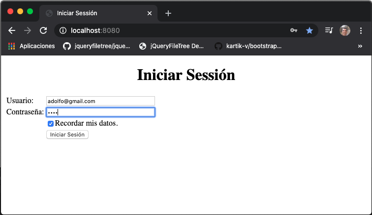
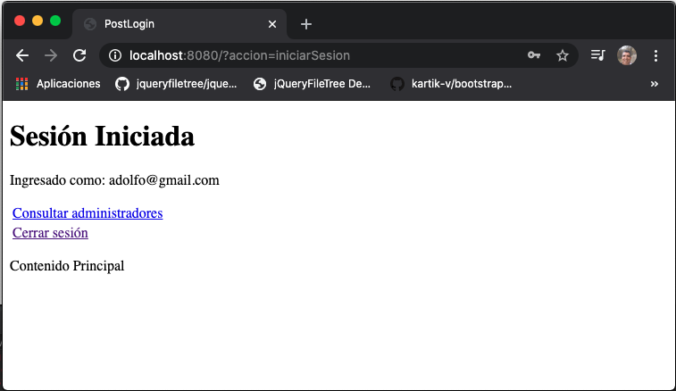
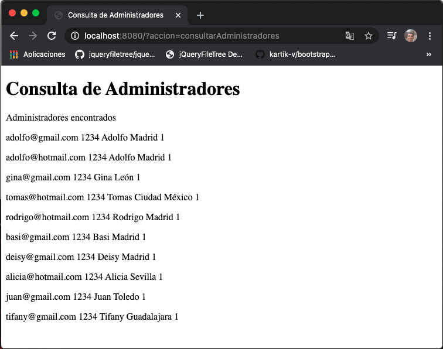
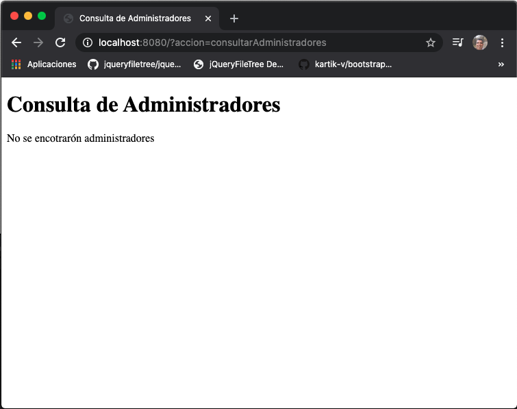
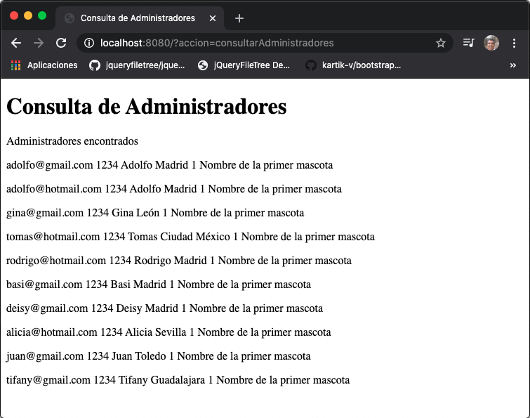
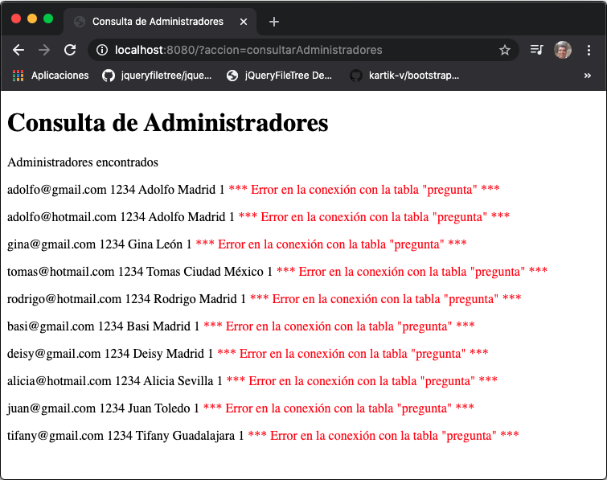

# 5. JSTL 01:11:31

* Introducción a JSTL 07:25
* Mi primer mensaje con c:out 04:35
* Uso de las etiquetas c:if y c:choose 03:54
* Creación de una consulta en el modelo 08:34
* Iteraciones con c:foreach 13:15
* Creación de una consulta con JSTL 08:44
* Manejo de excepciones en JSTL 04:19
* Manejo de parámetros HTTP con param 08:00
* Inserción de un registro en la B.D. con JSTL 07:41
* Funciones en JSTL 05:04

## Introducción a JSTL 07:25

[JavaServer Pages Standard Tag Library](https://www.oracle.com/java/technologies/Java-server-tag-library.html)

[Using JSTL](https://docs.oracle.com/javaee/5/tutorial/doc/bnake.html)

[JSP - Standard Tag Library (JSTL) Tutorial](https://www.tutorialspoint.com/jsp/jsp_standard_tag_library.htm)

[JSTL (JSP Standard Tag Library)](https://www.javatpoint.com/jstl)

[JSTL Tutorial, JSTL Tags Example](https://www.journaldev.com/2090/jstl-tutorial-jstl-tags-example)

[JSTL](http://www.jtech.ua.es/j2ee/restringido/cw/sesion08-apuntes.html)

[Uso de JSTL](https://desarrollo-java.readthedocs.io/es/latest/tutorial6.md.html)

JavaServer Pages Standard Tag Library (JSTL) encapsula como etiquetas simples la funcionalidad principal común a muchas aplicaciones web. JSTL tiene soporte para tareas comunes y estructurales como iteración y condicionales, etiquetas para manipular documentos XML, etiquetas de internacionalización y etiquetas SQL. También proporciona un marco para integrar etiquetas personalizadas existentes con etiquetas JSTL.

La JSTL 1.2 Maintenace Release se alinea con el Unified Expression Language (EL) que se entrega como parte de la JavaServer Pages (JSP) 2.1 specification. Gracias a Unified EL, las JSTL tags, como las JSTL iteration tags, ahora se pueden usar con componentes JavaServer Faces de una manera intuitiva.

### Configurar taglibs JSTL en nuestro proyeyecto

Para poder usar los tags de JSTL dentro de nuestra aplicación debemos añadir una directiva que nos permitirá usar un conjunto de etiquetas segun un tema determinado, en el siguiente enlace se explican todos los grupos de taglibs que existen y nos indica que directiva debemos añadir a nuestro proyecto para poder usarla.

[Using JSTL](https://docs.oracle.com/javaee/5/tutorial/doc/bnake.html)


Existen básicamente 5 áreas `Core, XML, I18N, Database, Functions` cada una con sus funcionalidades, por ejemplo para añadir el uso de `Core` debemos añadir la directiva `<%@ taglib uri="http://java.sun.com/jsp/jstl/core" prefix="c" %>` en la vista que vaya a usar los tagslibs de `Core`.

En nuestro caso copiaremos la directiva en la vista `login.jsp`


Cuando lo añadimos en la vista nos marca un error esto es debido a que como es un recurso de un tercero, necesito añadir el **.jar** correspondiente para poder utilizarlo, podemos ayudarnos de los repositorios de Maven para poder descargar los jars necesarios, el siguiente enlace nos ayuda a resolver algunos problemas encontrados:

[Tomcat 7 y JSTL](https://www.it-swarm.dev/es/java/tomcat-7-y-jstl/972781429/)

En resumen debemos descargar dos archivos jar `jstl-api-1.2.jar` y `jstl-impl-1.2.jar` los copiamos a nuestra libreria y los añadimos al Build Path.


## Mi primer mensaje con c:out 04:35

En esta lección vamos a remplazar el Scripler que utilizamos para enviar el mensaje de error cuando los datos de acceso no son correctos, con JSTL.

```html
<%
   String error = (String) request.getAttribute("error");
	
   if (error != null){
			out.println(error);
	 }
%>
```

Lo primero que tenemos que ver es como manejar el `request` en JSTL. Nos podemos apoyar en la siguiente documentación:

[Expression Language Support](https://docs.oracle.com/javaee/1.3/tutorial/doc/JSTL4.html)

[Java Platform, Enterprise Edition: The Java EE Tutorial (Java EE) 7](https://docs.oracle.com/javaee/7/tutorial/index.html)

JSTL expression language define un conjunto de objetos implicitos:


El objeto `requestScope` mapea los atributos en el ambito Request. Por lo que el Scriplet anterior lo podemos simplemente reemplazar por:

```html
<c:out value="${requestScope.error}" />
```

Con esta etiqueta nos ahorramos muchas líneas de código que usabamos con el Scriptler para hacer exactamente lo mismo.


Un mensaje corresponde al Scripler y otro al JSTL.

#### Ver código final

```html
<%@ page language="java" contentType="text/html; charset=UTF-8"
    pageEncoding="UTF-8"%>
<%@ taglib uri="http://java.sun.com/jsp/jstl/core" prefix="c" %>
	
<!DOCTYPE html>
<html>
<head>
<meta charset="UTF-8">
<title>Iniciar Sessión</title>
</head>
<body>
	<h1 align="center">Iniciar Sessión</h1>
	
	
	<p style="color: red; font-weight: bold;">
	<c:out value="${requestScope.error}" />
	</p>
	
	<p style="color: red; font-weight: bold;">
	<%
		String error = (String) request.getAttribute("error");
	
		if (error != null){
			out.println(error);
		}
	%>
	</p>
	<form method="post" action="?accion=iniciarSesion">
	
		<%
		   String usuario = "";
		   String contrasena = "";	
		   
		   //Leyendo Cookies
		   Cookie[] cookies = request.getCookies();
		   if (cookies != null){
				
		       // Si existen cookies recorremos el array
			   for(Cookie cookie : cookies){
					//Busca las cookies de usuario y contraeña
					if(cookie.getName().equals("usuario")){
						usuario = cookie.getValue();   
					}else if(cookie.getName().equals("contrasena")){
						contrasena = cookie.getValue();   
					}
			    }
		    }
		   
		%>
		<table>
			<tr>
				<td>Usuario: </td>
				<td><input type="text" name="usuario" size="35" value="<%= usuario %>" /></td>
			</tr>
			<tr>
				<td>Contraseña: </td>
				<td><input type="password" name="contrasena" size="35" value="<%= contrasena %>" /></td>
			</tr>
			<tr>
				<td>&nbsp;</td>
				<td><input name="ckbox" type="checkbox" checked="checked" />Recordar mis datos.</td>
			</tr>
			<tr>
				<td>&nbsp;</td>
				<td><input type="submit" value="Iniciar Sesión" /></td>
			</tr>
		</table>	
	</form>
	
</body>
</html>
```

## Uso de las etiquetas c:if y c:choose 03:54

En esta lección vamos a aprender a manejar condiciones con JSTL.

Para el manejo de condicines tenemos dos tagslibs `c:if` y `c:choose`, veamos un ejemplo de cada una:

**El tagslib `c:if`** funciona como un if pero solo tiene el caso verdadero, es decir no hay else. En el ejemplo verifica que error sea diferente de `null`y si es así lo imprime (ESTO YA LO HACE POR SI SOLO `c:out`)

```html
<c:if test="${requestScope.error != null}">
   <c:out value="${requestScope.error}" />
</c:if>
```
**El tagslib `c:choose`** se parece un poco más a un `switch`.

```html
<c:choose>
   <c:when test="${requestScope.error != null}">
      <c:out value="${requestScope.error}" />
   </c:when>
   <c:otherwise>
      ;)
   </c:otherwise>
</c:choose>
```

En el nuestra vista `login.jsp` tenemos todas las opciones como podemos ver en el siguiente código:

```html
<%@ page language="java" contentType="text/html; charset=UTF-8"
    pageEncoding="UTF-8"%>
<%@ taglib uri="http://java.sun.com/jsp/jstl/core" prefix="c" %>
	
<!DOCTYPE html>
<html>
<head>
<meta charset="UTF-8">
<title>Iniciar Sessión</title>
</head>
<body>
	<h1 align="center">Iniciar Sessión</h1>
	
	<p style="color: red; font-weight: bold;">
	<c:out value="${requestScope.error}" />
	</p>
	
	<p style="color: red; font-weight: bold;">
	<c:if test="${requestScope.error != null}">
		<c:out value="${requestScope.error}" />
	</c:if>
	</p>
	
	<p style="color: red; font-weight: bold;">
	<c:choose>
	   <c:when test="${requestScope.error != null}">
		  <c:out value="${requestScope.error}" />
	   </c:when>
	   <c:otherwise>
	      ;)
	   </c:otherwise>
	</c:choose>
	</p>
	
	<p style="color: red; font-weight: bold;">
	<%
		String error = (String) request.getAttribute("error");
	
		if (error != null){
			out.println(error);
		}
	%>
	</p>
	<form method="post" action="?accion=iniciarSesion">
	
		<%
		   String usuario = "";
		   String contrasena = "";	
		   
		   //Leyendo Cookies
		   Cookie[] cookies = request.getCookies();
		   if (cookies != null){
				
		       // Si existen cookies recorremos el array
			   for(Cookie cookie : cookies){
					//Busca las cookies de usuario y contraeña
					if(cookie.getName().equals("usuario")){
						usuario = cookie.getValue();   
					}else if(cookie.getName().equals("contrasena")){
						contrasena = cookie.getValue();   
					}
			    }
		    }
		   
		%>
		<table>
			<tr>
				<td>Usuario: </td>
				<td><input type="text" name="usuario" size="35" value="<%= usuario %>" /></td>
			</tr>
			<tr>
				<td>Contraseña: </td>
				<td><input type="password" name="contrasena" size="35" value="<%= contrasena %>" /></td>
			</tr>
			<tr>
				<td>&nbsp;</td>
				<td><input name="ckbox" type="checkbox" checked="checked" />Recordar mis datos.</td>
			</tr>
			<tr>
				<td>&nbsp;</td>
				<td><input type="submit" value="Iniciar Sesión" /></td>
			</tr>
		</table>	
	</form>
	
</body>
</html>

```

*login.jsp*

Al ejecutar el código tenemos:


## Creación de una consulta en el modelo 08:34

En esta lección crearemos una consulta en el modelo. 

Lo primero que vamos hacer es insertar varios registros en la tabla `administrador` :

```sql
INSERT INTO `administradores`.`administrador` (`id`, `email`, `contrasena`, `nombre`, `estado`, `idpregunta`) VALUES ('2', 'adolfo@hotmail.com', '1234', 'Adolfo', 'Madrid', '1');
INSERT INTO `administradores`.`administrador` (`id`, `email`, `contrasena`, `nombre`, `estado`, `idpregunta`) VALUES ('3', 'gina@gmail.com', '1234', 'Gina', 'León', '1');
INSERT INTO `administradores`.`administrador` (`id`, `email`, `contrasena`, `nombre`, `estado`, `idpregunta`) VALUES ('4', 'tomas@hotmail.com', '1234', 'Tomas', 'Ciudad México', '1');
INSERT INTO `administradores`.`administrador` (`id`, `email`, `contrasena`, `nombre`, `estado`, `idpregunta`) VALUES ('5', 'rodrigo@hotmail.com', '1234', 'Rodrigo', 'Madrid', '1');
INSERT INTO `administradores`.`administrador` (`id`, `email`, `contrasena`, `nombre`, `estado`, `idpregunta`) VALUES ('6', 'basi@gmail.com', '1234', 'Basi', 'Madrid', '1');
INSERT INTO `administradores`.`administrador` (`id`, `email`, `contrasena`, `nombre`, `estado`, `idpregunta`) VALUES ('7', 'deisy@gmail.com', '1234', 'Deisy', 'Madrid', '1');
INSERT INTO `administradores`.`administrador` (`id`, `email`, `contrasena`, `nombre`, `estado`, `idpregunta`) VALUES ('8', 'alicia@hotmail.com', '1234', 'Alicia', 'Sevilla', '1');
INSERT INTO `administradores`.`administrador` (`id`, `email`, `contrasena`, `nombre`, `estado`, `idpregunta`) VALUES ('9', 'juan@gmail.com', '1234', 'Juan', 'Toledo', '1');
INSERT INTO `administradores`.`administrador` (`id`, `email`, `contrasena`, `nombre`, `estado`, `idpregunta`) VALUES ('10', 'tifany@gmail.com', '1234', 'Tifany', 'Guadalajara', '1');
```



Una vez insertados los registros vamos a crear una consulta que recupere la lista de administradores. Ya contamos con una clase de  Modelo **`Cuenta`**, este tipo de clases también se conocen como **DAO** Objetos de Acceso a los Datos. Por lo tanto vamos a crear un método en la clase `Cuenta` que recupere la lista de administradores.

```java
public ArrayList<Administrador> consultarAdministradores(){
		
   ArrayList<Administrador> administradores = new ArrayList<Administrador>();
		
   String sql = "SELECT * FROM administrador";
		
   try {
      PreparedStatement st = con.prepareStatement(sql);
			
      ResultSet rs = st.executeQuery();
			
      while(rs.next()) {
				
         Administrador administrador = new Administrador(
	    rs.getString("email"),
	    rs.getString("contrasena"),
	    rs.getString("nombre"),
	    rs.getString("estado"),
	    rs.getInt("idPregunta")
	 );
				
	 administradores.add(administrador);
      }
      
      rs.close();
      
   } catch (SQLException e) {
      administradores.clear();
      log.error("Al consultar administradores: " + e.getMessage());
   }
		
   return administradores;
}
```

Este método retorna un `ArrayList` de `Administrador`, hace una consulta a la tabla `administrador`, recorre lo recuperado con un `while` con cada registro recuperado construye un objeto `Administrador` que va insertando en el `ArrayList` y cuando finaliza el ciclo nos devuelve el `ArrayList` con todos los `Administradores` encontrados.

## Iteraciones con c:foreach 13:15

En esta lección vamos a iterar el `ArrayList` creado usando el taglib `c:foreach`.

En nuesta vista `postLogin.jsp` pondremos un link que nos lleva a la consulta de los administradores:

```html
<tr>
   <td><a href="?accion=consultarAdministradores" >Consultar administradores</a></td>
</tr>
```

Este link lo debemos manejar en el método `doGet()` de nuestro `Servlet.java`.

```java
} else if (accion.equals("consultarAdministradores")) {
				
   //Intanciación anónima me evito 
   //Cuenta cuenta = new Cuenta(con);
   ArrayList<Administrador> administradores = new Cuenta(con).consultarAdministradores();
				
   if (administradores.isEmpty()) {
      request.setAttribute("mensaje", "No se encotrarón administradores");
   }else {
      request.setAttribute("mensaje", "Administradores encontrados");
      // Vamos a cargar los administradores encontrados en la sesión
      sesion.setAttribute("administradores", administradores);
   }
   setRespuestaControlador("consultaAdministradores").forward(request, response);
}
```

En resumen lo que hacemos es crear un `ArrayList administradores` y lo llenamos con lo que nos regrese el método `consultarAdministradores()` de la clase `Cuenta`, dependiendo de si contiene o no valores mandamos un mensaje al ambito del request, ademas si existen administradores los colocamos en el ambito de la sesión, finalmente vamos a redirigir a una nueva vista que llamaremos `consultaAdministradores.jsp`. Debemos añadir la conexión al método `doGet()` para poder usarla.

En la carpeta `/jsp` creamos la nueva vista `consultaAdministradores.jsp`, aquí vamos a mostrar el mensaje e iterar la lista de administradores encontrada con la taglib `c:foreach`.

```html
<c:out value="${requestScope.mensaje}" />
	
<c:forEach var="admin" items="${sessionScope.administradores }">
   <p><c:out value="${admin.email}" /> ${admin.contrasena} ${admin.nombre} ${admin.estado} ${admin.idPregunta} </p>
</c:forEach>
```

### Ver código modificado.

```java
package com.novellius.modelo;

import java.sql.Connection;
import java.sql.PreparedStatement;
import java.sql.ResultSet;
import java.sql.SQLException;
import java.util.ArrayList;

import org.apache.log4j.LogManager;
import org.apache.log4j.Logger;

import com.novellius.modelo.beans.Administrador;

public class Cuenta {
	
	private static final Logger log = LogManager.getLogger("Cuenta: ");
	private Connection con;

	public Cuenta(Connection con) {
		this.con = con;
	}
	
	public boolean login(String email, String contrasena) {
		
		
		// El uso de los comodines (?) en lugar de la concatenación, nos permite evitar la SQL INYECTION (; delete database) 
		String sql = "SELECT count(*) as count FROM administrador WHERE email = ? AND contrasena = ? ";
		
		//Permite saber si encontro o no el registro en la BD
		int noRegistros = 0;
		
		try {
			//Preparar la sentencia
			PreparedStatement st = con.prepareStatement(sql);
			
			//Pasar valores a los dos comodines
			st.setString(1, email);
			st.setString(2, contrasena);
			
			// Ejecutar la consulta y almacenarla en un ResultSet
			ResultSet rs = st.executeQuery();
			
			//Comprobar que la consulta obtuvo resultados
			if(rs.next()) {
				noRegistros = rs.getInt("count");
			}
			
			//Cerrar el Result Set
			rs.close();
		} catch (SQLException e) {
			log.error("Al realizar Login: " + e.getMessage());
			// Si hay una excepción retornamos false
			return false;
		}
		
		// Verificamos si hubo coincidencias en la BD
		if (noRegistros == 0 ) {
			return false;
		}else {
			return true;
		}
	}
	
	public ArrayList<Administrador> consultarAdministradores(){
		
		ArrayList<Administrador> administradores = new ArrayList<Administrador>();
		
		String sql = "SELECT * FROM administrador";
		
		try {
			PreparedStatement st = con.prepareStatement(sql);
			
			ResultSet rs = st.executeQuery();
			
			while(rs.next()) {
				
				Administrador administrador = new Administrador(
						rs.getString("email"),
						rs.getString("contrasena"),
						rs.getString("nombre"),
						rs.getString("estado"),
						rs.getInt("idPregunta")
				);
				
				administradores.add(administrador);
			}
			rs.close();
		} catch (SQLException e) {
			administradores.clear();
			log.error("Al consultar administradores: " + e.getMessage());
		}
		
		return administradores;
	}
}
```

*Cuenta.java*

```html
<%@ page language="java" contentType="text/html; charset=UTF-8"
    pageEncoding="UTF-8"%>
<!DOCTYPE html>
<html>
<head>
<meta charset="UTF-8">
<title>PostLogin</title>
</head>
<body>
	<h1>Sesión Iniciada</h1>
	
	<p>Ingresado como: <%= session.getAttribute("usuario") %></p>
	
	
	<table>
		<tr>
			<td><a href="?accion=consultarAdministradores" >Consultar administradores</a></td>
		</tr>
		<tr>
			<td><a href="?accion=logout">Cerrar sesión</a></td>
		</tr>
	</table>
	<p>
		Contenido Principal
	</p>

</body>
</html>
```

*postLogin.jsp*


```java
package com.novellius;

import java.io.IOException;
import java.sql.Connection;
import java.sql.DriverManager;
import java.sql.SQLException;
import java.util.ArrayList;

import javax.naming.Context;
import javax.naming.InitialContext;
import javax.naming.NamingException;
import javax.servlet.RequestDispatcher;
import javax.servlet.ServletConfig;
import javax.servlet.ServletContext;
import javax.servlet.ServletException;
import javax.servlet.http.Cookie;
import javax.servlet.http.HttpServlet;
import javax.servlet.http.HttpServletRequest;
import javax.servlet.http.HttpServletResponse;
import javax.servlet.http.HttpSession;
import javax.sql.DataSource;

import org.apache.log4j.BasicConfigurator;
import org.apache.log4j.LogManager;
import org.apache.log4j.Logger;

import com.novellius.modelo.Cuenta;
import com.novellius.modelo.beans.Administrador;

/**
 * Servlet implementation class Servlet
 */
public class Servlet extends HttpServlet {
	private static final long serialVersionUID = 1L;

	private static final Logger log = LogManager.getLogger("Servlet: ");
	private String rutaJsp;

	// Variables para interctuar con la BD
	private DataSource ds;
	private Connection con;

	/**
	 * @see HttpServlet#HttpServlet()
	 */
	public Servlet() {
		super();
		// TODO Auto-generated constructor stub
	}

	@Override
	public void init(ServletConfig config) throws ServletException {
		// TODO Auto-generated method stub
		super.init(config);

		// System.out.println(config.getInitParameter("rutaJsp"));
		rutaJsp = config.getInitParameter("rutaJsp");

		// Configurar Logger
		BasicConfigurator.configure();

		// Confuguración JNDI
		try {
			InitialContext initContext = new InitialContext();
			Context env = (Context) initContext.lookup("java:comp/env");
			ds = (DataSource) env.lookup("jdbc/novellius");
		} catch (NamingException e) {
			log.error("Al configurar JNDI: " + e.getMessage());
		}
	}

	/**
	 * @see HttpServlet#doGet(HttpServletRequest request, HttpServletResponse
	 *      response)
	 */
	protected void doGet(HttpServletRequest request, HttpServletResponse response)
			throws ServletException, IOException {

		String accion = request.getParameter("accion");
		HttpSession sesion = request.getSession();
		
		// Conexión a la BD
		try {
		   con = ds.getConnection();
		} catch (SQLException e) {
		   // Enviar a una vista de error
		  log.error("Error al crear conexión: " + e.getMessage());
		}

		if (accion != null) {
			if (accion.equals("login")) {
				setRespuestaControlador(accion).forward(request, response);
			} else if (accion.equals("logout")) {
				sesion.invalidate();
				log.info("Sesión destruida");
				setRespuestaControlador("login").forward(request, response);
			} else if (accion.equals("consultarAdministradores")) {
				
				//Intanciación anónima me evito 
				//Cuenta cuenta = new Cuenta(con);
				ArrayList<Administrador> administradores = new Cuenta(con).consultarAdministradores();
				
				if(administradores.isEmpty()) {
					request.setAttribute("mensaje", "No se encotrarón administradores");
				}else {
					request.setAttribute("mensaje", "Administradores encontrados");
					// Vamos a cargar los administradores encontrados en la sesión
					sesion.setAttribute("administradores", administradores);
				}
				setRespuestaControlador("consultaAdministradores").forward(request, response);
			}
		} else {
			setRespuestaControlador("login").forward(request, response);
		}
		
		// Conexión a la BD
		try {
		   con.close();
		} catch (SQLException e) {
		   // Enviar a una vista de error
		   log.error("Error al cerrar conexión: " + e.getMessage());
		}
	}

	/**
	 * @see HttpServlet#doPost(HttpServletRequest request, HttpServletResponse
	 *      response)
	 */
	protected void doPost(HttpServletRequest request, HttpServletResponse response)
			throws ServletException, IOException {

		String accion = request.getParameter("accion");
		HttpSession sesion = request.getSession();

		// Conexión a la BD
		try {
			con = ds.getConnection();
		} catch (SQLException e) {
			// Enviar a una vista de error
			log.error("Error al crear conexión: " + e.getMessage());

		}

		if (accion != null) {

			if (accion.equals("iniciarSesion")) {

				String usuario = request.getParameter("usuario");
				String contrasena = request.getParameter("contrasena");
				
				
				// Creación de la Cookie
				Cookie cookieUsurio = new Cookie("usuario", usuario);
				Cookie cookieContrasena = new Cookie("contrasena", contrasena);
				
				try {
						
				   if (request.getParameter("ckbox").equals("on")) {
						
						// Tiempo de vida 1 día
						cookieUsurio.setMaxAge(60 * 60 * 24);
						cookieContrasena.setMaxAge(60 * 60 * 24);
						// Añado las cookies
						response.addCookie(cookieUsurio);
						response.addCookie(cookieContrasena);
						
						System.out.println("Cookies añadidos");
					}
				} catch (NullPointerException e) {
					log.info("chbox vacio");
					
					
					// Expira las cookies
					cookieUsurio.setMaxAge(0);
					cookieContrasena.setMaxAge(0);
					// Añado las cookies
					response.addCookie(cookieUsurio);
					response.addCookie(cookieContrasena);
				}

				// Invocar consulta SQL
				Cuenta cuenta = new Cuenta(con);

				if (cuenta.login(usuario, contrasena)) {
					log.info("Ingresado correctamente como: " + usuario);


					// Ámbito sesión
					sesion.setAttribute("usuario", usuario);
					setRespuestaControlador("postLogin").forward(request, response);

				} else {
					log.error("Error de login");
					request.setAttribute("error", "Nombre de usuario o contraseña incorrectos.");
					
					setRespuestaControlador("login").forward(request, response);
				}
			}

		} else {
			setRespuestaControlador("login").forward(request, response);
		}

		// Conexión a la BD
		try {
			con.close();
		} catch (SQLException e) {
			// Enviar a una vista de error
			log.error("Error al cerrar conexión: " + e.getMessage());
		}

	}

	public RequestDispatcher setRespuestaControlador(String vista) {
		String url = rutaJsp + vista + ".jsp";
		return getServletContext().getRequestDispatcher(url);
	}
}
```

*Servlet.java*

```html
<%@ page language="java" contentType="text/html; charset=UTF-8"
    pageEncoding="UTF-8"%>
<%@ taglib uri="http://java.sun.com/jsp/jstl/core" prefix="c" %>    
    
<!DOCTYPE html>
<html>
<head>
<meta charset="UTF-8">
<title>Consulta de Administradores</title>
</head>
<body>
	<h1>Consulta de Administradores</h1>
	
	<c:out value="${requestScope.mensaje}" />
	
	<c:forEach var="admin" items="${sessionScope.administradores }">
		<p><c:out value="${admin.email}" /> ${admin.contrasena} ${admin.nombre} ${admin.estado} ${admin.idPregunta} </p>
	</c:forEach>

</body>
</html>
```

*consultaadministradores.jsp*

#### Ejecución

El ciclo que sigue la aplicación al ejecutarse es el siguiente:



Seleccionamos la opción de consultar los administradores



Aquí tenemos la lista de los administradores



En caso de no existir registros se nos presenta el siguiente mensaje



## Creación de una consulta con JSTL 08:44

En esta lección vamos a aprender como hacer una consulta con JSTL, por lo que vamosa usar la directiva:

```html
<%@ taglib uri = "http://java.sun.com/jsp/jstl/sql" prefix = "sql"%>
```

Lo que haremos es que en lugar de desplegar el `idPregunta` mostraremos la pregunata. Haremos uso de la etiqueta 

`<sql:query var="" dataSource="">` 

En el `dataSource` vamos a poner el name de la conexión a la BD `jdbc/novellius` y en var vamos a poner la referencia a los resultados que obtenga en el query que vayamos a ejecutar.

Lo mejor es insertar todos los cambios en el código.

```html
<%@ page language="java" contentType="text/html; charset=UTF-8"
    pageEncoding="UTF-8"%>
<%@ taglib uri="http://java.sun.com/jsp/jstl/core" prefix="c" %>   
<%@ taglib uri = "http://java.sun.com/jsp/jstl/sql" prefix = "sql"%> 
    
<!DOCTYPE html>
<html>
<head>
<meta charset="UTF-8">
<title>Consulta de Administradores</title>
</head>
<body>
   <h1>Consulta de Administradores</h1>
	
   <c:out value="${requestScope.mensaje}" />
	
   <c:forEach var="admin" items="${sessionScope.administradores }">
	   
      <p>
      <c:out value="${admin.email}" /> ${admin.contrasena} ${admin.nombre} ${admin.estado} ${admin.idPregunta} 
      
      <!-- Crea la variable id -->		
      <c:set var="id" value="${admin.idPregunta}" />

      <!-- Ejecutar query, usa la variable creada para formar el query -->
      <sql:query var="rs" dataSource="jdbc/novellius">
         SELECT pregunta FROM pregunta WHERE idpregunta = ${id};
      </sql:query>
	
      <!--  Recorre los datos recuperados y pinta el campo pregunta -->
      <c:forEach var="row" items="${rs.rows}">
	 ${row.pregunta}
      </c:forEach>  
      </p>
	   
    </c:forEach>

</body>
</html>
```

*consultaAdministradores.jsp*

Ejecución del Programa.



## Manejo de excepciones en JSTL 04:19

En esta lección vamos a ver como manejar una excepciones en JSTL, usando la taglibs `<c:catch var="">`. Vamos a modificar el código para generar una excepción y manejarla.

```html
<%@ page language="java" contentType="text/html; charset=UTF-8"
    pageEncoding="UTF-8"%>
<%@ taglib uri="http://java.sun.com/jsp/jstl/core" prefix="c" %>   
<%@ taglib uri = "http://java.sun.com/jsp/jstl/sql" prefix = "sql"%> 
    
<!DOCTYPE html>
<html>
<head>
<meta charset="UTF-8">
<title>Consulta de Administradores</title>
</head>
<body>
   <h1>Consulta de Administradores</h1>
	
   <c:out value="${requestScope.mensaje}" />
	
   <c:forEach var="admin" items="${sessionScope.administradores }">
		
      <p>
         <c:out value="${admin.email}" /> ${admin.contrasena} ${admin.nombre} ${admin.estado} ${admin.idPregunta} 
         <!-- Crea la variable id -->
         <c:set var="id" value="${admin.idPregunta}" />
		
         <c:catch var="ex">
            <!-- Ejecutar query, usa la variable creada para formar el query -->
            <sql:query var="rs" dataSource="jdbc/novellius">
               SELECT pregunta FROM pregunta WHERE idpregunta = id;
            </sql:query>
		
            <!--  Recorre los datos recuperados y pinta el campo pregunta -->
            <c:forEach var="row" items="${rs.rows}">
               ${row.pregunta}
            </c:forEach>
         </c:catch>
		
         <c:if test="${ex != null}">
            <span style="color:red;">*** Error en la conexión con la tabla "pregunta" ***</span>
         </c:if>
      </p>
   
   </c:forEach>

</body>
</html>
```

*consultaAdministradores.jsp*

Ejecución del Programa.



## Manejo de parámetros HTTP con param 08:00
## Inserción de un registro en la B.D. con JSTL 07:41
## Funciones en JSTL 05:04
