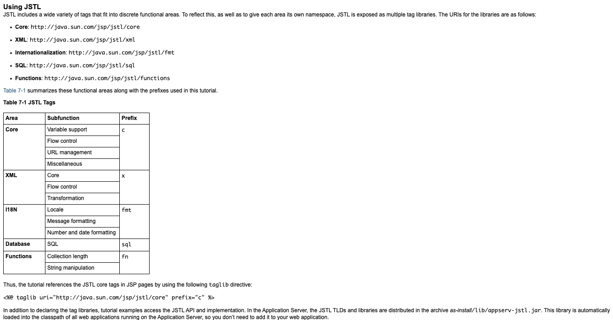
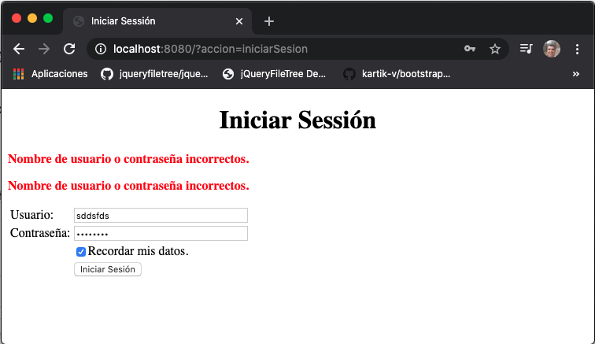
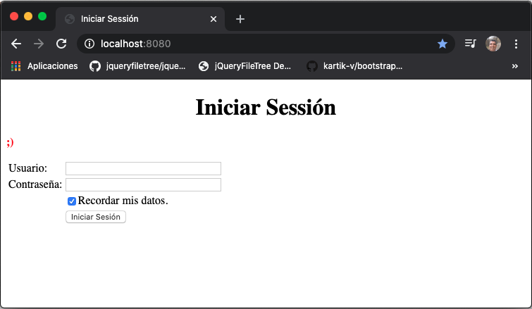
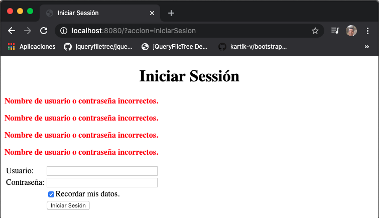

# 5. JSTL 01:11:31

* Introducción a JSTL 07:25
* Mi primer mensaje con c:out 04:35
* Uso de las etiquetas c:if y c:choose 03:54
* Creación de una consulta en el modelo 08:34
* Iteraciones con c:foreach 13:15
* Creación de una consulta con JSTL 08:44
* Manejo de excepciones en JSTL 04:19
* Manejo de parámetros HTTP con param 08:00
* Inserción de un registro en la B.D. con JSTL 07:41
* Funciones en JSTL 05:04

## Introducción a JSTL 07:25

[JavaServer Pages Standard Tag Library](https://www.oracle.com/java/technologies/Java-server-tag-library.html)

[Using JSTL](https://docs.oracle.com/javaee/5/tutorial/doc/bnake.html)

[JSP - Standard Tag Library (JSTL) Tutorial](https://www.tutorialspoint.com/jsp/jsp_standard_tag_library.htm)

[JSTL (JSP Standard Tag Library)](https://www.javatpoint.com/jstl)

[JSTL Tutorial, JSTL Tags Example](https://www.journaldev.com/2090/jstl-tutorial-jstl-tags-example)

[JSTL](http://www.jtech.ua.es/j2ee/restringido/cw/sesion08-apuntes.html)

[Uso de JSTL](https://desarrollo-java.readthedocs.io/es/latest/tutorial6.md.html)

JavaServer Pages Standard Tag Library (JSTL) encapsula como etiquetas simples la funcionalidad principal común a muchas aplicaciones web. JSTL tiene soporte para tareas comunes y estructurales como iteración y condicionales, etiquetas para manipular documentos XML, etiquetas de internacionalización y etiquetas SQL. También proporciona un marco para integrar etiquetas personalizadas existentes con etiquetas JSTL.

La JSTL 1.2 Maintenace Release se alinea con el Unified Expression Language (EL) que se entrega como parte de la JavaServer Pages (JSP) 2.1 specification. Gracias a Unified EL, las JSTL tags, como las JSTL iteration tags, ahora se pueden usar con componentes JavaServer Faces de una manera intuitiva.

### Configurar taglibs JSTL en nuestro proyeyecto

Para poder usar los tags de JSTL dentro de nuestra aplicación debemos añadir una directiva que nos permitirá usar un conjunto de etiquetas segun un tema determinado, en el siguiente enlace se explican todos los grupos de taglibs que existen y nos indica que directiva debemos añadir a nuestro proyecto para poder usarla.

[Using JSTL](https://docs.oracle.com/javaee/5/tutorial/doc/bnake.html)



Existen básicamente 5 áreas `Core, XML, I18N, Database, Functions` cada una con sus funcionalidades, por ejemplo para añadir el uso de `Core` debemos añadir la directiva `<%@ taglib uri="http://java.sun.com/jsp/jstl/core" prefix="c" %>` en la vista que vaya a usar los tagslibs de `Core`.

En nuestro caso copiaremos la directiva en la vista `login.jsp`


Cuando lo añadimos en la vista nos marca un error esto es debido a que como es un recurso de un tercero, necesito añadir el **.jar** correspondiente para poder utilizarlo, podemos ayudarnos de los repositorios de Maven para poder descargar los jars necesarios, el siguiente enlace nos ayuda a resolver algunos problemas encontrados:

[Tomcat 7 y JSTL](https://www.it-swarm.dev/es/java/tomcat-7-y-jstl/972781429/)

En resumen debemos descargar dos archivos jar `jstl-api-1.2.jar` y `jstl-impl-1.2.jar` los copiamos a nuestra libreria y los añadimos al Build Path.


## Mi primer mensaje con c:out 04:35

En esta lección vamos a remplazar el Scripler que utilizamos para enviar el mensaje de error cuando los datos de acceso no son correctos, con JSTL.

```html
<%
   String error = (String) request.getAttribute("error");
	
   if (error != null){
			out.println(error);
	 }
%>
```

Lo primero que tenemos que ver es como manejar el `request` en JSTL. Nos podemos apoyar en la siguiente documentación:

[Expression Language Support](https://docs.oracle.com/javaee/1.3/tutorial/doc/JSTL4.html)

[Java Platform, Enterprise Edition: The Java EE Tutorial (Java EE) 7](https://docs.oracle.com/javaee/7/tutorial/index.html)

JSTL expression language define un conjunto de objetos implicitos:


El objeto `requestScope` mapea los atributos en el ambito Request. Por lo que el Scriplet anterior lo podemos simplemente reemplazar por:

```html
<c:out value="${requestScope.error}" />
```

Con esta etiqueta nos ahorramos muchas líneas de código que usabamos con el Scriptler para hacer exactamente lo mismo.



Un mensaje corresponde al Scripler y otro al JSTL.

#### Ver código final

```html
<%@ page language="java" contentType="text/html; charset=UTF-8"
    pageEncoding="UTF-8"%>
<%@ taglib uri="http://java.sun.com/jsp/jstl/core" prefix="c" %>
	
<!DOCTYPE html>
<html>
<head>
<meta charset="UTF-8">
<title>Iniciar Sessión</title>
</head>
<body>
	<h1 align="center">Iniciar Sessión</h1>
	
	
	<p style="color: red; font-weight: bold;">
	<c:out value="${requestScope.error}" />
	</p>
	
	<p style="color: red; font-weight: bold;">
	<%
		String error = (String) request.getAttribute("error");
	
		if (error != null){
			out.println(error);
		}
	%>
	</p>
	<form method="post" action="?accion=iniciarSesion">
	
		<%
		   String usuario = "";
		   String contrasena = "";	
		   
		   //Leyendo Cookies
		   Cookie[] cookies = request.getCookies();
		   if (cookies != null){
				
		       // Si existen cookies recorremos el array
			   for(Cookie cookie : cookies){
					//Busca las cookies de usuario y contraeña
					if(cookie.getName().equals("usuario")){
						usuario = cookie.getValue();   
					}else if(cookie.getName().equals("contrasena")){
						contrasena = cookie.getValue();   
					}
			    }
		    }
		   
		%>
		<table>
			<tr>
				<td>Usuario: </td>
				<td><input type="text" name="usuario" size="35" value="<%= usuario %>" /></td>
			</tr>
			<tr>
				<td>Contraseña: </td>
				<td><input type="password" name="contrasena" size="35" value="<%= contrasena %>" /></td>
			</tr>
			<tr>
				<td>&nbsp;</td>
				<td><input name="ckbox" type="checkbox" checked="checked" />Recordar mis datos.</td>
			</tr>
			<tr>
				<td>&nbsp;</td>
				<td><input type="submit" value="Iniciar Sesión" /></td>
			</tr>
		</table>	
	</form>
	
</body>
</html>
```

## Uso de las etiquetas c:if y c:choose 03:54

En esta lección vamos a aprender a manejar condiciones con JSTL.

Para el manejo de condicines tenemos dos tagslibs `c:if` y `c:choose`, veamos un ejemplo de cada una:

**El tagslib `c:if`** funciona como un if pero solo tiene el caso verdadero, es decir no hay else. En el ejemplo verifica que error sea diferente de `null`y si es así lo imprime (ESTO YA LO HACE POR SI SOLO `c:out`)

```html
<c:if test="${requestScope.error != null}">
   <c:out value="${requestScope.error}" />
</c:if>
```
**El tagslib `c:choose`** se parece un poco más a un `switch`.

```html
<c:choose>
   <c:when test="${requestScope.error != null}">
      <c:out value="${requestScope.error}" />
   </c:when>
   <c:otherwise>
      ;)
   </c:otherwise>
</c:choose>
```

En el nuestra vista `login.jsp` tenemos todas las opciones como podemos ver en el siguiente código:

```html
<%@ page language="java" contentType="text/html; charset=UTF-8"
    pageEncoding="UTF-8"%>
<%@ taglib uri="http://java.sun.com/jsp/jstl/core" prefix="c" %>
	
<!DOCTYPE html>
<html>
<head>
<meta charset="UTF-8">
<title>Iniciar Sessión</title>
</head>
<body>
	<h1 align="center">Iniciar Sessión</h1>
	
	<p style="color: red; font-weight: bold;">
	<c:out value="${requestScope.error}" />
	</p>
	
	<p style="color: red; font-weight: bold;">
	<c:if test="${requestScope.error != null}">
		<c:out value="${requestScope.error}" />
	</c:if>
	</p>
	
	<p style="color: red; font-weight: bold;">
	<c:choose>
	   <c:when test="${requestScope.error != null}">
		  <c:out value="${requestScope.error}" />
	   </c:when>
	   <c:otherwise>
	      ;)
	   </c:otherwise>
	</c:choose>
	</p>
	
	<p style="color: red; font-weight: bold;">
	<%
		String error = (String) request.getAttribute("error");
	
		if (error != null){
			out.println(error);
		}
	%>
	</p>
	<form method="post" action="?accion=iniciarSesion">
	
		<%
		   String usuario = "";
		   String contrasena = "";	
		   
		   //Leyendo Cookies
		   Cookie[] cookies = request.getCookies();
		   if (cookies != null){
				
		       // Si existen cookies recorremos el array
			   for(Cookie cookie : cookies){
					//Busca las cookies de usuario y contraeña
					if(cookie.getName().equals("usuario")){
						usuario = cookie.getValue();   
					}else if(cookie.getName().equals("contrasena")){
						contrasena = cookie.getValue();   
					}
			    }
		    }
		   
		%>
		<table>
			<tr>
				<td>Usuario: </td>
				<td><input type="text" name="usuario" size="35" value="<%= usuario %>" /></td>
			</tr>
			<tr>
				<td>Contraseña: </td>
				<td><input type="password" name="contrasena" size="35" value="<%= contrasena %>" /></td>
			</tr>
			<tr>
				<td>&nbsp;</td>
				<td><input name="ckbox" type="checkbox" checked="checked" />Recordar mis datos.</td>
			</tr>
			<tr>
				<td>&nbsp;</td>
				<td><input type="submit" value="Iniciar Sesión" /></td>
			</tr>
		</table>	
	</form>
	
</body>
</html>

```

*login.jsp*

Al ejecutar el código tenemos:





## Creación de una consulta en el modelo 08:34

En esta lección crearemos una consulta en el modelo. 

Lo primero que vamos hacer es insertar varios registros en la tabla `administrador` :

```sql
INSERT INTO `administradores`.`administrador` (`id`, `email`, `contrasena`, `nombre`, `estado`, `idpregunta`) VALUES ('2', 'adolfo@hotmail.com', '1234', 'Adolfo', 'Madrid', '1');
INSERT INTO `administradores`.`administrador` (`id`, `email`, `contrasena`, `nombre`, `estado`, `idpregunta`) VALUES ('3', 'gina@gmail.com', '1234', 'Gina', 'León', '1');
INSERT INTO `administradores`.`administrador` (`id`, `email`, `contrasena`, `nombre`, `estado`, `idpregunta`) VALUES ('4', 'tomas@hotmail.com', '1234', 'Tomas', 'Ciudad México', '1');
INSERT INTO `administradores`.`administrador` (`id`, `email`, `contrasena`, `nombre`, `estado`, `idpregunta`) VALUES ('5', 'rodrigo@hotmail.com', '1234', 'Rodrigo', 'Madrid', '1');
INSERT INTO `administradores`.`administrador` (`id`, `email`, `contrasena`, `nombre`, `estado`, `idpregunta`) VALUES ('6', 'basi@gmail.com', '1234', 'Basi', 'Madrid', '1');
INSERT INTO `administradores`.`administrador` (`id`, `email`, `contrasena`, `nombre`, `estado`, `idpregunta`) VALUES ('7', 'deisy@gmail.com', '1234', 'Deisy', 'Madrid', '1');
INSERT INTO `administradores`.`administrador` (`id`, `email`, `contrasena`, `nombre`, `estado`, `idpregunta`) VALUES ('8', 'alicia@hotmail.com', '1234', 'Alicia', 'Sevilla', '1');
INSERT INTO `administradores`.`administrador` (`id`, `email`, `contrasena`, `nombre`, `estado`, `idpregunta`) VALUES ('9', 'juan@gmail.com', '1234', 'Juan', 'Toledo', '1');
INSERT INTO `administradores`.`administrador` (`id`, `email`, `contrasena`, `nombre`, `estado`, `idpregunta`) VALUES ('10', 'tifany@gmail.com', '1234', 'Tifany', 'Guadalajara', '1');
```


Una vez insertados los registros vamos a crear una consulta que recupere la lista de administradores. Ya contamos con una clase de  Modelo **`Cuenta`**, este tipo de clases también se conocen como **DAO** Objetos de Acceso a los Datos. Por lo tanto vamos a crear un método en la clase `Cuenta` que recupere la lista de administradores.

```java
public ArrayList<Administrador> consultarAdministradores(){
		
   ArrayList<Administrador> administradores = new ArrayList<Administrador>();
		
   String sql = "SELECT * FROM administrador";
		
   try {
      PreparedStatement st = con.prepareStatement(sql);
			
      ResultSet rs = st.executeQuery();
			
      while(rs.next()) {
				
         Administrador administrador = new Administrador(
	    rs.getString("email"),
	    rs.getString("contrasena"),
	    rs.getString("nombre"),
	    rs.getString("estado"),
	    rs.getInt("idPregunta")
	 );
				
	 administradores.add(administrador);
      }
      
      rs.close();
      
   } catch (SQLException e) {
      administradores.clear();
      log.error("Al consultar administradores: " + e.getMessage());
   }
		
   return administradores;
}
```

Este método retorna un `ArrayList` de `Administrador`, hace una consulta a la tabla `administrador`, recorre lo recuperado con un `while` con cada registro recuperado construye un objeto `Administrador` que va insertando en el `ArrayList` y cuando finaliza el ciclo nos devuelve el `ArrayList` con todos los `Administradores` encontrados.

## Iteraciones con c:foreach 13:15

En esta lección vamos a iterar el `ArrayList` creado usando el taglib `c:foreach`.

En nuesta vista `postLogin.jsp` pondremos un link que nos lleva a la consulta de los administradores:

```html
<tr>
   <td><a href="?accion=consultarAdministradores" >Consultar administradores</a></td>
</tr>
```

Este link lo debemos manejar en el método `doGet()` de nuestro `Servlet.java`.

```java
} else if (accion.equals("consultarAdministradores")) {
				
   //Intanciación anónima me evito 
   //Cuenta cuenta = new Cuenta(con);
   ArrayList<Administrador> administradores = new Cuenta(con).consultarAdministradores();
				
   if (administradores.isEmpty()) {
      request.setAttribute("mensaje", "No se encotrarón administradores");
   }else {
      request.setAttribute("mensaje", "Administradores encontrados");
      // Vamos a cargar los administradores encontrados en la sesión
      sesion.setAttribute("administradores", administradores);
   }
   setRespuestaControlador("consultaAdministradores").forward(request, response);
}
```

En resumen lo que hacemos es crear un `ArrayList administradores` y lo llenamos con lo que nos regrese el método `consultarAdministradores()` de la clase `Cuenta`, dependiendo de si contiene o no valores mandamos un mensaje al ambito del request, ademas si existen administradores los colocamos en el ambito de la sesión, finalmente vamos a redirigir a una nueva vista que llamaremos `consultaAdministradores.jsp`.


## Creación de una consulta con JSTL 08:44
## Manejo de excepciones en JSTL 04:19
## Manejo de parámetros HTTP con param 08:00
## Inserción de un registro en la B.D. con JSTL 07:41
## Funciones en JSTL 05:04
