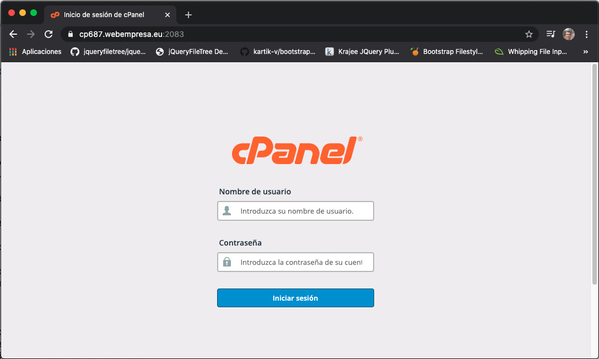
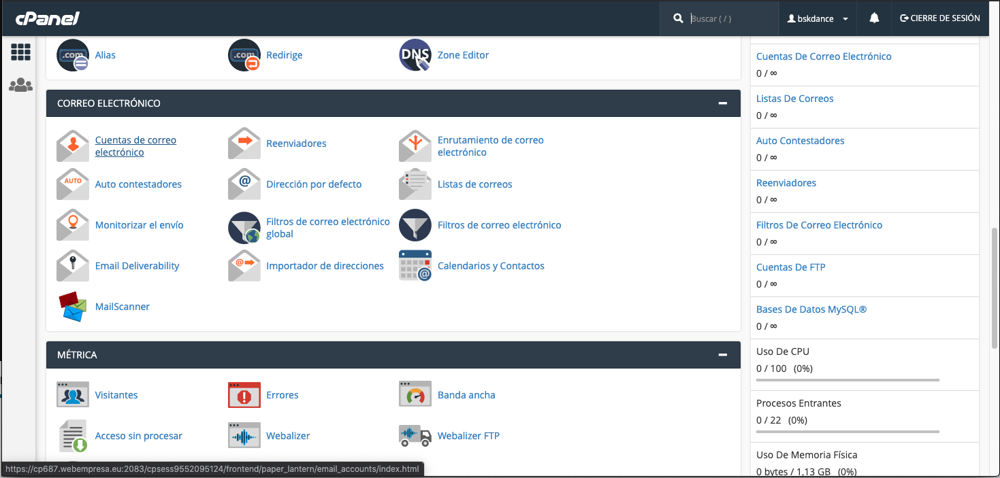
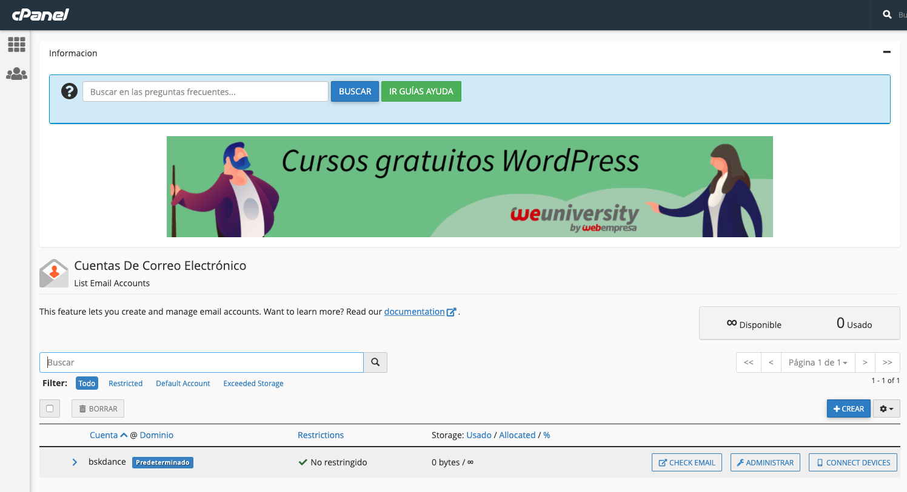
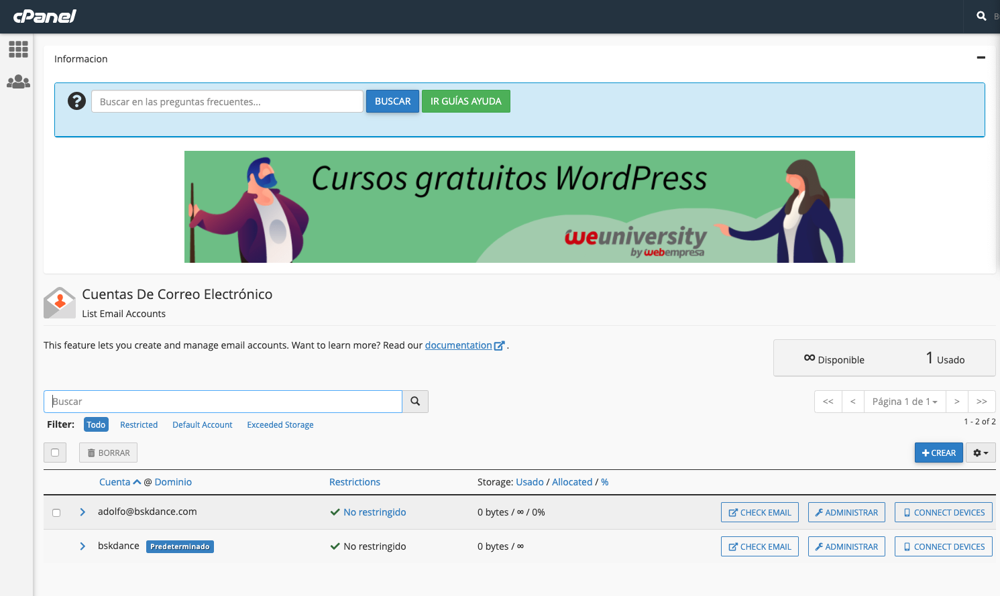
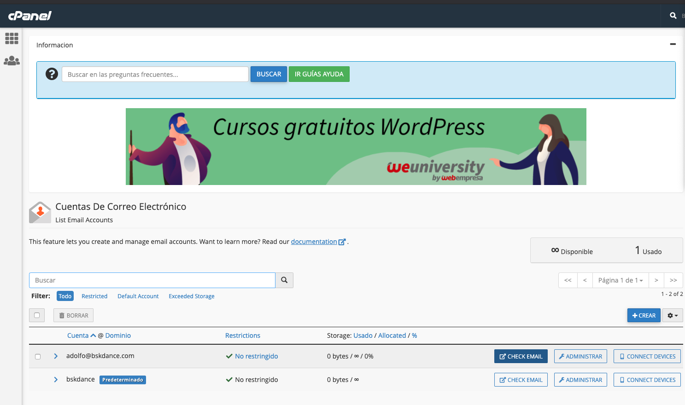

# 6. Envío de correos electrónicos 40:42

* Configuración previa 04:18
* Creación de una clase manejadora de correos 17:13
* Implementación de envío de correos electrónicos en la Vista y el Controlador 12:34
* Completando el código de envío de correos 06:37

## Configuración previa 04:18

Para poder enviar correos con Java necesitamos:

* un cuenta de Correo
* Un API 

### Configurar Cuenta de Correo

Para poder envíar correos en Java hay que configurar una cuenta de correos desde donde vamos envíar los correos, esta puede ser una cuenta hotmail, gmail o una cuenta de un servidor que tengamos contratado, este último caso es el que configuraremos aquí.

### Configigurar JavaMail API (compat) » 1.4.7

[JavaMail API (compat) » 1.4.7](https://mvnrepository.com/artifact/javax.mail/mail/1.4.7)

Necesitamos descargar la librería `javax.mail.jar`, en enlace abterior nos permite descargar `mail-1.4.7.jar`
el cual lo añadimos en la carpeta `lib` y lo añadimos al Build Path.

## Creación de una clase manejadora de correos 17:13
## Implementación de envío de correos electrónicos en la Vista y el Controlador 12:34
## Completando el código de envío de correos 06:37
