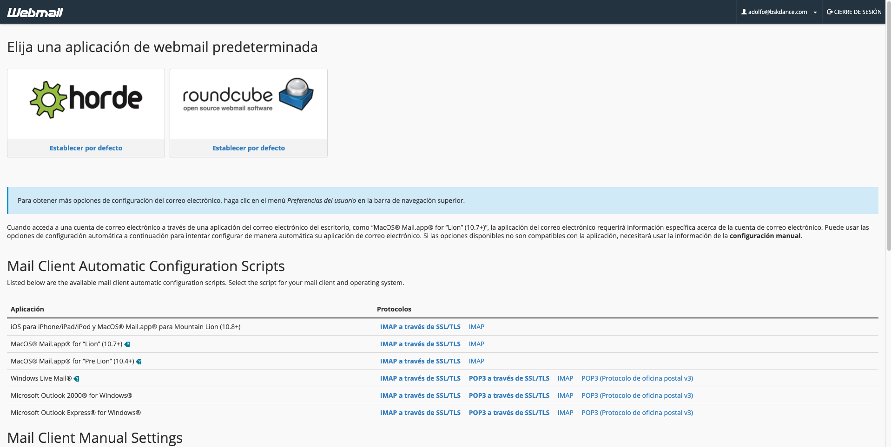
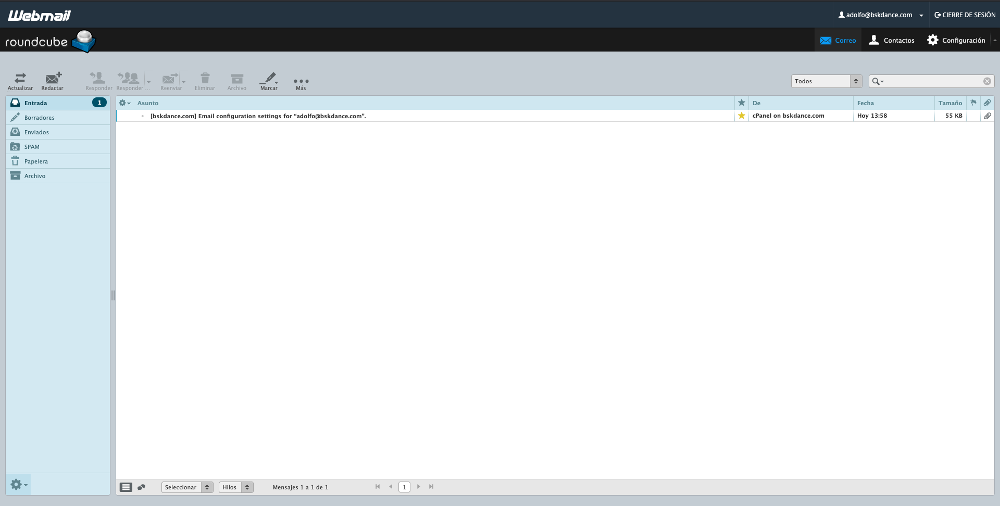
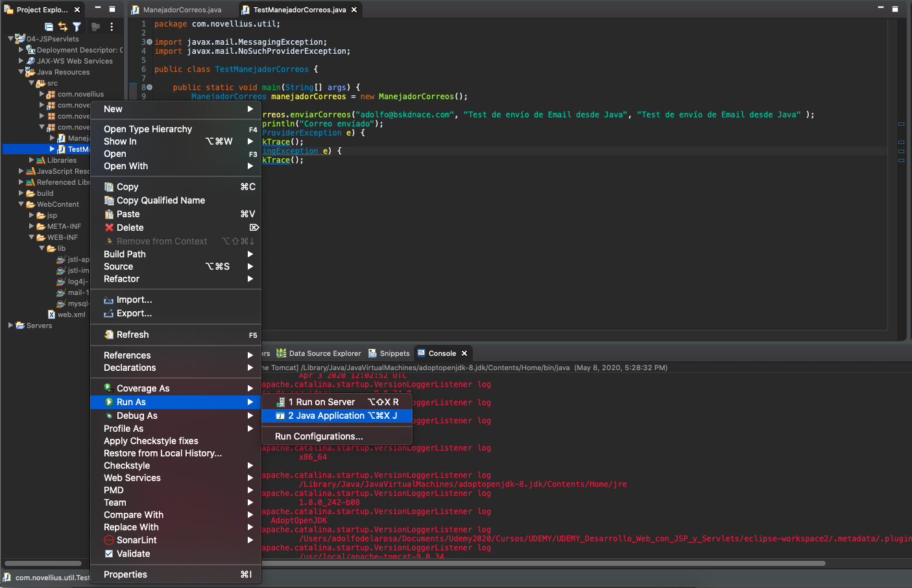
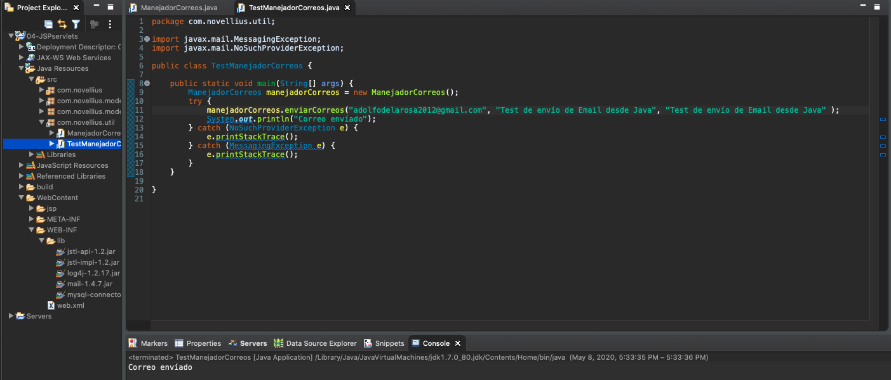
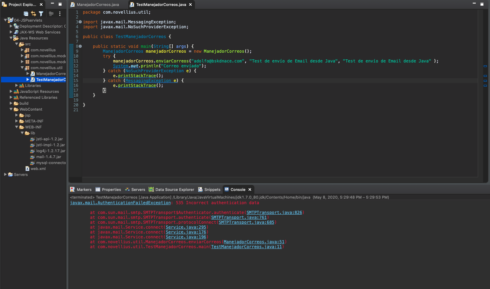
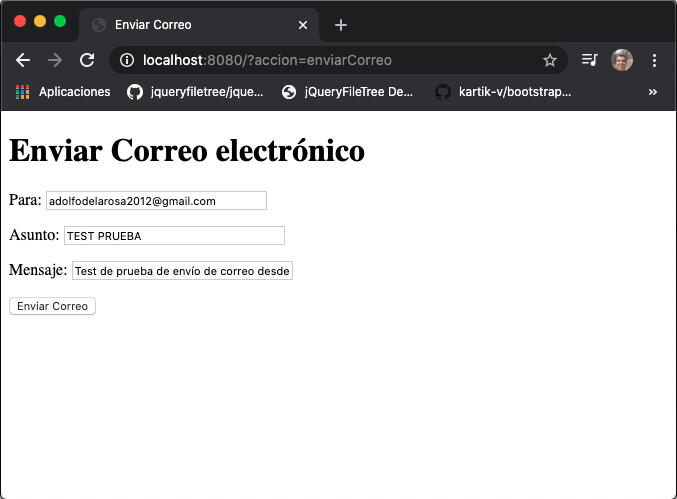
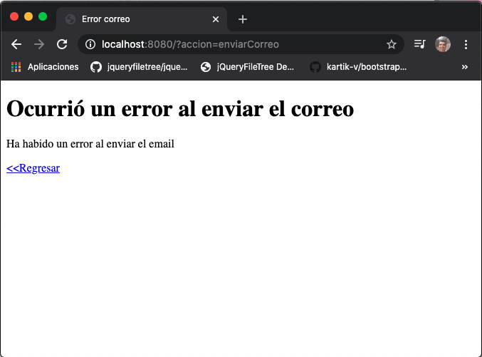
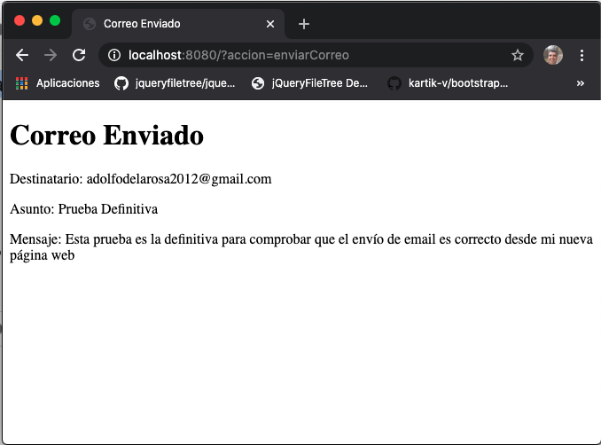

# 6. Envío de correos electrónicos 40:42

* Configuración previa 04:18
* Creación de una clase manejadora de correos 17:13
* Implementación de envío de correos electrónicos en la Vista y el Controlador 12:34
* Completando el código de envío de correos 06:37

## Configuración previa 04:18

Para poder enviar correos con Java necesitamos:

* un cuenta de Correo
* Un API 

### Configurar Cuenta de Correo

Para poder envíar correos en Java hay que configurar una cuenta de correos desde donde vamos envíar los correos, esta puede ser una cuenta hotmail, gmail o una cuenta de un servidor que tengamos contratado, este último caso es el que configuraremos aquí.






### Configigurar JavaMail API (compat) » 1.4.7

[JavaMail API (compat) » 1.4.7](https://mvnrepository.com/artifact/javax.mail/mail/1.4.7)

Necesitamos descargar la librería `javax.mail.jar`, en enlace abterior nos permite descargar `mail-1.4.7.jar`
el cual lo añadimos en la carpeta `lib` y lo añadimos al Build Path.


## Creación de una clase manejadora de correos 17:13

En esta lección vamos a crear una clase manejadora de correos. 

La nueva clase la crearemos en un nuevo paquete llamado `util` dentro de este paquete crearemos la clase `ManejadorCorreos.java` esta clase tiene que hacer los siguientes pasos:

* Iniciarlizar las propiedades de conexión como Host, Puerto, Usuario, Autenticación
* Inicializar una sesión de email con todas las propiedades previamente definidas
* Composición del mensaje pasando como parámetro la sesión. Establece emisor, destinatario, asunto y mensaje
* Crear un objeto que modela un objeto para el transportedel transporte, crea un canal de comunicación para el mensaje. 

Una vez hecho todo esto crearemos una clase de prueba `TestManejadorCorreos.java` para el envio de correos, con un método `public static void main(String[] args)`.

#### Ejecutar la aplicación

Ejecutamos la aplicación como una Java Aplicación, no usamos el Server.



Se ejecuta `TestManejadorCorreos.java` y nos muestra en consola que el Correo se ha envíado.



Si abrimos nuestro correo vemos el nuevo email


Y si lo abrimos vemos el contenido que definimos en nuestra clase `ManejadorCorreos.java`


Si por el contrario existe alguna excepción al ejecutar la clase se nos muestra en la consola, en este caso, el problema que el email emisor era incorrecto.



#### Código de Manejador de Correos

```java
package com.novellius.util;

import java.util.Properties;

import javax.mail.Message;
import javax.mail.MessagingException;
import javax.mail.NoSuchProviderException;
import javax.mail.Session;
import javax.mail.Transport;
import javax.mail.internet.InternetAddress;
import javax.mail.internet.MimeMessage;

public class ManejadorCorreos {
	
   // Propiedades de la clase
   private Properties props; // Datos del correo que va a enviar el mensaje HOST, PUERTO, EMAIL, AUTENTICACIÓN
   private Session sesion; // Sesión de javax.mail, una vez que se implementa la conexión esta sesión se conecta a ella para establecer un canal y poder enviar el mensaje y después cierra la conexión 
   private Transport transport; // Crean las conexiones para el email
   private MimeMessage msg; // Aquí se compone el cuerpo del mensaje
	
   //Constructor
   public ManejadorCorreos() {
		
      // Inicializar y llenar las propiedades básicas para poder conectar y enviar un correo
      props = new Properties();
      props.setProperty("mail.smtp.host", "mail.bskdance.com"); // Host del correo saliente
      props.setProperty("mail.smtp.port", "26"); // Puerto del correo saliente
      props.setProperty("mail.smtp.user", "adolfo@bskdance.com"); // Usuario del correo saliente
      props.setProperty("mail.smtp.auth", "true"); // Autenticación
		
   }
	
   //Método para enviar el correo
   //Dispara las excepciones hacia arriba para que el Servlet maneje la excepción y 
   //redirija a una vista que muestre un mensaje de error
   public void enviarCorreos(String destinatario, String asunto, String mensaje) throws MessagingException, NoSuchProviderException {
		
      //Inicializar sesión con las propiedades definidas
      sesion = Session.getDefaultInstance(props);
		
      //Composición del mensaje, establece emisor, destinatario, asunto y mensaje
      msg = new MimeMessage(sesion);
      msg.setFrom(new InternetAddress("adolfo@bskdance.com"));
      msg.addRecipient(Message.RecipientType.TO, new InternetAddress(destinatario));
      msg.setSubject(asunto);
      msg.setText("<h1>Mensaje</h1>"
               +  "<p>" + mensaje + "</p>", "UTF-8", "html"); //Puedi mandar texto plano o html
	
      // Crear un objeto que modela un objeto para el transportedel transporte, crea un canal de comunicación para el mensaje. 
      transport = sesion.getTransport("smtp"); // Protocolo para enviar emails
      transport.connect("adolfo@bskdance.com", "1234ABCD"); //Claves de autenticación
      transport.sendMessage(msg, msg.getAllRecipients()); // Envío del correo (se puede envíar a varios destinatarios si son un array)
      transport.close(); // Cerrar la conexión
   }
}
```

*ManejadorCorreos.java*

```java
package com.novellius.util;

import javax.mail.MessagingException;
import javax.mail.NoSuchProviderException;

public class TestManejadorCorreos {
	
   public static void main(String[] args) {
      ManejadorCorreos manejadorCorreos = new ManejadorCorreos();
      try {
         manejadorCorreos.enviarCorreos("adolfodelarosa2012@gmail.com", "Test de envío de Email desde Java", "Test de envío de Email desde Java" );
         System.out.println("Correo envíado");
      } catch (NoSuchProviderException e) {
         e.printStackTrace();
      } catch (MessagingException e) {
         e.printStackTrace();
      }
   }
}
```

*TestManejadorCorreos.java*

## Implementación de envío de correos electrónicos en la Vista y el Controlador 12:34

En esta lección vamos a implementar el envío de correos electrónicos en la Vista y el Controlador. 

Lo primero que haremos es incluir una opción a nuestro menú en la vista `postLogin.jsp`.

```html
<tr>
   <td><a href="?accion=enviarCorreo" >Enviar correo electrónico</a></td>
</tr>
```

Manejamos esta nueva acción en nuestro Servlet.

```java
} else if (accion.contentEquals("enviarCorreo")) {
   setRespuestaControlador(accion).forward(request, response);
}
```

Creamos la nueva vista `enviarCorreo.jsp`

```html
<h1>Enviar Correo electrónico</h1>

<form method="post" action="?accion=enviarCorreo">
		
   <p>Para: <input type="text" name="destinatario" size="35" /></p>
   <p>Asunto: <input type="text" name="asunto" size="35" /></p>
   <p>Mensaje: <input type="text" name="destinatario" size="35" /></p>
		
   <input type="submit" value="Enviar Correo" />
</form>
```

Tenemos una nueva acción `enviarCorreo` que debemos manejar en el método `doPost()` del Servlet. Hemos agregado el conjunto de caracteres UTF-8 al método `doPost()` para que los emails lleguen con acentos.

```java
protected void doPost(HttpServletRequest request, HttpServletResponse response)
			throws ServletException, IOException {
   //Establecer un juego de carácteres para los parámetros que llegan al método POST
   request.setCharacterEncoding("UTF-8");

   ....

   } else if(accion.contentEquals("enviarCorreo")) {
      ManejadorCorreos manejadorCorreos = new ManejadorCorreos();
      try {
         manejadorCorreos.enviarCorreos(request.getParameter("destinatario"), request.getParameter("asunto"), request.getParameter("mensaje"));
         log.info("correo enviado correctamente");
      } catch (Exception e) {
         log.error("Al enviar correo: " + e.getMessage());
         e.printStackTrace();
         setRespuestaControlador("errorCorreo").forward(request, response);
      }
}
```

Vamos a crear la nueva vista `errorCorreo.jsp` 

```html
<%@ page language="java" contentType="text/html; charset=UTF-8"
    pageEncoding="UTF-8"%>
<!DOCTYPE html>
<html>
<head>
<meta charset="UTF-8">
<title>Error correo</title>
</head>
<body>
   <h1>Ocurrió un error al enviar el correo</h1>
   
   <p>Ha habido un error al enviar el email</p>
   
   <a href="?accion="menu">&lt;&lt;Regresar</a>

</body>
</html>
```

Metemos en el método `doGet()` la acción de `menu`:

```java
} else if (accion.equals("menu")) {
   setRespuestaControlador("postLogin").forward(request, response);
}
```

### Ejecución de la aplicación


Ingresamos los datos de destinatario, asunto y mensaje.



Aparece una pantalla en blanco por que no estamos redirigiendo a ninguna vista.


Pero en la consola vemos el mensaje de que el correo se ha enviado.


Si abrimos el correo vemos que el correo ha llegado


Si abrimos el contenido del email vemos exactamente lo que se metio en el formulario.


En caso de que ubiese un error nos manda a la vista `errorCorreo.jsp`



## Completando el código de envío de correos 06:37

Finalmente lo que vamos a hacer es crear una vista para mostrar un aviso de que el email a sido enviado y no nos salga solo la pantalla en blanco, la llamaremos `postEnvioCorreo.jsp`

```html
<%@ page language="java" contentType="text/html; charset=UTF-8"
    pageEncoding="UTF-8"%>
<!DOCTYPE html>
<html>
<head>
<meta charset="UTF-8">
<title>Correo Enviado</title>
</head>
<body>
   <h1>Correo Enviado</h1>
   <p>Destinatario: ${param.destinatario}</p>
   <p>Asunto: ${param.asunto}</p>
   <p>Mensaje: ${param.mensaje}</p>
</body>
</html>
```

*postEnvioCorreo.jsp*


En nuetro Servlet debemos reenviar a esta nueva vista cuando el correo se envíe correctamente:

```java
} else if(accion.contentEquals("enviarCorreo")) {
   ManejadorCorreos manejadorCorreos = new ManejadorCorreos();
   try {
      manejadorCorreos.enviarCorreos(request.getParameter("destinatario"), request.getParameter("asunto"), request.getParameter("mensaje"));
      log.info("correo enviado correctamente");
      setRespuestaControlador("postEnviocorreo").forward(request, response);
   } catch (Exception e) {
   
   . . .
```


### Ejecución de la aplicación


Ingresamos los datos de destinatario, asunto y mensaje.


Ahora ya se nos muestra una pantalla de resultado con los datos enviados en el correo electrónico.



Si abrimos el correo 


Comprobamos que lo que se recibe es exactamente lo que se envío desde el email.


## Código del proyecto hasta el momento

Esta es la estructura de todos los archivos que tenemos hasta el momento en nuetra aplicación:


```java
package com.novellius;

import java.io.IOException;
import java.sql.Connection;
import java.sql.DriverManager;
import java.sql.SQLException;
import java.util.ArrayList;

import javax.mail.MessagingException;
import javax.mail.NoSuchProviderException;
import javax.naming.Context;
import javax.naming.InitialContext;
import javax.naming.NamingException;
import javax.servlet.RequestDispatcher;
import javax.servlet.ServletConfig;
import javax.servlet.ServletContext;
import javax.servlet.ServletException;
import javax.servlet.http.Cookie;
import javax.servlet.http.HttpServlet;
import javax.servlet.http.HttpServletRequest;
import javax.servlet.http.HttpServletResponse;
import javax.servlet.http.HttpSession;
import javax.sql.DataSource;

import org.apache.log4j.BasicConfigurator;
import org.apache.log4j.LogManager;
import org.apache.log4j.Logger;

import com.novellius.modelo.Cuenta;
import com.novellius.modelo.beans.Administrador;
import com.novellius.util.ManejadorCorreos;

/**
 * Servlet implementation class Servlet
 */
public class Servlet extends HttpServlet {
	private static final long serialVersionUID = 1L;

	private static final Logger log = LogManager.getLogger("Servlet: ");
	private String rutaJsp;

	// Variables para interctuar con la BD
	private DataSource ds;
	private Connection con;

	/**
	 * @see HttpServlet#HttpServlet()
	 */
	public Servlet() {
		super();
		// TODO Auto-generated constructor stub
	}

	@Override
	public void init(ServletConfig config) throws ServletException {
		// TODO Auto-generated method stub
		super.init(config);

		// System.out.println(config.getInitParameter("rutaJsp"));
		rutaJsp = config.getInitParameter("rutaJsp");

		// Configurar Logger
		BasicConfigurator.configure();

		// Confuguración JNDI
		try {
			InitialContext initContext = new InitialContext();
			Context env = (Context) initContext.lookup("java:comp/env");
			ds = (DataSource) env.lookup("jdbc/novellius");
		} catch (NamingException e) {
			log.error("Al configurar JNDI: " + e.getMessage());
		}
	}

	/**
	 * @see HttpServlet#doGet(HttpServletRequest request, HttpServletResponse
	 *      response)
	 */
	protected void doGet(HttpServletRequest request, HttpServletResponse response)
			throws ServletException, IOException {

		String accion = request.getParameter("accion");
		HttpSession sesion = request.getSession();
		
		// Conexión a la BD
		try {
		   con = ds.getConnection();
		} catch (SQLException e) {
		   // Enviar a una vista de error
		  log.error("Error al crear conexión: " + e.getMessage());
		}

		if (accion != null) {
			if (accion.equals("login")) {
				setRespuestaControlador(accion).forward(request, response);
			} else if (accion.equals("menu")) {
				setRespuestaControlador("postLogin").forward(request, response);
			} else if (accion.equals("logout")) {
				sesion.invalidate();
				log.info("Sesión destruida");
				setRespuestaControlador("login").forward(request, response);
			} else if (accion.equals("consultarAdministradores")) {
				
				//Intanciación anónima me evito 
				//Cuenta cuenta = new Cuenta(con);
				ArrayList<Administrador> administradores = new Cuenta(con).consultarAdministradores();
				
				if(administradores.isEmpty()) {
					request.setAttribute("mensaje", "No se encotrarón administradores");
				}else {
					request.setAttribute("mensaje", "Administradores encontrados");
					// Vamos a cargar los administradores encontrados en la sesión
					sesion.setAttribute("administradores", administradores);
				}
				setRespuestaControlador("consultaAdministradores").forward(request, response);
			} else if (accion.contentEquals("registrarPregunta")) {
				setRespuestaControlador(accion).forward(request, response);
			} else if (accion.contentEquals("insertarPregunta")) {
				setRespuestaControlador(accion).forward(request, response);
			} else if (accion.contentEquals("enviarCorreo")) {
				setRespuestaControlador(accion).forward(request, response);
			}
		} else {
			setRespuestaControlador("login").forward(request, response);
		}
		
		// Conexión a la BD
		try {
		   con.close();
		} catch (SQLException e) {
		   // Enviar a una vista de error
		   log.error("Error al cerrar conexión: " + e.getMessage());
		}
	}

	/**
	 * @see HttpServlet#doPost(HttpServletRequest request, HttpServletResponse
	 *      response)
	 */
	protected void doPost(HttpServletRequest request, HttpServletResponse response)
			throws ServletException, IOException {
		
		//Establecer un juego de carácteres para los parámetros que llegan al método POST
		request.setCharacterEncoding("UTF-8");

		String accion = request.getParameter("accion");
		HttpSession sesion = request.getSession();

		// Conexión a la BD
		try {
			con = ds.getConnection();
		} catch (SQLException e) {
			// Enviar a una vista de error
			log.error("Error al crear conexión: " + e.getMessage());

		}

		if (accion != null) {

			if (accion.equals("iniciarSesion")) {

				String usuario = request.getParameter("usuario");
				String contrasena = request.getParameter("contrasena");
				
				
				// Creación de la Cookie
				Cookie cookieUsurio = new Cookie("usuario", usuario);
				Cookie cookieContrasena = new Cookie("contrasena", contrasena);
				
				try {
						
				   if (request.getParameter("ckbox").equals("on")) {
						
						// Tiempo de vida 1 día
						cookieUsurio.setMaxAge(60 * 60 * 24);
						cookieContrasena.setMaxAge(60 * 60 * 24);
						// Añado las cookies
						response.addCookie(cookieUsurio);
						response.addCookie(cookieContrasena);
						
						System.out.println("Cookies añadidos");
					}
				} catch (NullPointerException e) {
					log.info("chbox vacio");
					
					
					// Expira las cookies
					cookieUsurio.setMaxAge(0);
					cookieContrasena.setMaxAge(0);
					// Añado las cookies
					response.addCookie(cookieUsurio);
					response.addCookie(cookieContrasena);
				}

				// Invocar consulta SQL
				Cuenta cuenta = new Cuenta(con);

				if (cuenta.login(usuario, contrasena)) {
					log.info("Ingresado correctamente como: " + usuario);


					// Ámbito sesión
					sesion.setAttribute("usuario", usuario);
					setRespuestaControlador("postLogin").forward(request, response);

				} else {
					log.error("Error de login");
					request.setAttribute("error", "Nombre de usuario o contraseña incorrectos.");
					
					setRespuestaControlador("login").forward(request, response);
				}
			} else if(accion.contentEquals("enviarCorreo")) {
				ManejadorCorreos manejadorCorreos = new ManejadorCorreos();
				try {
					manejadorCorreos.enviarCorreos(request.getParameter("destinatario"), request.getParameter("asunto"), request.getParameter("mensaje"));
					log.info("correo enviado correctamente");
					setRespuestaControlador("postEnvioCorreo").forward(request, response);
				} catch (Exception e) {
					log.error("Al enviar correo: " + e.getMessage());
					e.printStackTrace();
					setRespuestaControlador("errorCorreo").forward(request, response);
				}
			}

		} else {
			setRespuestaControlador("login").forward(request, response);
		}

		// Conexión a la BD
		try {
			con.close();
		} catch (SQLException e) {
			// Enviar a una vista de error
			log.error("Error al cerrar conexión: " + e.getMessage());
		}

	}

	public RequestDispatcher setRespuestaControlador(String vista) {
		String url = rutaJsp + vista + ".jsp";
		return getServletContext().getRequestDispatcher(url);
	}
}
```
*Servlet.java*

```java
package com.novellius.modelo;

import java.sql.Connection;
import java.sql.PreparedStatement;
import java.sql.ResultSet;
import java.sql.SQLException;
import java.util.ArrayList;

import org.apache.log4j.LogManager;
import org.apache.log4j.Logger;

import com.novellius.modelo.beans.Administrador;

public class Cuenta {
	
	private static final Logger log = LogManager.getLogger("Cuenta: ");
	private Connection con;

	public Cuenta(Connection con) {
		this.con = con;
	}
	
	public boolean login(String email, String contrasena) {
		
		
		// El uso de los comodines (?) en lugar de la concatenación, nos permite evitar la SQL INYECTION (; delete database) 
		String sql = "SELECT count(*) as count FROM administrador WHERE email = ? AND contrasena = ? ";
		
		//Permite saber si encontro o no el registro en la BD
		int noRegistros = 0;
		
		try {
			//Preparar la sentencia
			PreparedStatement st = con.prepareStatement(sql);
			
			//Pasar valores a los dos comodines
			st.setString(1, email);
			st.setString(2, contrasena);
			
			// Ejecutar la consulta y almacenarla en un ResultSet
			ResultSet rs = st.executeQuery();
			
			//Comprobar que la consulta obtuvo resultados
			if(rs.next()) {
				noRegistros = rs.getInt("count");
			}
			
			//Cerrar el Result Set
			rs.close();
		} catch (SQLException e) {
			log.error("Al realizar Login: " + e.getMessage());
			// Si hay una excepción retornamos false
			return false;
		}
		
		// Verificamos si hubo coincidencias en la BD
		if (noRegistros == 0 ) {
			return false;
		}else {
			return true;
		}
	}
	
	public ArrayList<Administrador> consultarAdministradores(){
		
		ArrayList<Administrador> administradores = new ArrayList<Administrador>();
		
		String sql = "SELECT * FROM administrador";
		
		try {
			PreparedStatement st = con.prepareStatement(sql);
			
			ResultSet rs = st.executeQuery();
			
			while(rs.next()) {
				
				Administrador administrador = new Administrador(
						rs.getString("email"),
						rs.getString("contrasena"),
						rs.getString("nombre"),
						rs.getString("estado"),
						rs.getInt("idPregunta")
				);
				
				administradores.add(administrador);
			}
			rs.close();
		} catch (SQLException e) {
			administradores.clear();
			log.error("Al consultar administradores: " + e.getMessage());
		}
		
		return administradores;
	}
}
```
*Cuenta.java*

```java
package com.novellius.modelo.beans;

public class Administrador {
	
	private int idAdministrador;
	private String email;
	private String contrasena;
	private String nombre;
	private String estado;
	private int idPregunta;
	
	public Administrador(String email, String contrasena, String nombre, String estado, int idPregunta) {
		this.email = email;
		this.contrasena = contrasena;
		this.nombre = nombre;
		this.estado = estado;
		this.idPregunta = idPregunta;
	}
	
	public int getIdAdministrador() {
		return idAdministrador;
	}
	public void setIdAdministrador(int idAdministrador) {
		this.idAdministrador = idAdministrador;
	}
	public String getEmail() {
		return email;
	}
	public void setEmail(String email) {
		this.email = email;
	}
	public String getContrasena() {
		return contrasena;
	}
	public void setContrasena(String contrasena) {
		this.contrasena = contrasena;
	}
	public String getNombre() {
		return nombre;
	}
	public void setNombre(String nombre) {
		this.nombre = nombre;
	}
	public String getEstado() {
		return estado;
	}
	public void setEstado(String estado) {
		this.estado = estado;
	}
	public int getIdPregunta() {
		return idPregunta;
	}
	public void setIdPregunta(int idPregunta) {
		this.idPregunta = idPregunta;
	}
	
}
```
*Administrador.java*

```java
package com.novellius.util;

import java.util.Properties;

import javax.mail.Message;
import javax.mail.MessagingException;
import javax.mail.NoSuchProviderException;
import javax.mail.Session;
import javax.mail.Transport;
import javax.mail.internet.InternetAddress;
import javax.mail.internet.MimeMessage;

public class ManejadorCorreos {
	
	// Propiedades de la clase
	private Properties props; // Datos del correo que va a enviar el mensaje HOST, PUERTO, EMAIL, AUTENTICACIÓN
	private Session sesion; // Sesión de javax.mail, una vez que se implementa la conexión esta sesión se conecta a ella para establecer un canal y poder enviar el mensaje y después cierra la conexión 
	private Transport transport; // Crean las conexiones para el email
	private MimeMessage msg; // Aquí se compone el cuerpo del mensaje
	
	//Constructor
	public ManejadorCorreos() {
		
		// Inicializar y llenar las propiedades básicas para poder conectar y enviar un correo
		props = new Properties();
		props.setProperty("mail.smtp.host", "mail.bskdance.com"); // Host del correo saliente
		props.setProperty("mail.smtp.port", "26"); // Puerto del correo saliente
		props.setProperty("mail.smtp.user", "adolfo@bskdance.com"); // Usuario del correo saliente
		props.setProperty("mail.smtp.auth", "true"); // Autenticación
		
	}
	
	//Método para enviar el correo
	//Dispara las excepciones hacia arriba para que el Servlet maneje la excepción y 
	//redirija a una vista que muestre un mensaje de error
	public void enviarCorreos(String destinatario, String asunto, String mensaje) throws MessagingException, NoSuchProviderException {
		
		//Inicializar sesión con las propiedades definidas
		sesion = Session.getDefaultInstance(props);
		
		//Composición del mensaje, establece emisor, destinatario, asunto y mensaje
		msg = new MimeMessage(sesion);
		msg.setFrom(new InternetAddress("adolfo@bskdance.com"));
		msg.addRecipient(Message.RecipientType.TO, new InternetAddress(destinatario));
		msg.setSubject(asunto);
		msg.setText("<h1>Mensaje</h1>"
		          +	"<p>" + mensaje + "</p>", "UTF-8", "html"); //Puedi mandar texto plano o html
	
		// Crear un objeto que modela un objeto para el transportedel transporte, crea un canal de comunicación para el mensaje. 
		transport = sesion.getTransport("smtp"); // Protocolo para enviar emails
		transport.connect("adolfo@bskdance.com", "1234ABCD"); //Claves de autenticación
		transport.sendMessage(msg, msg.getAllRecipients()); // Envío del correo (se puede envíar a varios destinatarios si son un array)
		transport.close(); // Cerrar la conexión
	}

}
```
*ManejadorCorreo.java*

```java
package com.novellius.util;

import javax.mail.MessagingException;
import javax.mail.NoSuchProviderException;

public class TestManejadorCorreos {
	
	public static void main(String[] args) {
		ManejadorCorreos manejadorCorreos = new ManejadorCorreos();
		try {
			manejadorCorreos.enviarCorreos("adolfodelarosa2012@gmail.com", "Test de envío de Email desde Java", "Test de envío de Email desde Java" );
			System.out.println("Correo envíado");
		} catch (NoSuchProviderException e) {
			e.printStackTrace();
		} catch (MessagingException e) {
			e.printStackTrace();
		}
	}
}
```
*TestManejadorCorreo.java*


