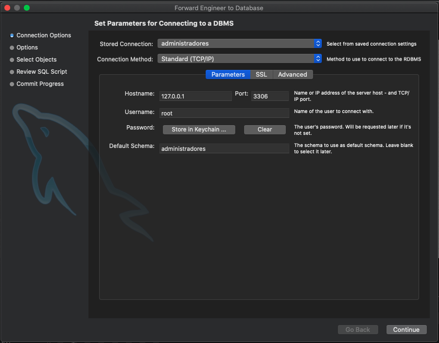
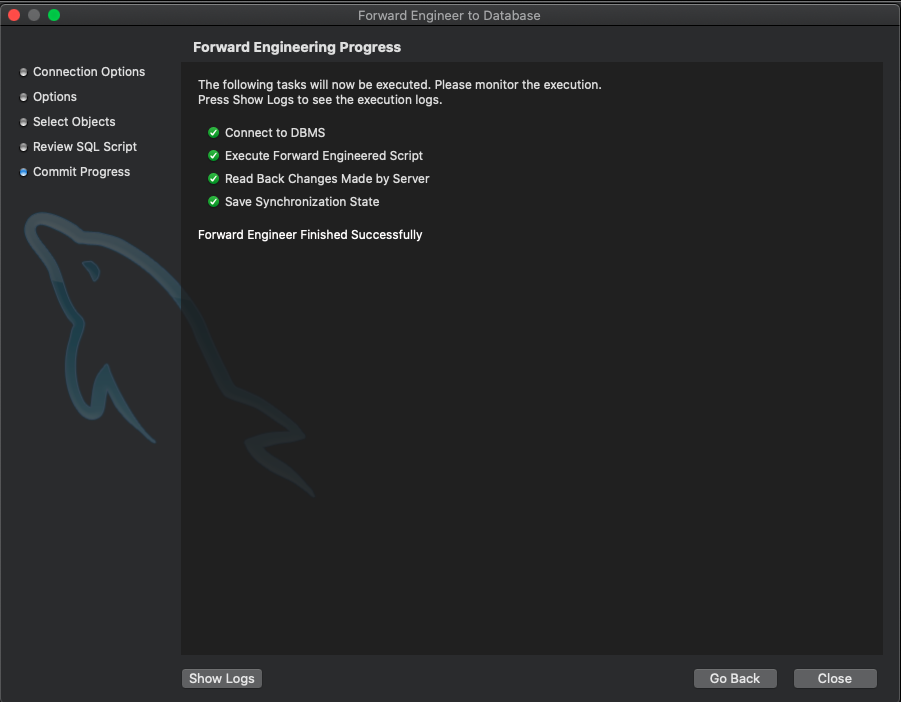
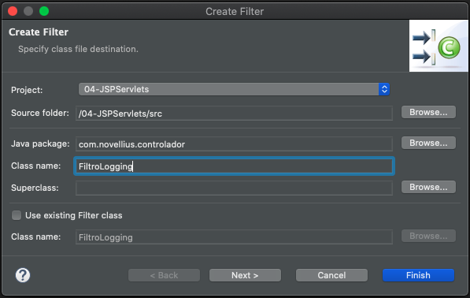
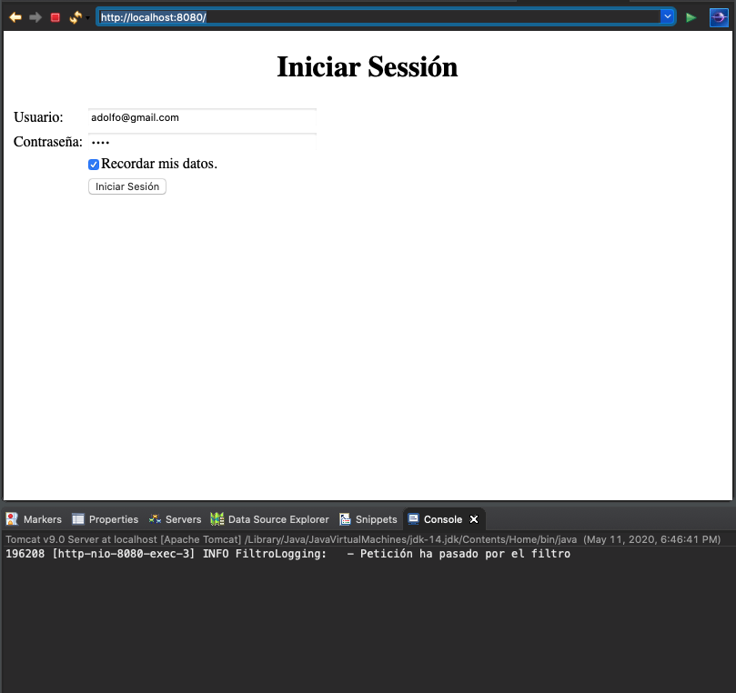
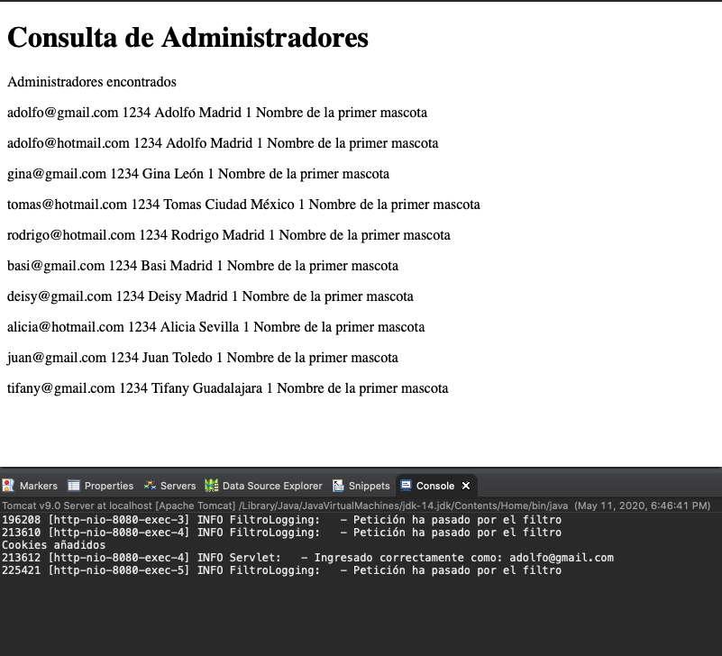
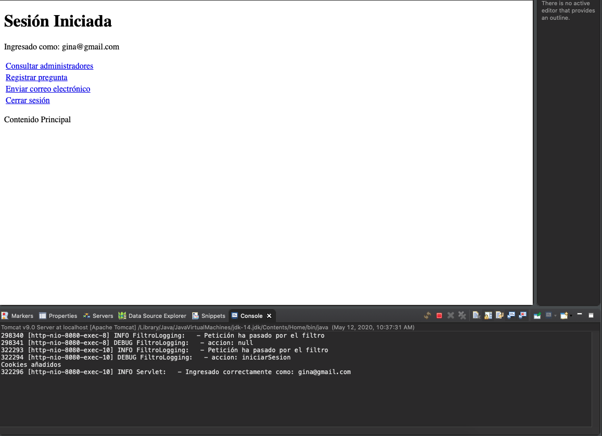
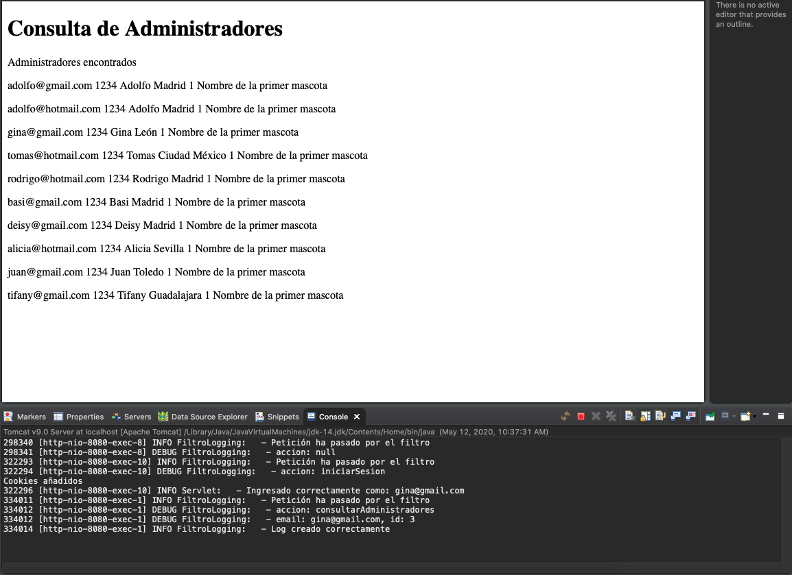

# 7. Implementación de un Logger a través de Filtros 01:02:17

En este capítulo veremos el uso de filtros, crearemos un módulo de Logger para registrar todos los movimientos del administrador y registrarlos en la BD. 

* Creación de la tabla de Log 04:32
* Definición y creación de un SerlvetFilter básico 06:17
* Código del modelo para crear el Logger 12:48
* Implementación del Logger en el SerlvetFilter 19:49
* Completando el módulo de Logging 18:51

## Creación de la tabla de Log 04:32

En esta lección vamos a crear una nueva tabla llamada `log` la cual se relacionara con la tabla `administrador`, es decir que un administrador pueden tener varios logs.


Una vez creada la tabla vamos a generar el código para que se genere la BD.


Seleccionamos la conección `administradores`



Marcamos el check drop objects before each CREATE object, para eliminar el esquema previo antes de generarlo nuevamente.


Continuamos


Se nos muestra el código generado 


Ejecuta todas las tareas correctamente 



Tenemos nuestras tres tablas generadas


Como se borrarón los datos de las tablas `administrador` y `pregunta` vamos a ejecutar los siguientes scripts:

```sql
INSERT INTO `pregunta` (`idpregunta`,`pregunta`) VALUES (1,'Nombre de la primer mascota');
INSERT INTO `pregunta` (`idpregunta`,`pregunta`) VALUES (2,'Apellido de soltera de la madre');
INSERT INTO `pregunta` (`idpregunta`,`pregunta`) VALUES (3,'Nombre del abuelo paterno');
INSERT INTO `pregunta` (`idpregunta`,`pregunta`) VALUES (4,'Nombre de escuela primaría');
INSERT INTO `administrador` (`id`,`email`,`contrasena`,`nombre`,`estado`,`idpregunta`) VALUES (1,'adolfo@gmail.com','1234','Adolfo','Madrid',1);
INSERT INTO `administrador` (`id`,`email`,`contrasena`,`nombre`,`estado`,`idpregunta`) VALUES (2,'adolfo@hotmail.com','1234','Adolfo','Madrid',1);
INSERT INTO `administrador` (`id`,`email`,`contrasena`,`nombre`,`estado`,`idpregunta`) VALUES (3,'gina@gmail.com','1234','Gina','León',1);
INSERT INTO `administrador` (`id`,`email`,`contrasena`,`nombre`,`estado`,`idpregunta`) VALUES (4,'tomas@hotmail.com','1234','Tomas','Ciudad México',1);
INSERT INTO `administrador` (`id`,`email`,`contrasena`,`nombre`,`estado`,`idpregunta`) VALUES (5,'rodrigo@hotmail.com','1234','Rodrigo','Madrid',1);
INSERT INTO `administrador` (`id`,`email`,`contrasena`,`nombre`,`estado`,`idpregunta`) VALUES (6,'basi@gmail.com','1234','Basi','Madrid',1);
INSERT INTO `administrador` (`id`,`email`,`contrasena`,`nombre`,`estado`,`idpregunta`) VALUES (7,'deisy@gmail.com','1234','Deisy','Madrid',1);
INSERT INTO `administrador` (`id`,`email`,`contrasena`,`nombre`,`estado`,`idpregunta`) VALUES (8,'alicia@hotmail.com','1234','Alicia','Sevilla',1);
INSERT INTO `administrador` (`id`,`email`,`contrasena`,`nombre`,`estado`,`idpregunta`) VALUES (9,'juan@gmail.com','1234','Juan','Toledo',1);
INSERT INTO `administrador` (`id`,`email`,`contrasena`,`nombre`,`estado`,`idpregunta`) VALUES (10,'tifany@gmail.com','1234','Tifany','Guadalajara',1);
```
## Definición y creación de un SerlvetFilter básico 06:17

En esta lección veremos que es un Filtro y crearemos un SerlvetFilter básico.

### ¿Qué es un Filter?

El filter es una capa entre el cliente y el Servlet cada que se hace un request/response.


En el filter podemos realizar tareas intermedias de acuerdo a las peticiones o respuestas que se hagan, para nuestro ejemplo iinterceptaremos la "acción" que se realiza y la registraremos en la BD.

### Creación del Filter.

1. Creamos el paquete `com.novellius.controlador`
2. Movemos `Servlet.java` en este nuevo paquete
3. Es necesario modificar `web.xml` para indicar la nueva posición del Servlet

```html
<servlet-class>com.novellius.controlador.Servlet</servlet-class>
```

4. Dentro del nuevo paquete creamos un nuevo `Filter`




5.Se crea una plantilla en `FiltroLogging.java`, para comprobar que funciona, implementaremos el Logger en este archivo y mandaremos un mensaje en el método `doFilter`:

```java
public void doFilter(ServletRequest request, ServletResponse response, FilterChain chain) throws IOException, ServletException {
		
		log.info("Petición ha pasado por el filtro");
		
		// pass the request along the filter chain
		chain.doFilter(request, response);
	}
```

6. En teoría se debería haber metido una etiqueta `<filter>` y `<filter-mapping>` en `web.xml` pero si no lo hace la metemos manualmente:

```html
<filter>
	<display-name>FiltroLogging</display-name>
	<filter-name>FiltroLogging</filter-name>
	<filter-class>com.novellius.controlador.FiltroLogging</filter-class>
</filter>
<filter-mapping>
	<filter-name>FiltroLogging</filter-name>
	<url-pattern>/*</url-pattern>
</filter-mapping>
```

7. Ejecutamos el proyecto

Al cargar el proyecto ya paso por el filtro



Al hacer el loggin pasa nuevamente por el filtro


Y al entrar a cualquier opción del menú vuelve a pasar por el filtro



## Código del modelo para crear el Logger 12:48

En esta lección vamos a crear las clases del modelo para insertar en la BD en nuestro Logger.

1. En el paquete `modelo.beans` vamos a crear el bean `Log`

```java
package com.novellius.modelo.beans;

public class Log {
	
   private int idLog;
   private String accionLog;
   private int idAdministrador;
	
   public Log() {
   }
		
   public Log(int idLog, String accionLog, int idAdministrador) {
      super();
      this.idLog = idLog;
      this.accionLog = accionLog;
      this.idAdministrador = idAdministrador;
   }
	
   public int getIdLog() {
      return idLog;
   }
   public void setIdLog(int idLog) {
      this.idLog = idLog;
   }
   public String getAccionLog() {
      return accionLog;
   }
   public void setAccionLog(String accionLog) {
      this.accionLog = accionLog;
   }
   public int getIdAdministrador() {
      return idAdministrador;
   }
   public void setIdAdministrador(int idAdministrador) {
      this.idAdministrador = idAdministrador;
   }
}
```

2. En el paquete `modelo` creamos la clase `Logging.java`

```java
package com.novellius.modelo;

import java.sql.Connection;
import java.sql.PreparedStatement;
import java.sql.SQLException;

import org.apache.log4j.LogManager;
import org.apache.log4j.Logger;

public class Logging {

   private static final Logger log = LogManager.getLogger("Logging: ");
   private Connection con;

   public Logging(Connection con) {
      this.con = con;
   }
	
   public boolean registrarLog(String accionLog, int idAdministrador) {
		
      try {
         PreparedStatement st = con.prepareStatement("INSERT INTO log (accionLog, idadministrador) VALUES (?, ?)");
	 st.setString(1, accionLog);
	 st.setInt(2,  idAdministrador);
	 st.executeUpdate();
			
	 st.close();
			
	 return true;

      } catch (SQLException e) {
         // TODO Auto-generated catch block
	 e.printStackTrace();
         return false;
      }
   }	
}
```


3. En `Servlet.java` es necesario colocar el `id` del administrador en la sesión como lo hacemos con el `usuario`

```java
if (cuenta.login(usuario, contrasena)) {
   log.info("Ingresado correctamente como: " + usuario);

   // Ámbito sesión
   sesion.setAttribute("usuario", usuario);
   //sesion.setAttribute("id", id);
   sesion.setAttribute("id", new Cuenta(con).obtenerIdAdmin(usuario));
   setRespuestaControlador("postLogin").forward(request, response);
} 
```

   Pero el id lo tenemos que sacar de algún lado, tenemos dos opciónes crear un método en la clase `Cuenta.java` que me regrese el id de un administrador en base a su email o que cuando invoco la acción `iniciarSesion` además de queme pase el `usuario` y `contrasena` también pase el `id`, en esta ocasión obtaremos por la primer soluión pero es mejor la segunda.

4. En `Cuenta.java` creamos el método que me regrese el `id` de un administrador en base a su `email`:

```java
public int obtenerIdAdmin(String emailAdmin) {
		
   try {
      PreparedStatement st = con.prepareStatement("SELECT id FROM administrador WHERE email = ?");
      st.setString(1, emailAdmin);
			
      ResultSet rs = st.executeQuery();
			
      /*
      if(rs.next()) {
         return rs.getInt("id");
      } else {
         return 0;
      }
      */
			
      return (rs.next()) ? rs.getInt("id") : 0;
		
   } catch (SQLException e) {
      // TODO Auto-generated catch block
      e.printStackTrace();
      return 0;
   }		
}
```

## Implementación del Logger en el SerlvetFilter 19:49

En esta lección vamos a implementar el Logger en el SerlvetFilter, es decir vamos a detectar que acción se esta ejecutando y la vamos a registrar en la BD. Como trabajaremos con la BD necesitamos implementar el JNDI, abrir conexiciones a la BD,  insertar registros en la tabla `log` y cerrar la conexión, vamos a seguir los siguientes pasos.

1. En el método `init()` de `FiltroLogging.java` implementamos JNDI.

```java
...
private DataSource ds;
....

// Confuguración JNDI
try {
      InitialContext initContext = new InitialContext();
      Context env = (Context) initContext.lookup("java:comp/env");
      ds = (DataSource) env.lookup("jdbc/novellius");
   } catch (NamingException e) {
      log.error("Al configurar JNDI: " + e.getMessage());
   }
```

2. En el método `doFilter()` vamos a abrir la conexión de la BD, detectaremos la acción ejecutada, la insertaremos en la BD y cerraremos la conexión a la BD.

```java
public void doFilter(ServletRequest request, ServletResponse response, FilterChain chain) throws IOException, ServletException {
		
   log.info("Petición ha pasado por el filtro");
		
   // Conexión a la BD
   try {
      con = ds.getConnection();
   } catch (SQLException e) {
      // Enviar a una vista de error
      log.error("Error al crear conexión: " + e.getMessage());
   }
		
   //Necesitamos recuperar el parámetro "accion" que se hace con request.getParameter("accion"); (En Servlet.java)
   //Donde request es un HttpServletRequest, pero aquí el request es un ServletRequest Por lo que 
   //Necesito hacer cast entre HttpServletRequest - ServletRequest y HttpServletResponse - ServletResponse
   // por que son diferentes tipos entre Servlet y Filter
   HttpServletRequest servletRequest = (HttpServletRequest) request;
   HttpServletResponse  servletResponse = (HttpServletResponse) response;
		
   //Recuperar parámetro accion
   String accion = servletRequest.getParameter("accion");
		
   log.debug("accion: " + accion);
		
   //Recuperamos instancia de session para poder recuperar los atributos que se subierón a la sesión
   HttpSession sesion = servletRequest.getSession();
		
   if(accion != null) {
      //Si hay usuario logeado
      if(sesion.getAttribute("usuario") != null) {
	 int idAdmin = (int) sesion.getAttribute("id");
			
	 if(accion.equals("consultarAdministradores")) {
	    	
	     log.debug("email: " + sesion.getAttribute("usuario") + ", id: " + idAdmin);
					
	     if(new Logging(con).registrarLog("Consulta de administradores", idAdmin)) {
		 log.info("Log creado correctamente");
	     } else {
		 log.error("Error al crear el log");
	     }
					
	   }			
       }
   }
		 
		
   // Cerrar Conexión a la BD
   try {
      con.close();
   } catch (SQLException e) {
      // Enviar a una vista de error
     log.error("Error al cerrar conexión: " + e.getMessage());
   }
				
   // pass the request along the filter chain
   chain.doFilter(request, response);
}
```

Ejecutar la aplicación:


Seleccionamos la opción de Consultra Administradores


Antes de mostrar la lista de los Administradores se ejcuta el filtro quien registra la Acción en la BD.


Si consultamos la BD observamos el nuevo registro.


## Completando el módulo de Logging 18:51

En esta lección vamos a crear nuevas entradas para nuestro Logger y añadiremos fecha y hora en que se realizan.

1. En el paquete `com.novellius.util` vamos a crear la clase `Util.java` 

```java
package com.novellius.util;

import java.util.Calendar;
import java.util.GregorianCalendar;

public class Util {

	private Calendar calendar;

	public Util() {
		calendar = new GregorianCalendar();
	}
	public String getAnio() {
		return String.valueOf(calendar.get(Calendar.YEAR));
	}

	public String getMes() {
		int mesEntero = Calendar.MONTH + 1;
		String mes = "";

		switch (mesEntero) {
		case 1: {
			mes = "ENERO";
			break;
		}
		case 2: {
			mes = "FEBRERO";
			break;
		}
		case 3: {
			mes = "MARZO";
			break;
		}
		case 4: {
			mes = "ABRIL";
			break;
		}
		case 5: {
			mes = "MAYO";
			break;
		}
		case 6: {
			mes = "JUNIO";
			break;
		}
		case 7: {
			mes = "JULIO";
			break;
		}
		case 8: {
			mes = "AGOSTO";
			break;
		}
		case 9: {
			mes = "SEPTIEMBRE";
			break;
		}
		case 10: {
			mes = "OCTUBRE";
			break;
		}
		case 11: {
			mes = "NOVIEMBRE";
			break;
		}
		case 12: {
			mes = "DICIEMBRE";
			break;
		}
		}

		return mes;

	}

	public String getDia() {
		if (calendar.get(Calendar.DAY_OF_MONTH) <= 9) {
			return "0" + String.valueOf(calendar.get(Calendar.DAY_OF_MONTH));
		} else {
			return String.valueOf(calendar.get(Calendar.DAY_OF_MONTH));
		}
	}

	public String getHora() {
		if (calendar.get(Calendar.MINUTE) <= 9) {

			return String
					.valueOf(calendar.get(Calendar.HOUR_OF_DAY) + "0:" + String.valueOf(calendar.get(Calendar.MINUTE)));
		} else {
			return String
					.valueOf(calendar.get(Calendar.HOUR_OF_DAY) + ":" + String.valueOf(calendar.get(Calendar.MINUTE)));
		}
	}
}
```

2. En `FiltroLogging` vamos a añadir nuevas entradas:

```java
public void doFilter(ServletRequest request, ServletResponse response, FilterChain chain) throws IOException, ServletException {
		
   log.info("Petición ha pasado por el filtro");
		
   // Conexión a la BD
   try {
      con = ds.getConnection();
   } catch (SQLException e) {
      // Enviar a una vista de error
      log.error("Error al crear conexión: " + e.getMessage());
   }
		
   //Necesitamos recuperar el parámetro "accion" que se hace con request.getParameter("accion"); (En Servlet.java)
   //Donde request es un HttpServletRequest, pero aquí el request es un ServletRequest Por lo que 
   //Necesito hacer cast entre HttpServletRequest - ServletRequest y HttpServletResponse - ServletResponse
   // por que son diferentes tipos entre Servlet y Filter
   HttpServletRequest servletRequest = (HttpServletRequest) request;
   HttpServletResponse  servletResponse = (HttpServletResponse) response;
		
   //Recuperar parámetro accion
   String accion = servletRequest.getParameter("accion");
		
   log.debug("accion: " + accion);
		
   //Recuperamos instancia de session para poder recuperar los atributos que se subierón a la sesión
   HttpSession sesion = servletRequest.getSession();
		
   if(accion != null) {
      //Si hay usuario logeado
      if(sesion.getAttribute("usuario") != null) {
				
         Util util = new Util();
	 String fechaYHora = util.getAnio() + "/" + util.getMes() + "/" + util.getDia() + ". " + util.getHora();
			
	 int idAdmin = (int) sesion.getAttribute("id");
				
	 if(accion.equals("consultarAdministradores")) {
	 				
	    log.debug("email: " + sesion.getAttribute("usuario") + ", id: " + idAdmin);
					
	    if(new Logging(con).registrarLog("Consulta de administradores. " + fechaYHora, idAdmin)) {
	       log.info("Log creado correctamente");
	    } else {
	       log.error("Error al crear el log");
	    }
					
	 }else if(accion.equals("registrarPregunta")) {
					
	    log.debug("email: " + sesion.getAttribute("usuario") + ", id: " + idAdmin);
					
	    if(new Logging(con).registrarLog("Muestra del formulario para registrar pregunta secreta.  " + fechaYHora, idAdmin)) {
	       log.info("Log creado correctamente");
 	    } else {
	       log.error("Error al crear el log");
	    }
	 }else if(accion.equals("enviarCorreo")) {
					
	    log.debug("email: " + sesion.getAttribute("usuario") + ", id: " + idAdmin);
					
	    if(new Logging(con).registrarLog("Envíar correo electrónico.  " + fechaYHora, idAdmin)) {
	      log.info("Log creado correctamente");
	    } else {
	      log.error("Error al crear el log");
	    }
	 }
      }
   }
		 
		
   // Cerrar Conexión a la BD
   try {
      con.close();
   } catch (SQLException e) {
      // Enviar a una vista de error
      log.error("Error al cerrar conexión: " + e.getMessage());
   }
				
   // pass the request along the filter chain
   chain.doFilter(request, response);
}
```

Ejecución de la aplicación:

Iniciamos sesión con usuario diferente:


Vamos a seleccionar Consulta de administradores



Se registra la acción en el Logger.



Ahora con Registrar Pregunta


Seguimos con Envíar Correo


Vemos como en la BD se va registrando cada acción.


