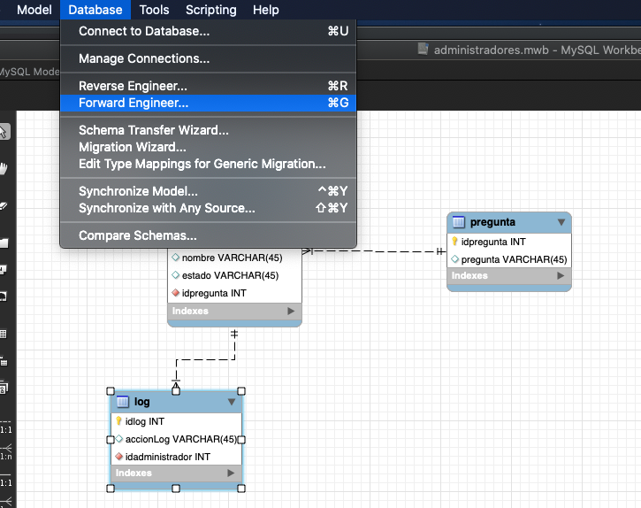
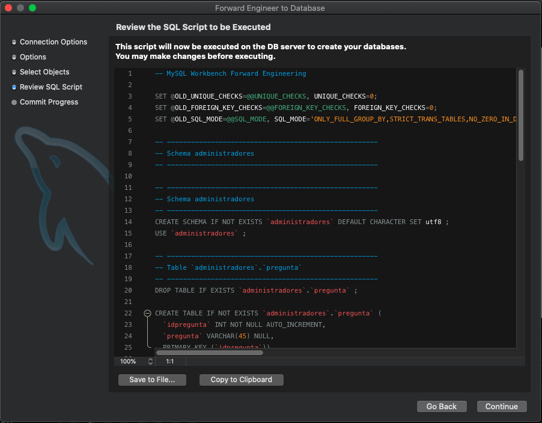
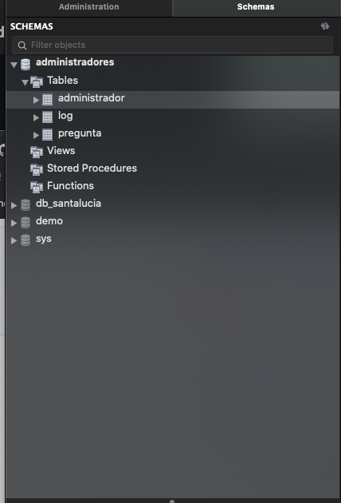

# 7. Implementación de un Logger a través de Filtros 01:02:17

En este capítulo veremos el uso de filtros, crearemos un módulo de Logger para registrar todos los movimientos del administrador y registrarlos en la BD. 

* Creación de la tabla de Log 04:32
* Definición y creación de un SerlvetFilter básico 06:17
* Código del modelo para crear el Logger 12:48
* Implementación del Logger en el SerlvetFilter 19:49
* Completando el módulo de Logging 18:51

## Creación de la tabla de Log 04:32

En esta lección vamos a crear una nueva tabla llamada `log` la cual se relacionara con la tabla `administrador`, es decir que un administrador pueden tener varios logs.


Una vez creada la tabla vamos a generar el código para que se genere la BD.



Seleccionamos la conección `administradores`


Marcamos el check drop objects before each CREATE object, para eliminar el esquema previo antes de generarlo nuevamente.


Continuamos


Se nos muestra el código generado 



Ejecuta todas las tareas correctamente 


Tenemos nuestras tres tablas generadas



Como se borrarón los datos de las tablas `administrador` y `pregunta` vamos a ejecutar los siguientes scripts:

```sql
INSERT INTO `pregunta` (`idpregunta`,`pregunta`) VALUES (1,'Nombre de la primer mascota');
INSERT INTO `pregunta` (`idpregunta`,`pregunta`) VALUES (2,'Apellido de soltera de la madre');
INSERT INTO `pregunta` (`idpregunta`,`pregunta`) VALUES (3,'Nombre del abuelo paterno');
INSERT INTO `pregunta` (`idpregunta`,`pregunta`) VALUES (4,'Nombre de escuela primaría');
INSERT INTO `administrador` (`id`,`email`,`contrasena`,`nombre`,`estado`,`idpregunta`) VALUES (1,'adolfo@gmail.com','1234','Adolfo','Madrid',1);
INSERT INTO `administrador` (`id`,`email`,`contrasena`,`nombre`,`estado`,`idpregunta`) VALUES (2,'adolfo@hotmail.com','1234','Adolfo','Madrid',1);
INSERT INTO `administrador` (`id`,`email`,`contrasena`,`nombre`,`estado`,`idpregunta`) VALUES (3,'gina@gmail.com','1234','Gina','León',1);
INSERT INTO `administrador` (`id`,`email`,`contrasena`,`nombre`,`estado`,`idpregunta`) VALUES (4,'tomas@hotmail.com','1234','Tomas','Ciudad México',1);
INSERT INTO `administrador` (`id`,`email`,`contrasena`,`nombre`,`estado`,`idpregunta`) VALUES (5,'rodrigo@hotmail.com','1234','Rodrigo','Madrid',1);
INSERT INTO `administrador` (`id`,`email`,`contrasena`,`nombre`,`estado`,`idpregunta`) VALUES (6,'basi@gmail.com','1234','Basi','Madrid',1);
INSERT INTO `administrador` (`id`,`email`,`contrasena`,`nombre`,`estado`,`idpregunta`) VALUES (7,'deisy@gmail.com','1234','Deisy','Madrid',1);
INSERT INTO `administrador` (`id`,`email`,`contrasena`,`nombre`,`estado`,`idpregunta`) VALUES (8,'alicia@hotmail.com','1234','Alicia','Sevilla',1);
INSERT INTO `administrador` (`id`,`email`,`contrasena`,`nombre`,`estado`,`idpregunta`) VALUES (9,'juan@gmail.com','1234','Juan','Toledo',1);
INSERT INTO `administrador` (`id`,`email`,`contrasena`,`nombre`,`estado`,`idpregunta`) VALUES (10,'tifany@gmail.com','1234','Tifany','Guadalajara',1);
```
## Definición y creación de un SerlvetFilter básico 06:17

En esta lección veremos que es un Filtro y crearemos un SerlvetFilter básico.

### ¿Qué es un Filter?

El filter es una capa entre el cliente y el Servlet cada que se hace un request/response.


En el filter podemos realizar tareas intermedias de acuerdo a las peticiones o respuestas que se hagan, para nuestro ejemplo iinterceptaremos la "acción" que se realiza y la registraremos en la BD.

### Creación del Filter.

1. Creamos el paquete `com.novellius.controlador`


## Código del modelo para crear el Logger 12:48
## Implementación del Logger en el SerlvetFilter 19:49
## Completando el módulo de Logging 18:51
