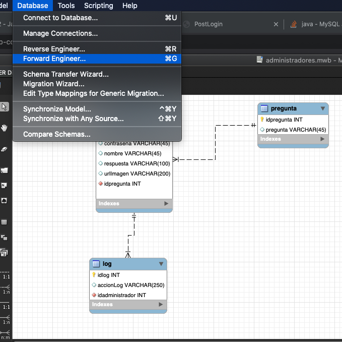

# 8. Creación de un módulo de registro de administradores 46:43

* Introducción 02:01
* Modificación de la Base de Datos 02:24
* Creación de la vista 11:51
* Código del modelo para insertar el administrador 08:22
* Código del controlador para procesar la petición de registro 14:22
* Creación de un mecanismo para evitar administradores duplicados 07:43

## Introducción 02:01

:+1:

## Modificación de la Base de Datos 02:24

Necesitamos modificar la BD, modificando la tabla `administrador` cambiando el campo `estado` por respuesta y añadiendo el campo `urlImagen`.


Volvemos a generar la BD.



Podemos comprobar que en la tabla `administrador` ya estan nuestros dos nuevos campos.


Insertamos las siguientes preguntas:

```sql
INSERT INTO `pregunta` (`idpregunta`,`pregunta`) VALUES (1,'Nombre de la primer mascota');
INSERT INTO `pregunta` (`idpregunta`,`pregunta`) VALUES (2,'Apellido de soltera de la madre');
INSERT INTO `pregunta` (`idpregunta`,`pregunta`) VALUES (3,'Nombre del abuelo paterno');
INSERT INTO `pregunta` (`idpregunta`,`pregunta`) VALUES (4,'Nombre de escuela primaría');
```


Insertamos el siguiente administrador


```sql
INSERT INTO `administradores`.`administrador` (`id`, `email`, `contrasena`, `nombre`, `respuesta`, `urlImagen`, `idpregunta`) VALUES ('1', 'adolfo@gmail.com', '1234', 'Adolfo', 'Bengi', NULL, '1');
```


## Creación de la vista 11:51

En esta lección crearemos la vista `registroAdministrador.jsp`para que el administrador se pueda registrar.

## Código del modelo para insertar el administrador 08:22
## Código del controlador para procesar la petición de registro 14:22
## Creación de un mecanismo para evitar administradores duplicados 07:43
