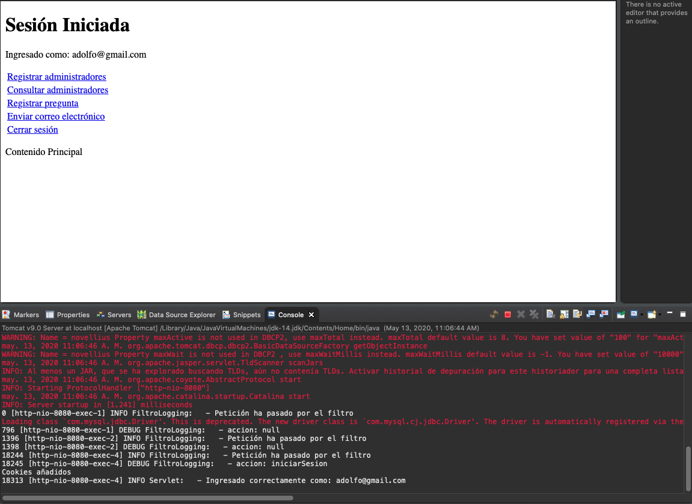
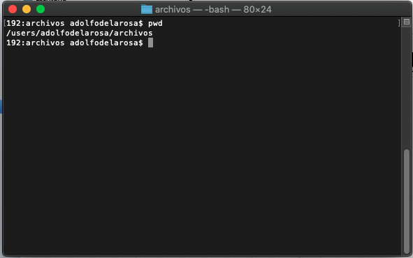
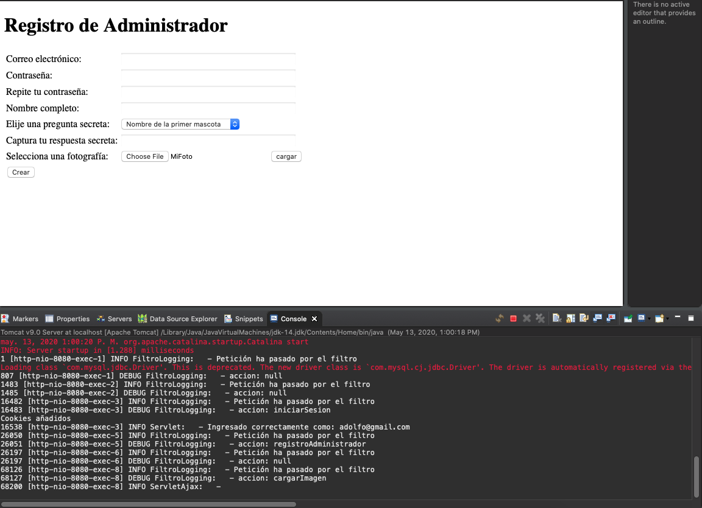
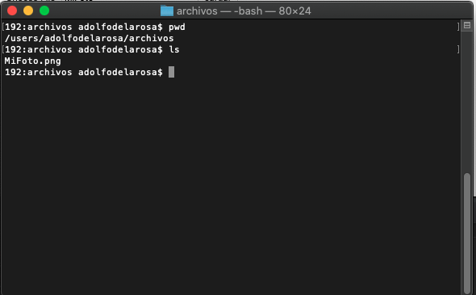
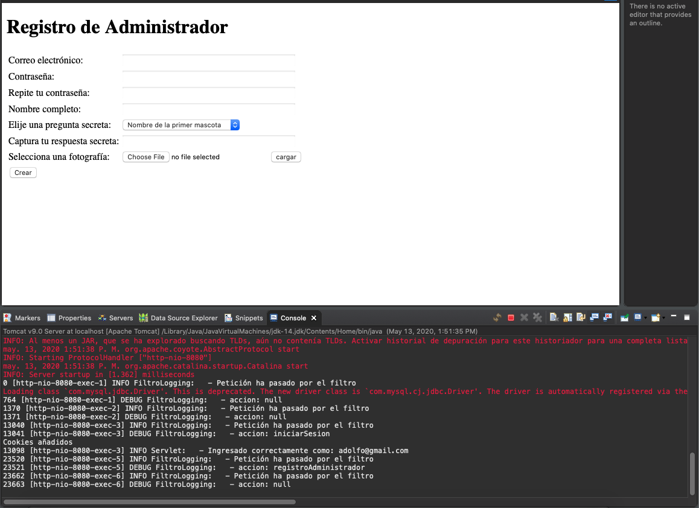
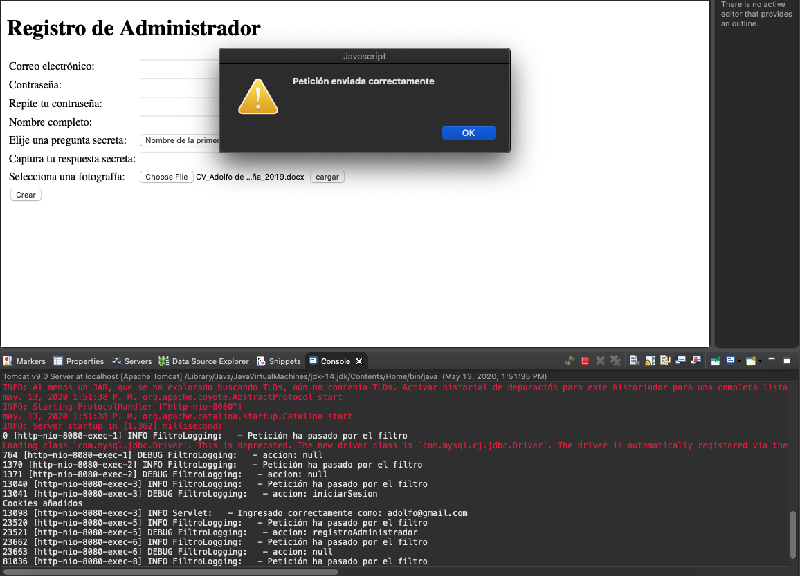
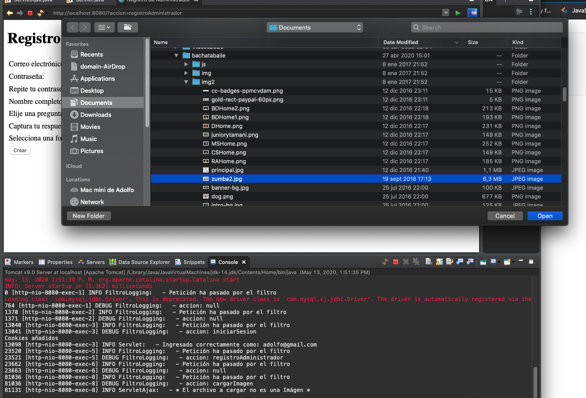
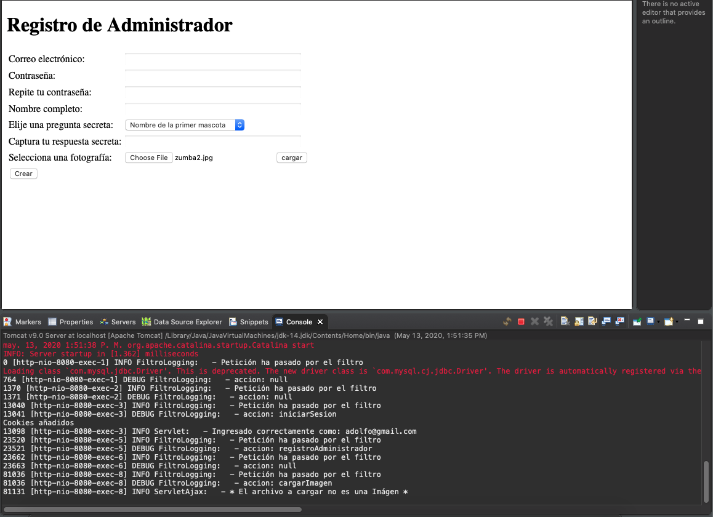
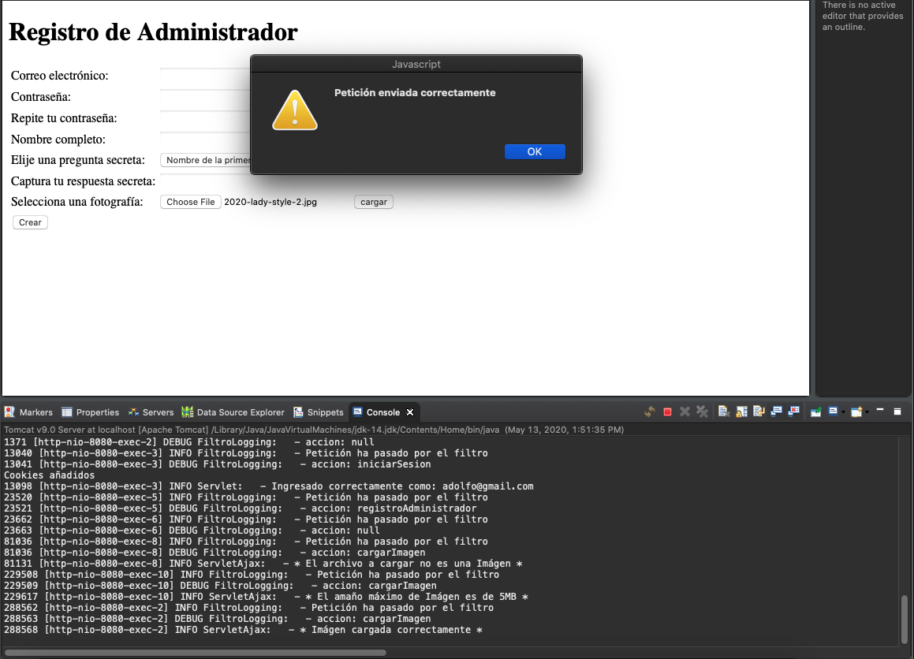

# 9. AJAX 01:24:27

* Introducción 02:01
* Creación del script AJAX para enviar una petición HTTP 12:41
* Enviando una petición asíncrona a un Servlet 11:36
* Creación de una función para cargar un archivo 14:26
* Creación de un método para validar una imagen y su tamaño máximo 12:14
* Informando al usuario el resultado de la carga de la imagen 10:43
* Como solucionar problemas de caché en Tomcat 02:53
* Almacenando la ruta de la imagen en la Base de Datos 10:59
* Mostrando al usuario la imagen almacenada en el servidor 06:54

## Introducción 02:01

En esta lección explicaremos lo que es AJAX.

AJAX = JavaScript asíncrono y XML.

AJAX no es un lenguaje de programación.

AJAX solo usa una combinación de:

* Un objeto incorporado XMLHttpRequest del navegador (para solicitar datos de un servidor web)
* JavaScript y HTML DOM (para mostrar o usar los datos)

AJAX es el sueño de un desarrollador, porque puedes:

* Leer datos de un servidor web: después de que la página se haya cargado
* Actualizar una página web sin volver a cargar la página
* Enviar datos a un servidor web: en segundo plano

## Creación del script AJAX para enviar una petición HTTP 12:41

En esta lección vamos a crear un archivo JS donde codificaremos una función para crear una petición HTTP y envviarla a un Servlet. 

1. Crear la carpeta `js` dentro de nuestra carpeta `webcontent`
2. Crear dentro de la carpeta `js` un archivo JS llamado `ajax.js`

   

   
   
3. Insertar el siguiente código:

```js
function cargarImagen(){
	//Crea un formulario con código
	var formdata = new FormData();
	//Permite elejir un archivo del ordenador.
	formdata.append("file", document.getElementById("file").files[0]); //0 indica que selecciona el primer archivo seleccionado
	
	//Construye petición HTTP
	var xhr = new XMLHttpRequest();
	//Establecer parámetros de la petición HTTP, método, url, asyncrono
	xhr.ope("post", "/ServletAjax?accion=cargarImagen", true);
	//Enviar el formulario a a la petición
	xhr.send(formdata);
	
	//Analisa el resultado de la petición
	xhr.onload = function(){
		if(this.status == 200){
			alert("Petición enviada correctamente");
		}
	};
}
```

## Enviando una petición asíncrona a un Servlet 11:36

En esta lección probaremos el Script hecho en `ajax.js` 

1. Añadiremos dos inputs en `registroAdministrador.jsp`

```html
<tr>
   <td>Selecciona una fotografía: </td>
   <td>
      <input type="file" id="file"/> 
      <input type="button" value="cargar" onclick="cargarImagen();" />
   </td>
</tr>
```

El primer input de tipo file nos permite cargar un archivo del ordenador, el id debe ser el mismo `file` que se recupera en el script. El segundo input invoca a la función `argarImagen()` que se encuentra en el archivo `ajax.js`.

3. Debemos importar el archivo `ajax.js` dentro de nuestro archivo `registroAdministrador.jsp`. **Debemos tener en cuenta el CONTEXTO de la aplicación**, por lo cual usamos `<c:url` que añade el contexto a la ruta de nuestro archivo. 

```html
<head>
<meta charset="UTF-8">
<title>Registro de Administrador</title>
<!-- /04-JSPServlets/js/ajax.js -->
<script type="text/javascript" src='<c:url value="/js/ajax.js" /> '></script>
</head>
```

4. Creación de un nuevo Servlet llamado `ServletAjax.java` en la carpeta controlador. Cuando lo creamos en el archivo `web.xml` debería haberme metido el siguiente código:

```html
<servlet>
    <description></description>
    <display-name>ServletAjax</display-name>
    <servlet-name>ServletAjax</servlet-name>
    <servlet-class>com.novellius.controlador.ServletAjax</servlet-class>
  </servlet>
  <servlet-mapping>
    <servlet-name>ServletAjax</servlet-name>
    <url-pattern>/ServletAjax</url-pattern>
  </servlet-mapping>
```

NOTA: Por mi configuración lo tuve que meter manualmente, por que al crear el Servlet le metio la anotación `@WebServlet("/ServletAjax")` que quite para tratarlo tradicionalmente.

5. Ingresar el siguiente código en el método `doPost()` de `ServletAjax.java`

```java
protected void doPost(HttpServletRequest request, HttpServletResponse response) throws ServletException, IOException {
		
   String accion = request.getParameter("accion");
		
   if(accion != null) {
      if(accion.equals("cargarImagen")) {
	 System.out.println("Petición AJAX recibida correctamente");
      }
   }
}
```

### Probar la aplicación.


Del menú seleccionamos registrar Administrador



Podemos ver los dos nuevos inputs insertados.


Si presionamos el botón `cargar` nos aparece el `alert` que pusimos en nuestro script en `ajax.js` el cual a su vez invoca el `ServletAjax` el cual pinta en la consola el mensaje `Petición AJAX recibida correctamente`. 


## Creación de una función para cargar un archivo 14:26

En esta lección vamos a crear un método para cargar un archivo en una ruta dada. 

Vamos a usar dos APIs 

* [Commons FileUpload](http://commons.apache.org/proper/commons-fileupload/)

   El paquete Commons FileUpload facilita agregar capacidad robusta y de alto rendimiento de carga de archivos a sus servlets y aplicaciones web.

   FileUpload analiza las solicitudes HTTP que cumplen con RFC 1867, "Form-based File Upload in HTML". Es decir, si se envía una solicitud HTTP utilizando el método POST, y con un tipo de contenido de "multipart/form-data", FileUpload puede analizar esa solicitud y hacer que los resultados estén disponibles de manera fácil para el llamante.

* [Commons IO](https://commons.apache.org/proper/commons-io/)

   Commons IO es una biblioteca de utilidades para ayudar con el desarrollo de la funcionalidad IO.

   Hay seis áreas principales incluidas:

   * Utility classes - con métodos estáticos para realizar tareas comunes
   * Input - implementaciones útiles de  Input Stream y Reader
   * Output - implementaciones útiles de Output Stream y Writer
   * Filters - diversas implementaciones de filtros de archivos
   * Comparators - varias implementaciones de java.util.Comparator para archivos
   * File Monitor - un componente para monitorear eventos del file system

1. Descargamos el zip `commons-fileupload-1.4-bin.zip` de el API Commons FileUpload.
2. Descomprimimos el zip y copiamos `commons-fileupload-1.4.jar` en la carpeta `lib` y lo añadimos en el Build path.
3. Descargamos el zip `commons-io-2.6-bin.zip` de el API Commons IO
4. Descomprimimos el zip y copiamos `commons-io-2.6.jar` en la carpeta `lib` y lo añadimos en el Build path.


5. Crear el método `cargarImagen()` en `Servletajax.java`

```java
public String cargarImagen(HttpServletRequest request, String urlDestino) {
		
   String valorRetorno = "";
		
   //Objeto FileItem del API commons-fileupload recibe a través de POST un tipo "multipart/form-data"  
   //donde se pueden seleccionar varios archivos.
   //Todos los objetos que viajan por el objeto request del Servlet se tiene que obtener en forma de 
   //lista 		  
   // La clase ServletFileUpload maneja una serie de archivos en un widget HTML 		
   // La clase DiskFileItemFactory es una fabrica de File Items que los mantiene en memoria y si son muy grandes en disco
   try {
      List<FileItem> items = new ServletFileUpload(new DiskFileItemFactory()).parseRequest(request);
			
      //Ya que tengo la lista de todos los archivos que me llegan la itero
      for(FileItem item : items) {
				
         String nombreImagen = item.getName();
         long tamanioImagen = item.getSize();
				
         //Validar archivo de imágen y tamaño máximo
			
         File archivoCargado = new File(urlDestino, nombreImagen);
         item.write(archivoCargado);
      }
   } catch (Exception e) {
      log.error("Error al cargar imágen: " + e.getMessage());
      e.printStackTrace();
      valorRetorno ="*error al cargar imágen*";
   }
		
   return valorRetorno;
}
```

6. Hacer la llamada a nuestro método `cargarImagen()` cuando invocamos la acción `cargarImagen`

```java
protected void doPost(HttpServletRequest request, HttpServletResponse response) throws ServletException, IOException {
		
   String accion = request.getParameter("accion");
		
   if(accion != null) {
      if(accion.equals("cargarImagen")) {
	 // "/users/adolfodelarosa/archivos" es una carpeta en nuestro ordenador
	 String s = cargarImagen(request, "/users/adolfodelarosa/archivos");
	 log.info(s);
      }
   }
}
```



### Ejecutar nuestra aplicación


Hemos seleccionado la imágen `MiFoto`


La petición al Script se ha hecho correctamente


Y se ha invocado a `ServletAjax.java` pero hemos quitado el mensaje en la consola



Pero si revisamos la carpeta del ordenador vemos como se ha escrito el archivo cargado



## Creación de un método para validar una imagen y su tamaño máximo 12:14

En esta lección vamos a validar que el archivo cargado sea una imágen y que tenga un tamaño máximo.

1. Crear en `ServletAjax.java` el método `isImagenValida()`.

```java
public boolean isImagenValido(FileItem archivo) {
		
   String nombre = archivo.getName();
		
   if(! nombre.isEmpty()) {
      String extension3 = nombre.substring(nombre.length() - 3, nombre.length()).toLowerCase();
      String extension4 = nombre.substring(nombre.length() - 4, nombre.length()).toLowerCase();
			
      if( extension3.equals("jpg") || extension3.equals("bmp") || extension3.equals("png") || 
          extension3.equals("xcf") || extension3.equals("gif") || extension3.equals("eps") || 
          extension3.equals("pcx") || extension3.equals("dng") || extension3.equals("wmp") || 
          extension3.equals("psb") || extension3.equals("jp2") ||
          extension4.equals("tiff") || extension4.equals("jpeg") ){
				
	 return true;
				
      } else {
         return false;
      }
			
   }else {
      return false;
   }
}
```

2. Validar el archivo antes de cargarlo.

```java
//Ya que tengo la lista de todos los archivos que me llegan la itero
for(FileItem item : items) {
				
   String nombreImagen = item.getName();
   long tamanioImagen = item.getSize();
				
   //Validar archivo de imágen y tamaño máximo
   if(isImagenValido(item)) {
      if( tamanioImagen > 0 && tamanioImagen < 5242880 ) {			
         File archivoCargado = new File(urlDestino, nombreImagen);
	 item.write(archivoCargado);
	 valorRetorno ="* Imágen cargada correctamente *";
      }else {
	 valorRetorno ="* El amaño máximo de Imágen es de 5MB *";
      }
   } else {
      valorRetorno ="* El archivo a cargar no es una Imágen *";
   }
}
```
### Ejecución del Código
















## Informando al usuario el resultado de la carga de la imagen 10:43
## Como solucionar problemas de caché en Tomcat 02:53
## Almacenando la ruta de la imagen en la Base de Datos 10:59
## Mostrando al usuario la imagen almacenada en el servidor 06:54
