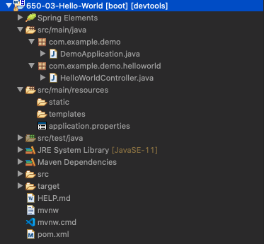
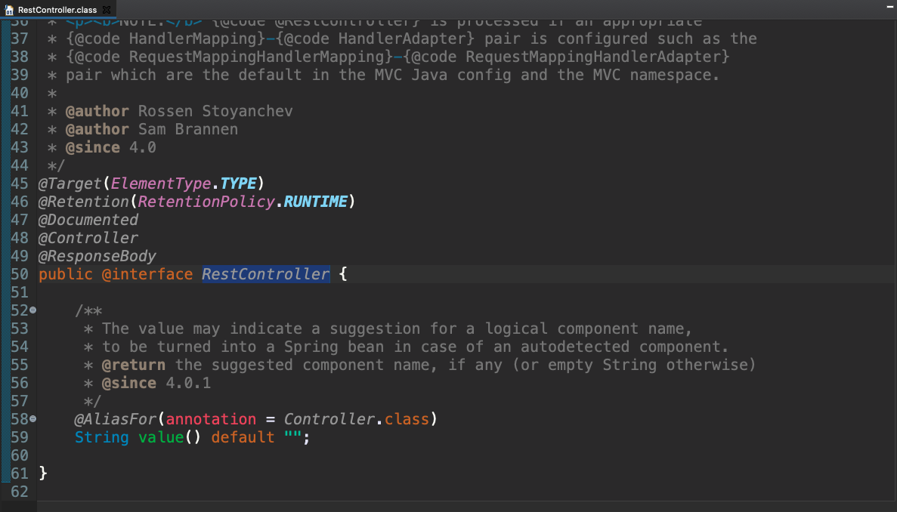

# 03 - Servicios Web Conceptos Clave

## :computer: `650-03-Hello-World`
### Ejemplo de básico de un Controller y RestController 



Basados en el proyecto `650-02-Demo` vamos a realizar una copia que vamos a llamar `650-03-Hello-World`.

Lo primero que vamos a hacer para facilitar el desarrollo es comentar la dependencia `spring-boot-starter-security` para que no añada la seguridad por defecto por que por el momento no vamos a hacer uso de ella.

### Creación del Controlador

¿Qué necesitamos dentro de un controlador para definir uno o varios EndPoints que sean accesibles:

1. Anotar la clase como un controlador
2. Crear métodos que respondan a los EndPoints
3. Configurar esos métodos

Vamos a crear la clase `HelloWorldController` en el paquete `com.example.helloworld`.

```java
package com.example.helloworld;

public class HelloWorldController {

}
```

Esta es simplemente una clase común y corriente, vamos a configurar la clase con los pasos que escribimos arriba para convertir la clase en un Controlador, empezamos por anotarla con la anotación `@Controller`


```java
package com.example.helloworld;

import org.springframework.stereotype.Controller;

@Controller
public class HelloWorldController {

}
```

Con esta anotación `@Controller` la clase ya se convierte en un controlador.

Ahora vamos a crear un método para saludar.

```java
package com.example.helloworld;

import org.springframework.stereotype.Controller;

@Controller
public class HelloWorldController {
   public String helloWorld() {
      return "Hello World!";
   }
}
```

Ahora ¿cómo vamos a configurar este método? ¿Qué anotaciones necesitamos?

Necesitamos una que es `@RequestMapping` con esta anotación le indicamos el EndPoint con el que esta mapeado el método, al que va a responder este método.

Dentro de `@RequestMapping` tenemos varios parámetros que podemos usar para configurar la anotación.


Para este ejemplo vamos a configurarlo así:

```java
@Controller
public class HelloWorldController {

   @RequestMapping(value="/hello-world", method= RequestMethod.GET)
   public String helloWorld() {
      return "Hello World!";
   }
	
}
```

Lo último que tenemos que hacer es indicar que este método, cuando se llame al endpoint `/hello-world` vamos a devolver algo en el body, por que el `String Hello World!` debe ir en el body de la respuesta. Por lo que tenemos que indicar que el `String` que retorna el método forma parte del body eso lo logramas con la anotación `@ResponseBody`

```java
@RequestMapping(value="/hello-world", method= RequestMethod.GET)
public @ResponseBody String helloWorld() {
   return "Hello World!";
}
```

Con esto ya tendríamos nuestro primer controlador:

```java
package com.example.helloworld;

import org.springframework.stereotype.Controller;
import org.springframework.web.bind.annotation.RequestMapping;
import org.springframework.web.bind.annotation.RequestMethod;
import org.springframework.web.bind.annotation.ResponseBody;

@Controller
public class HelloWorldController {

   @RequestMapping(value="/hello-world", method= RequestMethod.GET)
   public @ResponseBody String helloWorld() {
      return "Hello World!";
   }
	
}
```

Vamos a probar la aplicación ejecutando el URL http://localhost:8080/hello-world


Hay un par de cosas que podemos hacer para simplificar la configuración de este Controller:

* Cambiar la anotación `@Controller` por `@RestController` que nos indica que el controlador es de tipo Rest. si inspeccionamos la anotación `@RestController`:



vemos que tiene la anotación `@ResponseBody` como global, esto implica que la anotación `@ResponseBody` se va a aplicar automáticamente a todos los métodos que esten dentro de este RestController, por lo tanto la anotación `@ResponseBody` que tenemos en nuestro método es redundante y la podemos eliminar,   

```java
@RestController
public class HelloWorldController {

   @RequestMapping(value="/hello-world", method= RequestMethod.GET)
   public String helloWorld() {
      return "Hello World!";
   }
	
}
```

En segundo lugar hay anotaciones especificas para los distintos métodos que tiene HTTP por lo que podemos cambiar la anotación `@RequestMapping(...)` por `@GetMapping` como sigue:


```java
@RestController
public class HelloWorldController {

   @GetMapping(value="/hello-world")
   public String helloWorld() {
      return "Hello World!";
   }
	
}
```

Incluso cuando solo se tiene un parámetro se puede solo poner el valor del endpoint.

```java
package com.example.demo.helloworld;

import org.springframework.web.bind.annotation.GetMapping;
import org.springframework.web.bind.annotation.RestController;

@RestController
public class HelloWorldController {

   @GetMapping("/hello-world")
   public String helloWorld() {
      return "Hello World!";
   }
	
}
```

Con lo cual el método queda aun más simplificado. Si volvemos a probar la aplicación el resultado sigue siendo el mismo.


