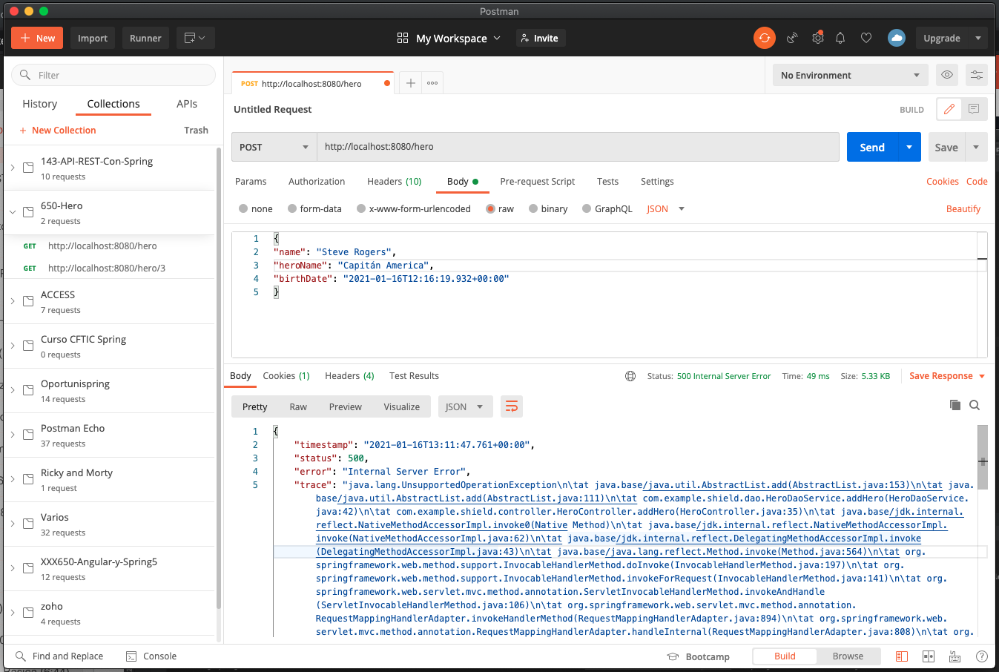

# 09 - Métodos POST de Hero I

En esta lección vamos a crear el método POST que nos va a permitir crear nuevos Heroes, será un método POST que nos devolvera un Status Code 201 que significa que se ha creado un nuevo recurso y debemos devolver la URI de este nuevo recurso.

Para empezar vamos a crear un método que va a recibir como parámetro de entrada un `Hero` y por el momento también devuelve un `Hero`, que devolvera el resultado de invocar el servicio correspondiente:

```java
public Hero addHero(Hero hero) {
   return heroDaoService.addHero(hero);
}
```

Con esto en principio ya lo tendríamos, falta la configuración del método, como es un POST lo anotamos con:

```java
@PostMapping("/hero")
public Hero addHero(Hero hero) {
   return heroDaoService.addHero(hero);
}
```
Con esto ya casi lo tenemos, lo último es ver que tratamiento que le vamos a dar al parámetro de entrada, en el caso cunado pasabamos un `id` que es de tipo `int` en el URL y lo anotabamos con `@PathVariable`, pero en este caso no podemos pasar un `Hero` que es un Objeto por la URL no es posible, pero tenemos que anotar a nuestro `Hero` de tal manera que le indiquemos a nuestro método de donde tiene que obtener este valor, como estamos haciendo una petición de tipo POST `Hero` no va a venir en la URL va a venir en el Body, por lo que lo vamos a anotar con la anotación `@RequestBody` y así le decimos que el el Body de la Request va a haber un objeto de tipo `Hero`.

```java
@PostMapping("/hero")
public Hero addHero(@RequestBody Hero hero) {
   return heroDaoService.addHero(hero);
}
```

Una vez hecho esto podemos probar este método pero no va a ser posible hacerlo desde el navegador ya que este solo hace peticiónes GET vamos a necesitar un Cliente REST que nos permita enviar información en el Body. Nosotros usaremso POSTMAN.

En Postman selececcionamos una petición POST, incluimos la URL del endpoint que queramos probar y en este caso debemos mandar en el Body un JSON u Objeto con la información del Heroe, recordar que no mandamos el ID. Todo esto lo debemos meter en la pestaña Body, seleccionar RAW y JSON como se ve en la imagen.


Presionamos SEND para hacer la petición  



En este caso nos regresa un error 500 lo que indica que hay un error en nuestro Servidor, un ERROR DE CÓDIGO y nos da la pista que es por `java.lang.UnsupportedOperationException\n\tat java.base/java.util.AbstractList.add`, este error es por la forma en que hemos definido nuestro ArrayList en la clase Servicio, la tenemos así:

```java
private static List<Hero> heroes = Arrays.asList(
			new Hero(1,"Peter Parker","Spiderman", new Date()),
			new Hero(2,"Tony Stark","Ironman", new Date()),
			new Hero(3,"Bruce Banner","Hulk", new Date()));
```

El error viene dado por que "`asList` devuelve una lista de tamaño fijo, por lo que no puede agregarle nuevos elementos. Debido a que la lista que devuelve es realmente una "vista" del array a partir de la cual se creó, tiene sentido que no pueda agregar elementos, al igual que no puede agregar elementos a un array. Consulte los documentos de [asList](https://docs.oracle.com/javase/1.5.0/docs/api/java/util/Arrays.html#asList%28T...%29)"
```

Lo vamos a cambiar por esto:

```java
private static List<Hero> heroes = new ArrayList<>();
	
static {
   heroes.add(new Hero(1,"Peter Parker","Spiderman", new Date()));
   heroes.add(new Hero(2,"Tony Stark","Ironman", new Date()));
   heroes.add(new Hero(3,"Bruce Banner","Hulk", new Date()));
}
```

Si volvemos a probar tenemos:


Nos devuelve por ahora un Status Code 200 y como respuesta el JSON del Objeto creado, si listamos nuevamente la lista de Heroes ya lo vemos incluido en la lista.


