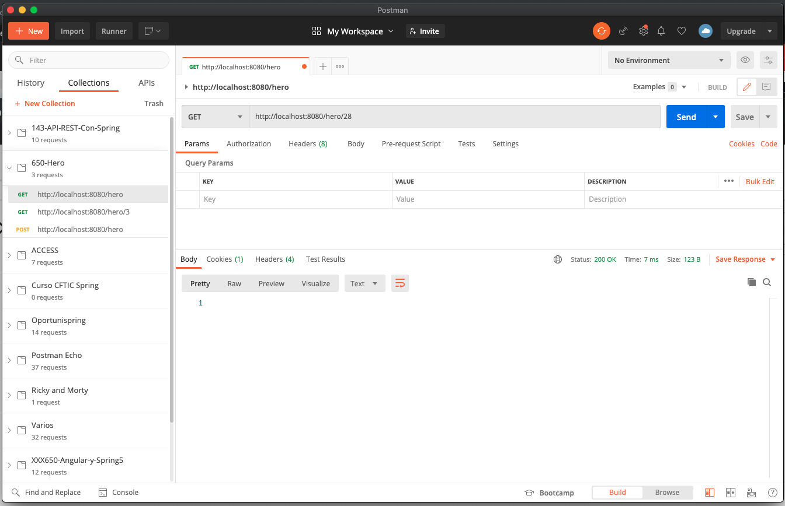
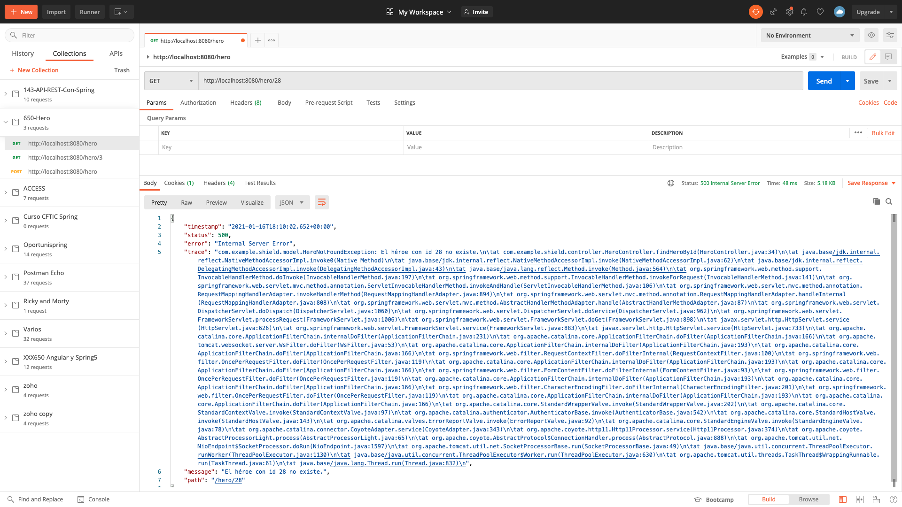
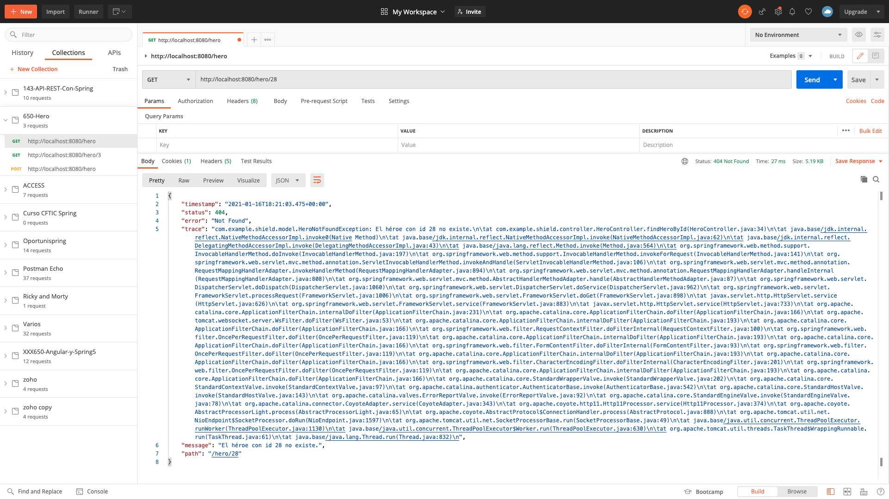

# 11 - Manejo de Excepciones

Hasta el momento hemos desarrollado tres métodos para recuperar todos nuestros heroes, un hereo en particular y dar de alta un nuevo heroe y sugún nuestras pruebas todo ha ido bien, pero ¿Qué pasa si buscamos un heroe que no existe?



No nos devuelve nada pero tampoco nos devuelve un mensaje de error el estado sigue siendo el 200 como si todo ubiera ido correctamente, eso es algo que tenemos que solucionar por que cuando se produce un error dentro de nuestra API debemos ser capaces de informar al consumer de que se a producido un error, vamos a ver como podemos solucionarlo.

Actualmente tenemos nuestro método de busqueda de un hereo concreto como sigue:

```java
@GetMapping(value="/hero/{id}")
public Hero findHeroById(@PathVariable int id) {
   return heroDaoService.findHeroById(id);
}
```

Vamos a modificarlo por lo siguiente:

```java
@GetMapping(value="/hero/{id}")
public Hero findHeroById(@PathVariable int id) {
   Hero result = heroDaoService.findHeroById(id);
   if(result == null) {
      throw new HeroNotFoundException("El héroe con id " + id + " no existe.");
   }
   return result;
}
```

* Si no encuentra el héroe con un id determinado vamos a lanzar la expeción `HeroNotFoundException` que va a ser una excepción propia.
* Si lo encuentra lo devolvemos.

Vamos a crear la clase `HeroNotFoundException` dentro del paquete `model` 

`HeroNotFoundException`

```java
@GetMapping(value="/hero/{id}")
public Hero findHeroById(@PathVariable int id) {
   Hero result = heroDaoService.findHeroById(id);
	 if(result == null) {
      throw new HeroNotFoundException("El héroe con id " + id + " no existe.");
   }
   return result;
}
```
* Extiende `RuntimeException`
* Implementamos un constructor que recibe el parámetro `message`

Si lanzamos la aplicación y probamos nuevamente buscar un héroe que no existe tenemos:



Ahora se nos esta retornando un `Status 500 Internal Server Error`, y el mensaje de error es el mensaje de la excepción `"El héroe con id 28 no existe."`, esto esta un poco mejor por que estamos informando a nuestro consumer que ha habido un error, pero lo cierto es que el error no es correcto del todo ya que el error 500 indica un problema dentro del servidor y nosotros lo que querenos inidcar realmente al consumer es que no se ha encontrado el recurso, lo que podemos hacer para solucionar esto es utilizar una anotación `@ResponseStatus(HttpStatus.NOT_FOUND)` en nuestra excepción, donde le estamos pasando como parámetro el estado NOT_FOUND.

```java
@ResponseStatus(HttpStatus.NOT_FOUND)
public class HeroNotFoundException extends RuntimeException {

   public HeroNotFoundException(String message) {
      super(message);
   }
}
```

Si probamos nuevamente vamos a tener:



Ahora ya nos esta devolviendo un estado `Status 404 Not found`, la respuesta que nos arroja en caso de que se produzca una excepción tiene un determinado formato donde nos retorna los datos `"timestamp"`, `"status"`, `"error"`, `"trace"`, `"message"` y `"path"` que es un formato proporcionado por Spring Boot junto con Spring MVC, lo cierto es que este formatio general no es ideal del todo, lo ideal sería que tuvieramos nuestra propia estructura de excepciones para que las excepciones sean consistentes a lo largo de toda la aplicación, no devolver excepciones distintas o con mensajes distintos, en este formato la traza `"trace"` es algo que sobra bastante y que no aporta información de valor al consumer y no es necesario que el consumer lo vea. Vamos a mejorar esto en la próxima lección.


