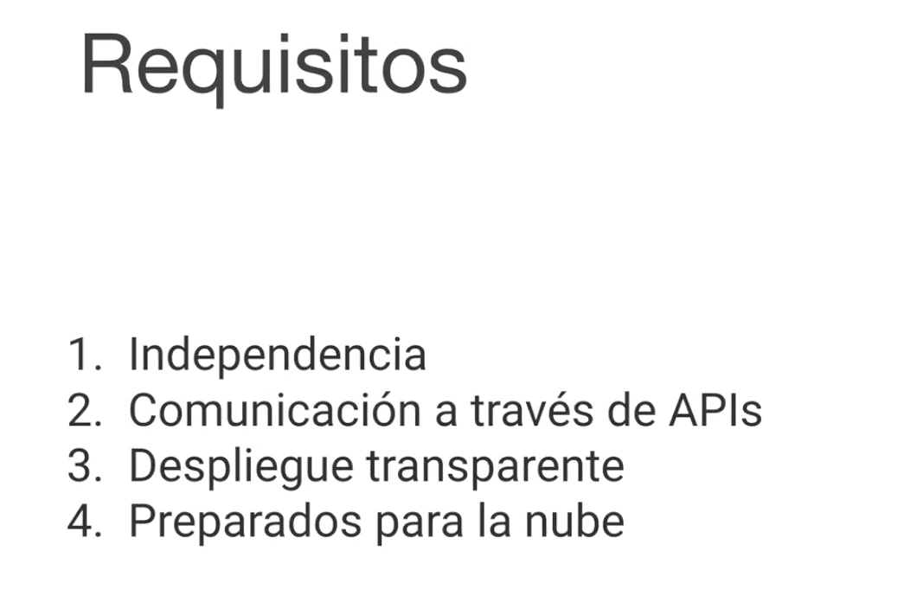
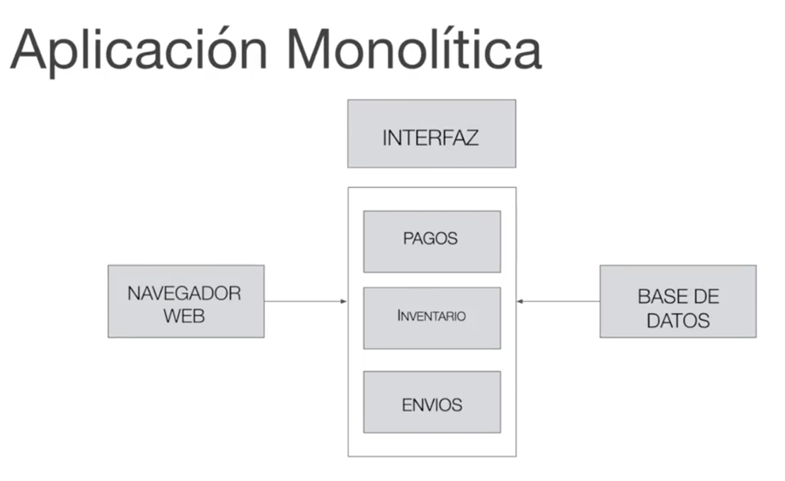
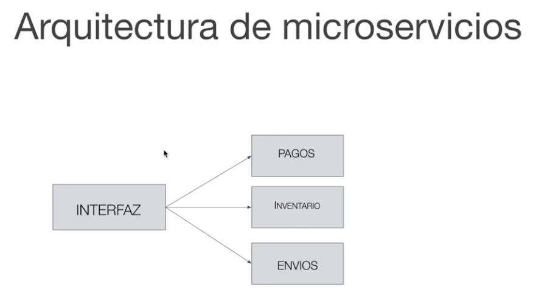

# 01 - Introducción a los microservicios

En esta lección vamos a ver una introducción a los MicroServicios, vamos a definir lo que es un Microservicio, vamos a comparar lo que son los MicroServicios con la tradicional arquitectura monolitica que serían las aplicaciones Web hasta ahora y vamos a ver también los retos que se nos presentan a la hora de implementar una arquitectura de MicroServicios.

Definir un MicroServicio es bastante complicado por que hay discrepacias en cuanto a los tamaños que los MicroServicios deben tener, la encapsulación que deben tener, podemos ver una definición en la diapositiva.

Los principales requisitos que debe cumplir los MicroServicios son:

1. Que sean **Independientes**
2. Que se **comuniquen a través de APIs**

   Con estas dos primeras característivas nos va a permitir definir los MicroServicios que componen una aplicación incluso en distintas tecnologías, una aplicación que sigue una arquitectura de MicroServicios podría estar compuesta con MicroServicios escritos con NodeJS, otros escritos en Java o .NET.

   Otros requisitos que necesitamos son:

3. El **despliegue sea transparente**.

   ¿Por qué es esto?, por que cuando nosotros creamos una aplicación basada en la arquitectura de MicroServicios los microservicios normalmente van a tener diferentes instancias, es decir si nosotros tenemos un MicroServicio de Login, es posible que este MicroServicio de Login lo tengamos desplegado en diferentes servidores a la vez, por que esa es una de las ventajas de los MicroServicios el hecho que nos permitan escalar ciertas partes de la aplicación de manera independiente, entonces si por ejemplo dentro de nuestra aplicación del MicroServicio de Login es una parte de la aplicación que recibe especialmente un numero grande de llamadas podemos necesitar escalar hacia arriba la parte en concreto de la aplicación sin tener que escalar el resto de partes de la aplicación, entonces si tuvieramos el MicroServicio que se encargara de la parte del Login, podríamos necesitar que dinamicamente ese MicroServicio este desplegado en 5 servidores por ejemplo y si nos llega más carga desplegarlo en 8 servidores y cuando la carga sea menor bajar ese despliegue a simplemente 1 servidor, que esto también nos permite ahorrarnos costes.

   ¿Qué es lo que ocurre? ¿Qué problema hay con esto?

   Cada vez que nosotros levantamos un servidor ese servidor se levanta en otro puerto distinto, no pueden estar exactamente en la misma dirección de Internet que todas las instancias del MicroServicio de Login por que chocarían unas con otras, sin embargo tampoco nos podemos permitir el hecho que cada vez que se levantye una instancia nueva del MicroServicio de Login tengamos que parar la aplicación, añadir esa instancia nueva a un listado de instancias en las que esta registrado el MicroServicio de Login y volver a levantar la aplicación, esta gestión de instancias del hecho que se puedan levantar distintas instancias de un MicroServicio o tirarlas debe ser una gestión que debe ser transparente a los programadores, debe estar externalizada y no debe necesitar intervención humana ninguna, sino que debe ser posible configurarla y que ese despliegue sea transparente para el programador.

   Otro requisito importante es:

4. Los MicroServicios deben estar **preparados para la nube**.

   Entre otra cosa este despliegue transparente es uno de los requisitos que les permite estar preparados para la nube, tienen que ser capaces de registrarse en un servidor de nombres, tienen que ser capaces de descubrir otros servicios en un servidor de nombres, tenemos que tener un balanceador de carga para que se pueda distribuir la carga en las diferentes instancias de los microservicios, todas esas caracteristicas hacen que los MicroServicios esten preparados para la nube, y veremos a posteriory como podemos implementar estas características en los MicroServicios.
   

Vamos a ver ahora por contraposición cual sería la estructura de una aplicación monolitica y de una aplicación de MicroServicios y como se difernecia la una de la otra. 

La estructura de una aplicación monolitica la vemos en la imagen, pensemos en una aplicación de tienda online y esa dentro de esa misma aplicación tendríamos clases destinadas a gestionar los pagos, inventarios y envios, toda esa aplicación monolitica se conectaría a una BD y por medio de un navegador Web consumiriamos esa aplicación en donde se nos presentaría una interfaz del usuario para que el usuarrio interactue con la aplicación. 

Algunos de los problemas que se nos presentan con este tipo de arquitectura es lo que comentamos antes, por ejemplo si la parte de inventario fuera fuertemente consumida y necesitaramos más instancias de la aplicación para atender todas las aplicaciones nosotros no podríamos escalar solamente el inventario, nosotros necesitariamos escalar la aplicación entera y estariamos replicando en otro servidor todo el código referente a los pagos, todo el código referente a los envios y levantando una aplicación bastante pesada simplemente para escalar el modulo de inventarios. Por otro lado los tres modulos estan acoplados a la aplicación no se pueden consumir desde fuera, no podemos crear modulos comunes, esas son desventajas que tienen las aplicaciones monoliticas.

En cuanto a la arquitectura de Microservicios lo que tendríamos serían tres Microservicios independientes y la interfaz se comunicaria con los tres y los Microservicios se comunicarian entre ellos para aplicar las reglas de negocio que correspondieran. En este caso si quisieramos escalar el modulo de Inventario simplemente tendriamos que añadir una nueva instancia del modulo de inventario.

Luego con el servidor de nombres, el servidor de cargas se distribuirian las peticiones entre las dos instancias de Inventarios de una manera transparente para los usuarios y para el programador.

En cuanto a los retos que se nos presentan a la hora de implementar los Microservicios tenemos por ejemplo.

* La Gestion de la Configuración

   Si han visto las aplicaciones de Spring Boot que hemos hecho hasata ahora se configuran a través del `application.properties`, ¿Cuál es el problema con esto? El problema es que como hemos dicho antes en una aplicación con Microservicios vamos a tener muchisimas aplicaciones, vamos a tener muchisimos `application.properties` uno por cada aplicación realizada, luego para cada instancia necesitamos que ciertas configuraciones sean especificas y sean relativas al entorno en que se despliega esa instancia, cuando tengamos que hacer un cambio en la configuración, imaginaros que en el futuro vamos a tener diferentes `application.properties` en función de distintos entornos, `application.properties` para desarrollo otros para producción, otros para stegen, esto al final va a provocar que tengamos muchos archivos `application.properties` y no solo eso sino que también esos archivos `application.properties` estan en un monton de sitios distintos, cada uno esta dentro de su propio proyecto y al final acaba siendo un infierno la gestión de esta configuración a través de todos los servicios que componen nuestra aplicación, por lo tanto vamos a necesitar un lugar centralizado donde tengamos toda la configuración de la aplicación de todos los Microservicios de nuestra aplicación, y luego los Microservicios leeran de ese servidor de configuración para obtener los parámetros de configuración concretos que le corresponden a ese microservicio en función del entorno en el que esta siendo desplegado.
   
* Escalado Dinámico
   
   El escalado dinámico es lo que hemos comentado antes, tenemos que ser capaces de levantar y tirar instancias de los Microservicios de una manera transparente sin que eso afecte al rendimiento de la aplicación o sea necesario parar la aplicación entera para levantar o tirar una instancia de un Microservicio concreto.
   
* Distribución de la Carga

   No es suficiente levantar diferentes instancias de un Microservicio si al final todas las peticiones de un Microservicio las va a atender la misma instancia, entonces vamos a necesitra un balanceador de carga que distribuya las peticiones en las distintas instancias que haya de ese servicio.
   
* Visibilidad

   La visibilidad también ayuda a distribuir la carga el tener un servidor de nombres hace que podamos esconder por decirlo de alguna manera las instancias de un Microservicio en concreto tras un nombre común, entonces los distintos Microservicios que tienen que consumir a ese Microservicio ya no tienen que estar preocupandose de en que puerto estará o cual será su URL, sino que simplemente van a hacer la petición a un nombre del Servidor de Nombres y el Servidor de Nombres junto con el Balanceador de Carga se encargará de redirigir esta petición a donde le corresponde.
   
* Monitorización 

   Al tener un Sistema Distribuido muchos de los problemas que tiene la Arquitectura de Microservicios son comunes al Sistema Distribuido, al tener un Sistema Distribuido es mucho más dificil trazar las peticiones a lo largo de todo el sistema por que una petición pasa de un Microservicio y luego a otro, a otro, ..., entonces debuggear se convierte en algo dificil y la Monitorización se convierte en algo muy importante, tenemos que saber en que estado se encuentran las distintas partes de nuestra aplicación, si hay algún Microservicio que este caído demasiado tiempo, que este suponiendo un cuello de botella, todas esas cosas necesitamos saberlas en una aplicación distribuida.
   
* Tolerancia a Fallos   

   Como los Microservicios interactuan entre ellos es necesaria la intervención de diferentes Microservicios para resolver una regla de negocio, o alguna peticición que se haya hecho a nuestra aplicación, entonces si en esta cadena de Microservicios alguno de esos Microservicios falla la petición entera va a fallar entonces
   
   
   
   
   
   

