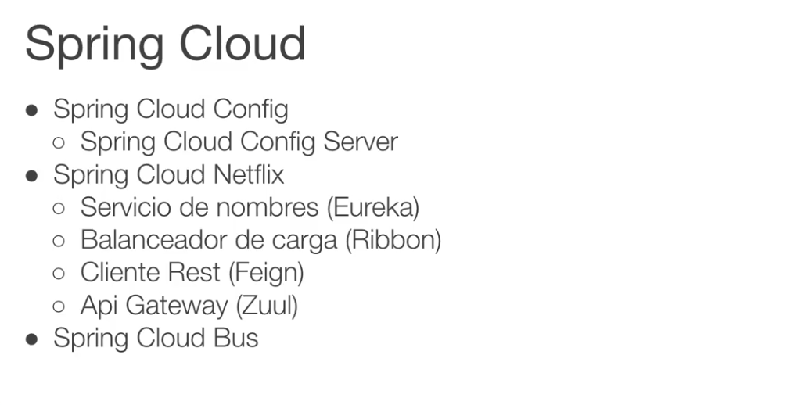

# 02 - Spring Cloud

En esta lección vamos a ver Spring Cloud que es un conjunto de paquetes y dependencias que nos van a permitir resolver todas las problematicas que se nos presentan al realizar una arquitectura de Microservicios.

Spring Cloud consta de distintos proyectos que contienen una serie de características que nos ayudan a resolver un problema concreto de las aplicaciones de MicroServicios.

* **Spring Cloud Config**
   El proyecto **Spring Cloud Config** es el que nos va a permitir crear un servidor de configuración distribuido para el cloud, a este servidor de configuración es donde se van a conectar el resto de MicroServicios para leer las propiedades de configuración especificas y nos va a permitir eso, tener en un mismo servidor de configuración las distintas propiedades de configuración para los distintos MicroServicios y además para cada MicroServicio las distintas propiedades de configuración para los distintos entornos.
   
* **Spring Cloud Netflix**
   El proyecto **Spring Cloud Netflix** que es de Netflix contiene una serie de proyectos que nos van a permitir resolver otra serie de dificultades:
   
   * **Eureka** que es un Servicio de Nombres, un Servicio de Nombres es donde el resto de MicroServicios se van a registrar y a partir de ahí tanto el resto de Microservicios como cuando hagamos peticiones a nuestra aplicación la URL a la que vamos a ir no va a ser directamente la URL del servicio, por ejemplo si el servicio lo levantamos en el http://localhost:8080 no vamos a ir a http://localhost:8080/nombreendpoint que corresponda, sino que si ese servicio tiene un nombre por ejemplo "servicioA" vamos a "servicioA/loquecorresponda" de esta manera lo que hacemos es que ocultamos tras un nombre todas las instancias que haya de ese servicio, por que ese servicio puede tener una instancia en el puerto 8080, otra en el puerto 8081, otra en el 8082 y además esas instancias van a ser dinamicas se van a ir levantando o tirandose automaticamente en función de la carga que tenga la aplicación, por lo tanto nunca vamos a saber realmente que instancias estan realmente arriba, lo podríamos saber pero nos dificultaría las cosas, por eso se utiliza 
   
   
   * **Ribbon** que es un balanceador de la carga, 
   * **Feign** que es un cliente REST,
   * **Zuul** que es un API Gateway, 
   
* **Spring Cloud Bus**
   El proyecto **Spring Cloud Bus** que   
   
   
   

