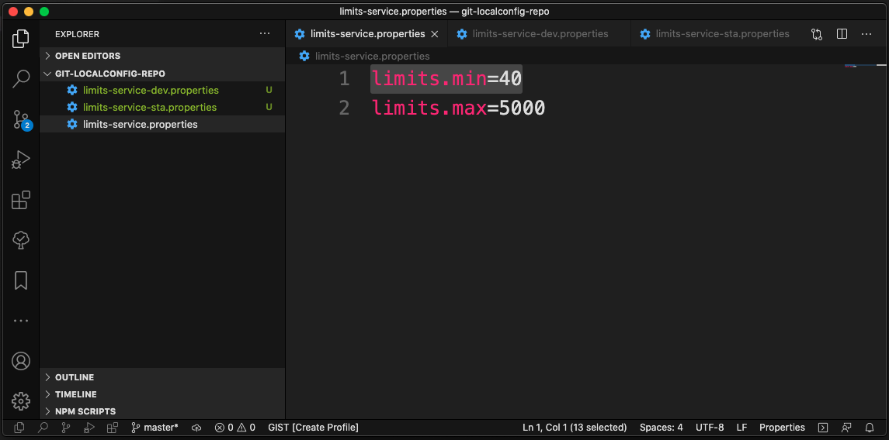
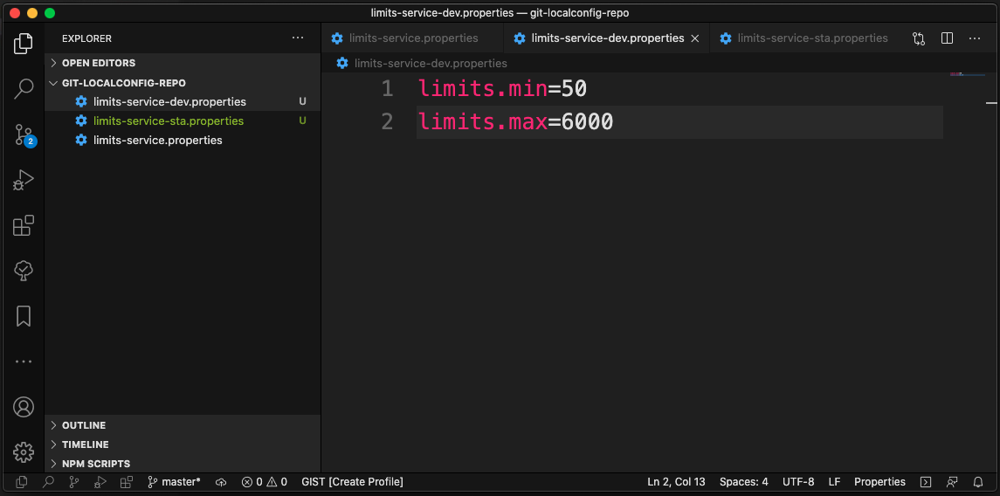
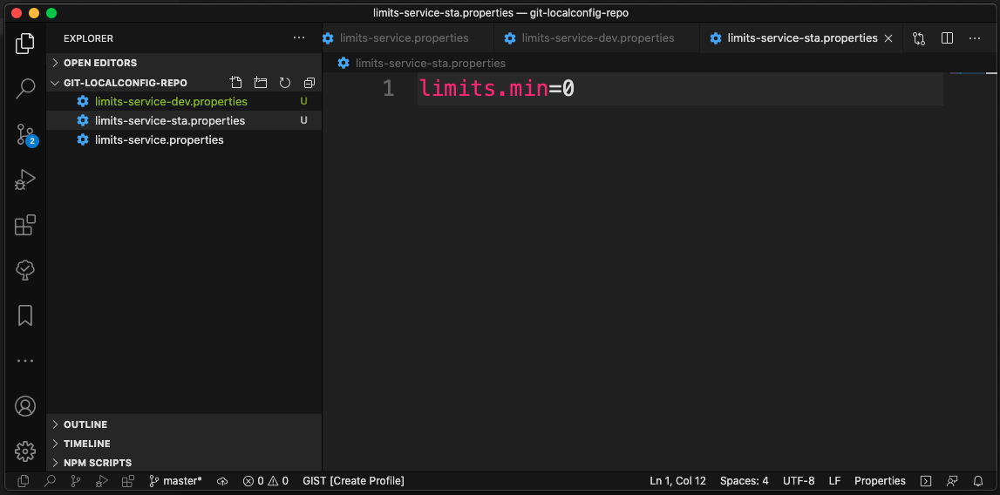
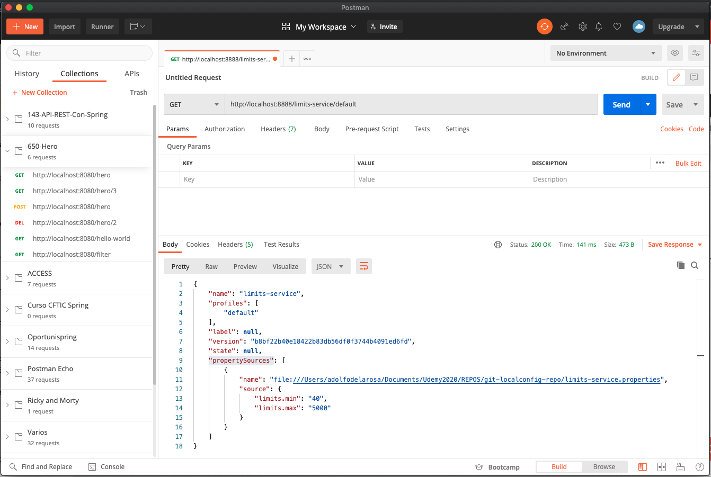
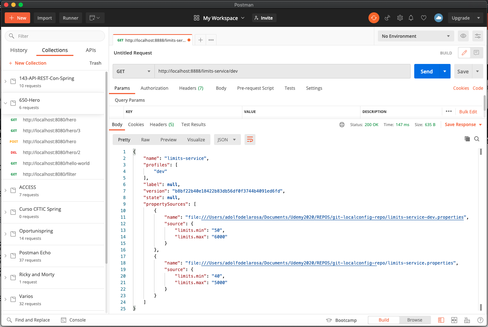
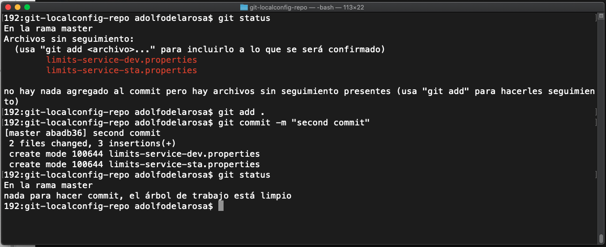

# 10 - Configurando Distintos Entornos

En lecciones anteriores creamos un archivo de propiedades por defecto en el repositorio GIT, pero mencionamos que se podian crear distintos archivos de propiedades en función del entorno que queremos que se utilice, luego también podemos indicar el entorno en el servicio cuando lo levantemos, y de acuerdo al entorno que le indiquemos va a leer el archivo de propiedades de un entorno o de otro, vamos a ver como el archivo de propiedades por defecto siempre se van a mandar pero dentro del `"propertySources"` se van a ordenar por prioridad, por lo tanto en el caso que indicaramos un entorno que no este disponible dentro de nuestro repositorio local se tiraria del archivo de propiedades por defecto, siempre lo tenemos como una especie de Backup, también lo podemos usar para sobreescribir ciertas propiedades, es decir si nosotros queremos tener un valor para el archivo de stages pero solo en el caso del límite mínimo podemos modificar el límite mínimo dentro del archivo de propiedades del stages y no indicar el límite máximo, entonces el límite máximo sería recogido del archivo de propiedades por defecto, así que vamos a ver como hacer esto.

Vamos al repositorio y vamos a crear los archivos para los diferentes entornos.

`limits-service.properties`, `limits-service-dev.properties` y `limits-service-sta.properties`

Ahora si levantamos la aplicación `spring-cloud-config-server` con las diferentes URLs:

http://localhost:8888/limits-service/default
http://localhost:8888/limits-service/dev
http://localhost:8888/limits-service/sta

En el caso de `sta` lee del archivo de propiedades que le corresponde y lee el `"limits.min"` para que sea 0 y el `"limits.max"` como no esta indicado en este archivo de propiedades, el valor que va a cojer es el valor por defecto, la prioridad de estos archivos es el orden en que aparecen en el JSON 

Como vemos la aplicación funciona, pero realmente nos ha faltado hacer un paso y en teoría la aplicación no debería haber funcionado, el paso que falta es hacer el commit en el repositorio ya que hemos creado dos nuevos archivos de propiedades, pero como realmente lo que hacemos es leer directamente sobre el archivo que tenemos de manera local no estamos teniendo ningún problema, pero si tuvieramos un repositorio remoto si que lo habriamos tenido al solicitar los archivos de propiedades veriamos que no los encuentra y eso sería por que no los hemos commiteado. Vamos a commitear para mantener el orden.

Ahora ya esta todo commiteado y los cambios en el repositorio.
