# 1. Introducing JEE and Eclipse

* JEE

   * The presentation layer

      * Java Servlets

      * JavaServer Pages

      * JavaServer Faces

   * The business layer

      * Enterprise JavaBeans

   * The enterprise integration layer

      * Java Database Connectivity 

      * The Java Persistence API

      * Java Connector Architecture

      * Web services

   * Eclipse IDE

      * Workspace

      * Plugin

      * Editors and views

      * Perspective

      * Eclipse preferences

* Installing products

   * Installing Eclipse

   * Installing the Tomcat server

   * Installing the GlassFish server

   * Installing MySQL

      * Installing MySQL on Windows

      * Installing MySQL on macOS X

      * Installing MySQL on Linux

      * Creating MySQL users

* Summary


# Introduciendo JEE y Eclipse

Java Enterprise Edition (JEE, que anteriormente se llamaba J2EE) existe desde hace muchos años. Es una plataforma muy robusta para desarrollar aplicaciones empresariales. J2EE se lanzó por primera vez en 1999, pero sufrió cambios importantes con el lanzamiento de la versión 5 en 2006. Desde la versión 5, se ha renombrado **Java Enterprise Edition ( JEE )**. Las versiones recientes de JEE han hecho que desarrollar una aplicación distribuida de múltiples niveles sea mucho más fácil. J2EE se había centrado en los servicios básicos y había dejado las tareas que hacían que el desarrollo de aplicaciones fuera más fácil para los marcos externos, por ejemplo, MVC y marcos persistentes. Pero JEE ha incorporado muchos de estos marcos a los servicios principales. Junto con el soporte para anotaciones, estos servicios simplifican el desarrollo de aplicaciones en gran medida.

Cualquier tecnología de tiempo de ejecución no es buena sin buenas herramientas de desarrollo. El  **entorno de desarrollo integrado ( IDE )** desempeña un papel importante en el desarrollo de aplicaciones más rápido, y Eclipse proporciona exactamente eso para JEE. No solo obtienes un buen soporte de edición de código en Eclipse, sino que también obtienes soporte para compilación, pruebas unitarias, control de versiones y muchas otras tareas importantes en diferentes fases del desarrollo de aplicaciones de software.

En este capítulo, vamos a cubrir los siguientes temas:

* Introducción a diferentes tecnologías en JEE
* Introducción al entorno de desarrollo de Eclipse.
* Instalación y configuración de algunos de los software utilizados con frecuencia en este libro, por ejemplo, servidores JEE, Eclipse IDE y Servidor de base de datos MySQL

El objetivo de este libro es mostrar cómo puede desarrollar eficientemente aplicaciones JEE utilizando Eclipse mediante el uso de muchas de sus características durante las diferentes fases del desarrollo de la aplicación. Pero primero, aquí hay una breve introducción a JEE y Eclipse.

*En 2017, Oracle acordó entregar el control de Java EE a Eclipse Foundation. En abril de 2018, la Fundación Eclipse renombró Java EE como Yakarta EE. Puede encontrar más información sobre Jakarta EE en  https://jakarta.ee/ . Al momento de escribir, la última versión de Java EE es 8. Pero todas las futuras versiones de Java EE se llamarán Jakarta EE.*

# JEE

JEE es una colección de muchos de los programas de Java Community Process ( https://www.jcp.org ). Actualmente, JEE está en la Versión 8. Sin embargo, las diferentes especificaciones de JEE están en sus propias versiones diferentes.

Las especificaciones JEE se pueden clasificar en términos generales en los siguientes grupos:

* Capa de presentación
* Capa empresarial
* Capa de integración empresarial

Tenga en cuenta que la especificación JEE no clasifica necesariamente las API en los grupos amplios anteriores, pero dicha clasificación podría ayudar a comprender mejor el propósito de las diferentes especificaciones y API en JEE.

Antes de ver las API en cada una de estas categorías, comprendamos un flujo típico de aplicaciones web JEE, como se muestra en el siguiente diagrama, y dónde encaja cada una de las capas anteriores:


Figura 1.1: Un flujo típico de aplicación web JEE

Las solicitudes comienzan desde los clientes. Un cliente puede ser cualquier aplicación que solicite servicios desde una aplicación remota; por ejemplo, podría ser el navegador o una aplicación de escritorio. La solicitud es recibida primero por el servidor web en el destino. Los ejemplos de servidores web incluyen el servidor web Apache, IIS y nginx. Si se trata de una solicitud de contenido estático, los servidores web la atienden. Sin embargo, una solicitud dinámica generalmente requiere un servidor de aplicaciones para procesar. Los servidores JEE son servidores de aplicaciones que manejan solicitudes dinámicas. La mayoría de las API de especificación JEE se ejecutan en el servidor de aplicaciones. Ejemplos de servidores de aplicaciones JEE son WebSphere, GlassFish y WildFly.

La mayoría de las aplicaciones JEE no triviales acceden a sistemas externos, como una base de datos o **Enterprise Integration Server ( EIS )**, para acceder a los datos y procesarlos. Se devuelve una respuesta del servidor de aplicaciones al servidor web y luego a los clientes.

Las siguientes secciones proporcionan una breve descripción de cada una de las especificaciones JEE en diferentes capas. Veremos cómo usar estas especificaciones y sus API en más detalle en los capítulos siguientes. Sin embargo, tenga en cuenta que la siguiente no es la lista exhaustiva de todas las especificaciones en JEE. Veremos las especificaciones más utilizadas aquí. Para obtener una lista exhaustiva, visite http://www.oracle.com/technetwork/java/javaee/tech/index.html .

## The presentation layer (La capa de presentación)

Las especificaciones o tecnologías JEE en esta capa reciben solicitudes del servidor web y envían la respuesta, generalmente en formato HTML. Sin embargo, también es posible devolver solo datos de la capa de presentación, por ejemplo, en **JavaScript Object Notation ( JSON )** o en formato de **Lenguaje de marcado extensible ( XML )**, que podrían ser consumidos por  llamadas **Asynchronous JavaScript y XML ( AJAX )** para actualizar solo una parte de la página, en lugar de representar la página HTML completa. Las clases en la capa de presentación se ejecutan principalmente en el contenedor web; es una parte del servidor de aplicaciones que maneja las solicitudes web. Tomcat es un ejemplo de un contenedor web popular.

Ahora echemos un vistazo a algunas de las especificaciones de esta capa.

### Java Servlets

Los Java Servlets son módulos del lado del servidor, que se utilizan generalmente para procesar solicitudes y enviar respuestas en aplicaciones web. Los servlets son útiles para manejar solicitudes que no generan grandes respuestas de marcado HTML. Por lo general, se usan como controladores en los marcos de **Model View Controller ( MVC )** , para reenviar / redirigir solicitudes o para generar respuestas que no son HTML, como PDF. Para generar una respuesta HTML desde el servlet, debe incrustar código HTML (como una cadena Java) en el código Java. Por lo tanto, no es la opción más conveniente para generar grandes respuestas HTML. **JEE 8 contiene servlet API 4.0**. 

### JavaServer Pages

Al igual que los servlets, las **JavaServer Pages (JSPs)** también son módulos del lado del servidor que se utilizan para procesar solicitudes web. Los JSP son excelentes para manejar solicitudes que generan grandes respuestas de marcado HTML. En las páginas JSP, el código Java o las etiquetas JSP se pueden mezclar con otro código HTML, como las etiquetas HTML, JavaScript y CSS. Dado que el código Java está incrustado en el código HTML más grande, es más fácil (que los servlets) generar una respuesta HTML desde las páginas JSP. **La especificación JSP 2.3 se incluye en JEE 8**.

### JavaServer Faces

JavaServer Faces (JSFs) hace que la creación de una interfaz de usuario en el lado del servidor sea modular al incorporar el patrón de diseño MVC en su implementación. También proporciona etiquetas fáciles de usar para controles de interfaz de usuario comunes que pueden guardar estados en múltiples intercambios de solicitud-respuesta entre el cliente y el servidor. Por ejemplo, si tiene una página que publica datos de formulario desde un navegador, puede hacer que un JSF guarde esos datos en un bean Java para que pueda usarse posteriormente en la respuesta a la misma solicitud o a otra diferente. Los JSF también facilitan el manejo de eventos de IU en el lado del servidor y especifican la navegación de página en una aplicación.

Usted escribe el código JSF en JSP, utilizando etiquetas JSP personalizadas creadas para JSF. **JavaServer Faces API 2.3 es parte de JEE 8.**

## The business layer (La capa empresarial)

La capa empresarial es donde normalmente escribe código para manejar la lógica empresarial de su aplicación. Las solicitudes a esta capa pueden provenir de la capa de presentación, directamente de la aplicación del cliente o de la capa intermedia que consiste en, pero no se limita a, servicios web. Las clases en esta capa se ejecutan en la parte del contenedor de la aplicación del servidor JEE. GlassFish y WebSphere son ejemplos de contenedores web más contenedores de aplicaciones.

Hagamos un recorrido por algunas de las especificaciones de este grupo.

### Enterprise JavaBeans

**Enterprise JavaBeans ( EJB )** son las clases de Java donde puede escribir su lógica de negocios. Aunque no es un requisito estricto utilizar EJB para escribir la lógica empresarial, sí proporcionan muchos de los servicios que son esenciales en las aplicaciones empresariales. Estos servicios son seguridad, gestión de transacciones, búsqueda de componentes, agrupación de objetos, etc.

Puede tener EJB distribuidos en varios servidores y dejar que el contenedor de la aplicación (también denominado contenedor EJB) se encargue de la búsqueda de componentes (componente de búsqueda) y la agrupación de componentes (útil para la escalabilidad). Esto puede mejorar la escalabilidad de la aplicación.

Los EJB son de dos tipos:

* **Session beans**: Beans de sesión son llamados directamente por clientes u objetos de nivel medio
* **Message-driven beans**: los beans controlados por mensajes se invocan en respuesta a eventos de **Java Messaging Service (JMS)**

JMS y beans controlados por mensajes se pueden usar para manejar solicitudes asincrónicas. En un escenario típico de procesamiento de solicitudes asíncronas, el cliente coloca una solicitud en una cola de mensajes o un tema y no espera una respuesta inmediata. Una aplicación en el lado del servidor recibe el mensaje de solicitud, ya sea utilizando directamente API de JMS o utilizando MDB. Procesa la solicitud y puede colocar la respuesta en una cola o tema diferente, al que el cliente escucharía y obtendría la respuesta.

**Java EE 8 contiene la especificación 3.2 de EJB y la especificación 2.0 de JMS.**

## The enterprise integration layer (La capa de integración empresarial)

Las API de esta capa se utilizan para interactuar con sistemas externos (a la aplicación JEE) en la empresa. La mayoría de las aplicaciones necesitarían acceder a una base de datos y a las API para acceder a ese grupo.

### Java Database Connectivity 

**Java Database Connectivity ( JDBC )** es una especificación para acceder a una base de datos relacional de una manera común y consistente. Con JDBC, puede ejecutar sentencias SQL y obtener resultados en diferentes bases de datos utilizando API comunes. Un controlador específico de la base de datos se ubica entre la llamada JDBC y la base de datos, y traduce las llamadas JDBC a llamadas API específicas del proveedor de la base de datos. JDBC se puede usar tanto en la presentación como en las capas empresariales directamente, pero se recomienda separar las llamadas a la base de datos de la IU y del código comercial. Por lo general, esto se realiza mediante la creación de **Data Access Objects (DAOs)** que encapsulan la lógica para acceder a la base de datos. JDBC es en realidad una parte de Java Standard Edition. **Java SE 8 contiene JDBC 4.2**.

### The Java Persistence API

Uno de los problemas de usar las API de JDBC directamente es que debe asignar constantemente los datos entre los objetos de Java y los datos en columnas o filas en la base de datos relacional. Los marcos como Hibernate y Spring han simplificado este proceso mediante el uso de un concepto conocido como **Object Relational Mapping ( ORM )**. ORM se incorpora en JEE en forma de la **Java Persistence API (JPA)**.

JPA le brinda la flexibilidad de asignar objetos a tablas en la base de datos relacional y ejecutar consultas con o sin el uso de **Structured Query Language (SQL)**. Cuando se usa en el contenido de JPA, el lenguaje de consulta se llama **Java Persistence Query Language**. **La especificación 2.2 de JPA es parte de JEE8**.

### Java Connector Architecture

**Java Connector Architecture (JCA)** APIs se pueden usar en aplicaciones JEE para comunicarse con sistemas de integración empresarial ( EIS ), como SAP y Salesforce. Al igual que tiene controladores de base de datos para negociar la comunicación entre las API JDBC y las bases de datos relacionales, tiene adaptadores JCA entre llamadas JCA y EIS. La mayoría de las aplicaciones EIS ahora proporcionan API REST, que son livianas y fáciles de usar, por lo que REST podría reemplazar a JCA en algunos casos. Sin embargo, si usa JCA, obtiene soporte de transacciones y agrupación del servidor de aplicaciones JEE.

### Web services

Los servicios web son componentes de aplicaciones remotas y exponen API autónomas. Los servicios web se pueden clasificar en términos generales según los siguientes dos estándares:

* **Protocolo simple de acceso a objetos ( SOAP )**
* **Transferencia de estado representativo ( REST )**

Los servicios web pueden desempeñar un papel importante en la integración de aplicaciones dispares, porque están basadas en estándares y son independientes de la plataforma.

JEE proporciona muchas especificaciones para simplificar el desarrollo y el consumo de ambos tipos de servicios web, por ejemplo, JAX-WS (Java API para XML — servicios web) y JAX-RS (Java API para servicios web RESTful).

Las anteriores son solo algunas de las especificaciones que forman parte de JEE. Hay muchas otras especificaciones independientes y muchas especificaciones habilitadoras, como la inyección de dependencia y las utilidades de concurrencia, que veremos en capítulos posteriores.

## Eclipse IDE

Un buen IDE es esencial para una mejor productividad durante la codificación. Eclipse es uno de esos IDE, que tiene excelentes características de editor y muchos puntos de integración con tecnologías JEE. El objetivo principal de este libro es mostrarle cómo desarrollar aplicaciones JEE utilizando Eclipse. Entonces, la siguiente es una introducción rápida a Eclipse, si aún no está familiarizado con él.

Eclipse es un IDE de código abierto para desarrollar aplicaciones en muchos lenguajes de programación diferentes. Es bastante popular para desarrollar muchos tipos diferentes de aplicaciones Java. Su arquitectura es conectable: hay un componente IDE central y se le pueden agregar muchos complementos diferentes. De hecho, el soporte para muchos idiomas se agrega como complementos de Eclipse, incluido el soporte para Java.

Junto con el soporte del editor, Eclipse tiene complementos para interactuar con muchos de los sistemas externos utilizados durante el desarrollo. Los ejemplos incluyen sistemas de control de fuente como SVN y Git, herramientas de compilación como Apache Ant y Maven, exploradores de archivos para sistemas remotos que usan FTP, servidores de administración como Tomcat y GlassFish, exploradores de bases de datos, memoria y perfiladores de CPU. Veremos muchas de estas características en los capítulos siguientes. La siguiente captura de pantalla muestra la vista predeterminada de Eclipse para el desarrollo de aplicaciones JEE:

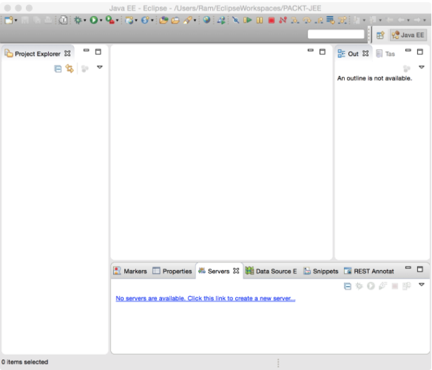

Figura 1.2: Vista de Eclipse predeterminada

Al trabajar con Eclipse, es bueno comprender los siguientes términos.

CopiarAgregar resaltadoAñadir la nota

### Workspace (Espacio de trabajo)

El Workspace de Eclipse es una colección de proyectos, configuraciones y preferencias. Es una carpeta donde Eclipse almacena esta información. Debe crear un espacio de trabajo para comenzar a usar Eclipse. Puede crear múltiples espacios de trabajo, pero solo una instancia en ejecución de Eclipse puede abrir  uno a la vez . Sin embargo, puede iniciar varias instancias de Eclipse con diferentes Workspaces. 

### Plugin

Eclipse tiene una arquitectura conectable. Muchas de las características de Eclipse se implementan como complementos, por ejemplo, complementos de editor para Java y muchos otros idiomas, complementos para SVN y Git, y muchos más. La instalación predeterminada de Eclipse viene con muchos complementos incorporados y puede agregar más complementos para las funciones que desee más adelante.

### Editors and views

La mayoría de las ventanas en Eclipse se pueden clasificar como editor o como vista. Un editor es algo donde puede cambiar la información que se muestra en él. Una vista solo muestra la información y no le permite cambiarla. Un ejemplo de un editor es el editor de Java donde escribes código. Un ejemplo de una vista es la vista de esquema que muestra la estructura jerárquica del código que está editando (en el caso de un editor Java, muestra clases y métodos en el archivo que se está editando).

Para ver todas las vistas en una instalación de Eclipse dada, abra la `Window | Show View | Other menu`:

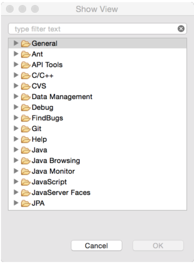

Figura 1.3: Mostrar todas las vistas de Eclipse

### Perspective

La perspectiva es una colección de editores y vistas, y cómo se presentan u organizan en la ventana principal de Eclipse. En diferentes etapas de desarrollo, necesita diferentes vistas para mostrar. Por ejemplo, cuando está editando el código, necesita ver las  vistas Explorador de proyectos y Tarea , pero cuando está depurando una aplicación, no necesita esas vistas, sino que desea ver vistas de punto de corte y variable. Por lo tanto, la perspectiva de edición muestra, entre otras vistas y editores, las vistas  Explorador de proyectos y Tareas , y la perspectiva Depuración muestra vistas y editores relevantes para las actividades de depuración. Puede cambiar las perspectivas predeterminadas para adaptarlas a sus propósitos.

### Eclipse preferences

La ventana de Preferencias de Eclipse ( Figura 1.4 ) es donde personaliza muchos complementos / características. Las preferencias están disponibles en el  menú Ventana en las instalaciones de Windows y Linux de Eclipse, y en el menú Eclipse en Mac:


Figura 1.4: Preferencias de Eclipse

# Installing products

En los capítulos siguientes, aprenderemos cómo desarrollar aplicaciones JEE en Eclipse. Pero las aplicaciones van a necesitar un servidor de aplicaciones JEE y una base de datos. Usaremos el contenedor web Tomcat en los primeros capítulos y luego usaremos el servidor de aplicaciones GlassFish JEE. Vamos a usar una base de datos MySQL.

Vamos a necesitar estos productos para muchas de las aplicaciones que vamos a desarrollar. Entonces, las siguientes secciones describen cómo instalar y configurar Eclipse, Tomcat, GlassFish y MySQL.

## Installing Eclipse

Descargue la última versión de Eclipse desde https://eclipse.org/downloads/ . Verá muchos paquetes diferentes para Eclipse. Asegúrese de instalar el paquete Eclipse IDE para desarrolladores de Java EE . Seleccione un paquete apropiado basado en su sistema operativo y arquitectura JVM (32 o 64 bits). Es posible que desee ejecutar el comando `java -version` para saber si la JVM es de 32 bits o de 64 bits.

*Si planea usar Eclipse para el desarrollo de AWS, se recomienda descargar Eclipse desde el instalador de Oomph. Consulte  https://wiki.eclipse.org/Eclipse_Installer y  https://docs.aws.amazon.com/toolkit-for-eclipse/v1/user-guide/setup-install.html*.

Descomprima el archivo ZIP descargado y luego ejecute la aplicación Eclipse (debe instalar JDK antes de ejecutar Eclipse). La primera vez que ejecute Eclipse, se le pedirá que especifique un espacio de trabajo. Cree una nueva carpeta en su sistema de archivos y selecciónela como la carpeta inicial del espacio de trabajo. Si tiene la intención de usar la misma carpeta para el espacio de trabajo en cada lanzamiento de Eclipse, marque la casilla Usar esto como predeterminada y no volver a preguntar:

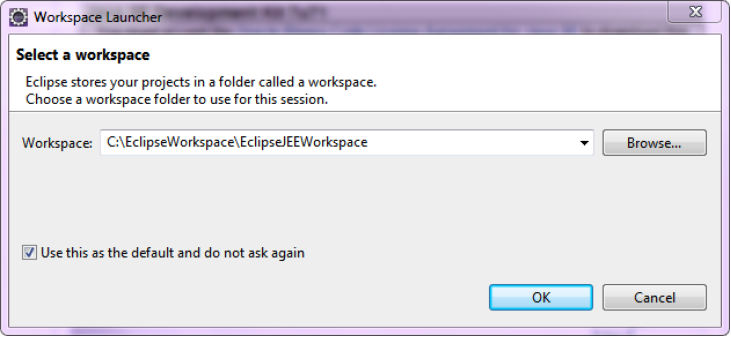

Figura 1.5: Seleccione el espacio de trabajo de Eclipse

Luego verá la perspectiva predeterminada de Java EE de Eclipse como se muestra en la Figura 1.2 .

## Installing the Tomcat server

Tomcat es un contenedor web. Admite API en la capa de presentación descrita anteriormente. Además, es compatible con JDBC y JPA. Es fácil de configurar y podría ser una buena opción si no desea utilizar EJB.

Descargue la última versión de Tomcat de http://tomcat.apache.org/ . Descomprima el archivo descargado en una carpeta. Establezca la variable de entorno `JAVA_HOME` para que apunte a la carpeta donde está instalado JDK (la ruta de la carpeta debe ser la carpeta JDK, que tiene `bin` como una de las subcarpetas). Para iniciar el servidor, ejecute `startup.bat` en símbolo del sistema en Windows y `startup.sh` en una ventana de Terminal en Mac y Linux. Si no hay errores, entonces debería ver el mensaje `Server startup in --ms` o `Tomcat started`.

La instalación predeterminada de Tomcat está configurada para usar el puerto `8080`. Si desea cambiar el puerto, abra `server.xml` en la carpeta `conf` y busque una declaración `connector` como la siguiente:

```sh
<Connector port="8080" protocol="HTTP/1.1" 
               connectionTimeout="20000" 
               redirectPort="8443" /> 
```               
               
Cambie el valor del puerto a cualquier número de puerto que desee, aunque en este libro usaremos el puerto predeterminado 8080. Antes de abrir la página predeterminada de Tomcat, agregaremos un usuario para la administración del servidor Tomcat. Abra `tomcat-users.xml` en la carpeta `conf` con cualquier editor de texto. Al final del archivo, verá un ejemplo comentado de cómo agregar usuarios. Agregue la siguiente configuración antes del cierre del tag `</tomcat-users>`:

```sh
<role rolename="manager-gui"/> 
<user username="admin" password="admin" roles="manager-gui"/> 
```

Aquí, estamos agregando un usuario `admin`, con contraseña también `admin`, para un rol llamado `manager-gui`. Este rol tiene acceso a páginas web para administrar una aplicación en Tomcat. Este y otros roles de seguridad se definen en `web.xml` de la aplicación `manager`. Lo puedes encontrar en` webapps/manager/WEB-INF/web.xml`.


*Para obtener más información sobre la administración del servidor Tomcat, consulte  http://tomcat.apache.org/tomcat-8.0-doc/manager-howto.html*.

Después de realizar los cambios anteriores, abra un navegador web y busque http://localhost:8080 (modifique el número de puerto si ha cambiado el puerto predeterminado). Verá la siguiente página predeterminada de Tomcat:


Figura 1.6: La aplicación web predeterminada de Tomcat

Haga clic en el botón de la aplicación Manager a la derecha. Se le pedirá el nombre de usuario y la contraseña. Introduzca el nombre de usuario y la contraseña que configuró en `tomcat-users.xml` para `manager-gui`, como se describió anteriormente. Una vez que haya iniciado sesión correctamente, verá la  página del Administrador de aplicaciones web de Tomcat , como se muestra en la Figura 1.7 . Puede ver todas las aplicaciones implementadas en Tomcat en esta página. También puede implementar sus aplicaciones desde esta página:

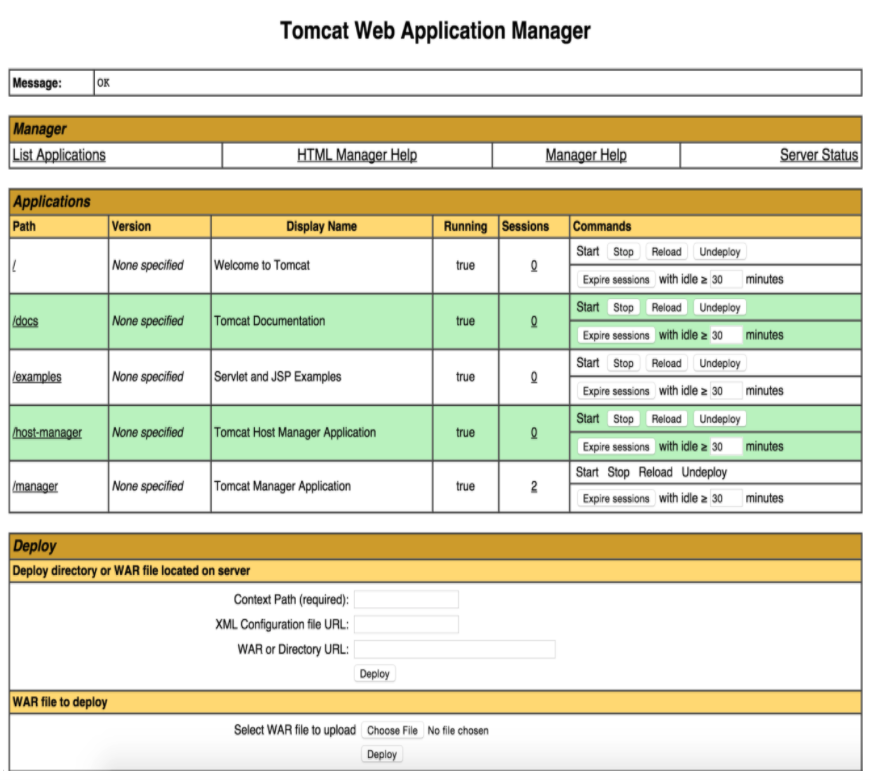

Figura 1.7: Tomcat Web Application Manager

Para detener el servidor Tomcat, presione *Ctrl/cmd + C* o ejecute el script shutdown en la carpeta `bin`.

## Installing the GlassFish server

Descargue GlassFish desde https://glassfish.java.net/download.html . GlassFish viene en dos sabores: perfil web y plataforma completa. Web Profile es como Tomcat, que no incluye soporte EJB. Así que descarga la plataforma completa.

Descomprima el archivo descargado en una carpeta. El puerto predeterminado del servidor GlassFish es `8080`. Si desea cambiar eso, ábra `glassfish/domains/domain1/config/domain.xml` en un editor de texto (también puede abrirlo en Eclipse, usando la  opción de menú File | Open File ) y busque `8080`. Deberías verlo en uno de los `<network-listener>`. Cambie el puerto si lo desea (que puede ser el caso si alguna otra aplicación ya está usando ese puerto).

Para iniciar el servidor, ejecute el script `startserv` (`.bat` o `.sh` según el sistema operativo que utilice). Una vez que el servidor se ha iniciado, abra un navegador web y busque `http://localhost:8080`. Debería ver una página como la siguiente:

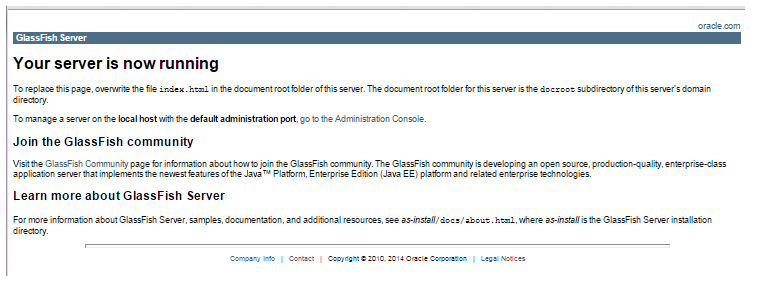

Figura 1.8: La aplicación web predeterminada de Glassfish

Esta página está ubicada en `glassfish/domains/domain1/docroot/index.html`. Haga clic en el enlace Ir a la Consola de administración en la página para abrir el administrador de GlassFish (vea la siguiente captura de pantalla):

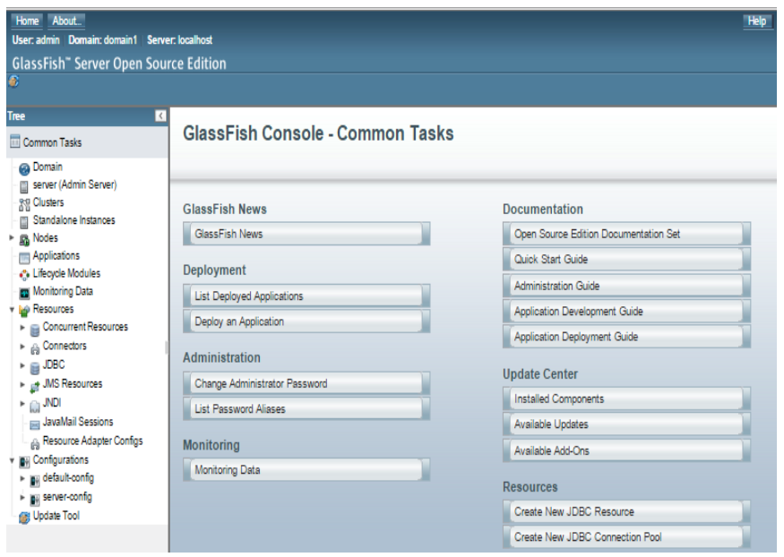

Figura 1.9: El administrador de Glassfish

*Para obtener detalles sobre la administración del servidor GlassFish, consulte  https://javaee.github.io/glassfish/doc/5.0/administration-guide.pdf*.

Para detener el servidor GlassFish, ejecute el script `stopserv` en la carpeta `glassfish/bin`.

## Installing MySQL

Utilizaremos una base de datos MySQL para muchos de los ejemplos de este libro. Las siguientes secciones describen cómo instalar y configurar MySQL para diferentes plataformas.

También nos gustaría instalar MySQL Workbench, que es una aplicación cliente para administrar MySQL Server. Descargue MySQL Workbench desde  https://dev.mysql.com/downloads/workbench/ .

### Installing MySQL on Windows

Descargue MySQL Community Server desde http://dev.mysql.com/downloads/mysql/ . Puede descargar el instalador web o el instalador todo en uno. El instalador web descargará solo los componentes que haya seleccionado. Las siguientes instrucciones muestran las opciones de descarga mediante el instalador web.

El instalador web primero descarga una pequeña aplicación y le brinda opciones para seleccionar los componentes que desea instalar:

1. Seleccione la opción Personalizada y haga clic en Siguiente :

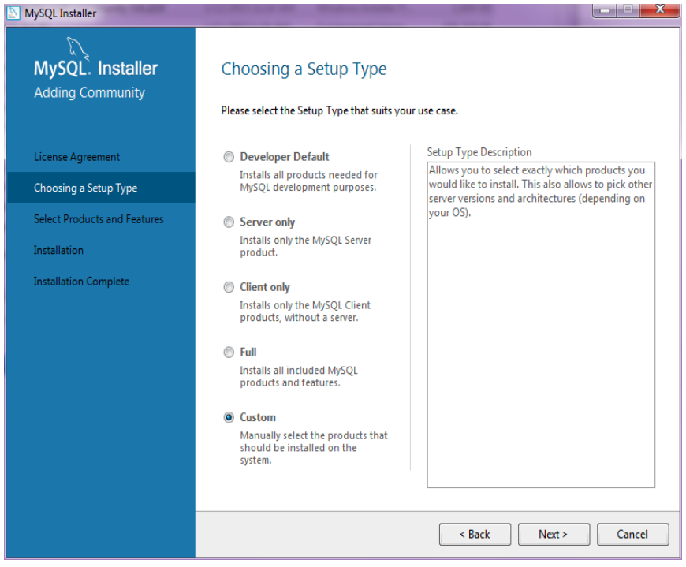

Figura 1.10: Instalador MySQL para Windows

2. Seleccione los productos  MySQL Server y MySQL Workbench y complete la instalación. Durante la instalación del servidor, se le pedirá que establezca la contraseña `root` y se le dará la opción de agregar más usuarios. Siempre es una buena idea agregar un usuario que no sea root para que las aplicaciones lo usen:

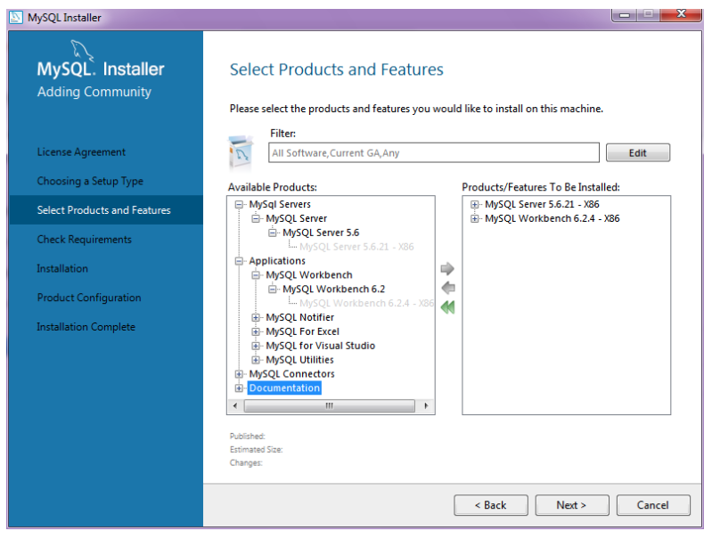

Figura 1.11: Seleccione los productos y características de MySQL para instalar

3. Asegúrese de seleccionar Todos los hosts al agregar un usuario para que pueda acceder a la base de datos MySQL desde cualquier máquina remota que tenga acceso de red a la máquina donde está instalado MySQL:

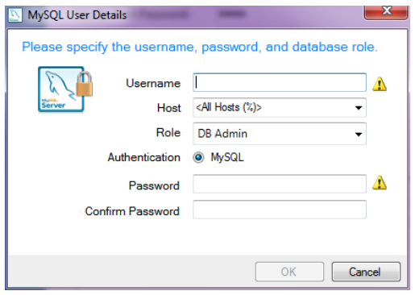

Figura 1.12: Agregar usuario MySQL

4. Ejecute MySQL Workbench después de la instalación. Encontrará que la conexión predeterminada a la instancia local de MySQL ya está creada para usted:

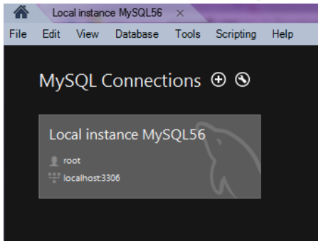

Figura 1.13: Conexiones de MySQL Workbench

5. Haga clic en la conexión local y se le pedirá que ingrese la contraseña `root`. Ingrese la contraseña `root` que escribió durante la instalación de MySQL Server. MySQL Workbench se abre y muestra el esquema de prueba predeterminado:

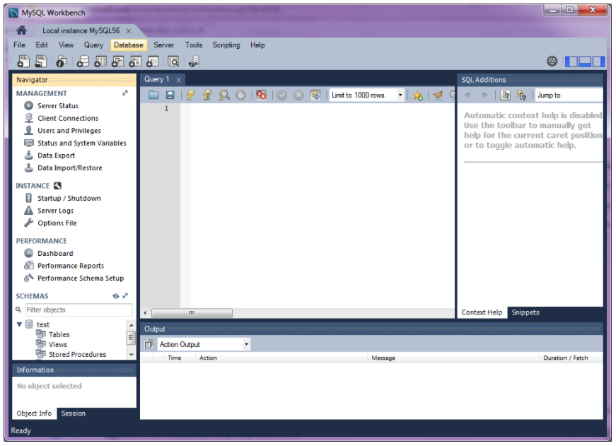

Figura 1.14: My SQL Workbench

### Installing MySQL on macOS X

Las versiones de OS X anteriores a la 10.7 tenían instalado MySQL Server por defecto. Si está utilizando OS X 10.7 o posterior, deberá descargar e instalar MySQL Community Server desde http://dev.mysql.com/downloads/mysql/ .

Hay muchas formas diferentes de instalar MySQL en OS X. Consulte http://dev.mysql.com/doc/refman/5.7/en/osx-installation.html para obtener instrucciones de instalación para OS X. Tenga en cuenta que los usuarios de OS X deben tener privilegios de administrador para instalar MySQL Server.

Una vez que instale el servidor, puede iniciarlo desde el símbolo del sistema o desde las preferencias del sistema:

1. Para iniciarlo desde el símbolo del sistema, ejecute el siguiente comando en la Terminal:

```sh
sudo /usr/local/mysql/support-files/mysql.server start  
```

2. Para iniciarlo desde Preferencias del sistema , abra las preferencias y haga clic en el icono de MySQL:

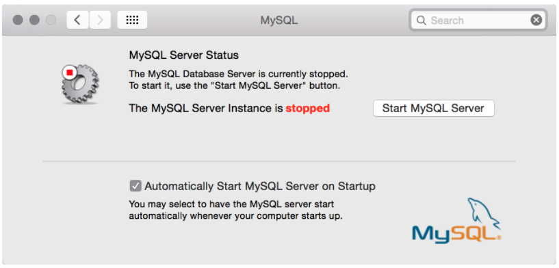

Figura 1.15: Preferencias del sistema MySQL - OS X

Haga clic en el  botón Iniciar servidor MySQL .

### Installing MySQL on Linux

Hay muchas formas diferentes de instalar MySQL en Linux. Consulte  https://dev.mysql.com/doc/refman/5.7/en/linux-installation.html para obtener más detalles.

### Creating MySQL users

Puede crear usuarios de MySQL desde el símbolo del sistema o utilizando MySQL Workbench:

1. Para ejecutar SQL y otros comandos desde el símbolo del sistema, abra la Terminal y escriba el siguiente comando:

```sh
mysql -u root -p<root_password> 
```

2. Una vez que haya iniciado sesión correctamente, verá el símbolo del sistema `mysql`:

```sh
mysql>  
```

3. Para crear un usuario, primero seleccione la mysqlbase de datos:

```sh
mysql>use mysql;
Database changed
mysql>create user 'user1'@'%' identified by 'user1_pass';  
mysql>grant all privileges on *.* to 'user1'@'%' with grant option
```

El comando anterior creará un usuario `'user1'` con contraseña `'user1_pass'` que tenga todos los privilegios, por ejemplo, para insertar, actualizar y seleccionar de la base de datos. Y debido a que hemos especificado el host como `'%'`, este usuario puede acceder al servidor desde cualquier host.


*Consulte https://dev.mysql.com/doc/refman/5.7/en/adding-users.html para obtener más detalles sobre cómo agregar usuarios a la base de datos MySQL*


Si prefiere una **interfaz gráfica de usuario - graphical user interface (GUI)** para administrar a los usuarios, ejecute MySQL Workbench, conéctese al servidor MySQL local (consulte la Figura 1.13 Conexiones de MySQL Workbench) y luego haga clic en Usuarios y privilegios en la sección Administración :

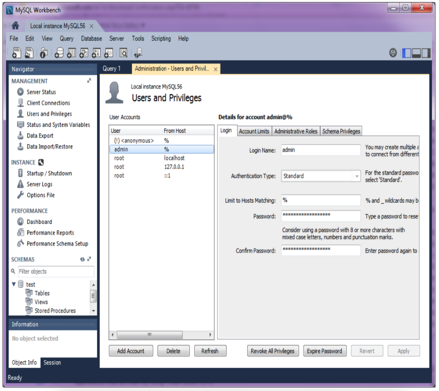

Figura 1.16: Crear un usuario en MySQL Workbench

Una vez instalados todos los productos anteriores, debe estar en condiciones de comenzar a desarrollar aplicaciones JEE. Es posible que necesitemos un software adicional, pero veremos cómo instalarlo y configurarlo en el momento adecuado.

# Summary

En este capítulo, tuvimos una breve introducción a las diferentes especificaciones JEE para la capa de presentación, la capa empresarial y la capa de integración empresarial. Aprendimos algunas de las terminologías importantes en Eclipse IDE. Luego aprendimos cómo instalar Eclipse, Tomcat, Glassfish, MySQL y MySQL Workbench. Vamos a utilizar estos productos en este libro para desarrollar aplicaciones JEE.

En el próximo capítulo, configuraremos el servidor JEE y crearemos una aplicación simple utilizando servlets, JSP y JSF. También aprenderemos cómo usar Maven para compilar y empaquetar las aplicaciones JEE.
