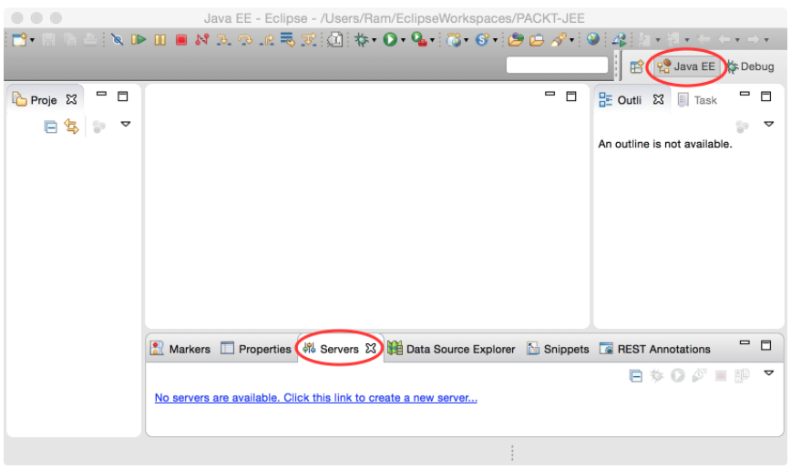
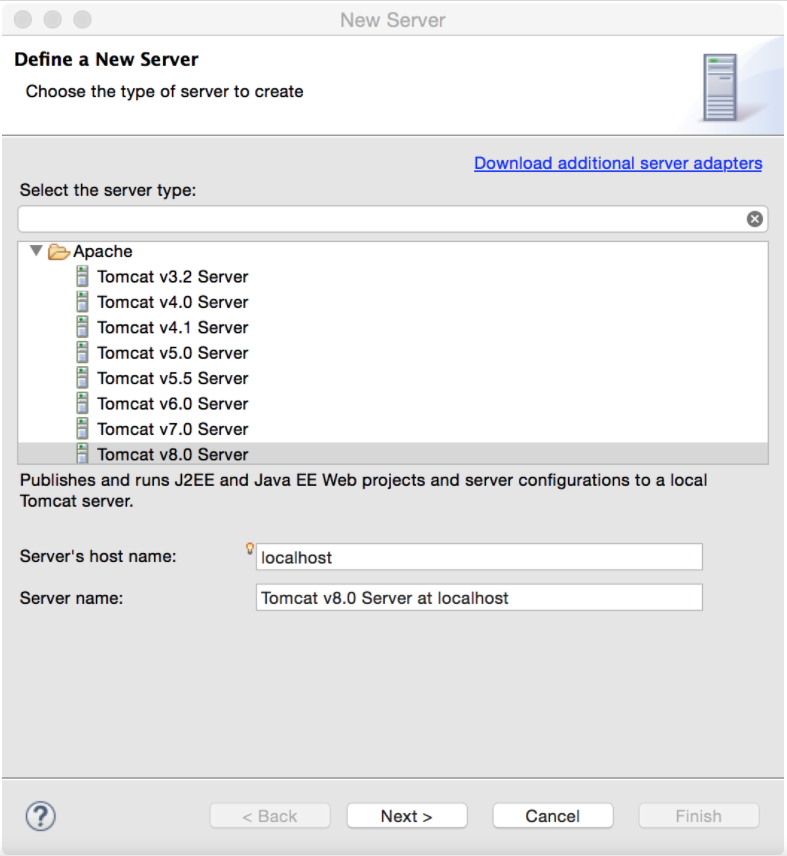
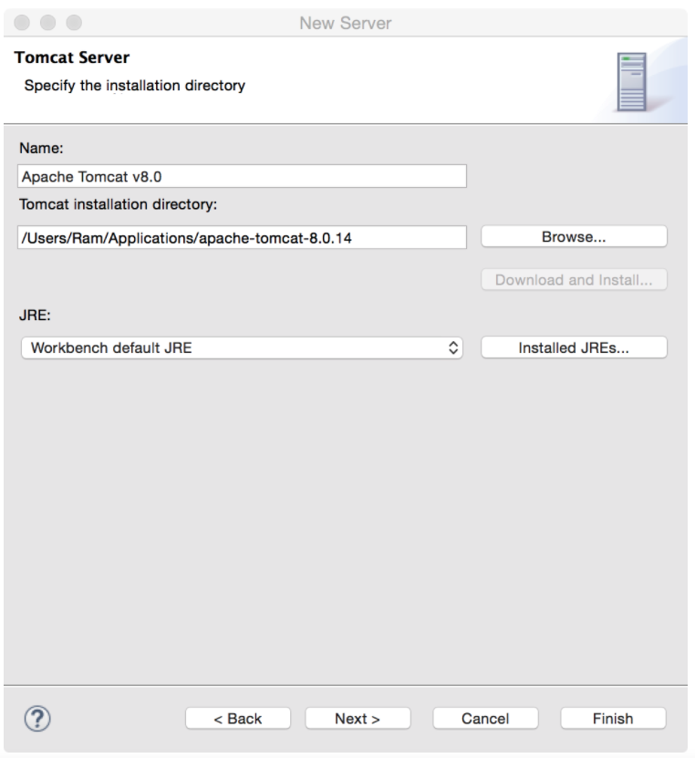
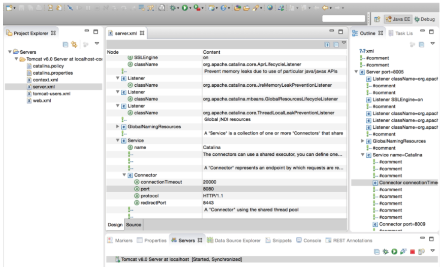

# 2. Creating a Simple JEE Web Application

* Configuring Tomcat in Eclipse

* JavaServer Pages

   * Creating a dynamic web project

   * Creating JSP

   * Running JSP in Tomcat

   * Using JavaBeans in JSP

   * Using JSTL

* Java Servlet

* Creating WAR

* JavaServer Faces

* Using Maven for project management

   * Maven views and preferences in Eclipse JEE

   * Creating a Maven project

      * Maven archetype

   * Exploring the POM

   * Adding Maven dependencies

   * Maven project structure

   * Creating a WAR file using Maven

* Summary

# Creating a Simple JEE Web Application (Crear una aplicación web JEE simple)

El capítulo anterior le dio una breve introducción a JEE y Eclipse. También aprendimos cómo instalar el paquete Eclipse JEE y también cómo instalar y configurar Tomcat. Tomcat es un contenedor de servlets y es fácil de usar y configurar. Por lo tanto, muchos desarrolladores lo usan para ejecutar aplicaciones web JEE en máquinas locales.

En este capítulo, cubriremos los siguientes temas:

* Configurar Tomcat en Eclipse e implementar aplicaciones web desde Eclipse
* Uso de diferentes tecnologías para crear aplicaciones web en JEE, por ejemplo, JSP, JSTL, JSF y servlets
* Usando la herramienta de gestión de dependencias de Maven

# Configuring Tomcat in Eclipse

Realizaremos los siguientes pasos para configurar Tomcat en Eclipse:

1. En la perspectiva Java EE de Eclipse, encontrará la  pestaña Servidores en la parte inferior. Como todavía no se ha agregado ningún servidor, verá un enlace en la pestaña como se muestra en la siguiente captura de pantalla: no hay servidores disponibles. Haga clic en este enlace para crear un nuevo servidor ... . 

Figura 2.1: La pestaña Servidores en Eclipse JEE

2. Haga clic en el enlace en la pestaña Servidores para agregar un nuevo servidor.

3. Expanda el grupo `Apache` y seleccione la versión de Tomcat que ya ha instalado. Si Eclipse y el servidor Tomcat están en la misma máquina, deje el nombre de host del servidor como `localhost`. De lo contrario, ingrese el nombre de host o la dirección IP del servidor Tomcat. Haga clic en siguiente :

Figura 2.2: Seleccionar un servidor en el asistente de Nuevo servidor

4. Haga clic en el  botón Examinar ... y seleccione la carpeta donde está instalado Tomcat.

5. Haga clic en Siguiente hasta completar el asistente. Al final, verá el servidor Tomcat agregado a la  vista Servidores. Si Tomcat aún no se ha iniciado, verá el estado como detenido.

Figura 2.3: Configuración de la carpeta Tomcat en el asistente de Nuevo servidor

6. Para iniciar el servidor, haga clic derecho en el servidor y seleccione Iniciar . También puede iniciar el servidor haciendo clic en el botón Inicio en la barra de herramientas de la   vista Servidor .

Figura 2.4: El servidor Tomcat agregado a la vista Servidores

Una vez que el servidor se inicia correctamente, verá el estado cambiado a `Started`. Si hace clic en la  pestaña Consola , verá mensajes de consola que el servidor Tomcat envía durante el inicio.

Si expande el grupo Servidores en la  vista Explorador de proyectos , verá el servidor Tomcat que acaba de agregar. Expanda el nodo del servidor Tomcat para ver los archivos de configuración. Esta es una manera fácil de editar la configuración de Tomcat para que no tenga que buscar los archivos de configuración en el sistema de archivos.

Haga doble clic `server.xml` para abrirlo en el editor XML. Obtiene la  vista Diseño , así como la  vista Fuente (dos pestañas en la parte inferior del editor). Hemos aprendido cómo cambiar el puerto predeterminado de Tomcat en el último capítulo. Puede cambiar eso fácilmente en el editor de Eclipse abriendo `server.xml` y yendo al nodo Conector. Si necesita buscar el texto, puede cambiar a la pestaña Fuente (en la parte inferior del editor).

Figura 2.5: Abra server.xml

También puede editar fácilmente `tomcat-users.xml` para agregar/editar usuarios de Tomcat. Recuerde que agregamos un usuario Tomcat en el Capítulo 1 , *Introducción a JEE y Eclipse*, para administrar el servidor Tomcat.

De manera predeterminada, Eclipse no cambia nada en la carpeta de instalación de Tomcat cuando agrega el servidor en Eclipse. En su lugar, crea una carpeta en el espacio de trabajo y copia los archivos de configuración de Tomcat a esta carpeta. Las aplicaciones que se implementan en Tomcat también se copian y publican desde esta carpeta. Esto funciona bien en el desarrollo, cuando no desea modificar la configuración de Tomcat o cualquier aplicación implementada en el servidor. Sin embargo, si desea utilizar la carpeta de instalación real de Tomcat, debe modificar la configuración del servidor en Eclipse. Haga doble clic en el servidor en la vista Servidores para abrirlo en el editor.

Figura 2.6: Configuración de Tomcat

Tenga en cuenta las opciones en Ubicaciones del servidor . Seleccione la segunda opción, Usar  instalación de Tomcat , si desea usar las carpetas de instalación reales de Tomcat para la configuración y para publicar aplicaciones desde Eclipse.

# JavaServer Pages

## Creating a dynamic web project

## Creating JSP

## Running JSP in Tomcat

## Using JavaBeans in JSP

## Using JSTL

# Java Servlet

# Creating WAR

# JavaServer Faces

# Using Maven for project management

## Maven views and preferences in Eclipse JEE

## Creating a Maven project

### Maven archetype

## Exploring the POM

## Adding Maven dependencies

## Maven project structure

## Creating a WAR file using Maven

# Summary
