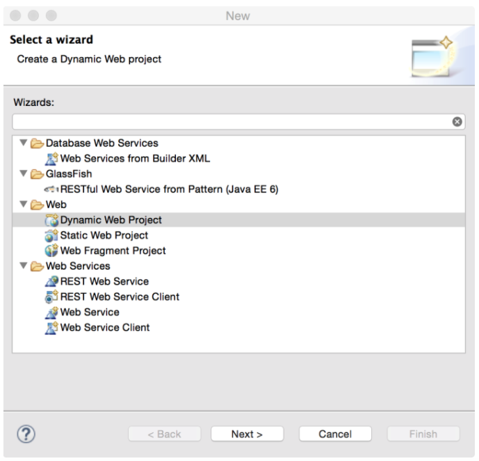
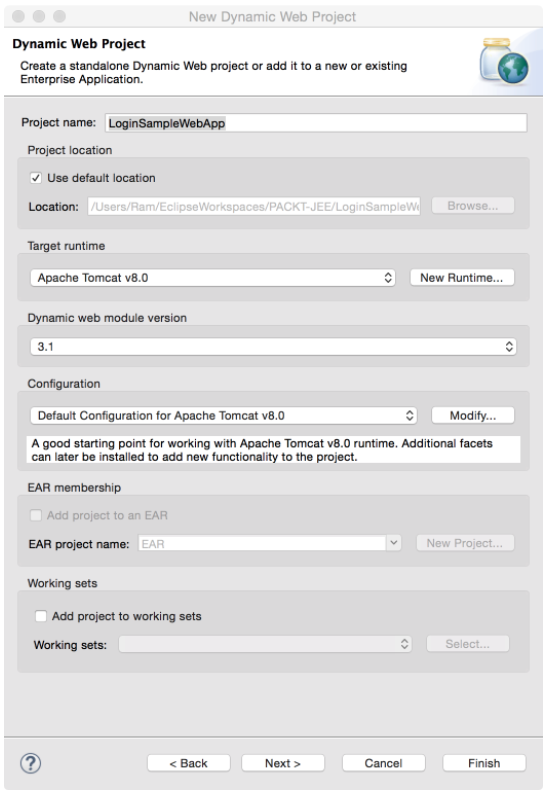
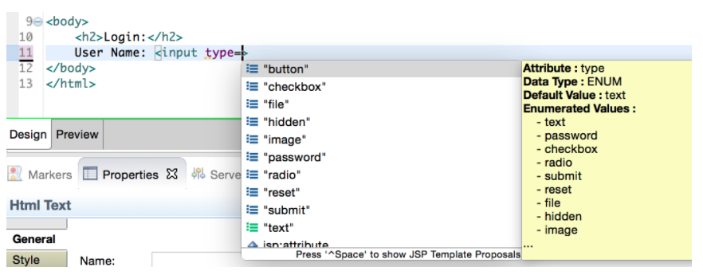

# 2. Creating a Simple JEE Web Application

* Configuring Tomcat in Eclipse

* JavaServer Pages

   * Creating a dynamic web project

   * Creating JSP

   * Running JSP in Tomcat

   * Using JavaBeans in JSP

   * Using JSTL

* Java Servlet

* Creating WAR

* JavaServer Faces

* Using Maven for project management

   * Maven views and preferences in Eclipse JEE

   * Creating a Maven project

      * Maven archetype

   * Exploring the POM

   * Adding Maven dependencies

   * Maven project structure

   * Creating a WAR file using Maven

* Summary

# Creating a Simple JEE Web Application (Crear una aplicación web JEE simple)

El capítulo anterior le dio una breve introducción a JEE y Eclipse. También aprendimos cómo instalar el paquete Eclipse JEE y también cómo instalar y configurar Tomcat. Tomcat es un contenedor de servlets y es fácil de usar y configurar. Por lo tanto, muchos desarrolladores lo usan para ejecutar aplicaciones web JEE en máquinas locales.

En este capítulo, cubriremos los siguientes temas:

* Configurar Tomcat en Eclipse e implementar aplicaciones web desde Eclipse
* Uso de diferentes tecnologías para crear aplicaciones web en JEE, por ejemplo, JSP, JSTL, JSF y servlets
* Usando la herramienta de gestión de dependencias de Maven

# Configuring Tomcat in Eclipse

Realizaremos los siguientes pasos para configurar Tomcat en Eclipse:

1. En la perspectiva Java EE de Eclipse, encontrará la  pestaña Servidores en la parte inferior. Como todavía no se ha agregado ningún servidor, verá un enlace en la pestaña como se muestra en la siguiente captura de pantalla: no hay servidores disponibles. Haga clic en este enlace para crear un nuevo servidor ... . 


Figura 2.1: La pestaña Servidores en Eclipse JEE

2. Haga clic en el enlace en la pestaña Servidores para agregar un nuevo servidor.

3. Expanda el grupo `Apache` y seleccione la versión de Tomcat que ya ha instalado. Si Eclipse y el servidor Tomcat están en la misma máquina, deje el nombre de host del servidor como `localhost`. De lo contrario, ingrese el nombre de host o la dirección IP del servidor Tomcat. Haga clic en siguiente :


Figura 2.2: Seleccionar un servidor en el asistente de Nuevo servidor

4. Haga clic en el  botón Examinar ... y seleccione la carpeta donde está instalado Tomcat.

5. Haga clic en Siguiente hasta completar el asistente. Al final, verá el servidor Tomcat agregado a la  vista Servidores. Si Tomcat aún no se ha iniciado, verá el estado como detenido.


Figura 2.3: Configuración de la carpeta Tomcat en el asistente de Nuevo servidor

6. Para iniciar el servidor, haga clic derecho en el servidor y seleccione Iniciar . También puede iniciar el servidor haciendo clic en el botón Inicio en la barra de herramientas de la   vista Servidor .


Figura 2.4: El servidor Tomcat agregado a la vista Servidores

Una vez que el servidor se inicia correctamente, verá el estado cambiado a `Started`. Si hace clic en la  pestaña Consola , verá mensajes de consola que el servidor Tomcat envía durante el inicio.

Si expande el grupo Servidores en la  vista Explorador de proyectos , verá el servidor Tomcat que acaba de agregar. Expanda el nodo del servidor Tomcat para ver los archivos de configuración. Esta es una manera fácil de editar la configuración de Tomcat para que no tenga que buscar los archivos de configuración en el sistema de archivos.

Haga doble clic `server.xml` para abrirlo en el editor XML. Obtiene la  vista Diseño , así como la  vista Fuente (dos pestañas en la parte inferior del editor). Hemos aprendido cómo cambiar el puerto predeterminado de Tomcat en el último capítulo. Puede cambiar eso fácilmente en el editor de Eclipse abriendo `server.xml` y yendo al nodo Conector. Si necesita buscar el texto, puede cambiar a la pestaña Fuente (en la parte inferior del editor).


Figura 2.5: Abra server.xml

También puede editar fácilmente `tomcat-users.xml` para agregar/editar usuarios de Tomcat. Recuerde que agregamos un usuario Tomcat en el Capítulo 1 , *Introducción a JEE y Eclipse*, para administrar el servidor Tomcat.

De manera predeterminada, Eclipse no cambia nada en la carpeta de instalación de Tomcat cuando agrega el servidor en Eclipse. En su lugar, crea una carpeta en el espacio de trabajo y copia los archivos de configuración de Tomcat a esta carpeta. Las aplicaciones que se implementan en Tomcat también se copian y publican desde esta carpeta. Esto funciona bien en el desarrollo, cuando no desea modificar la configuración de Tomcat o cualquier aplicación implementada en el servidor. Sin embargo, si desea utilizar la carpeta de instalación real de Tomcat, debe modificar la configuración del servidor en Eclipse. Haga doble clic en el servidor en la vista Servidores para abrirlo en el editor.


Figura 2.6: Configuración de Tomcat

Tenga en cuenta las opciones en Ubicaciones del servidor . Seleccione la segunda opción, Usar  instalación de Tomcat , si desea usar las carpetas de instalación reales de Tomcat para la configuración y para publicar aplicaciones desde Eclipse.

# JavaServer Pages

Comenzaremos con un proyecto para crear un JSP simple. Crearemos un JSP de inicio de sesión que envíe datos a sí mismo y valide al usuario.

## Creating a dynamic web project

Realizaremos los siguientes pasos para crear un proyecto web dinámico:

1. Seleccione `File | New | Other menu.` Esto abre el asistente de selección. En la parte superior del asistente, encontrará un cuadro de texto con un icono de cruz en el extremo derecho.

2. Escribe `web` en el cuadro de texto. Este es el cuadro de filtro. Muchos asistentes y vistas en Eclipse tienen un cuadro de texto de filtro de este tipo, lo que facilita la búsqueda de elementos.



Figura 2.7: New selection wizard

Select Dynamic Web Project and click Next to open the Dynamic Web Project wizard. Enter project name, for example, LoginSampleWebApp. Note that the Dynamic web module version field in this page lists Servlet API version numbers. Select version 3.0 or greater. Click Next.

Seleccione Dynamic Web Project y haga clic en Next para abrir el asistente de Dynamic Web Project. Ingrese el nombre del proyecto, por ejemplo `LoginSampleWebApp`. Tenga en cuenta que el campo Dynamic web module version en esta página enumera los números de versión de API de Servlet. Seleccione la versión 3.0 o superior. Haga clic en Next.



Figura 2.8: New Dynamic Web Project wizard

Haga clic en Next en las siguientes páginas y haga clic en Finish en la última página para crear un  `LoginSimpleWebApp`. Este proyecto también se agrega a Project Explorer.


Figura 2.9: New web project

Los archivos fuente de Java van en la carpeta `src` en `Java Resources`. Los recursos web como los archivos HTML, JS y CSS van en la carpeta `WebContent`.

En la siguiente sección, crearemos una página JSP para iniciar sesión.

*Para mantener la página simple en el primer JSP, no seguiremos muchas de las mejores prácticas. Tendremos el código UI mezclado con el código comercial de la aplicación. Tal diseño no se recomienda en aplicaciones reales, pero podría ser útil para la creación rápida de prototipos. Veremos cómo escribir un mejor código JSP con una clara separación de la interfaz de usuario y la lógica empresarial más adelante en este capítulo.*

## Creating JSP

Realizaremos los siguientes pasos para crear el JSP:

1. Haga clic derecho en la carpeta `WebContent` y seleccione New | JSP File. Nómbralo `index.jsp`. El archivo se abrirá en el editor con la vista dividida. La parte superior muestra la vista de diseño y la parte inferior muestra el código. Si el archivo no se abre en el editor dividido, haga clic con el botón derecho en `index.jsp` en el Project Explorer y seleccione Open With | Web Page Editor.


Figura 2.10: The JSP editor

2. Si no le gusta la vista dividida y desea ver la vista de diseño completo o la vista de código completo, use los botones apropiados de la barra de herramientas en la parte superior derecha, como se muestra en la siguiente captura de pantalla:


Figura 2.11: Los botones de visualización del editor JSP

3. Cambia el título `Insert title here` a `Login`.

4. Veamos ahora cómo Eclipse proporciona asistencia de código para etiquetas HTML. Tenga en cuenta que los campos de entrada deben estar en una etiqueta `form`. Añadiremos un tag `form` más tarde. Dentro del tag `body`, escriba la etiqueta `User Name:`. Luego, escribe `<`. Si espera un momento, Eclipse abre la ventana de asistencia de código que muestra las opciones para todas las etiquetas HTML válidas. También puede invocar la asistencia de código manualmente.

5. Coloque un símbolo de intercalación justo después `<` y presione Ctrl + Spacebar.


Figura 2.12: Asistencia de código HTML en JSP

La asistencia de código también funciona en texto parcial; por ejemplo, si se invoca el asistente de código después del texto `<i`, verá una lista de etiquetas HTML a partir de `i` ( `i, iframe, img, input,` y así sucesivamente). También puede usar la asistencia de código para los atributos de etiqueta y los valores de atributo.
Por ahora, queremos insertar el campo `input` para nombre de usuario.

6. Seleccione `input` de las propuestas de asistencia de código o escríbala.

7. Después de insertar el  elemento `input`, mueva el cursor dentro del cierre `>` e invoque el código de asistencia nuevamente ( *Ctrl/Cmd + Spacebar* ). Verá la lista de propuestas para los atributos del tag `input`.



Figura 2.13: Código de asistencia para el valor del atributo de etiqueta

8. Escriba el siguiente código para crear un formulario de inicio de sesión:

```html
<body> 
  <h2> Inicio de sesión: </h2> 
  <form method = "post"> 
    Nombre de usuario: <input type = "text" name = "userName"> <br> 
    Contraseña: <input type = "password" name = "contraseña"> <br> 
    <button type = "submit" name = "submit"> Enviar </button> 
    <button type = "reset"> Restablecer </button> 
  </form> 
</body>
```

*Descarga del código de ejemplo
Puede descargar los archivos de código de ejemplo de su cuenta en http://www.packtpub.com para todos los libros de Packt Publishing que haya comprado. Si compró este libro en otro lugar, puede visitar http://www.packtpub.com/support y registrarse para recibir los archivos directamente por correo electrónico.*

Si está utilizando el editor dividido (páginas de diseño y fuente), puede ver el formulario de inicio de sesión representado en la vista de diseño. Si desea ver cómo se vería la página en el navegador web, haga clic en la  pestaña Vista previa en la parte inferior del editor. Verá que la página web se muestra en la vista del navegador dentro del editor. Por lo tanto, no necesita salir de Eclipse para probar sus páginas web.


Figura 2.14: Vistas de diseño y fuente

Si hace clic en cualquier control de interfaz de usuario en la vista de diseño, verá sus propiedades en la Properties view (consulte la Figura 2.14 ). Puede editar propiedades, como el  Name y Value del elemento seleccionado. Haga clic en la  Style tab de la Properties window para editar los estilos CSS del elemento.

*No hemos especificado el atributo `action` en el formulario anterior. Este atributo especifica una URL en la que se deben publicar los datos del formulario cuando el usuario hace clic en el  botón Submit (Enviar). **Si no se especifica este atributo, la solicitud o los datos del formulario se enviarán a la misma página**; en este caso, se enviarían los datos del formulario `index.jsp`. Ahora escribiremos el código para manejar los datos del formulario.*

Como se mencionó en el Capítulo 1 , Introducción a JEE y Eclipse , puede escribir código Java y el código del lado del cliente (HTML, CSS y JavaScript) en el mismo JSP. **No se considera una buena práctica mezclar código Java con código HTML**, pero lo haremos de todos modos en este ejemplo para mantener el código más simple. Más adelante en el libro, veremos cómo hacer que nuestro código sea modular.

El código Java está escrito en JSP entre `<%` y `%>`; Tales bloques de código Java en JSP se denominan **scriptlets** . También puede establecer atributos a nivel de página en JSP. Se llaman **page directives (directivas de página)** y se incluyen entre `<%@` y `%>`. El JSP que creamos ya tiene una directiva de página para establecer el tipo de contenido de la página. El tipo de contenido le dice al navegador el tipo de respuesta (en este caso html/text) devuelta por el servidor. El navegador muestra una respuesta adecuada según el tipo de contenido:

```html
<%@ page language="java" contentType="text/html; charset=UTF-8" 
    pageEncoding="UTF-8"%> 
```

En JSP tiene acceso a varios objetos para ayudarlo a procesar y generar la respuesta, como se describe en la siguiente tabla:

Object name | Type
------------|-----
`request`   | `HttpServletRequest` (http://docs.oracle.com/javaee/7/api/javax/servlet/http/HttpServletRequest.html). Use esto para obtener request parameters y otros datos relacionados con la request.
`response`  | `HttpServletResponse` (http://docs.oracle.com/javaee/7/api/javax/servlet/http/HttpServletResponse.html). Use esto para enviar una response (respuesta).
`out`       | `JSPWriter` (http://docs.oracle.com/javaee/7/api/javax/servlet/jsp/JspWriter.html). Use esto para generar una respuesta de texto.
`session`   | `HttpSession` (http://docs.oracle.com/javaee/7/api/javax/servlet/http/HttpSession.html). Use esto para obtener o poner objetos en la sesión.
`application` | `ServletContext` (http://docs.oracle.com/javaee/7/api/javax/servlet/ServletContext.html). Use esto para obtener o poner objetos en el contexto, que se comparten entre todos los JSP y servlets en la misma aplicación.

En este ejemplo, vamos a hacer uso de los objetos `request` y `out`. Primero verificaremos si el formulario se envía utilizando el método `POST`. Si es verdadero, obtendremos valores de campos de username y password . Si las credenciales son válidas (en este ejemplo, vamos a codificar el username y password  como `admin`), imprimiremos un mensaje de bienvenida:

```html
<% 
  String errMsg = null; 
  //first check whether the form was submitted 
  if ("POST".equalsIgnoreCase(request.getMethod()) && 
   request.getParameter("submit") != null) 
  { 
    //form was submitted 
    String userName = request.getParameter("userName"); 
    String password = request.getParameter("password"); 
    if ("admin".equalsIgnoreCase(userName) && 
     "admin".equalsIgnoreCase(password)) 
    { 
      //valid user 
      System.out.println("Welcome admin !"); 
    } 
    else 
    { 
      //invalid user. Set error message 
      errMsg = "Invalid user id or password. Please try again"; 
    } 
  } 
%> 
```

Hemos utilizado dos objetos integrados en el código anterior `request` y `out`. Primero verificamos si se envió el formulario  `"POST".equalsIgnoreCase(request.getMethod()`. Luego, verificamos si el botón de enviar se utilizó para publicar el formulario `request.getParameter("submit") != null`.

Luego obtenemos el nombre de usuario y la contraseña llamando al método `request.getParameter`. Para mantener el código simple, los comparamos con los valores codificados. En la aplicación real, lo más probable es que valide las credenciales en una base de datos o algún servicio de nombres y carpetas. Si las credenciales son válidas, imprimimos un mensaje utilizando el objeto `out`( `JSPWriter` ). Si las credenciales no son válidas, establecemos un mensaje de error. Imprimiremos el mensaje de error, si lo hay, justo antes del formulario de inicio de sesión:

```html
<h2>Login:</h2> 
  <!-- Check error message. If it is set, then display it --> 
  <%if (errMsg != null) { %> 
    <span style="color: red;"><%=;"><%=;"><%=errMsg %></span> 
  <%} %> 
  <form method="post"> 
  ... 
  </form> 
```

Aquí, comenzamos otro bloque de código Java usando `<%%>`. Si un mensaje de error no es nulo, lo mostramos usando la etiqueta `span`. Observe cómo se imprime el valor del mensaje de error `<%=errMsg %>`. Esta es una sintaxis corta para `<%out.print(errMsg);%>`. Observe también que la llave que comenzó en el primer bloque de código Java se completa en el siguiente bloque de código Java separado. Entre estos dos bloques de código, puede agregar cualquier código HTML y se incluirá en la respuesta solo si la expresión condicional en el sentencia `if` se evalúa como verdadera.

Aquí está el código completo del JSP que creamos en esta sección:

```html
<%@ page language="java" contentType="text/html; charset=UTF-8" 
    pageEncoding="UTF-8"%> 
<!DOCTYPE html PUBLIC "-//W3C//DTD HTML 4.01 Transitional//EN" 
 "http://www.w3.org/TR/html4/loose.dtd"> 
<html> 
<head> 
<meta http-equiv="Content-Type" content="text/html; 
charset=UTF-8"> 
<title>Login</title> 
</head> 
<% 
  String errMsg = null; 
  //first check whether the form was submitted 
  if ("POST".equalsIgnoreCase(request.getMethod()) && 
   request.getParameter("submit") != null) 
  { 
    //form was submitted 
    String userName = request.getParameter("userName"); 
    String password = request.getParameter("password"); 
    if ("admin".equalsIgnoreCase(userName) && 
     "admin".equalsIgnoreCase(password)) 
    { 
      //valid user 
      out.println("Welcome admin !"); 
      return; 
    } 
    else 
    { 
      //invalid user. Set error message 
      errMsg = "Invalid user id or password. Please try again"; 
    } 
  } 
%> 
<body> 
  <h2>Login:</h2> 
  <!-- Check error message. If it is set, then display it --> 
  <%if (errMsg != null) { %> 
    <span style="color: red;"><%out.print(errMsg); %></span> 
  <%} %> 
  <form method="post"> 
    User Name: <input type="text" name="userName"><br> 
    Password: <input type="password" name="password"><br> 
    <button type="submit" name="submit">Submit</button> 
    <button type="reset">Reset</button> 
  </form> 
</body> 
</html> 
```

## Running JSP in Tomcat

## Using JavaBeans in JSP

## Using JSTL

# Java Servlet

# Creating WAR

# JavaServer Faces

# Using Maven for project management

## Maven views and preferences in Eclipse JEE

## Creating a Maven project

### Maven archetype

## Exploring the POM

## Adding Maven dependencies

## Maven project structure

## Creating a WAR file using Maven

# Summary
