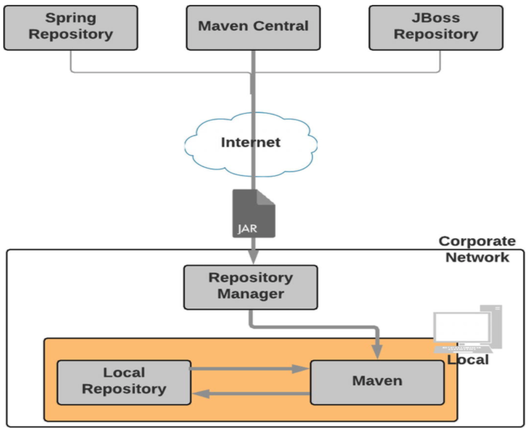
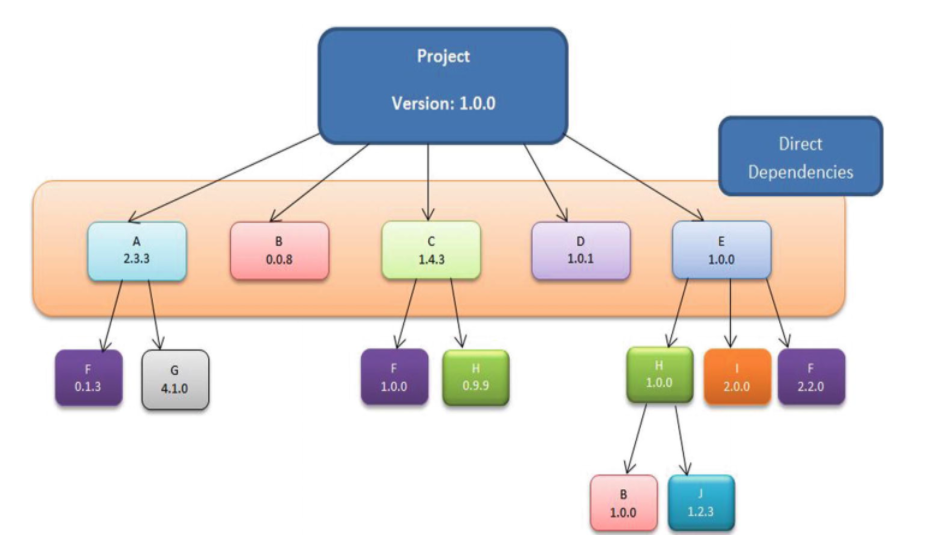

# Chapter 3: Maven Dependency Management

* Using New Repositories
* Dependency Identification
* Transitive Dependencies
* Dependency Scope
* Manual Dependency Installation
* Summary

Los proyectos de nivel empresarial generalmente dependen de una variedad de libraries de código abierto. Considere el escenario en el que desea utilizar `Log4J` para el logging(registro) de su aplicación. Para lograr esto, debe ir a la página de descarga de `Log4J`, descargar el archivo JAR y colocarlo en la carpeta `lib` de su proyecto o agregarlo a la ruta de clases del proyecto. Hay un par de problemas con este enfoque:

1. El archivo `JAR` que descargó puede depender de algunas otras bibliotecas. Ahora tendría que buscar todas esas dependencias (y sus dependencias) y agregarlas a su proyecto.
 
2. Cuando llegue el momento de actualizar el archivo `JAR`, debe comenzar el proceso de nuevo.
 
3. Debe agregar archivos `JAR` al control de fuente junto con su código fuente para que sus proyectos se puedan construir en una computadora que no sea la suya. Esto aumenta el tamaño del proyecto, el pago y el tiempo de construcción.
 
4. Compartir archivos `JAR` entre equipos dentro de su organización se vuelve difícil.
 
Para abordar estos problemas, Maven proporciona administración de dependencias declarativas. Con este enfoque, declaras las dependencias de tu proyecto en un archivo externo llamado `pom.xml`. Maven descargará automáticamente esas dependencias y las entregará a su proyecto con el propósito de construir, probar o empaquetar.

La Figura 3-1 muestra una vista de alto nivel de la gestión de dependencias de Maven. Cuando ejecuta su proyecto Maven por primera vez, Maven se conecta a la red y descarga artefactos y metadatos relacionados desde repositorios remotos. El repositorio remoto predeterminado se llama *Maven Central* y se encuentra en `repo.maven.apache.org` y `uk.maven.org`. Maven coloca una copia de estos artefactos descargados en su repositorio local. En ejecuciones posteriores, Maven buscará un artefacto en su repositorio local; y al no encontrar el artefacto, Maven intentará descargarlo desde un repositorio remoto.

