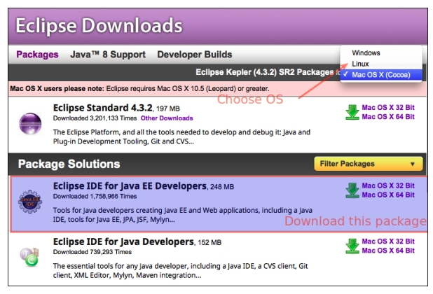
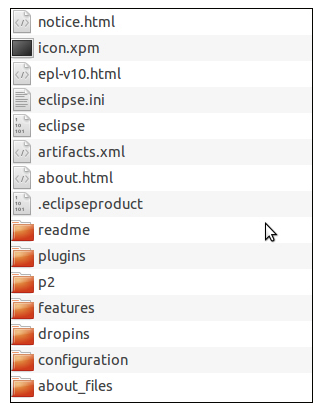
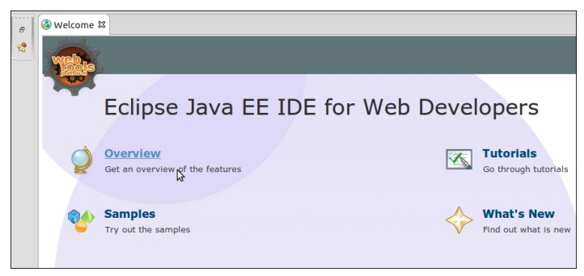
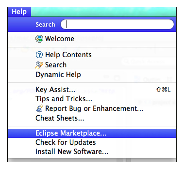
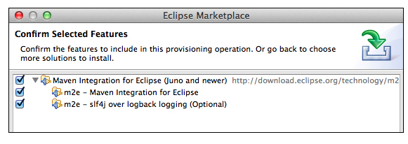
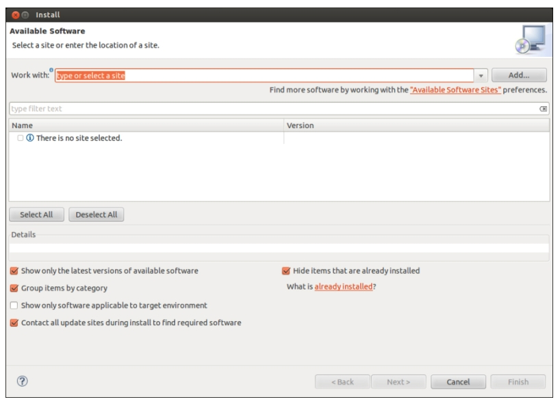
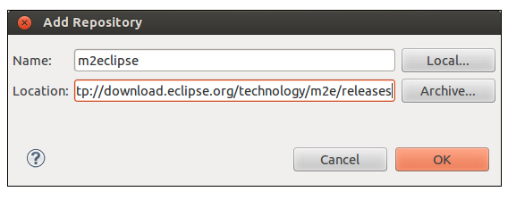

# 2. Installing m2eclipse

* Introduction to m2eclipse
* Downloading Eclipse
* Installing and launching Eclipse
   * Methods to install m2eclipse
      * Using Eclipse Marketplace
      * Using Update Site
* Setting up Maven for use
* Summary

Iniciamos nuestro viaje dando el primer paso en el capítulo anterior; aquí daremos un paso más. En este capítulo, comenzaremos con la instalación de un IDE, es decir, Eclipse, y luego entraremos en los detalles de la instalación de la integración de Maven en el complemento Eclipse, es decir, **m2eclipse**. Los temas cubiertos en este capítulo son:

* Introducción a m2eclipse
* Descargando Eclipse
* Instalación y ejecución de Eclipse
* Métodos para instalar m2eclipse
* Configuración de Maven para su uso

## Introducción a m2eclipse

m2eclipse es un complemento que proporciona integración de Maven con Eclipse. Tiene la intención de cerrar la brecha entre Eclipse y Maven, ayudar a crear proyectos usando interfaces simples e intuitivas de Maven Archetypes, y lanzar y administrar la construcción de proyectos usando un editor simple. Hace que el uso de Maven directamente desde el IDE sea mucho más fácil. Algunas de las características proporcionadas por m2eclipse son las siguientes:

* Crear e importar proyectos de Maven
* Lanzamiento de la compilación de Maven desde Eclipse
* Gestión de dependencias para la ruta de compilación de Eclipse
* Descargas y actualizaciones automáticas de dependencias
* Materializando un proyecto
* Navegar y buscar repositorios Maven remotos
* Proporcionar soporte para proyectos Maven de varios módulos

Además de las características anteriores, junto con diferentes conectores m2e y el complemento Mylyn, proporciona la capacidad de comunicarse con repositorios de versiones de código e interfaces basadas en tareas.

m2eclipse existe desde 2006 y se le atribuye a Eugene Kuleshov. Fue desarrollado bajo la comunidad de Codehaus durante 2 años antes de ser trasladado a la Fundación Eclipse en 2008.

## Descargando Eclipse

Si tiene Eclipse instalado, puede omitir esta sección y la siguiente y pasar de inmediato a la sección Instalación de m2eclipse.

Para descargar Eclipse, visite la siguiente URL:

https://www.eclipse.org/downloads/

Se puede visualizar la siguiente captura de pantalla. En el momento de escribir este libro, la última versión de Eclipse es Eclipse Kepler 4.3.2 SR2, y la descargaremos y usaremos durante el resto del libro.

Elija un sistema operativo apropiado del menú desplegable y descargue el paquete **Eclipse IDE for Java Developers** para la arquitectura correspondiente, es decir, 32 o 64 bits (que se muestra en la siguiente captura de pantalla). Elija **32 bits** para Java de 32 bits o 64 bits para Java de **64 bits** instalado en el sistema.

En el siguiente paso, elija el mirror apropiado cerca de su ubicación y comenzará la descarga. La pantalla de mirror puede verse como la siguiente captura de pantalla:

## Installing and launching Eclipse

Vaya a la ubicación del archivo descargado, como se muestra en la captura de pantalla anterior, y extráigalo en la ubicación deseada de su elección. La extracción dará como resultado una carpeta llamada [eclipse](). El contenido de la carpeta [eclipse]() se muestra en la siguiente captura de pantalla:

Podemos ver que hay una aplicación o archivo ejecutable llamado [eclipse](), que al hacer doble clic, lanza el IDE de Eclipse. Cuando se inicie Eclipse, le pedirá la ubicación del espacio de trabajo. Proporcione una ubicación adecuada donde se almacenarán los proyectos y haga clic en **OK**. Ahora, estamos en el espacio de Eclipse y listos para la acción. Verá algo similar a la siguiente captura de pantalla:

### Métodos para instalar m2eclipse

Instalar m2eclipse es bastante sencillo. Principalmente, hay dos formas de instalar el complemento m2eclipse en Eclipse:

* **Uso de Eclipse Marketplace**: use Eclipse Marketplace para buscar e instalar el plugin

* **Usando el sitio de actualización**: agregue el sitio de actualización de m2eclipse e instálelo

#### USO DE ECLIPSE MARKETPLACE

La instalación de m2eclipse utilizando Eclipse Marketplace implica los siguientes pasos:

1. Vaya a **Help | Eclipse Marketplace** como se muestra en la siguiente captura de pantalla:

   

2. Luego, busque [m2eclipse]() en el cuadro de búsqueda y haga clic en el botón **Install** para la integración de Maven para el paquete Eclipse, como se muestra en la siguiente captura de pantalla:

   
   
3. En la siguiente ventana, confirme el paquete que se instalará de la siguiente manera:   

   

4. Acepte los términos y condiciones y haga clic en **Finish**. Una vez finalizada la instalación, aparece el siguiente mensaje:

   

5. Haga clic en **Yes** para reiniciar Eclipse y que se reflejen los cambios.
6. Para los usuarios de Mac, elija la opción **Restart Now**, y para otros sistemas operativos, elija **Yes**.

#### USING UPDATE SITE

La instalación de m2eclipse usando el sitio de actualización implica los siguientes pasos:

1. Vaya a **Help | Install New Software** y su pantalla se verá similar a la siguiente captura de pantalla:

   
   
2. Haga clic en el botón **Add...** Agregue el sitio http://download.eclipse.org/technology/m2e/releases como sitio de actualización de m2eclipse, como se muestra en la siguiente captura de pantalla y haga clic en **OK**:

   
   
3. Elija los paquetes como se muestra en la siguiente captura de pantalla:   
   
   

4. Haga clic en **Next**, acepte los términos y finalmente haga clic en **Finish** para comenzar a instalar. Una vez finalizada la instalación, aparece el siguiente mensaje:

   

5. Haga clic en **Yes** para reiniciar Eclipse y que se reflejen los cambios. Para los usuarios de Mac, elija la opción **Restart Now** y para los usuarios con otros sistemas operativos, elija **Yes**.

> **NOTA**
>
> Eclipse Kepler 4.3.2 SR2 tiene m2eclipse instalado y, por lo tanto, el paso anterior de instalación actualizaría el complemento al último. Independientemente de cualquiera de los métodos de instalación anteriores, m2eclipse que viene empaquetado con Eclipse Kepler aún se actualizará.

Entonces, a mitad de camino, verá algo similar a la siguiente pantalla:

   

6. Haga clic en **Next** y acepte los términos, haga clic en **Finish** para iniciar la instalación y tendrá que reiniciar para que se reflejen los cambios.

## Configuración de Maven para su uso

m2eclipse viene con un componente Maven incrustado, por lo que la instalación externa de Maven descrita en el Capítulo 1, Apache Maven - Introducción e instalación, es opcional. Sin embargo, para usar la última versión de Maven, debemos instalar Maven externamente, como se discutió en el capítulo anterior. También debemos asegurarnos de que nuestro complemento m2eclipse lo use. Además, el uso de servidores de integración continua hoy en día requiere que tengamos una versión común de Maven en todos los servidores, haciendo uso de Maven instalado externamente.

Para hacer que m2eclipse use la versión externa de Maven, vaya a **Window | Preference** en Eclipse y aparece la ventana **Preference**. Busque [maven]() en el cuadro de búsqueda en el panel izquierdo y haga clic en **Installations** como se muestra en la siguiente captura de pantalla:

Haga clic en el botón **Add...** y seleccione la ubicación del directorio de Maven. Desde el capítulo anterior, nuestra ubicación era `/opt/maven3/apache-maven-3.2.1`. Marque la casilla de verificación externa de Maven correspondiente, como se muestra en la siguiente captura de pantalla, y haga clic en **Apply** seguido de **OK**:

Ahora, m2eclipse hará uso de este Maven.

## Resumen

Al final de este capítulo, habrá aprendido a instalar Eclipse y m2eclipse, así como a configurar m2eclipse para usar Maven instalado externamente. En el próximo capítulo, veremos los conceptos importantes de Maven y aprenderá a crear e importar proyectos de Maven y se familiarizará con la estructura de los proyectos de Maven.
