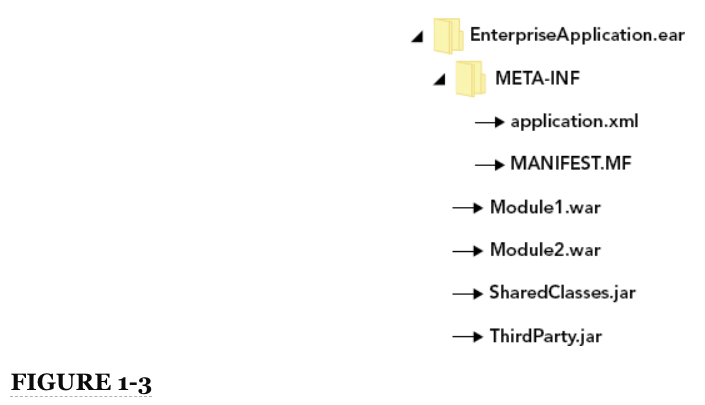

# Capítulo 1 Presentación de Java Platform, Enterprise Edition

EN ESTE CAPÍTULO

* Cronología de la versión de Java SE y Java EE
* Presentación de Servlets, Filtros, Listeners y JSP
* Comprensión de los archivos WAR y EAR y la jerarquía del cargador de clases

## CRONOLOGÍA DE LAS PLATAFORMAS DE JAVA

El lenguaje Java y sus plataformas han tenido una larga historia. Desde su invención a mediados de la década de 1990 hasta una sequía evolutiva desde 2007 hasta casi 2012, Java ha pasado por muchos cambios y ha encontrado su parte de controversia. En los primeros días, Java, conocido como Java Development Kit o JDK, era un lenguaje estrechamente acoplado a una plataforma compuesta por un pequeño conjunto de interfaces de programación de aplicaciones (API) esenciales. Sun Microsystems dio a conocer las primeras versiones alfa y beta en 1995, y aunque Java era extremadamente lento y primitivo para los estándares actuales, inició una revolución en el desarrollo de software.

### AL PRINCIPIO

La historia de Java se resume en la Figura 1-1, una línea de tiempo de las plataformas Java. En el momento de la publicación de este libro, el lenguaje Java y la plataforma Java SE siempre han evolucionado juntos: las nuevas versiones de cada uno siempre se lanzan al mismo tiempo y están estrechamente acopladas entre sí. La plataforma se llamó JDK hasta la versión 1.1 en 1997, pero en la versión 1.2 estaba claro que el JDK y la plataforma no eran sinónimos. A partir de la versión 1.2 a finales de 1998, la pila de tecnología Java se dividió en los siguientes componentes clave:

