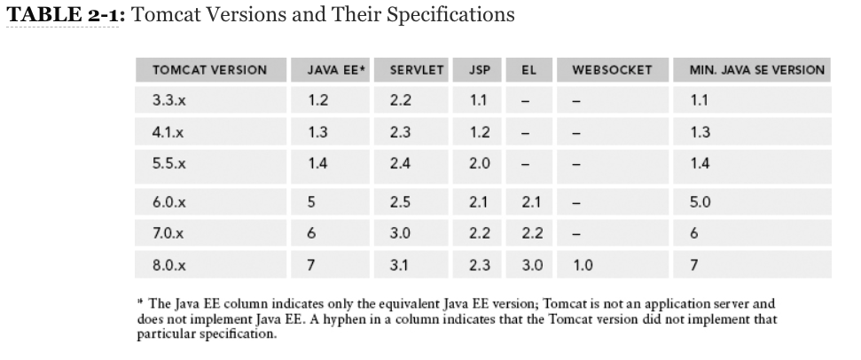
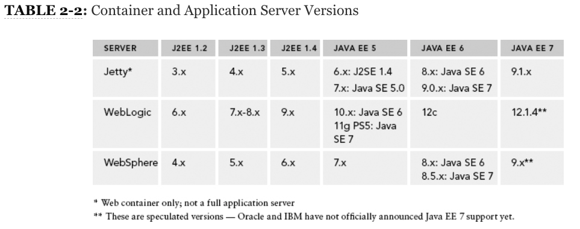
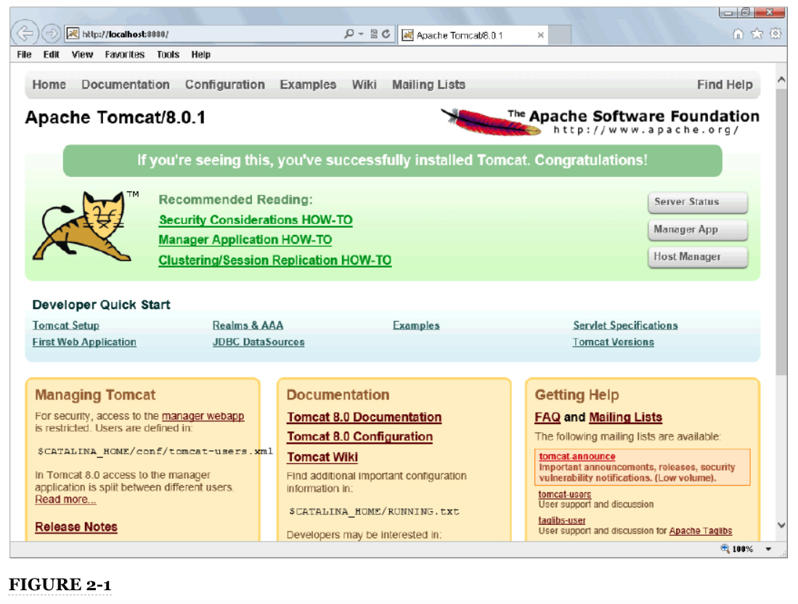
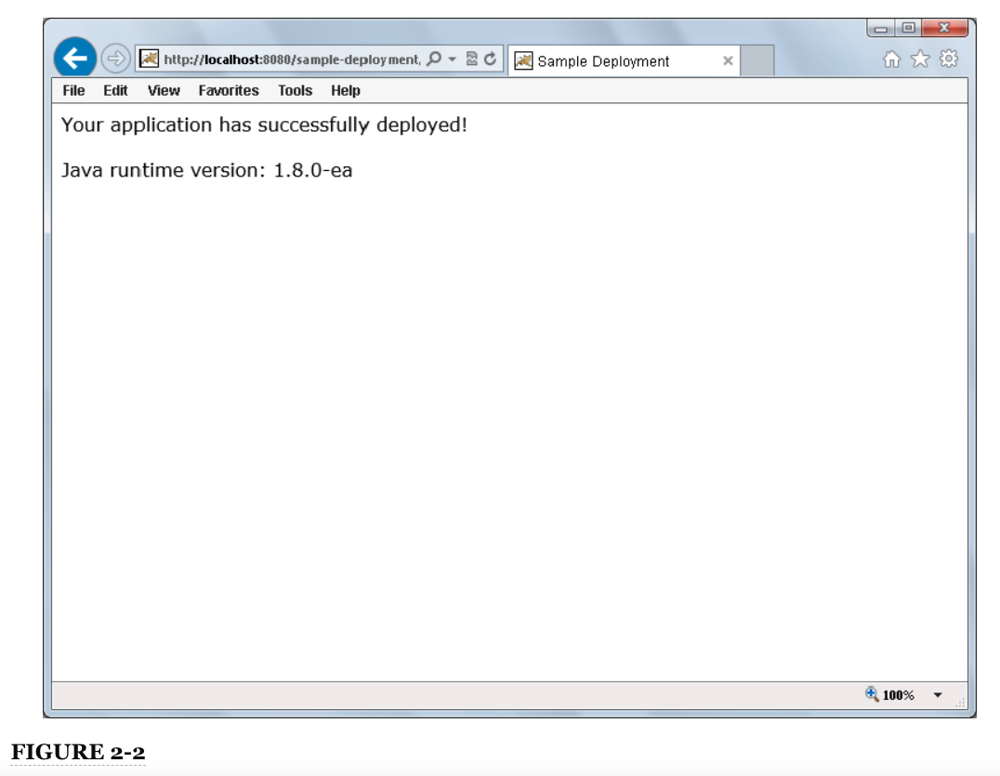
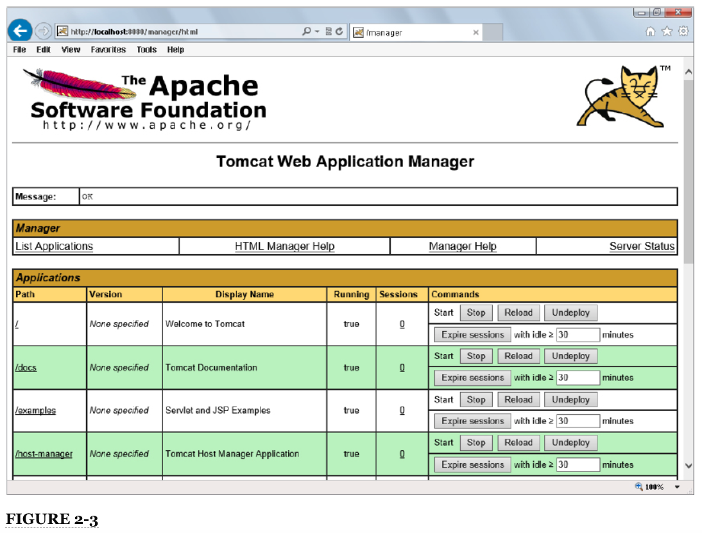
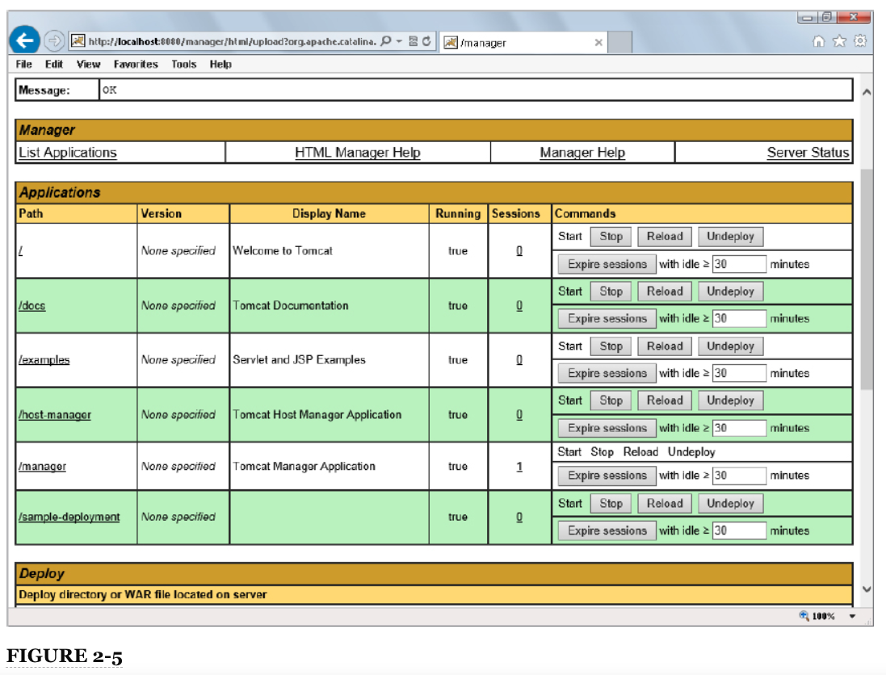
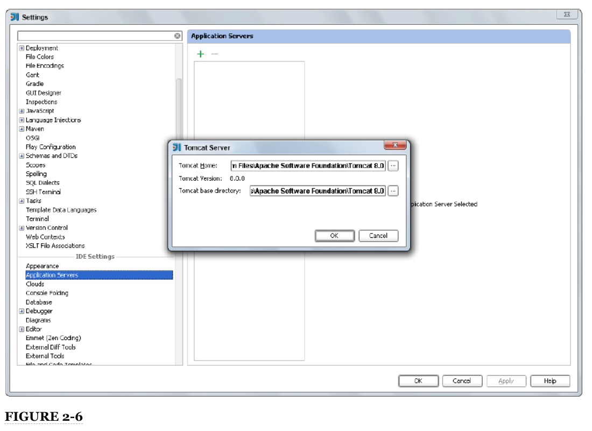
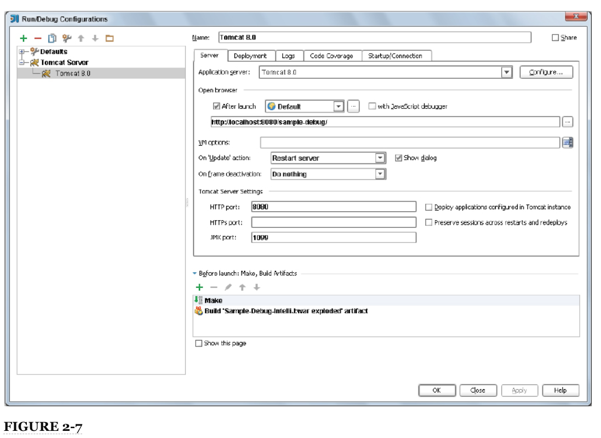
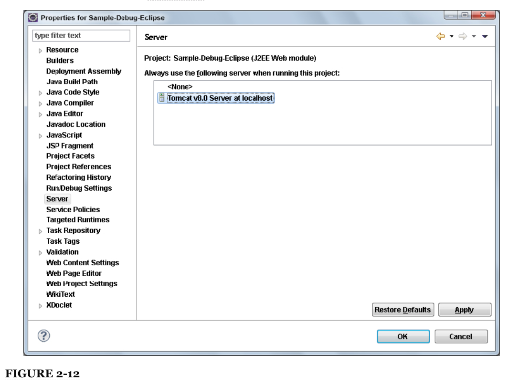

# Capítulo 2: Uso de Web Containers

* Elección de un Web Containers
* Instalación de Tomcat en su máquina
* Deploying y Undeploying Aplicaciones en Tomcat
* Debugging Tomcat desde su IDE
* Resumen 

#### EN ESTE CAPÍTULO

* Elegir un contenedor web
* Instalación de Tomcat en su máquina
* Implementar y anular la implementación de aplicaciones en Tomcat
* Depurando Tomcat desde IntelliJ IDEA
* Depurando Tomcat desde Eclipse

#### DESCARGAS PARA ESTE CAPÍTULO

El código de este capítulo se divide en los siguientes ejemplos principales:

* Sample-deployment WAR Application File
* Sample-Debug-IntelliJ Project
* Sample-Debug-Eclipse Project

#### DEPENDENCIAS DE NEW MAVEN PARA ESTE CAPÍTULO

No hay dependencias de Maven para este capítulo.

## ELEGIR UN WEB CONTAINER

En el capítulo anterior, se le presentó Java Platform, Enterprise Edition y los conceptos de Servlets, filters y otros componentes Java EE. También aprendió sobre algunas de las nuevas características de Java 7 y 8. Las aplicaciones web Java EE se ejecutan dentro de los servidores de aplicaciones y contenedores web Java EE (también conocidos como contenedores Servlet, y este libro usa los términos indistintamente).

Aunque la especificación Java EE está llena de muchas subespecificaciones más pequeñas, la mayoría de los contenedores web implementan solo las especificaciones de Servlet, JSP y JSTL. Esto es diferente de los servidores de aplicaciones Java EE en toda regla, que implementan toda la especificación Java EE. Cada servidor de aplicaciones contiene un contenedor web, que es responsable de administrar el ciclo de vida de los Servlets, asignar las URL de solicitud al código de Servlet, aceptar y responder a las solicitudes HTTP y administrar la cadena de filtros, cuando corresponda. Sin embargo, los contenedores web independientes suelen ser más livianos y más fáciles de usar cuando no necesita todo el conjunto de funciones de Java EE.

Elegir un contenedor web (o un servidor de aplicaciones, para el caso) es una tarea que requiere una cuidadosa investigación y consideración de los requisitos de su proyecto. Tiene muchas opciones para elegir un contenedor web, y cada una tiene sus ventajas y desafíos. Puede utilizar una variedad de contenedores web. Por ejemplo, puede decidir usar Apache Tomcat para pruebas locales en las máquinas de sus desarrolladores mientras usa GlassFish para su entorno de producción. O puede escribir una aplicación que sus clientes implementen en sus propios servidores, en cuyo caso probablemente desee probar en muchos servidores de aplicaciones y contenedores web diferentes.

En esta sección, aprenderá sobre algunos contenedores web y servidores de aplicaciones comunes, y en las secciones restantes, verá más de cerca el que usa para el resto de este libro.

### APACHE TOMCAT

Apache Tomcat es el contenedor web más común y popular disponible en la actualidad. Los ingenieros de software de Sun Microsystems crearon originalmente este contenedor web como Sun Java Web Server, y era la implementación de referencia original de la especificación Java EE Servlet. Más tarde, Sun lo donó a la Apache Software Foundation en 1999, y en ese momento se convirtió en Jakarta Tomcat y, finalmente, en Apache Tomcat. También es interesante notar que la evolución de Apache de Tomcat llevó al desarrollo de la herramienta de compilación Apache Ant, que miles de proyectos comerciales y de código abierto utilizan en la actualidad.

Las principales ventajas de Tomcat son su tamaño reducido, su configuración simple y su larga trayectoria de participación comunitaria. Por lo general, los desarrolladores pueden estar listos y en ejecución con una instalación funcional de Tomcat en 5 a 10 minutos, incluido el tiempo de descarga. Tomcat requiere muy poca configuración lista para funcionar para funcionar bien en una máquina de desarrollo, pero también se puede ajustar significativamente para que funcione bien en entornos de producción de alta carga y alta disponibilidad. Puede crear grandes clústeres de Tomcat para manejar grandes volúmenes de tráfico de manera confiable. Tomcat se utiliza a menudo en entornos de producción comercial debido a su simplicidad y perfil ligero. Sin embargo, Tomcat carece de la sofisticada interfaz de administración web que ofrecen muchos de sus competidores para configurar el servidor. En cambio, Tomcat proporciona solo una interfaz simple para tareas básicas, como implementar y cancelar la implementación de aplicaciones. Para una mayor configuración, los administradores deben manipular una colección de archivos de propiedades XML y Java. Además, debido a que no es un servidor de aplicaciones completo, carece de muchos componentes Java EE, como la Java Persistence API, el Bean Validation API, y el Java Message Service.

Como puede imaginar, esto hace que Tomcat sea ideal para muchas tareas, pero hace que la implementación de aplicaciones empresariales más complejas sea un desafío y, a veces, imposible. Si le gusta Tomcat pero necesita un servidor de aplicaciones Java EE completo, puede recurrir a **Apache TomEE**, que se basa en Tomcat pero ofrece una implementación completa de todos los componentes de Java EE. Al estar construido sobre Tomcat, tiene toda la fuerza de la comunidad Tomcat y más de una década de pruebas detrás de ella. Apache también ofrece **Geronimo**, otro servidor de aplicaciones Java EE completo de código abierto.

**NOTA** ***TomEE** y **Geronimo** son servidores de aplicaciones Java EE certificados por Oracle, lo que significa que se ha verificado que cumplen con todos los aspectos de la especificación Java EE. Como Tomcat es solo un contenedor web, no tiene dicha certificación. Sin embargo, su enorme base de usuarios y su comunidad activa garantizan que implemente con precisión los componentes Java EE que proporciona*.

Tomcat proporciona implementaciones de las especificaciones de Servlet, Java Server Pages (JSP), Java Unified Expression Language (EL) y WebSocket. La Tabla 2-1 enumera varias versiones de Tomcat y las especificaciones que implementan. Solo se admiten Tomcat 6, 7 y 8. Las versiones 3.3, 4.1 y 5.5 llegaron al final de su vida útil hace años. Puede leer más sobre Apache Tomcat en el [sitio web de Tomcat](http://tomcat.apache.org/).

TABLA 2-1: Versiones de Tomcat y sus especificaciones

## Instalación de Tomcat en su máquina
## Deploying y Undeploying Aplicaciones en Tomcat
## Debugging Tomcat desde su IDE
## Resumen 
