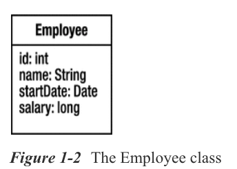

# 01. Introduction

* Relational Databases
* Object-Relational Mapping
   * The Impedance Mismatch
* Java Support for Persistence
   * Proprietary Solutions
   * JDBC
   * Enterprise JavaBeans
   * Java Data Objects
* Why Another Standard?
* The Java Persistence API
   * History of the Specification
   * Overview
* Summary

### MATERIAL SUPLEMENTARIO ELECTRÓNICO

La versión en línea de este capítulo (https://doi.org/10.1007/978-1-4842-3420-4_1) contiene material complementario, que está disponible para usuarios autorizados.

Las aplicaciones empresariales se definen por su necesidad de recopilar, procesar, transformar e informar sobre grandes cantidades de información. Y, por supuesto, esa información debe guardarse en algún lugar. El almacenamiento y la recuperación de datos es un negocio de miles de millones de dólares, evidenciado en parte por el crecimiento del mercado de bases de datos, así como por el surgimiento de servicios de almacenamiento basados en la nube. A pesar de todas las tecnologías disponibles para la gestión de datos, los diseñadores de aplicaciones todavía dedican gran parte de su tiempo a tratar de trasladar sus datos hacia y desde el almacenamiento de manera eficiente.

A pesar del éxito que ha tenido la plataforma Java al trabajar con sistemas de bases de datos, durante mucho tiempo sufrió el mismo problema que ha afectado a otros lenguajes de programación orientados a objetos. Mover datos entre un sistema de base de datos y el modelo de objetos de una aplicación Java fue mucho más difícil de lo necesario. Los desarrolladores de Java escribieron mucho código para convertir datos de filas y columnas en objetos, o se vieron atados a marcos patentados que intentaron ocultarles la base de datos. Afortunadamente, se introdujo en la plataforma una solución estándar, la API de persistencia de Java (JPA) para cerrar la brecha entre los modelos de dominio orientados a objetos y los sistemas de bases de datos relacionales.

Este libro presenta la versión 2.2 de la API de persistencia de Java como parte de Java EE 8 y explora todo lo que tiene para ofrecer a los desarrolladores.

La versión de mantenimiento de JPA 2.2 comenzó durante 2017 bajo JSR 338 y finalmente fue aprobada el 19 de junio de 2017.

Aquí está la declaración de lanzamiento oficial de Java Persistence 2.2 Maintenance:

“La especificación Java Persistence 2.2 mejora la API de persistencia de Java con soporte para anotaciones repetidas; inyección en convertidores de atributos; soporte para el mapeo de los tipos java.time.LocalDate, java.time.LocalTime, java.time.LocalDateTime, java.time.OffsetTime y java.time.OffsetDateTime; y métodos para recuperar los resultados de Query y TypedQuery como transmisiones ".

Uno de sus puntos fuertes es que se puede colocar en cualquier capa, nivel o marco en el que necesite una aplicación. Ya sea que esté creando aplicaciones cliente-servidor para recopilar datos de formularios en una aplicación Swing o creando un sitio web con la última aplicación framework, JPA puede ayudarlo a proporcionar persistencia de manera más efectiva.

Para preparar el escenario para JPA, este capítulo primero da un paso atrás para mostrar dónde hemos estado y qué problemas estamos tratando de resolver. A partir de ahí, analizaremos el historial de la especificación y le brindaremos una vista de alto nivel de lo que tiene para ofrecer.

Bases de datos relacionales
Muchas formas de conservar los datos han ido y venido a lo largo de los años, y ningún concepto tiene más poder de permanencia que la base de datos relacional. Incluso en la era de la nube, cuando "Big Data" y "NoSQL" roban regularmente los titulares, los servicios de bases de datos relacionales tienen una demanda constante para permitir que las aplicaciones empresariales actuales se ejecuten en la nube. Si bien las tiendas NoSQL de valor clave y orientadas a documentos tienen su lugar, las tiendas relacionales siguen siendo las bases de datos de uso general más populares que existen, y son donde se almacena la gran mayoría de los datos corporativos del mundo. Son el punto de partida para todas las aplicaciones empresariales y, a menudo, tienen una vida útil que continúa mucho después de que la aplicación se ha desvanecido.

Comprender los datos relacionales es clave para un desarrollo empresarial exitoso. El desarrollo de aplicaciones que funcionen bien con los sistemas de bases de datos es un obstáculo comúnmente reconocido en el desarrollo de software. Gran parte del éxito de Java se puede atribuir a su adopción generalizada para la creación de sistemas de bases de datos empresariales. Desde sitios web para consumidores hasta pasarelas automatizadas, las aplicaciones Java están en el corazón del desarrollo de aplicaciones empresariales. La figura 1-1 muestra un ejemplo de una base de datos relacional de usuario a automóvil.

