# 02: Getting Started (Comenzando)

* Entity Overview
   * Persistability
   * Identity
   * Transactionality
   * Granularity
* Entity Metadata
   * Annotations
   * XML
   * Configuration by Exception
* Creating an Entity
* Entity Manager
   * Obtaining an Entity Manager
   * Persisting an Entity
   * Finding an Entity
   * Removing an Entity
   * Updating an Entity
   * Transactions
   * Queries
* Putting It All Together
* Packaging It Up
   * Persistence Unit
   * Persistence Archive
* Summary

Uno de los principales objetivos de JPA era que fuera simple de usar y fácil de entender. Aunque el dominio de su problema no puede trivializarse ni diluirse, la tecnología que permite a los desarrolladores abordarlo puede ser sencilla e intuitiva. Este capítulo muestra lo sencillo que puede resultar desarrollar y utilizar entidades.

Comenzamos describiendo las características básicas de las entidades y revisamos los requisitos que debe seguir una clase de entidad. Definimos qué es una entidad y cómo crear, leer, actualizar y eliminar una. También presentamos a los administradores de entidades y cómo se obtienen y utilizan. Luego, echamos un vistazo rápido a las consultas y cubrimos cómo especificar y ejecutar una consulta utilizando los objetos EntityManager y Query. El capítulo concluye mostrando una aplicación de trabajo simple que se ejecuta en un entorno estándar de Java SE y demuestra todo el código de ejemplo en acción.

## Descripción General de la Entity

Una entidad no es algo nuevo en la gestión de datos. De hecho, las entidades han existido por más tiempo que muchos lenguajes de programación y ciertamente más que Java.

En general, una entidad es una representación de Java de la tabla de la base de datos que tiene características como persistencia, identidad, transaccionalidad y granularidad.

Fueron introducidos por Peter Chen en su artículo fundamental sobre el modelado entidad-relación1. Describió las entidades como cosas que tienen atributos y relaciones. La expectativa era que los atributos y las relaciones se conservarían en una base de datos relacional.

Incluso ahora, la definición es cierta. Una entidad es esencialmente un sustantivo o una agrupación de estados asociados como una sola unidad. Puede participar en relaciones con cualquier número de otras entidades de varias formas estándar. En el paradigma orientado a objetos, le agregamos comportamiento y lo llamamos objeto. En JPA, cualquier objeto definido por la aplicación puede ser una entidad, por lo que la pregunta importante podría ser esta: ¿Cuáles son las características de un objeto que se ha convertido en una entidad?

### PERSISTABILITY (PERSISTABILIDAD) 

La primera y más básica característica de las entidades es que son persistentes. Esto generalmente solo significa que se pueden hacer persistentes. Más específicamente, significa que su estado se puede representar en un almacén de datos y se puede acceder a él en un momento posterior, quizás mucho después del final del proceso que lo creó.

Podría llamarlos objetos persistentes, y mucha gente lo hace, pero no es técnicamente correcto. Estrictamente hablando, un objeto persistente se vuelve persistente en el momento en que se instancia en la memoria. Si existe un objeto persistente, entonces, por definición, ya es persistente.

Una entidad es persistente porque se puede guardar en un almacén persistente. La diferencia es que no se persiste automáticamente y que, para que tenga una representación duradera, la aplicación debe invocar activamente un método API para iniciar el proceso. Esta es una distinción importante porque deja el control sobre la persistencia firmemente en manos de la aplicación. La aplicación tiene la flexibilidad de manipular datos y realizar lógica de negocios en la entidad, haciéndola persistente solo cuando la aplicación decide que es el momento adecuado. La lección es que las entidades pueden manipularse sin que necesariamente se persistan, y es la aplicación la que decide si lo son.

### IDENTITY (IDENTIDAD)

Como cualquier otro objeto Java, una entidad tiene una identidad de objeto, pero cuando existe en la base de datos también tiene una identidad persistente. La identidad de objeto es simplemente la diferenciación entre objetos que ocupan memoria. La identidad persistente, o un identificador, es la clave que identifica de forma única una instancia de entidad y la distingue de todas las demás instancias del mismo tipo de entidad. Una entidad tiene una identidad persistente cuando existe una representación de ella en el almacén de datos; es decir, una fila en una tabla de base de datos. Si no está en la base de datos, aunque la entidad en memoria puede tener su identidad establecida en un campo, no tiene una identidad persistente. El identificador de la entidad, entonces, es equivalente a la clave principal en la tabla de la base de datos que almacena el estado de la entidad.

### TRANSACTIONALITY (TRANSACCIONALIDAD)

Las entidades pueden denominarse cuasi transaccionales. Aunque se pueden crear, actualizar y eliminar en cualquier contexto, estas operaciones normalmente se realizan dentro del contexto de una transacción2 porque se requiere una transacción para que los cambios se confirmen en la base de datos. Los cambios realizados en la base de datos tienen éxito o fallan atómicamente, por lo que la vista persistente de una entidad debería ser transaccional.

En la memoria, es una historia ligeramente diferente en el sentido de que las entidades pueden cambiar sin que los cambios persistan. Incluso cuando se inscriben en una transacción, pueden quedar en un estado indefinido o inconsistente en caso de una reversión o una falla en la transacción. Las entidades en memoria son objetos Java simples que obedecen todas las reglas y restricciones que aplica la máquina virtual Java (JVM) a otros objetos Java.

### GRANULARITY (GRANULARIDAD)

Finalmente, una buena forma de mostrar qué son las entidades es describir qué no lo son. No son primitivas, envolturas primitivas ni objetos incorporados con estado unidimensional. Estos no son más que escalares y no tienen ningún significado semántico inherente a una aplicación. Una cadena, por ejemplo, es un objeto demasiado detallado para ser una entidad porque no tiene ninguna connotación específica de dominio. Más bien, una cadena es adecuada y se usa muy a menudo como un tipo para un atributo de entidad y se le da un significado de acuerdo con el atributo de entidad que está escribiendo.

Las entidades están diseñadas para ser objetos detallados que tienen un conjunto de estados agregados que normalmente se almacenan en un solo lugar, como una fila en una tabla, y normalmente tienen relaciones con otras entidades. En el sentido más general, son objetos de dominio empresarial que tienen un significado específico para la aplicación que accede a ellos.

Si bien es cierto que las entidades pueden definirse de manera exagerada para ser tan precisas como almacenar una sola cadena o lo suficientemente generales como para contener 500 columnas de datos, las entidades JPA definitivamente estaban destinadas a estar en el extremo más pequeño de el espectro de granularidad. Idealmente, las entidades deberían diseñarse y definirse como objetos bastante ligeros de un tamaño comparable al del objeto Java medio.

## Entity Metadata

Además de su estado persistente, cada entidad JPA tiene algunos metadatos asociados (aunque sea una cantidad muy pequeña) que la describe. Estos metadatos pueden existir como parte del archivo de clase guardado o pueden almacenarse fuera de la clase, pero no se conservan en la base de datos. Permite que la capa de persistencia reconozca, interprete y administre adecuadamente la entidad desde el momento en que se carga hasta su invocación en tiempo de ejecución.

Los metadatos que realmente se requieren para cada entidad son mínimos, lo que hace que las entidades sean fáciles de definir y usar. Sin embargo, como cualquier tecnología sofisticada con su parte de interruptores, palancas y botones, también existe la posibilidad de especificar muchos, muchos más metadatos de los necesarios. Pueden ser grandes cantidades, según los requisitos de la aplicación, y pueden usarse para personalizar cada detalle de la configuración de la entidad o las asignaciones de estado.

Los metadatos de la entidad se pueden especificar de dos formas: anotaciones o XML. Cada uno es igualmente válido, pero el que utilice dependerá de sus preferencias o proceso de desarrollo.

### ANOTACIONES

Los metadatos de anotación son una característica del lenguaje introducida en Java SE 5 que permite adjuntar metadatos estructurados y mecanografiados al código fuente. Aunque JPA no requiere anotaciones, son una forma conveniente de aprender y usar la API. Debido a que las anotaciones ubican conjuntamente los metadatos con los artefactos del programa, no es necesario escapar a un archivo adicional y un lenguaje especial (XML) solo para especificar los metadatos.

Las anotaciones se utilizan en todos los ejemplos y las explicaciones adjuntas en este libro. Todas las anotaciones JPA que se muestran y describen (excepto en el Capítulo 3, que habla de las anotaciones Java EE) se definen en el paquete `javax.persistence`. Se puede suponer que los fragmentos de código de ejemplo tienen una importación implícita del formulario `import javax.persistence. * ;`.

Como dijimos en el Capítulo 1, una de las nuevas características de JPA 2.2 es hacer una anotación `@Repeatable`. Esto es en realidad un cambio de Java 8 y se rastreó en el número 115 de la especificación JPA.

Esta nueva característica de JPA 2.2 permitirá a los desarrolladores usar la misma anotación varias veces para una determinada clase o atributo sin usar una anotación de contenedor. Esta característica ayudará a que su código Java sea mucho más fácil de leer.

Prácticamente, podrá anotar cualquiera de sus clases de entidad con múltiples anotaciones `@NamedQuery` sin necesidad de envolverlas en una anotación `@NamedQueries`.

Estas son las anotaciones que se pueden repetir cuando se usa JPA 2.2:

* `AssociationOverride`

* `AttributeOverride`

* `Convert`

* `JoinColumn`

* `MapKeyJoinColumn`

* `NamedEntityGraph`

* `NamedNativeQuery`

* `NamedQuery`

* `NamedStoredProcedureQuery`

* `PersistenceContext`

* `PersistenceUnit`

* `PrimaryKeyJoinColumn`

* `SecondaryTable`

* `SqlResultSetMapping`

Tomemos uno de la lista, por ejemplo, la anotación `AssociationOverride`, que se usa para anular un mapeo para una relación de entidad.

Así es como funciona la anotación `AssociationOverride`. Observe la `@Repeatable(AssociationOverrides.class)`:

```java
@Target({TYPE, METHOD, FIELD}) @Retention(RUNTIME)
@Repeatable(AssociationOverrides.class)
public @interface AssociationOverride {
String name();
JoinColumn[] joinColumns() default {};
ForeignKey foreignKey() default @ForeignKey(PROVIDER_DEFAULT);
JoinTable joinTable() default @JoinTable;
}
```

### XML

Para aquellos que prefieren utilizar XML tradicional, esta opción todavía está disponible. Debería ser bastante sencillo cambiar al uso de descriptores XML después de haber aprendido y entendido las anotaciones, porque el XML se ha modelado principalmente a partir de las anotaciones. El Capítulo 12 describe cómo utilizar XML para especificar o anular los metadatos de asignación de entidades.

###  CONFIGURACIÓN POR EXCEPCIÓN

La noción de configuración por excepción significa que el motor de persistencia define los valores predeterminados que se aplican a la mayoría de las aplicaciones y que los usuarios necesitan proporcionar valores solo cuando quieren anular el valor predeterminado. En otras palabras, tener que proporcionar un valor de configuración es una excepción a la regla, no un requisito.

La configuración por excepción está arraigada en JPA y contribuye en gran medida a su usabilidad. La mayoría de los valores de configuración tienen valores predeterminados, lo que hace que los metadatos que deben especificarse sean más relevantes y concisos.

Sin embargo, el uso extensivo de valores predeterminados y la facilidad de uso que aporta a la configuración tienen un precio. Cuando los valores predeterminados están integrados en la API y no es necesario especificarlos, no son visibles ni obvios para los usuarios. Esto puede hacer posible que los usuarios desconozcan la complejidad del desarrollo de aplicaciones de persistencia, lo que dificulta la depuración o el cambio de comportamiento cuando es necesario.

Los valores predeterminados no están destinados a proteger a los usuarios de los problemas a menudo complejos que rodean la persistencia. Están destinados a permitir que un desarrollador comience fácil y rápidamente con algo que funcionará y luego mejorar e implementar iterativamente funcionalidades adicionales a medida que aumenta la complejidad de su aplicación. Aunque los valores predeterminados pueden ser lo que desea que ocurra la mayor parte del tiempo, sigue siendo importante que los desarrolladores estén familiarizados con los valores predeterminados que se están aplicando. Por ejemplo, si se asume un nombre de tabla predeterminado, es importante saber qué tabla espera el tiempo de ejecución, o si se usa la generación de esquema, qué tabla se generará.

Para cada una de las anotaciones, también discutimos el valor predeterminado para que quede claro qué se aplicará si no se especifica la anotación. Le recomendamos que recuerde estos valores predeterminados a medida que los aprende. Después de todo, un valor predeterminado sigue siendo parte de la configuración de la aplicación; ¡Es realmente fácil de configurar!

### Crear una Entidad

Las clases regulares de Java se transforman fácilmente en entidades simplemente anotándolas. De hecho, al agregar un par de anotaciones, casi cualquier clase con un constructor sin argumentos puede convertirse en una entidad.

El artefacto de programación principal de una entidad es la clase de entidad.

Estos son los requisitos que debe seguir una clase de entidad:

* Debe estar anotado con la anotación `javax.persistence.Entity`

* Debe tener un constructor sin argumentos público o protegido (puede tener otros constructores)

* No debe declararse `final` (por lo tanto, ningún método o variable de instancia persistente puede declararse `final`)

* Debe implementar la interfaz `Serializable` (en caso de que la instancia de la entidad se pase por valor como un objeto separado a través de la interfaz comercial remota de un bean de sesión)

* Puede extender las clases de entidad y no entidad, y las clases de no entidad pueden extender las clases de entidad

* Las variables de instancia persistentes deben declararse privadas, protegidas o de paquete privado (solo se puede acceder a ellas directamente mediante los métodos de clase de entidad)

Comencemos por crear una clase Java normal para un empleado. El listado 2-1 muestra una clase simple de `Employee`.

***Listado 2-1*** Clase `Employee`

```java
public class Employee {
   
   private int id;
   private String name;
   private long salary;
   
   public Employee() {}
   public Employee(int id) { this.id = id; }
    
   public int getId() { return id; }
   public void setId(int id) { this.id = id; }
   public String getName() { return name; }
   public void setName(String name) { this.name = name; }
   public long getSalary() { return salary; }
   public void setSalary (long salary) { this.salary = salary; }
}
```

Puede notar que esta clase se asemeja a una clase de estilo JavaBean con tres propiedades: `id`, `name` y `salary`. Cada una de estas propiedades está representada por un par de métodos de acceso para obtener y establecer la propiedad y está respaldada por un campo miembro. Las propiedades o los campos de miembros son las unidades de estado dentro de la entidad que se pueden conservar.

Para convertir a `Employee` en una entidad, primero anotamos la clase con `@Entity`. Esto es principalmente una anotación de marcador para indicar al motor de persistencia que la clase es una entidad.

La segunda anotación que debemos agregar es `@Id`. Esto anota el campo o propiedad en particular que contiene la identidad persistente de la entidad (la clave principal (primary key)) y es necesario para que el proveedor sepa qué campo o propiedad utilizar como clave de identificación única en la tabla.

Al agregar estas dos anotaciones a la clase `Employee`, terminamos con prácticamente la misma clase que teníamos antes, excepto que ahora es una entidad. El Listado 2-2 muestra la clase de entidad.

***Listado 2-2*** Entidad `Employee`

```java
@Entity
public class Employee {
   
   @Id private int id;
   private String name;
   private long salary;
   
   public Employee() {}
   public Employee(int id) { this.id = id; }
    
   public int getId() { return id; }
   public void setId(int id) { this.id = id; }
   public String getName() { return name; }
   public void setName(String name) { this.name = name; }
   public long getSalary() { return salary; }
   public void setSalary (long salary) { this.salary = salary; }
}
```

Cuando decimos que la anotación `@Id` se coloca en el campo o propiedad, queremos decir que el usuario puede elegir anotar el campo declarado o el método `getter` de una propiedad de estilo JavaBean. Se permite tanto la estrategia de campo como de propiedad, dependiendo de las necesidades y gustos de la entidad promotora. Hemos elegido en este ejemplo anotar el campo porque es más simple; en general, este será el enfoque más sencillo y directo. Discutimos los detalles de anotar el estado persistente usando el acceso a campos o propiedades en los capítulos siguientes.

Los campos de la entidad se vuelven persistentes automáticamente en virtud de su existencia en la entidad. Los valores de configuración de carga y asignación predeterminados se aplican a estos campos y permiten que se conserven cuando el objeto persiste. Dadas las preguntas que se plantearon en el último capítulo, uno podría llegar a preguntar: "¿Cómo se mapearon los campos y dónde persistieron?"

Para encontrar la respuesta, primero debemos tomar un desvío rápido para indagar dentro de la anotación `@Entity` y mirar un elemento llamado `name` que identifica de manera única a la entidad. El nombre de la entidad se puede especificar explícitamente para cualquier entidad mediante el uso de este elemento `name` en la anotación, como en `@Entity(name="Emp")`. En la práctica, esto rara vez se especifica porque se establece de forma predeterminada como el nombre no calificado de la clase de entidad. Esto casi siempre es razonable y adecuado.

Ahora podemos volver a la pregunta sobre dónde se almacenan los datos. Resulta que el nombre predeterminado de la tabla que se usa para almacenar cualquier entidad dada de un tipo de entidad en particular es el nombre de la entidad. Si hemos especificado el nombre de la entidad, será el nombre de la tabla por defecto; de lo contrario, se utilizará el valor predeterminado del nombre de la entidad. Acabamos de afirmar que el nombre de entidad predeterminado era el nombre no calificado de la clase de entidad, por lo que esa es efectivamente la respuesta a la pregunta de qué tabla se usa. En el ejemplo de Empleado, el nombre de la entidad se tomará por defecto como "Empleado" y todas las entidades del tipo `Employee` se almacenarán en una tabla llamada `EMPLOYEE`.

Cada uno de los campos o propiedades tiene un estado individual y debe dirigirse a una columna particular de la tabla. Sabemos que debemos ir a la tabla `EMPLOYEE`, pero ¿qué columna debería usarse para un campo o propiedad determinados? Cuando no se especifican columnas explícitamente, la columna predeterminada se usa para un campo o propiedad, que es solo el nombre del campo o propiedad en sí. Entonces, la identificación del empleado se almacenará en la columna `ID`, el nombre en la columna `NAME` y el salario en la columna `SALARY` de la tabla `EMPLOYEE`.

Por supuesto, todos estos valores se pueden anular para que coincidan con un esquema existente. Analizaremos cómo anularlos cuando lleguemos al Capítulo 4 y analicemos el mapeo con más detalle.

### Entity Manager

En la sección "Descripción general de la entidad", se indicó que se debe invocar una llamada API específica antes de que una entidad se mantenga en la base de datos. De hecho, se necesitan llamadas de API independientes para realizar muchas de las operaciones en las entidades. Esta API es implementada por el Entity Manager(administrador de entidades) y encapsulada casi por completo dentro de una única interfaz llamada `javax.persistence.EntityManager`. Cuando todo está dicho y hecho, es a un Entity Manager a quien se delega el verdadero trabajo de persistencia. Hasta que se utilice un Entity Manager para crear, leer o escribir una entidad, la entidad no es más que un objeto Java normal (no persistente).

Cuando un Entity Manager obtiene una referencia a una entidad, ya sea pasándola explícitamente como un argumento a una llamada a un método o porque se leyó de la base de datos, se dice que ese objeto es administrado por el Entity Manager. El conjunto de instancias de entidad gestionada dentro de un Entity Manager en un momento dado se denomina ***contexto de persistencia***. **Solo puede existir una instancia de Java con la misma identidad persistente en un contexto de persistencia en cualquier momento**. Por ejemplo, si un `Employee` con una identidad persistente (o ID) de 158 existe en el contexto de persistencia, entonces ningún otro objeto `Employee` con su ID establecido en 158 puede existir dentro de ese mismo contexto de persistencia.

Los Entity Manager están configurados para poder persistir o administrar tipos específicos de objetos, leer y escribir en una base de datos determinada y ser implementados por un proveedor de persistencia en particular (o proveedor para abreviar). Es el proveedor que proporciona el motor de implementación de respaldo para toda la API de persistencia de Java, desde el `EntityManager` hasta la implementación de las clases de consulta y la generación de SQL.

Todos los Entity Manager provienen de factories de tipo `javax.persistence.EntityManagerFactory`. La configuración de un `javax.persistence.EntityManagerFactory` se basa en la plantilla de la fábrica del `javax.persistence.EntityManagerFactory` que lo creó, pero se define por separado como una unidad de persistencia. **Una unidad de persistencia dicta implícita o explícitamente la configuración y las clases de entidad utilizadas por todos los javax.persistence.EntityManagerFactory obtenidas de la instancia única de `EntityManagerFactory` vinculada a esa unidad de persistencia**. Por tanto, existe una correspondencia uno a uno entre una unidad de persistencia y su instancia concreta de `EntityManagerFactory`.

Las unidades de persistencia se nombran para permitir la diferenciación de una fábrica de Entity Manager de otra. Esto le da a la aplicación control sobre qué configuración o unidad de persistencia se utilizará para operar en una entidad en particular.

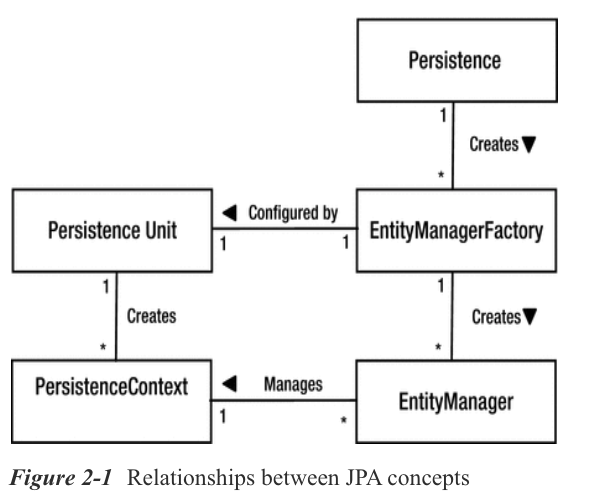

La figura 2-1 muestra que para cada unidad de persistencia hay una Entity Manager de entidades y que se pueden crear muchos Entity Manager a partir de una sola fábrica de Entity Manager. La parte que puede resultar sorprendente es que muchos Entity Manager pueden señalar el mismo contexto de persistencia. Hemos hablado solo de un Entity Manager y su contexto de persistencia, pero más adelante verá que, de hecho, puede haber múltiples referencias a diferentes Entity Manager, todas apuntando al mismo grupo de entidades administradas. Esto permitirá que el flujo de control atraviese los componentes del contenedor pero continúe accediendo al mismo contexto de persistencia.

La Tabla 2-1 resume los conceptos y objetos de API mencionados o discutidos anteriormente. Tenga en cuenta que, si bien algunos son objetos API reales, otros son solo conceptos abstractos que ayudan a explicar cómo funciona la API.

***Tabla 2-1*** Resumen de conceptos y objetos de API

Objeto | Objeto API | Descripción
-------|------------|--------------
Persistence            | `Persistence` | Clase de Bootstrap utilizada para obtener una entity manager factory
Entity Manager Factory | `EntityManagerFactory` | Objeto factory configurado utilizado para obtener entity manager
Persistence Unit       | --                   | Configuración con nombre que declara las clases de entidad y la información del almacén de datos
Entity Manager         | `EntityManager`      | Objeto API principal utilizado para realizar operaciones y consultas en entidades
Persistence Context    | --                   | Conjunto de todas las instancias de entidad administradas por un entity manager específico

### OBTENER UN ENTITY MANAGER

Un Entity Manager siempre se obtiene de `EntityManagerFactory`. La fábrica de la que se obtuvo determina los parámetros de configuración que rigen su funcionamiento. Si bien hay atajos que ocultan la fábrica de la vista del usuario cuando se ejecuta en un entorno de servidor de aplicaciones Java EE, en el entorno Java SE podemos usar una clase de arranque simple llamada `Persistence`. El método estático `createEntityManagerFactory()` de la clase `Persistence` devuelve `EntityManagerFactory` para el nombre de unidad de persistencia especificado. El siguiente ejemplo demuestra la creación de un `EntityManagerFactory` para la unidad de persistencia denominada `EmployeeService`:

```java
EntityManagerFactory emf =
    Persistence.createEntityManagerFactory("EmployeeService");
```

El nombre de la unidad de persistencia especificada `EmployeeService` pasado al método `createEntityManagerFactory()` identifica la configuración de la unidad de persistencia dada que determina cosas como los parámetros de conexión que los administradores de entidades generados a partir de esta fábrica usarán cuando se conecten a la base de datos.

Ahora que tenemos una factory(fábrica), podemos obtener fácilmente un entity manager de ella. El siguiente ejemplo demuestra la creación de un entity manager de la factory adquirida en el ejemplo anterior:

```java
EntityManager em = emf.createEntityManager();
```

Con este administrador de entidades estamos en condiciones de empezar a trabajar con entidades persistentes.

PERSISTIR UNA ENTITY

La persistencia de una entidad es la operación de tomar una entidad transitoria, o una que aún no tiene ninguna representación persistente en la base de datos, y almacenar su estado para poder recuperarla más tarde. Esta es realmente la base de la persistencia: ***crear un estado que puede sobrevivir al proceso que lo creó***. Comenzamos usando el  entity manager para conservar una instancia de `Employee`. Aquí hay un ejemplo de código que hace precisamente eso:

```java
Employee emp = new Employee(158);
em.persist(emp);
```

La primera línea en este segmento de código es simplemente crear una instancia de `Employee` que queremos que persista. Si ignoramos el triste hecho de emplear a un individuo sin nombre y no pagarle nada (estamos configurando solo el ID, no el nombre o el salario), el `Employee` instanciado es solo un objeto Java normal.

La siguiente línea usa el entity manager para conservar la entidad. **Llamar a `persist()` es todo lo que se requiere para iniciar su persistencia en la base de datos**. Si el entity manager encuentra un problema al hacer esto, lanzará una unchecked `PersistenceException`. Cuando se complete la llamada `persist()`, `emp` se habrá convertido en una entidad administrada dentro del contexto de persistencia del entity manager.

El Listado 2-3 muestra cómo incorporar esto en un método simple que crea un nuevo empleado y lo persiste en la base de datos.

***Listado 2-3*** Método que crea un nuevo empleado.

```java
public Employee createEmployee(int id, String name, long salary) {
   Employee emp = new Employee(id);
   emp.setName(name);
   emp.setSalary(salary);
   em.persist(emp);
   return emp;
}
```

Este método asume la existencia de un entity manager en el campo `em` de la instancia y lo usa para conservar el `Employee`. Tenga en cuenta que no necesitamos preocuparnos por el caso de falla en este ejemplo. Como resultado, se lanzará una `PersistenceException` en tiempo de ejecución, que se propagará hasta el llamador.

### ENCONTRAR UNA ENTITY

Una vez que una entidad está en la base de datos, lo siguiente que uno normalmente quiere hacer es encontrarla nuevamente. En esta sección, descubrirá cómo se puede encontrar una entidad utilizando el entity manager. En realidad, solo hay una línea que es importante:

```java
Employee emp = em.find(Employee.class, 158);
```

Estamos pasando la clase de la entidad que se busca (en este ejemplo, estamos buscando una instancia de `Employee`) y el ID o clave principal que identifica a la entidad en particular (en este caso queremos encontrar la entidad que acaba de crear). Esta es toda la información que necesita el administrador de la entidad para encontrar la instancia en la base de datos, y cuando se completa la llamada, el empleado que se devuelve será una entidad administrada, lo que significa que existirá en el contexto de persistencia actual asociado con el managed entity. Pasar la clase como parámetro también permite parametrizar el método `find` y devolver un objeto del mismo tipo que se pasó, lo que le ahorra a la persona que llama una conversión (cast) adicional.

¿Qué sucede si el objeto se ha eliminado o si proporciona una identificación incorrecta por accidente? En el caso de que no se encuentre el objeto, la llamada a `find()` simplemente devuelve `null`. Debería asegurarse de que se realice una verificación de un posible valor `null` antes de la próxima vez que se use la variable `emp`.

El código para un método que busca y devuelve el `Employee` con un ID dado ahora es trivial y se muestra en el Listado 2-4.

***Listado 2-4*** Método para buscar un empleado

```java
public Employee findEmployee(int id) {
   return em.find(Employee.class, id);
}
```

En el caso de que no exista ningún empleado para la ID que se pasa, el método devolverá `null` porque eso es lo que devolverá `find()`.

### ELIMINAR UNA ENTITY

La eliminación de una entidad de la base de datos no es tan común como podría pensar. Muchas aplicaciones nunca eliminan objetos, o si lo hacen, simplemente marcan los datos como desactualizados o ya no son válidos y luego los mantienen fuera de la vista de los clientes. No estamos hablando de ese tipo de eliminación lógica a nivel de aplicación en la que los datos ni siquiera se eliminan de la base de datos. Estamos hablando de algo que da como resultado una declaración `DELETE` que se realiza en una o más tablas.

Para eliminar una entidad, la entidad en sí debe administrarse, lo que significa que está presente en el contexto de persistencia. Esto significa que la aplicación que llama ya debería haber cargado o accedido a la entidad y ahora está emitiendo un comando para eliminarla. Normalmente, esto no es un problema dado que la mayoría de las veces la aplicación habrá provocado que se administre como parte del proceso de determinar que este era el objeto que quería eliminar.

Un ejemplo simple de remoción de un empleado es el siguiente:

```java
Employee emp = em.find(Employee.class, 158);
em.remove(emp);
```

En este ejemplo, primero buscamos la entidad usando la llamada `find()`, que devuelve una instancia administrada de `Employee`, y luego eliminamos la entidad usando la llamada `remove()` en el entity manager. Por supuesto, aprendió en la sección anterior que si no se encontró la entidad, el método `find()` devolverá un valor `null`. Obtendría una `java.lang.IllegalArgumentException` si resultara que pasó `null` en la llamada `remove()` porque olvidó incluir una verificación nula antes de llamar a `remove()`.

En el método de aplicación para eliminar a un empleado, el problema se puede solucionar verificando la existencia del empleado antes de emitir la llamada `remove()`, como se muestra en el Listado 2-5.

***Listado 2-5*** Método para eliminar un empleado

```java
public void removeEmployee(int id) {
   Employee emp = em.find(Employee.class, id);
   if (emp != null) {
      em.remove(emp);
   }
}
```

Este método asegurará que el empleado con la identificación dada, siempre que la identificación no sea nula, sea eliminado de la base de datos. Volverá con éxito si el empleado existe o no.

### ACTUALIZAR UNA ENTITY

Hay algunas formas diferentes de actualizar una entidad, pero por ahora ilustraremos el caso más simple y común. Aquí es donde tenemos una entidad administrada y queremos hacer cambios en ella. Si no tenemos una referencia a la entidad administrada, primero debemos obtener una usando `find()` y luego realizar nuestras operaciones de modificación en la entidad administrada. El siguiente código agrega $1,000 al salario del empleado con un ID de 158:

```java
Employee emp = em.find(Employee.class, 158);
emp.setSalary(emp.getSalary() + 1000);
```

Note la diferencia entre esta operación y las demás. En este caso, no estamos llamando al entity manager para modificar el objeto, sino directamente llamando al objeto en sí. Por este motivo, es importante que la entidad sea una instancia gestionada; de lo contrario, el proveedor de persistencia no tendrá medios para detectar el cambio y no se realizarán cambios en la representación persistente del empleado.

El método para aumentar el salario de un empleado determinado tomará la identificación y el monto del aumento, buscará al empleado y cambiará el salario al ajustado. El listado 2-6 demuestra este enfoque.

***Listado 2-6*** Método para actualizar un empleado.

```java
public Employee raiseEmployeeSalary(int id, long raise) {
   Employee emp = em.find(Employee.class, id);
   if (emp != null) {
      emp.setSalary(emp.getSalary() + raise);
   }
   return emp;
}
```

Si no pudimos encontrar al empleado, devolvemos un valor `null` para que la persona que llama sepa que no se pudo realizar ningún cambio. Indicamos éxito devolviendo al empleado actualizado.

### TRANSACTIONS

Puede sentir que el código hasta ahora parece inconsistente con lo que dijimos anteriormente sobre la transaccionalidad cuando se trabaja con entidades. No hubo transacciones en ninguno de los ejemplos anteriores, aunque dijimos que los cambios en las entidades deben hacerse persistentes mediante una transacción.

En todos los ejemplos, excepto en el que llamó solo a `find()`, asumimos que una transacción incluyó cada método. La llamada `find()` no es una operación de mutación, por lo que se puede llamar en cualquier momento, con o sin una transacción.

Una vez más, la clave es el entorno en el que se ejecuta el código. La situación típica cuando se ejecuta dentro del entorno del contenedor Java EE es que se utiliza la API de transacciones Java (JTA) estándar. El modelo de transacción cuando se ejecuta en el contenedor es asumir que la aplicación asegurará que un contexto transaccional esté presente cuando sea necesario. Si una transacción no está presente, la operación de modificación generará una excepción o el cambio simplemente nunca se mantendrá en el almacén de datos. Volvemos a analizar las transacciones en el entorno Java EE con más detalle en el Capítulo 3.

Sin embargo, en el ejemplo de este capítulo, no estamos ejecutando Java EE. Fue en un entorno Java SE, y el servicio de transacciones que debe usarse en Java SE es el servicio `javax.persistence.EntityTransaction`. Cuando ejecutamos en Java SE, necesitamos comenzar y confirmar la transacción en los métodos operativos, o debemos comenzar y confirmar la transacción antes y después de llamar a un método operativo. En cualquier caso, una transacción se inicia llamando a `getTransaction()` en el administrador de la entidad para obtener `EntityTransaction` y luego invocando `begin()` en él. Asimismo, para confirmar la transacción, se invoca la llamada `commit()` en el objeto `EntityTransaction` obtenido del entity manager. Por ejemplo, iniciar y confirmar antes y después del método produciría un código que crea un empleado de la forma en que se hace en el Listado 2-7.

***Listado 2-7*** Comenzar y Committing un EntityTransaction

```java
em.getTransaction().begin();
createEmployee(158, "John Doe", 45000);
em.getTransaction().commit();
```
En el Capítulo 6 se incluyen más detalles sobre las transacciones a nivel de recursos y la API `EntityTransaction`.

#### QUERIES

En general, dado que la mayoría de los desarrolladores han usado una base de datos relacional en algún momento u otro de sus vidas, la mayoría de nosotros sabemos qué es una consulta de base de datos. En JPA, una consulta es similar a una consulta de base de datos, excepto que en lugar de usar el Lenguaje de consulta estructurado (SQL) para especificar los criterios de consulta, estamos consultando entidades y usando un lenguaje llamado Lenguaje de consulta de persistencia Java (JP QL).

Una query o consulta se implementa en código como un objeto `Query` o `TypedQuery<X>`. Se construye utilizando `EntityManager` como un factory. La interfaz `EntityManager` incluye una variedad de llamadas a API que devuelven un nuevo objeto `Query` o `TypedQuery<X>`. Como objeto de primera clase, una consulta se puede personalizar a su vez de acuerdo con las necesidades de la aplicación.

Tenga en cuenta que la versión 2.2 de JPA introdujo para las interfaces JPA `Query` y `TypedQuery` un nuevo método llamado `getResultStream()`, que devolverá un stream de Java 8 del resultado de la consulta. Este método, por defecto, se delegará en `getResultList().stream()`. Este método proporciona una mejor manera de moverse por el conjunto de resultados de la consulta.

Este cambio se rastreó en el número 99 de la especificación JPA, donde se notó que cuando el método de lista es JPA 2.1 se usaba para leer grandes conjuntos de datos, el resultado era agregar todo el "conjunto de resultados" en la memoria antes de que pudiera usarse en la aplicación.

Una consulta se puede definir de forma estática o dinámica. Una consulta estática se define normalmente en una anotación o metadatos XML, y debe incluir los criterios de la consulta, así como un nombre asignado por el usuario. Este tipo de consulta también se denomina consulta con nombre y luego se busca por su nombre en el momento en que se ejecuta.

Se puede emitir una consulta dinámica en tiempo de ejecución proporcionando los criterios de consulta JP QL o un objeto de criterios. Pueden ser un poco más caras de ejecutar porque el proveedor de persistencia no puede preparar ninguna consulta de antemano, pero las consultas JP QL son, sin embargo, muy sencillas de usar y pueden emitirse en respuesta a la lógica del programa o incluso a la lógica del usuario.

Entonces, cuando usa JPA 2.2, llama al método `getResultStream()` en lugar del método `getResultList()`. El resto de la API no ha cambiado, por lo que aún puede crear la consulta como lo hizo en JPA 2.1.

El siguiente ejemplo muestra cómo crear una consulta dinámica y luego ejecutarla para obtener todos los empleados en la base de datos. Por supuesto, esta puede no ser una consulta muy buena para ejecutar si la base de datos es grande y contiene cientos de miles de empleados, pero es un ejemplo legítimo. La consulta simple es la siguiente:

Ejemplo usando JPA 2.1:

```java
TypedQuery<Employee> query = em.createQuery("SELECT e FROM Employee e", Employee.class);
List<Employee> emps = query.getResultList();
```

Ejemplo usando JPA 2.2 si queremos tener un Java 8 Stream del resultado de la consulta: 

```java
Stream<Employee> employee = em.createQuery("SELECT a FROM Employee e", Employee.class).getResultStream();
```

Creamos un objeto `TypedQuery<Employee>` emitiendo la llamada `createQuery()` en el `EntityManager` y pasando la cadena JP QL que especifica los criterios de consulta, así como la clase en la que se debe parametrizar la consulta. La cadena JP QL no se refiere a una tabla de la base de datos `EMPLOYEE` sino a la entidad `Employee`, por lo que esta consulta selecciona todos los objetos `Employee` sin filtrarlos más. Se sumergirá en consultas en el Capítulo 7, JP QL en los Capítulos 7 y 8, y consultas de criterios en el Capítulo 9. Verá que puede ser mucho más discrecional sobre qué objetos desea que se devuelvan.

Al igual que cuando se usa JPA 2.2, el nuevo método llamado `getResultStream()` devuelve un stream de Java 8 del resultado de la consulta. Entonces, en este caso, devolverá el stream del resultado de la consulta del `Employee`.

Para usar el método `getResultList` en lugar de ejecutar la consulta, simplemente invocamos `getResultList()` en él. Esto devuelve una `List<Employee>` que contiene los objetos `Employee` que coinciden con los criterios de consulta. Observe que la Lista es parametrizada por `Employee` ya que el tipo parametrizado se propaga desde el argumento de clase inicial pasado al método `createQuery()`. Podemos crear fácilmente un método que devuelva todos los empleados, como se muestra en el Listado 2-8.


***Listado 2-8*** Método para emitir una consulta
```java
public List<Employee> findAllEmployees() {
   TypedQuery<Employee> query = em.createQuery("SELECT e FROM Employee e", Employee.class);
   return query.getResultList();
}
```

Este ejemplo muestra lo simple que es crear, ejecutar y procesar consultas, pero no muestra cuán poderosas son las consultas. En el Capítulo 7, verá muchas otras formas extremadamente útiles e interesantes de definir y usar consultas en una aplicación.

## Poniendolo todo junto

Ahora podemos tomar todos los métodos que creamos y combinarlos en una clase. La clase actúa como una clase de servicio, a la que llamamos `EmployeeService`, y nos permite realizar operaciones en los empleados. El código debería ser bastante familiar ahora. El listado 2-9 muestra la implementación completa.

***Listado 2-9*** Clase de servicio para operar en entidades de empleados

```java
import javax.persistence.*;
import java.util.List;

public class EmployeeService {
   
   protected EntityManager em;
   
   public EmployeeService(EntityManager em) {
      this.em = em;
   }
   
   public Employee createEmployee(int id, String name, long salary) {
      Employee emp = new Employee(id);
      emp.setName(name);
      emp.setSalary(salary);
      em.persist(emp);
      return emp;
   }
   
   public void removeEmployee(int id) {
      Employee emp = findEmployee(id);
      if (emp != null) {
         em.remove(emp);
      }
   }
    
   public Employee raiseEmployeeSalary(int id, long raise) {
      Employee emp = em.find(Employee.class, id);
      if (emp != null) {
         emp.setSalary(emp.getSalary() + raise);
      }
      return emp;
   }
   
   public Employee findEmployee(int id) {
      return em.find(Employee.class, id);
   }
   
   public List<Employee> findAllEmployees() {
      TypedQuery<Employee> query = em.createQuery("SELECT e FROM Employee e", Employee.class);
      return query.getResultList();
   }
}
```

Esta es una clase simple pero completamente funcional que se puede utilizar para ejecutar las operaciones típicas de creación, lectura, actualización y eliminación (CRUD) en entidades `Employee`. Esta clase requiere que la persona que llama cree un administrador de entidad y que la persona que llama inicie y comprometa todas las transacciones necesarias. Puede parecer extraño al principio, pero desacoplar la lógica de transacción de la lógica de operación hace que esta clase sea más portátil para el entorno Java EE. Revisamos este ejemplo en el siguiente capítulo, que se centra en las aplicaciones Java EE.

En el Listado 2-10 se muestra un programa principal simple que utiliza este servicio y realiza toda la creación del administrador de entidad y la gestión de transacciones necesarias.

***Listado 2-10*** Uso de `EmployeeService`

```java
import javax.persistence.*;
import java.util.List;
public class EmployeeTest {

   public static void main(String[] args) {
      
      EntityManagerFactory emf = Persistence.createEntityManagerFactory("EmployeeService");
      EntityManager em = emf.createEntityManager();
      EmployeeService service = new EmployeeService(em);
        
      //  create and persist an employee
      em.getTransaction().begin();
      Employee emp = service.createEmployee(158, "John Doe", 45000);
      em.getTransaction().commit();
        
      System.out.println("Persisted " + emp);
        
      // find a specific employee
      emp = service.findEmployee(158);
        
      System.out.println("Found " + emp);
      
      // find all employees
      List<Employee> emps = service.findAllEmployees();
      for (Employee e : emps)
         System.out.println("Found employee: " + e);
        
      // update the employee
      em.getTransaction().begin();
      emp = service.raiseEmployeeSalary(158, 1000);
      em.getTransaction().commit();
        
      System.out.println("Updated " + emp);
      
      // remove an employee
      em.getTransaction().begin();
      service.removeEmployee(158);
      em.getTransaction().commit();
        
      System.out.println("Removed Employee 158");
      
      // close the EM and EMF when done
      em.close();
      emf.close();
   }
}
```

Tenga en cuenta que al final del programa, usamos los métodos `close()` para limpiar el entity manager y la factory que usamos para crearlo. Esto asegura que todos los recursos que puedan haber asignado se liberen correctamente.

## Empaquetarlo(Packaging It Up)

Ahora que conoce los componentes básicos de JPA, está listo para organizar las piezas en una aplicación que se ejecuta en Java SE. Lo único que queda por discutir es cómo armarlo para que funcione.

### UNIDAD DE PERSISTENCIA

La configuración que describe la unidad de persistencia se define en un archivo XML llamado `persistence.xml`. Cada unidad de persistencia tiene un nombre, por lo que cuando una aplicación de referencia desea especificar la configuración de una entidad, solo necesita hacer referencia al nombre de la unidad de persistencia que define esa configuración. Un solo archivo `persistence.xml` puede contener una o más configuraciones de unidades de persistencia con nombre, pero cada unidad de persistencia es independiente y distinta de las demás, y lógicamente se puede pensar que están en archivos `persistence.xml` separados.

Muchos de los elementos de la unidad de persistencia en el archivo `persistence.xml` se aplican a las unidades de persistencia que se implementan dentro del contenedor Java EE. Los únicos que necesitamos especificar para este ejemplo son el nombre, el tipo de transacción, la clase y las propiedades. Hay una serie de otros elementos que se pueden especificar en la configuración de la unidad de persistencia en el archivo `persistence.xml`, pero se tratan con más detalle en el Capítulo 13. El Listado 2-11 muestra las partes relevantes del archivo `persistence.xml` para este ejemplo.

***Listado 2-11*** Elementos en el archivo `persistence.xml`

```java
<persistence>
   <persistence-unit name="EmployeeService" transaction-type="RESOURCE_LOCAL">
      <class>examples.model.Employee</class>
      <properties>
         <property name="javax.persistence.jdbc.driver"
                   value="org.apache.derby.jdbc.ClientDriver"/>
         <property name="javax.persistence.jdbc.url"
                   value="jdbc:derby://localhost:1527/EmpServDB;create=true"/>
         <property name="javax.persistence.jdbc.user" value="APP"/>
         <property name="javax.persistence.jdbc.password" value="APP"/>
      </properties>
   </persistence-unit>
</persistence>
```

El atributo `name` del elemento `persistence-unit` indica el nombre de la unidad de persistencia y es la cadena que especificamos cuando creamos `EntityManagerFactory`. Usamos `EmployeeService` como nombre. El `transaction-type` de transacción indica que la unidad de persistencia utiliza `EntityTransaction` a nivel de recursos en lugar de transacciones JTA. El elemento `class` enumera la entidad que forma parte de la unidad de persistencia. Se pueden especificar varios elementos `class` cuando hay más de una entidad. Normalmente no serían necesarios cuando se implementan en un contenedor Java EE porque el contenedor buscará automáticamente clases de entidad anotadas con `@Entity` como parte del proceso de implementación, pero son necesarios para la ejecución portátil cuando se ejecuta en Java SE. Tenemos una sola entidad `Employee`.

La última sección es solo una lista de propiedades que pueden ser estándar o específicas del proveedor. Los parámetros de inicio de sesión de la base de datos JDBC deben especificarse cuando se ejecuta en un entorno Java SE para indicarle al proveedor a qué recurso conectarse. Otras propiedades del proveedor, como las opciones de registro, son específicas del proveedor y también pueden resultar útiles.

### ARCHIVO DE PERSISTENCIA

Los artefactos de persistencia están empaquetados en lo que en general llamaremos un archivo de persistencia. En realidad, esto es solo un archivo con formato JAR que contiene el archivo `persistence.xml` en el directorio `META-INF` y normalmente los archivos de clase de entidad.

Debido a que la aplicación se ejecuta como una aplicación Java SE simple, todo lo que tenemos que hacer es colocar el archivo de persistencia, las clases de aplicación que usan las entidades y los JAR del proveedor de persistencia en la ruta de clases cuando se ejecuta el programa.

## Resumen

Este capítulo analizó lo suficiente de los conceptos básicos de la API de persistencia de Java para desarrollar y ejecutar una aplicación simple en un tiempo de ejecución de Java SE.

Comenzamos discutiendo la entidad, cómo definir una y cómo convertir una clase Java existente en una. Hablamos de los administradores de entidades y cómo se obtienen y construyen en el entorno Java SE.

El siguiente paso fue crear una instancia de la entidad y usar el administrador de la entidad para conservarla en la base de datos. Después de insertar una nueva entidad, podríamos recuperarla nuevamente y luego eliminarla. También hicimos algunas actualizaciones y nos aseguramos de que los cambios se volvieran a escribir en la base de datos.

Hablamos sobre la API de transacciones locales de recursos y cómo usarla. Luego repasamos algunos de los diferentes tipos de consultas y cómo definirlas y ejecutarlas. Finalmente, agregamos todas estas técnicas y las combinamos en una aplicación simple que podemos ejecutar de forma aislada de un entorno empresarial.

En el próximo capítulo, analizamos el impacto del entorno Java EE al desarrollar aplicaciones empresariales utilizando la API de persistencia de Java.

#### Notas al pie

1
Peter P. Chen, “El modelo entidad-relación: hacia una vista unificada de los datos”, Transacciones ACM en sistemas de base de datos 1, no. 1 (1976): 9–36.

 
2
En la mayoría de los casos, esto es un requisito, pero en determinadas configuraciones, es posible que la transacción no se inicie hasta después de la operación.

 
3
Las anotaciones sobre los métodos setter simplemente se ignorarán.

## :computer: `960-02-01-EmployeeService`

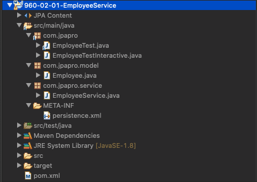

Aquí vamos a describir todos los pasos para la creación de este proyecto.

### 1. Base de Datos

Debemos crear la BD `EmpServDB`.

Creamos un usaurio para esta BD:

```sql
CREATE USER 'app'@'localhost' IDENTIFIED BY 'app';
GRANT ALL PRIVILEGES ON * . * TO 'app'@'localhost';
```

Crear la tabla `employee` con el siguiente Script:

```sql
DROP TABLE EMPLOYEE;

CREATE TABLE EMPLOYEE (ID INTEGER NOT NULL, NAME VARCHAR(255), SALARY BIGINT, NUMBER INTEGER, PRIMARY KEY (ID));
```


### 2. Creación del Proyecto

Vamos a crear un nuevo proyecto Maven como sigue:

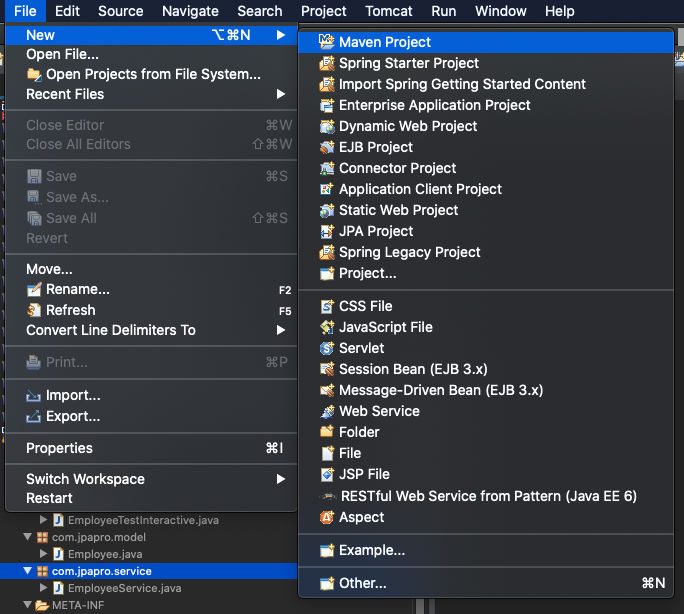
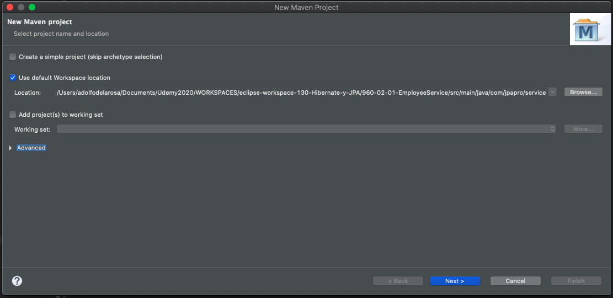
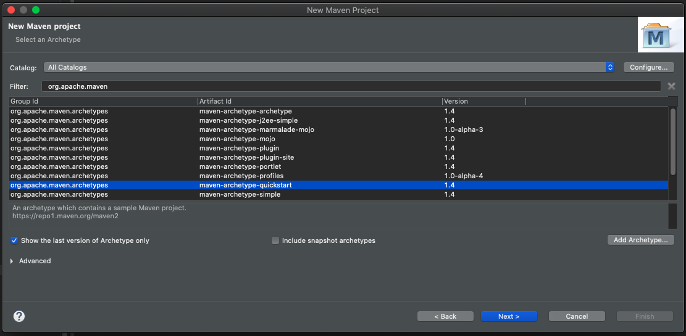
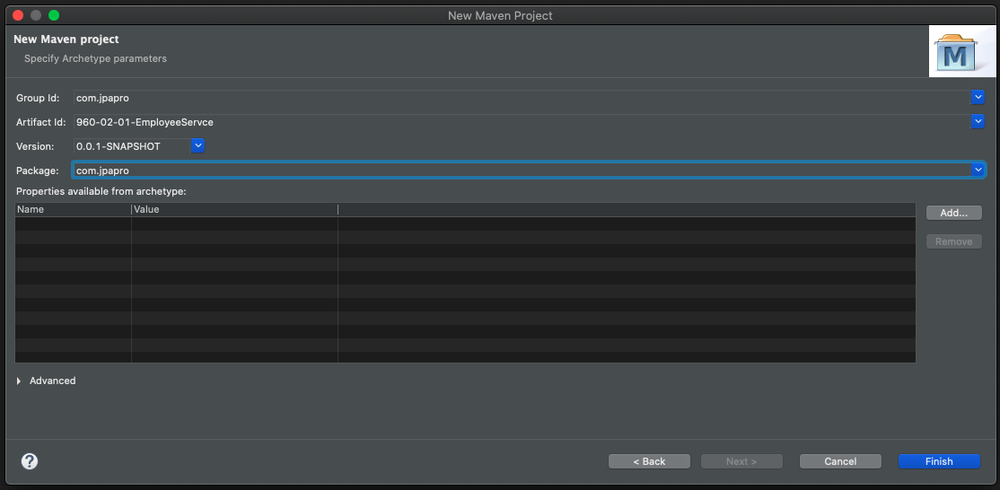

### 3. Añadir las Dependencias en el `pom.xml`

Debemos añadir las dependencias `hibernate-core` y `mysql-connector-java` en el `pom.xml`.

`pom.xml`

```html
<?xml version="1.0" encoding="UTF-8"?>

<project xmlns="http://maven.apache.org/POM/4.0.0"
	xmlns:xsi="http://www.w3.org/2001/XMLSchema-instance"
	xsi:schemaLocation="http://maven.apache.org/POM/4.0.0 http://maven.apache.org/xsd/maven-4.0.0.xsd">
	<modelVersion>4.0.0</modelVersion>

	<groupId>com.jpapro.jpa</groupId>
	<artifactId>960-02-01-EmployeeService</artifactId>
	<version>0.0.1-SNAPSHOT</version>

	<name>960-02-01-EmployeeService</name>
	<!-- FIXME change it to the project's website -->
	<url>http://www.example.com</url>

	<properties>
		<project.build.sourceEncoding>UTF-8</project.build.sourceEncoding>
		<maven.compiler.source>1.7</maven.compiler.source>
		<maven.compiler.target>1.7</maven.compiler.target>
	</properties>

	<dependencies>
		<dependency>
			<groupId>junit</groupId>
			<artifactId>junit</artifactId>
			<version>4.11</version>
			<scope>test</scope>
		</dependency>
		<dependency>
			<groupId>org.hibernate</groupId>
			<artifactId>hibernate-core</artifactId>
			<version>5.4.18.Final</version>
		</dependency>
		<!-- https://mvnrepository.com/artifact/mysql/mysql-connector-java -->
		<dependency>
			<groupId>mysql</groupId>
			<artifactId>mysql-connector-java</artifactId>
			<version>8.0.20</version>
		</dependency>
	</dependencies>

	<build>
		<pluginManagement><!-- lock down plugins versions to avoid using Maven 
				defaults (may be moved to parent pom) -->
			<plugins>
				<!-- clean lifecycle, see https://maven.apache.org/ref/current/maven-core/lifecycles.html#clean_Lifecycle -->
				<plugin>
					<artifactId>maven-clean-plugin</artifactId>
					<version>3.1.0</version>
				</plugin>
				<!-- default lifecycle, jar packaging: see https://maven.apache.org/ref/current/maven-core/default-bindings.html#Plugin_bindings_for_jar_packaging -->
				<plugin>
					<artifactId>maven-resources-plugin</artifactId>
					<version>3.0.2</version>
				</plugin>
				<plugin>
					<artifactId>maven-compiler-plugin</artifactId>
					<version>3.8.0</version>
				</plugin>
				<plugin>
					<artifactId>maven-surefire-plugin</artifactId>
					<version>2.22.1</version>
				</plugin>
				<plugin>
					<artifactId>maven-jar-plugin</artifactId>
					<version>3.0.2</version>
				</plugin>
				<plugin>
					<artifactId>maven-install-plugin</artifactId>
					<version>2.5.2</version>
				</plugin>
				<plugin>
					<artifactId>maven-deploy-plugin</artifactId>
					<version>2.8.2</version>
				</plugin>
				<!-- site lifecycle, see https://maven.apache.org/ref/current/maven-core/lifecycles.html#site_Lifecycle -->
				<plugin>
					<artifactId>maven-site-plugin</artifactId>
					<version>3.7.1</version>
				</plugin>
				<plugin>
					<artifactId>maven-project-info-reports-plugin</artifactId>
					<version>3.0.0</version>
				</plugin>
			</plugins>
		</pluginManagement>
	</build>
</project>
```

### 4. Añadir la Característica JPA

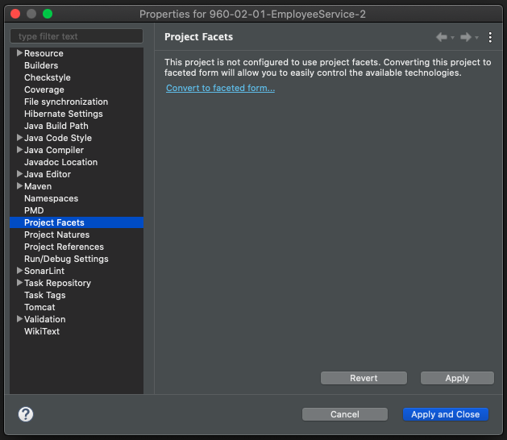
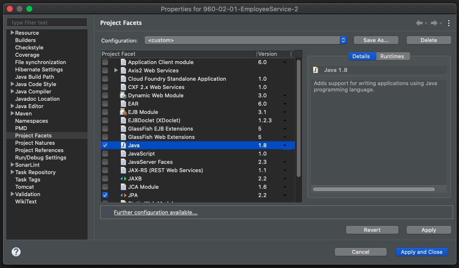
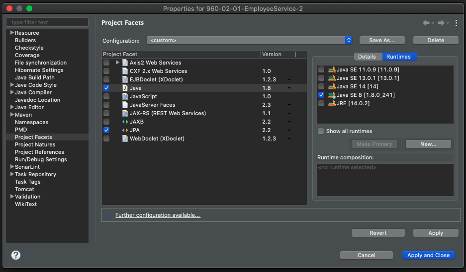

Con estos pasos se genera el archivo `persistence.xml` con los datos básicos.

### 5. Crear Conexión a la BD `EmpServDB`

Vamos a crear la conexión a la BD `EmpServDB` con el Data Source Explorer.

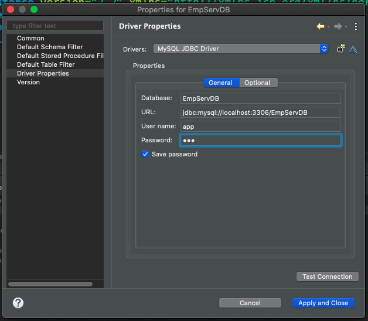
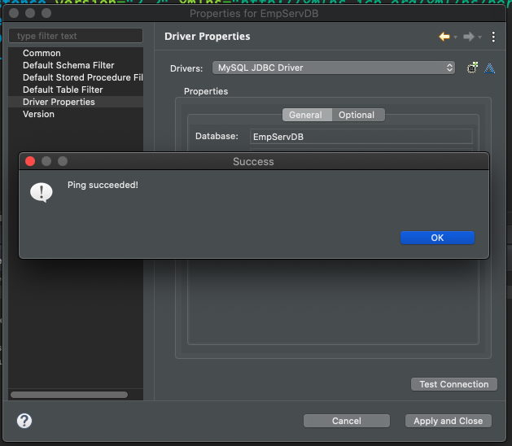


### 6. Modificaciones del `persistence.xml`

#### Conectar BD al `persistence.xml`

Abrimos el archivo `persistence.xml` y en la pestaña de Connection seleccionamos como **Transaction Type: Resource Local** para indicar que vamos a tener la conexión internamente desde la aplicación. Además asignamos la conexión que habíamos realizado anteriormente:

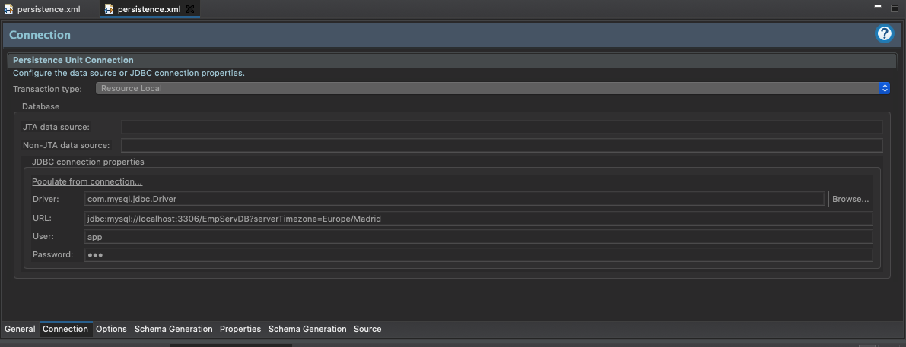

#### Dar Nombre a la Unidad de Persistencia

En la pestaña General asignamos el nombre a la unidad de persistencia `EmployeeService`.


#### Añadir Opciones Hibernate en `persistence.xml`

Ademas opcionalmente podemos añadir las siguientes características de hibernate en `persistence.xml`

```html
<property name="hibernate.dialect" value="org.hibernate.dialect.MySQL5InnoDBDialect"/>
<property name="hibernate.connection.driver_class" value="com.mysql.jdbc.Driver"/>
<property name="hibernate.hbm2ddl.auto" value="create"/>
<property name="hibernate.show_sql" value="true"/>
<property name="hibernate.format_sql" value="true"/>
```

#### Indicar el Validate Mode.

En la pestaña ***Options*** indicamos el **Validate mode: None** que es un requisto del ejemplo original.


### 7. Crear el Model `Employee`

`Employee`

```java
package com.jpapro.model;

import javax.persistence.Entity;
import javax.persistence.Id;

@Entity
public class Employee {
	
   @Id
   private int id;
   private String name;
   private long salary;
	
   public Employee() {
   }
	
   public Employee(int id) {
      this.id = id;
   }
   
   public int getId() {
      return id;
   }
   public void setId(int id) {
      this.id = id;
   }
   public String getName() {
      return name;
   }
   public void setName(String name) {
      this.name = name;
   }
   public long getSalary() {
      return salary;
   }
   public void setSalary(long salary) {
      this.salary = salary;
   }
   public String toString() {
      return "ID Empleado: " + getId() + " Nombre: " + getName() + " Salario: " + getSalary();
   }
}
```

### 8. Añadir la Entidad `Employee` al `persistence.xml`

Volvemos al archivo `persistence.xml` y en la pestaña ***General*** añadimos la entidad `Employee`.


Con esto ya tenemos nuestro archivo `persistence.xml` completo:

`persistence.xml`

```html
<?xml version="1.0" encoding="UTF-8"?>
<persistence version="2.2" xmlns="http://xmlns.jcp.org/xml/ns/persistence" xmlns:xsi="http://www.w3.org/2001/XMLSchema-instance" xsi:schemaLocation="http://xmlns.jcp.org/xml/ns/persistence http://xmlns.jcp.org/xml/ns/persistence/persistence_2_2.xsd">
	<persistence-unit name="EmployeeService" transaction-type="RESOURCE_LOCAL">
		<class>com.jpapro.model.Employee</class>
		<validation-mode>NONE</validation-mode>
		<properties>
			<property name="javax.persistence.jdbc.url" value="jdbc:mysql://localhost:3306/EmpServDB?serverTimezone=Europe/Madrid"/>
			<property name="javax.persistence.jdbc.user" value="app"/>
			<property name="javax.persistence.jdbc.password" value="app"/>
			<property name="javax.persistence.jdbc.driver" value="com.mysql.jdbc.Driver"/>
			<!--  
			<property name="hibernate.dialect" value="org.hibernate.dialect.MySQL5InnoDBDialect"/>
			<property name="hibernate.connection.driver_class" value="com.mysql.jdbc.Driver"/>
			<property name="hibernate.hbm2ddl.auto" value="create"/>
			<property name="hibernate.show_sql" value="true"/>
			<property name="hibernate.format_sql" value="true"/>
			-->
		</properties>
	</persistence-unit>
</persistence>
```

### 9. Crear el Service `EmployeeService`

`EmployeeService`

```java
package com.jpapro.service;

import java.util.Collection;

import javax.persistence.EntityManager;
import javax.persistence.TypedQuery;

import com.jpapro.model.Employee;

public class EmployeeService {
	
   protected EntityManager em;
	
   public EmployeeService(EntityManager em) {
      this.em = em;
   }
	
   public Employee createEmployee(int id, String name, long salary) {
      Employee emp = new Employee(id);
      emp.setName(name);
      emp.setSalary(salary);
      em.persist(emp);
      return emp;
   }
	
   public void removeEmployee(int id) {
      Employee emp = findEmployee(id);
      if(emp != null) {
         em.remove(emp);
      }
   }
	
   public Employee raiseEmployeeSalary(int id, long raise) {
      //OJO nunca se hace un merge
      Employee emp = em.find(Employee.class, id);
      if(emp != null) {
         emp.setSalary(emp.getSalary() + raise);
      }
      return emp;
   }
	
   public Employee findEmployee(int id) {
      return em.find(Employee.class, id);
   }
	
   public Collection<Employee> findAllEmployees(){
      TypedQuery<Employee> query = em.createQuery("SELECT e FROM Employee e", Employee.class);
      return query.getResultList();
   }

}
```

### 9. Crear un Cliente para Probar la Aplicación

`EmployeeTest`

```java
package com.jpapro;

import java.util.Collection;

import javax.persistence.EntityManager;
import javax.persistence.EntityManagerFactory;
import javax.persistence.Persistence;

import com.jpapro.model.Employee;
import com.jpapro.service.EmployeeService;

public class EmployeeTest {

   public static void main(String[] args) {
		
      // Crear el EntityManager
      EntityManagerFactory emf = Persistence.createEntityManagerFactory("EmployeeService");
      EntityManager em = emf.createEntityManager();
		
      // Crear un Servicio
      EmployeeService service = new EmployeeService(em);
		
      // Crear y Persistir un empleado
      em.getTransaction().begin();
      Employee emp = service.createEmployee(158, "John Doe", 45000);
      em.getTransaction().commit();
      System.out.println("Persistido " + emp);
		
      // Buscar un Empleado Especifico
      emp = service.findEmployee(158);
      System.out.println("Encontrado " + emp);
		
      // Buscar Todos los Empleados
      Collection<Employee> emps = service.findAllEmployees();
      for(Employee e: emps) {
         System.out.println("Encontrado el Empleado: " + e);
      }
		
      //Actualizar el Empleado
      em.getTransaction().begin();
      emp = service.raiseEmployeeSalary(158, 1000);
      em.getTransaction().commit();
      System.out.println("Actualizado " + emp);
		
      // Eliminar un Empleado
      em.getTransaction().begin();
      service.removeEmployee(158);
      em.getTransaction().commit();
      System.out.println("Eliminar Empleado 158");
		
      // Cerrar el EM y EMF cuando todo este hecho
      em.close();
      emf.close();
   }

}
```

Con este Test vamo a realizar las siguientes acciones:

* Crear y Persistir un Empleado
* Buscar un Empleado Especifico
* Buscar Todos los Empleados
* Actualizar el Empleado
* Eliminar un Empleado

La primera prueba vamos a hacerla comentando la eliminación para que podamos ver el registro en la BD.

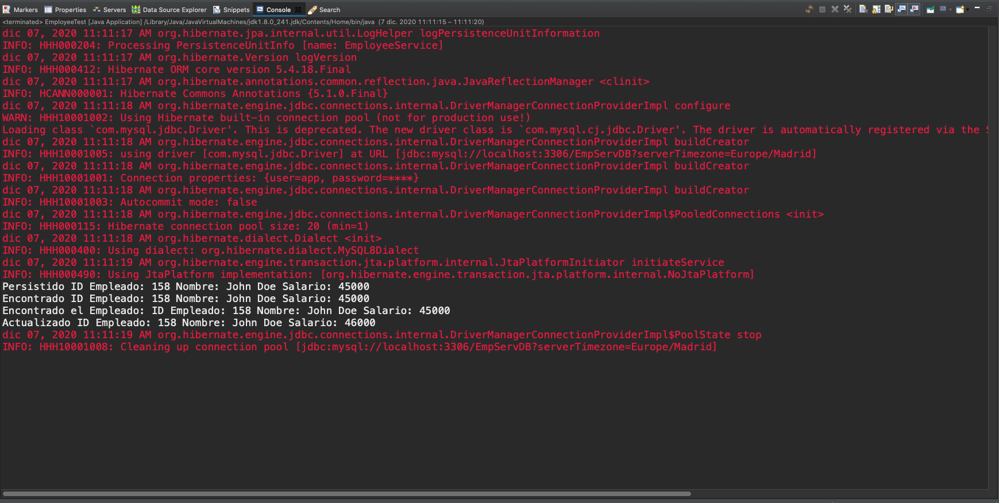

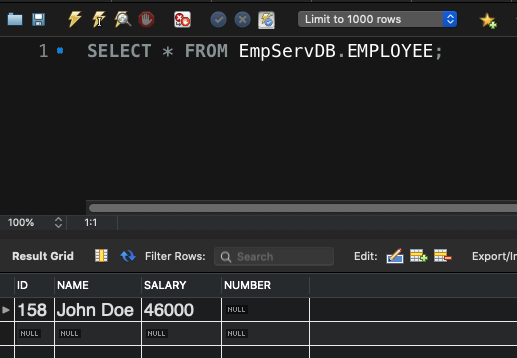

La segunda prueba la hacemos descomentando la eliminación.

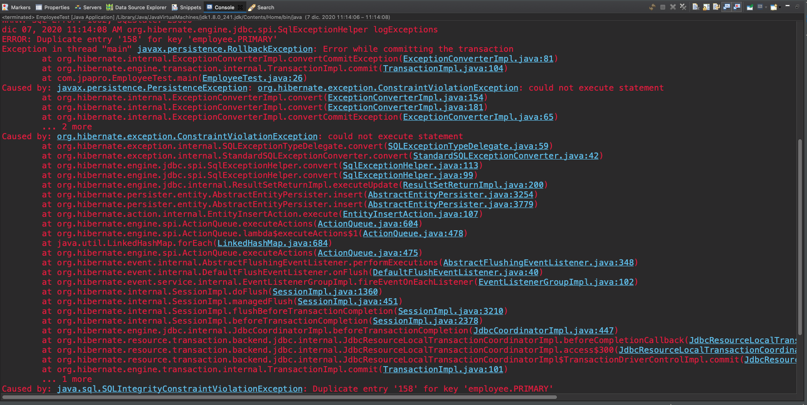

Al probar el ejemplo nos muestra un error esto pasa por que ya tenemos un empleado con ID 158 vamos a borrarlo y volver a ejecutar la aplicación.

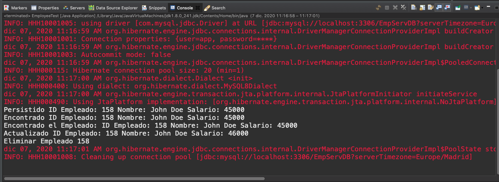


### 10. Crear un Cliente Interactivo para Probar la Aplicación

``
```java
package com.jpapro;

import java.io.BufferedReader;
import java.io.IOException;
import java.io.InputStreamReader;
import java.util.Collection;

import javax.persistence.EntityManager;
import javax.persistence.EntityManagerFactory;
import javax.persistence.Persistence;

import com.jpapro.model.Employee;
import com.jpapro.service.EmployeeService;

public class EmployeeTestInteractive {
   public static void main(String[] args) {
      
      // Crear el EntityManager
      EntityManagerFactory emf = Persistence.createEntityManagerFactory("EmployeeService");
      EntityManager em = emf.createEntityManager();

      // Crear un Servicio
      EmployeeService service = new EmployeeService(em);
		
      BufferedReader in = new BufferedReader(new InputStreamReader(System.in));
      String accion ="";
      int id;
      try {
         while (true) {
            System.out.println("\n\n\n[L]istar| [A]ñadir | [E]liminar | [S]alir: \n\t\t\t");
            try {
               accion = in.readLine();
            } catch (IOException e1) {
               break;
            }
            if ((accion.length() == 0) || accion.toUpperCase().charAt(0) == 'S') {
               break;
            }
            switch (accion.toUpperCase().charAt(0)) {
               case 'A':
                  System.out.println("Introduce un valor entero para el ID del Empleado: \n\t\t\t");
                  try {
                     id = new Integer(in.readLine());
                  } catch (NumberFormatException | IOException e) {
                     break;
                  }
                  
		  System.out.println("Introduce un valor para el Nombre del Empleado: \n\t\t\t");
                  
		  String name ="";
                  try {
                     name = in.readLine();
                  } catch (IOException e) {
                     break;
                  }
					
                  System.out.println("Introduce un valor entero para el Salario del Empleado: \n\t\t\t");
                  
		  long salary;
                  try {
                     salary = new Long(in.readLine());
                  } catch (NumberFormatException | IOException e) {
                     break;
                  }
                   
                  em.getTransaction().begin();
                  Employee emp = service.createEmployee(id, name, salary);
                  em.getTransaction().commit();
                    
                  System.out.println("\n\nCreado " + emp);
                  break;
               case 'L':
                  Collection<Employee> emps = service.findAllEmployees();
                  System.out.println("\n\nEmpleados Encontrados: ");
                  for (Employee e : emps)
                     System.out.println("\t" + e);                        
                  break;
               case 'E':
                  System.out.println("Introduzca el valor entero para el ID del Empleado: \n\t\t\t");
                  try {
                     id = new Integer(in.readLine());
                  } catch (NumberFormatException | IOException e) {
                     break;
                  }
                        
                  em.getTransaction().begin();
                  service.removeEmployee(id);
                  em.getTransaction().commit();
                        
                  System.out.println("\n\nEmpleado Eliminado: " + id);
                  break;
               default:
                  continue;
            }	
         }
      } finally {        
         // Cerrar el EM y EMF cuando todo este hecho
         em.close();
         emf.close();
      }
   }
}
```

Al ejecutar este Test tenemos:

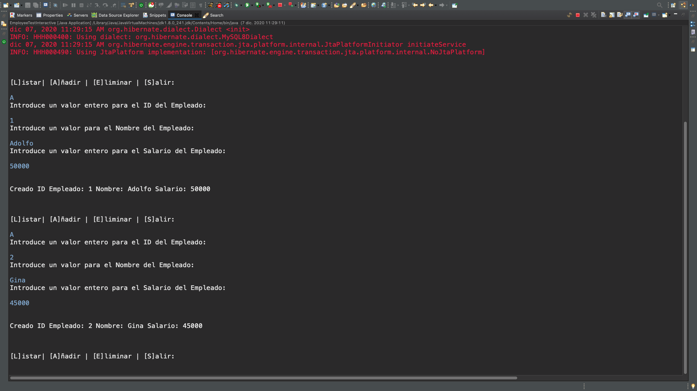
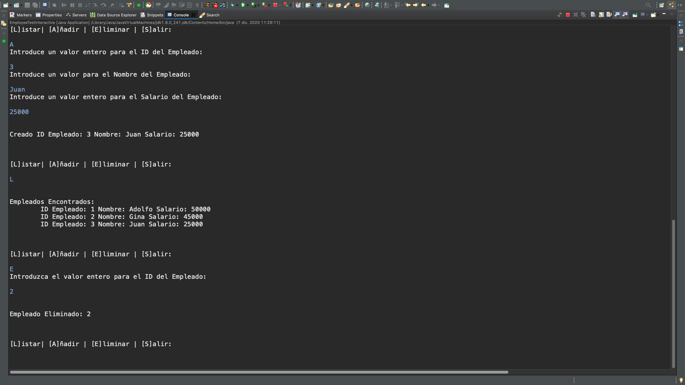
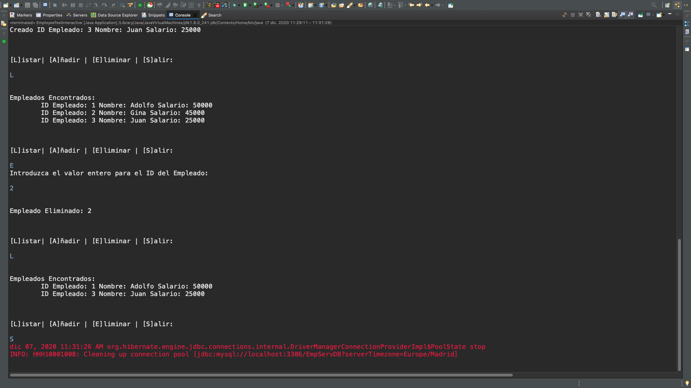

