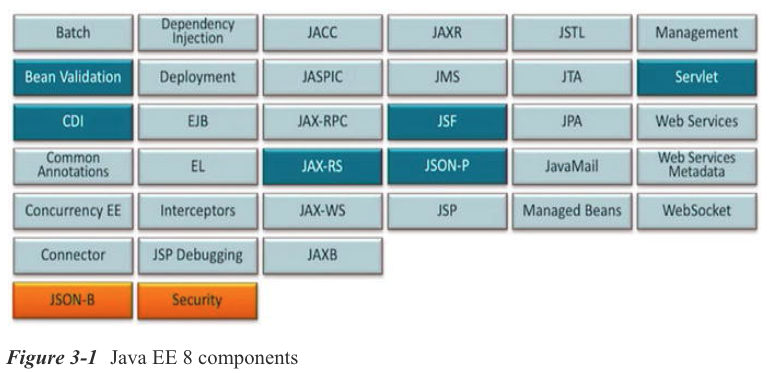

### Chapter 3: Enterprise Applications

* Application Component Models
* Session Beans
   * Stateless Session Beans
   * Stateful Session Beans
   * Singleton Session Beans
* Servlets
* Dependency Management and CDI
   * Dependency Lookup
   * Dependency Injection
   * Declaring Dependencies
* CDI and Contextual Injection
   * CDI Beans
   * Injection and Resolution
   * Scopes and Contexts
   * Qualified Injection
   * Producer Methods and Fields
   * Using Producer Methods with JPA Resources
* Transaction Management
   * Transaction Review
   * Enterprise Transactions in Java
* Putting It All Together
   * Defining the Component
   * Defining the User Interface
   * Packaging It Up
* Summary

No existe tecnología en el vacío, y JPA no es diferente en este sentido. Aunque el estilo de aplicación de cliente pesado que se demostró en el capítulo anterior es un uso viable de JPA, la mayoría de las aplicaciones Java empresariales se implementan en un servidor de aplicaciones, normalmente utilizando tecnologías web Java EE y posiblemente también otras tecnologías. Por lo tanto, es esencial comprender los componentes que componen una aplicación implementada y el papel de JPA en este entorno.

Este libro trata sobre JPA en Java EE 8, cuyas principales características nuevas son compatibles con HTML5, el estándar HTTP/2 y la integración de beans, y una infraestructura mejorada para aplicaciones que se ejecutan en la nube.

Comenzamos con una descripción general de las principales tecnologías Java EE relevantes para la persistencia. Como parte de esta descripción general, describimos el modelo de componente EJB, demostrando la sintaxis básica para algunos de los diferentes tipos de EJB.

Luego pasaremos a cubrir brevemente el mecanismo estándar de inyección de dependencia (DI), principalmente utilizando el enfoque de Contextos e Inyección de dependencia (CDI) de Java EE. Este capítulo no pretende ser una exploración completa o detallada de Java EE o marcos de componentes, y posiblemente no podamos entrar en todos los marcos de DI en la esfera de DI, o incluso en las facilidades que ofrece CDI. Sin embargo, los ejemplos de CDI y EJB son bastante típicos de DI en general y deberían dar a los lectores una idea general de cómo se puede usar JPA con componentes habilitados para DI, ya sean de la variedad Java EE o algún otro componente de contenedor DI, como Spring o Guice.

A continuación, analizamos las transacciones, otra tecnología de servidor de aplicaciones que ha tenido un gran impacto en las aplicaciones que utilizan JPA. Las transacciones son un elemento fundamental de cualquier aplicación empresarial que necesite garantizar la integridad de los datos.

Finalmente, explicamos cómo utilizar las tecnologías descritas en este capítulo dentro del contexto de cómo la persistencia se integra en cada tecnología componente. También revisamos la aplicación Java SE del capítulo anterior y la redirigimos a la plataforma empresarial.

Aquí hay una lista de los cambios más importantes en Java EE 8:

* Java EE 8 platform

* JSON-B 1.0

* JSON-P 1.1

* JAX-RS 2.1

* MVC 1.0

* Java Servlet 4.0

* JSF 2.3

* JMS 2.1

* CDI 2.0

* Java EE Security 1.0

* Java EE Management 2.0

* Concurrency utilities

* Connector architecture

* WebSocket

* JPA

* EJB

* JTA

* JCache

* JavaMail

La figura 3-1 muestra los componentes principales de Java EE 8.

