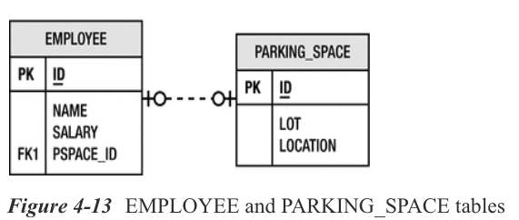
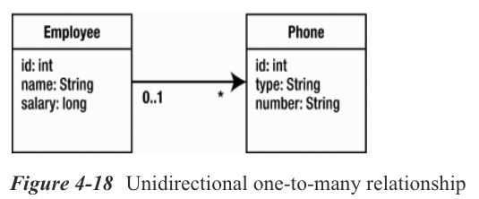

### Chapter 4: Object-Relational Mapping

* Persistence Annotations
* Accessing Entity State
   * Field Access
   * Property Access
   * Mixed Access
* Mapping to a Table
* Mapping Simple Types
   * Column Mappings
   * Lazy Fetching
   * Large Objects
   * Enumerated Types
   * Temporal Types
   * Transient State
* Mapping the Primary Key
   * Overriding the Primary Key Column
   * Primary Key Types
   * Identifier Generation
* Relationships
   * Relationship Concepts
   * Mappings Overview
   * Single-Valued Associations
   * Collection-Valued Associations
   * Lazy Relationships
* Embedded Objects
* Summary

