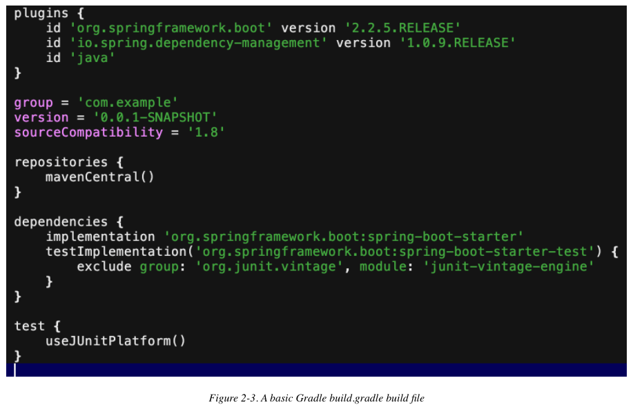
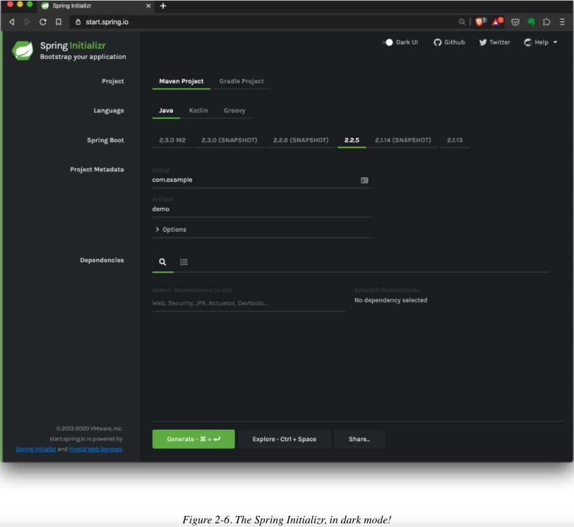
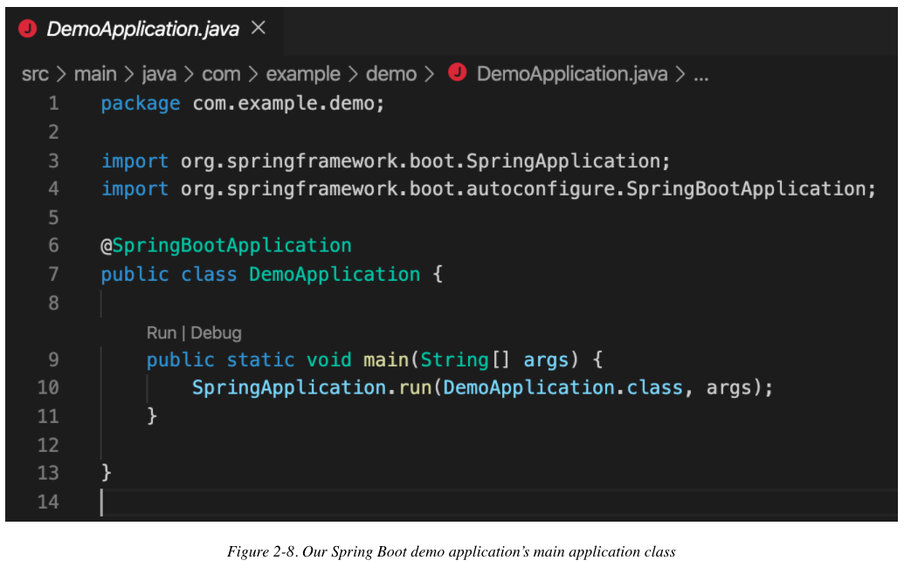

# 2. Elegir sus herramientas y comenzar

* ¿Maven o Gradle?
    * Apache Maven
    * Gradle
    * Elegir entre Maven y Gradle
* ¿Java o Kotlin?
    * Java
    * Kotlin
* Elegir entre Java y Kotlin
* Elegir una versión de Spring Boot
* El Spring Initializr
* Línea de comandos directa de Outta (Outta Commandline)
* Permanecer en entornos de desarrollo integrados (IDE)
* Cruising down main()
* Resumen

Comenzar a crear aplicaciones Spring Boot es fácil, como verá pronto. La parte más difícil puede ser decidir cuál de las opciones disponibles le gustaría elegir.

En este capítulo, examinaremos algunas de las excelentes opciones que tiene disponibles para crear aplicaciones Spring Boot: sistemas de compilación, lenguajes, cadenas de herramientas, editores de código y más.

## ¿Maven o Gradle?

Históricamente, los desarrolladores de aplicaciones Java han tenido algunas opciones para las herramientas de construcción de proyectos. Algunos han caído en desgracia con el tiempo, por una buena razón, y ahora nos hemos unido como una comunidad en torno a dos: Maven y Gradle. Spring Boot soporta ambos con igual aplomo.

### Apache Maven

Maven es una opción popular y sólida para un sistema de automatización de construcción. Ha existido durante bastante tiempo, habiendo tenido su comienzo en 2002 y convirtiéndose en un proyecto de alto nivel en la Apache Software Foundation en 2003. Su enfoque declarativo era (y es) conceptualmente más simple que las alternativas de la época y de ahora: simplemente cree un archivo con formato XML llamado `pom.xml` con las dependencias y complementos deseados. Cuando ejecuta el comando `mvn`, puede especificar una "fase" para completar, que realiza una tarea deseada como compilar, eliminar resultados anteriores, empaquetar, ejecutar una aplicación y más.


Maven también crea y espera una estructura de proyecto particular por convención. Por lo general, no debe desviarse mucho, si es que lo hace, de esa estructura a menos que esté preparado para luchar contra su herramienta de construcción, una búsqueda contraproducente si alguna vez hubo una. Para la gran mayoría de los proyectos, la estructura convencional de Maven funciona a la perfección, por lo que no es algo que probablemente deba cambiar.


**NOTA**

Para obtener más detalles sobre la estructura esperada del proyecto de Maven, consulte la [Introducción al diseño de directorio estándar de The Maven Project](https://maven.apache.org/guides/introduction/introduction-to-the-standard-directory-layout.html).

Si llega un momento en que las convenciones del proyecto de Maven y/o el enfoque estrictamente estructurado de las compilaciones se vuelven demasiado restrictivos, existe otra excelente opción.

### Gradle

Gradle es otra opción popular para crear proyectos de máquinas virtuales Java (JVM). Lanzado por primera vez en 2008, Gradle aprovecha un lenguaje específico de dominio (DSL) para producir un archivo de compilación `build.gradle` que es mínimo y flexible. Consulte la Figura 2-3 para ver un ejemplo de un archivo de compilación de Gradle para una aplicación Spring Boot.

Gradle le permite a usted, el desarrollador, elegir usar los lenguajes de programación Groovy o Kotlin para un DSL. También ofrece varias funciones destinadas a reducir el tiempo de espera para que se construya un proyecto, como:

* Compilación incremental de clases de Java

* Compile evitación para Java (en los casos en que no se produjeron cambios)

* Un demonio dedicado para la compilación de proyectos



### Elegir entre Maven y Gradle

Es posible que su elección de herramienta de construcción no parezca una gran elección en este momento. ¿Por qué no elegir simplemente Gradle?

El enfoque declarativo más rígido de Maven (algunos podrían decir obstinado) mantiene las cosas increíblemente consistentes de un proyecto a otro, de un entorno a otro. Si sigue el método de Maven, normalmente surgen pocos problemas, lo que le permite concentrarse en su código sin preocuparse mucho por la compilación.

Como sistema de compilación basado en programación/scripting, Gradle ocasionalmente también tiene problemas para digerir las versiones iniciales de nuevas versiones del lenguaje. El equipo de Gradle es receptivo y, por lo general, resuelve estos problemas con mucha prisa, pero si prefiere (o debe) sumergirse inmediatamente en las versiones de lenguaje de acceso temprano, esto merece consideración.

Gradle puede ser más rápido para las compilaciones y, a veces, significativamente más rápido, especialmente en proyectos más grandes. Dicho esto, para su proyecto típico basado en microservicios, no es probable que los tiempos de compilación difieran tanto entre proyectos similares de Maven y Gradle.

La flexibilidad de Gradle puede ser un soplo de aire fresco para proyectos simples y proyectos con requisitos de construcción muy complejos. Pero especialmente en esos proyectos complejos, la flexibilidad adicional de Gradle puede resultar en más tiempo dedicado a ajustes y solución de problemas cuando las cosas no funcionan de la manera esperada. TANSTAAFL (No existe nada como un almuerzo gratis).

Spring Boot admite tanto Maven como Gradle, y si usa Initializr (que se tratará en una sección a continuación), el proyecto y el archivo de compilación deseado se crean para usted, para que pueda comenzar a trabajar rápidamente. En resumen, pruebe ambos, luego elija lo que funcione mejor para usted. Spring Boot lo apoyará felizmente de cualquier manera.

## ¿Java o Kotlin?

Si bien hay muchos idiomas disponibles para usar en la JVM, dos disfrutan del uso más extendido. Uno es el lenguaje JVM original, Java; el otro es relativamente nuevo en el espacio, Kotlin. Ambos son ciudadanos de primera clase en Spring Boot.

### Java

Dependiendo de si considera la versión pública 1.0 o el origen del proyecto como su fecha de nacimiento oficial, Java ha existido durante 25 o 30 años, respectivamente. Sin embargo, es cualquier cosa menos estancada. Desde septiembre de 2017, Java ha estado en un ciclo de lanzamiento de seis meses, lo que resulta en mejoras de funciones más frecuentes que antes. Los encargados del mantenimiento han limpiado la base de código y han eliminado las funciones eliminadas por otras nuevas, además de introducir funciones vitales impulsadas por la comunidad Java. Java es más vibrante que nunca.

Ese ritmo dinámico de innovación, combinado con la longevidad de Java y el enfoque constante en la compatibilidad con versiones anteriores, significa que existen innumerables tiendas de Java que mantienen y crean aplicaciones Java críticas a diario en todo el mundo. Muchas de esas aplicaciones usan Spring.

Java forma la base sólida de casi todo el código base de Spring y, como tal, es una excelente opción para usar en la construcción de sus aplicaciones Spring Boot. Examinar el código de Spring, Spring Boot y todos los proyectos relacionados es una simple cuestión de visitar GitHub donde está alojado y verlo allí, o clonar el proyecto para revisarlo sin conexión. Y con la disponibilidad de una gran cantidad de código de ejemplo, proyectos de muestra y guías de "Introducción" escritas con Java, la escritura de aplicaciones Spring Boot con Java puede tener un mejor soporte que cualquier otra combinación de cadena de herramientas en el mercado.

### Kotlin

En términos relativos, Kotlin es el chico nuevo de la cuadra. Creado por JetBrains en 2010 y hecho público en 2011, Kotlin fue creado para abordar las brechas percibidas en la usabilidad de Java. Diseñado desde el principio para ser:

* Conciso: Kotlin requiere un código mínimo para comunicar claramente la intención al compilador (y a uno mismo y a otros desarrolladores).

* Seguro: Kotlin elimina los errores relacionados con nulos al eliminar la posibilidad de valores nulos de forma predeterminada, a menos que el desarrollador anule específicamente el comportamiento para permitirlos.

* Interoperable: Kotlin tiene como objetivo la interoperabilidad sin fricciones con todas las bibliotecas de navegadores, Android y JVM existentes.

* Fácil de usar: cree aplicaciones Kotlin en numerosos entornos de desarrollo integrados (IDE) o desde la línea de comandos, al igual que Java.

Los mantenedores de Kotlin amplían las capacidades del lenguaje con mucho cuidado, pero también con gran velocidad. Sin más de 25 años de compatibilidad de idiomas como un enfoque de diseño central, se han movido rápidamente para agregar capacidades muy útiles que probablemente aparecerán en Java en algunas versiones más adelante.

Además de ser conciso, Kotlin también es un idioma muy fluido. Sin profundizar en demasiados detalles todavía, varias características del lenguaje contribuyen a esta elegancia lingüística, entre ellas funciones de extensión y notación infija. Discutiré esta idea con más profundidad más adelante, pero hace posibles opciones de sintaxis como esta:

```kotlin
infix fun Int.multiplyBy(x: Int): Int { ... }

// calling the function using the infix notation
1 multiplyBy 2

// is the same as
1.multiplyBy(2)
```

Como puede imaginar, la capacidad de definir su propio "lenguaje dentro de un lenguaje" más fluido puede ser una bendición para el diseño de API. Combinado con la concisión de Kotlin, esto puede hacer que las aplicaciones Spring Boot escritas en Kotlin sean aún más cortas y más legibles que sus contrapartes de Java, sin pérdida en la comunicación de intención.

Kotlin ha sido un ciudadano de primera clase en Spring Framework desde que se lanzó la versión 5.0 en otoño de 2017, con soporte completo propagándose a través de Spring Boot (primavera de 2018) y otros proyectos de componentes desde entonces. Además, toda la documentación de Spring se está ampliando para incluir ejemplos tanto en Java como en Kotlin. Esto significa que, efectivamente, puede escribir aplicaciones Spring Boot completas con Kotlin tan fácilmente como con Java.

## Elegir entre Java y Kotlin

Lo sorprendente es que en realidad no tienes que elegir. Kotlin compila con la misma salida de código de bytes que Java; y dado que se pueden crear proyectos Spring que incluyan tanto archivos fuente de Java como Kotlin, y que puedan llamar a ambos compiladores con facilidad, puede usar el que tenga más sentido para usted incluso dentro del mismo proyecto. ¿Qué te parece tener tu pastel y comértelo también?

Por supuesto, si prefiere uno sobre el otro o tiene otras restricciones personales o profesionales, obviamente puede desarrollar aplicaciones completas en uno u otro. Es bueno tener opciones, ¿no?

## Elegir una versión de Spring Boot

Para aplicaciones de producción, siempre debe usar la versión actual de Spring Boot con las siguientes excepciones temporales y limitadas:

* Actualmente está ejecutando una versión anterior, pero está actualizando, volviendo a probar e implementando sus aplicaciones en algún orden tal que simplemente no ha llegado a esta aplicación en particular.

* Actualmente está ejecutando una versión anterior, pero hay un conflicto o error identificado que informó al equipo de Spring y se le indica que espere una actualización de Boot o una dependencia en cuestión.

* Debe utilizar funciones en una instantánea, un hito o una versión candidata a lanzamiento previa a GA (General Availability - disponibilidad general) y está dispuesto a aceptar los riesgos inherentes al código que aún no se ha declarado GA, es decir, "listo para su uso en producción".

**NOTA**

Las versiones Snapshot, Milestone y Release Candidate (RC) se prueban exhaustivamente antes de su publicación, por lo que ya se ha aplicado una gran cantidad de rigor para garantizar su estabilidad. Sin embargo, hasta que se apruebe y publique la versión completa de GA, siempre existe la posibilidad de cambios en la API, correcciones, etc. Los riesgos para su aplicación son bajos, pero tendrá que decidir por sí mismo (y probar y confirmar) si esos los riesgos son manejables cuando se considera el uso de cualquier software de acceso anticipado.

## El Spring Initializr

Hay muchas formas de crear una aplicación Spring Boot, pero la mayoría lleva a un único punto de partida: Spring Initializr (Figura 2-4).


A veces se hace referencia simplemente a su URL, `start.spring.io`, y se puede acceder a Spring Initializr desde asistentes de creación de proyectos dentro de IDE prominentes, a través de la línea de comandos o, con mayor frecuencia, a través de un navegador web. El uso del navegador web proporciona algunas funciones adicionales útiles a las que (todavía) no se puede acceder a través de otras vías.

Para comenzar a crear un proyecto Spring Boot de la mejor manera posible ™, dirija su navegador a https://start.spring.io. A partir de ahí, elegiremos algunas opciones y comenzaremos.

#### INSTALACIÓN DE JAVA

Supongo que si ha llegado a este punto, ya ha instalado una versión actual del Java Development Kit (JDK), a veces denominado Java Platform, Standard Edition, en su máquina. Si aún no ha instalado Java, deberá hacerlo antes de continuar.

Proporcionar instrucciones detalladas sobre cómo hacerlo está fuera del alcance de este libro, pero algunas recomendaciones tampoco estarían mal, ¿verdad? :)

¡Descubrí que la forma más fácil de instalar y administrar uno o más JDK en su máquina es usando SDKMAN !. Este administrador de paquetes también facilita la instalación de la interfaz de línea de comandos (CLI) de Spring Boot que usará más adelante (y muchas, muchas otras herramientas), por lo que es una aplicación de utilidad increíblemente útil. Si sigue las instrucciones en https://sdkman.io/install, estará listo para rodar.

Desde SDKMAN !, es cuestión de instalar la versión deseada de Java usando `sdk list java` para ver las opciones, luego `sdk install java <insert_desired_java_here>` para instalar. Existen numerosas opciones excelentes, pero para empezar, le recomiendo que elija la versión actual de Long Term Support (LTS) empaquetada por AdoptOpenJDK con Hotspot JVM, p. Ej. `11.0.7.hs-adpt`.

Si prefiere no utilizar SDKMAN! por el motivo que sea, también puede elegir descargar e instalar un JDK directamente desde https://adoptopenjdk.net/. Hacerlo lo pondrá en funcionamiento, pero dificulta las actualizaciones y no lo ayudará en el futuro con la actualización o si necesita administrar varios JDK.

<hr>

Para comenzar con Initializr, primero elegimos el sistema de compilación que planeamos usar con nuestro proyecto. Como se mencionó anteriormente, tenemos dos excelentes opciones: Maven y Gradle. Elijamos Maven para este ejemplo.

A continuación, elegiremos Java como base (del lenguaje) para este proyecto.

Como ya habrá notado, Spring Initializr selecciona suficientes valores predeterminados para las opciones presentadas para crear un proyecto sin ninguna entrada suya. Cuando llegó a esta página web, Maven y Java ya estaban preseleccionados. La versión actual de Spring Boot también lo es, y para este (y para la mayoría) de los proyectos, eso es lo que querrá seleccionar.

Podemos dejar las opciones en Metadatos del proyecto como están sin problemas, aunque las modificaremos para proyectos futuros.

Y por ahora, tampoco incluimos ninguna dependencia. De esta manera, podemos enfocarnos en la mecánica de la creación del proyecto, no en un resultado en particular.

Sin embargo, antes de generar ese proyecto, hay un par de características realmente agradables de Spring Initializr que me gustaría señalar, junto con una nota al margen.

Si desea examinar los metadatos de su proyecto y los detalles de dependencia antes de la generación del proyecto en función de sus selecciones actuales, puede hacer clic en el botón Explorar o usar el método abreviado de teclado, *Ctrl + Espacio*, para abrir el Explorador de proyectos de Spring Initializr (Figura 2-5 ). El Initializr luego le presentará la estructura del proyecto y el archivo de compilación que se incluirá en el proyecto comprimido (.zip) que está a punto de descargar. Puede revisar la estructura del directorio/paquete, el archivo de propiedades de la aplicación (más sobre esto más adelante) y las propiedades y dependencias del proyecto especificadas en su archivo de compilación: ya que estamos usando Maven para este proyecto, nuestro `pom.xml`.


Esta es una forma rápida y práctica de verificar la configuración y las dependencias del proyecto antes de descargar, extraer y cargar en su IDE su proyecto nuevo y vacío.

Otra característica más pequeña de Spring Initializr, pero que ha sido bien recibida por numerosos desarrolladores, es el modo oscuro. Al deslizar el interruptor de la interfaz de usuario oscura en la parte superior de la página hacia la derecha, cambia al modo oscuro de Initializr y lo convierte en el predeterminado cada vez que visita la página. Es una característica pequeña, pero si mantiene su máquina en modo oscuro en cualquier otro lugar, ciertamente hace que cargar Initializr sea menos discordante y más agradable. ¡Querrás seguir regresando!

**NOTA**

Aparte de la clase de aplicación principal y su método principal, más una prueba vacía, Spring Initializr no genera código por usted; genera el proyecto para usted, según su orientación. Es una pequeña distinción, pero muy importante: la generación de código tiene resultados muy variados y, a menudo, lo paraliza en el momento en que comienza a hacer cambios. Al generar la estructura del proyecto, incluido el archivo de compilación con las dependencias especificadas, Initializr le proporciona un comienzo en ejecución para escribir el código que necesita para aprovechar la configuración automática de Spring Boot. Autoconfig te da superpoderes sin la camisa de fuerza.

A continuación, haga clic en el botón Generar para generar, empaquetar y descargar su proyecto, guardándolo en la ubicación elegida en su máquina local. Luego navegue hasta ese archivo .zip descargado y descomprímalo para prepararse para desarrollar su

## Línea de comandos directa de Outta (Outta Commandline)


## Permanecer en entornos de desarrollo integrados (IDE)
## Cruising down main()
## Resumen







