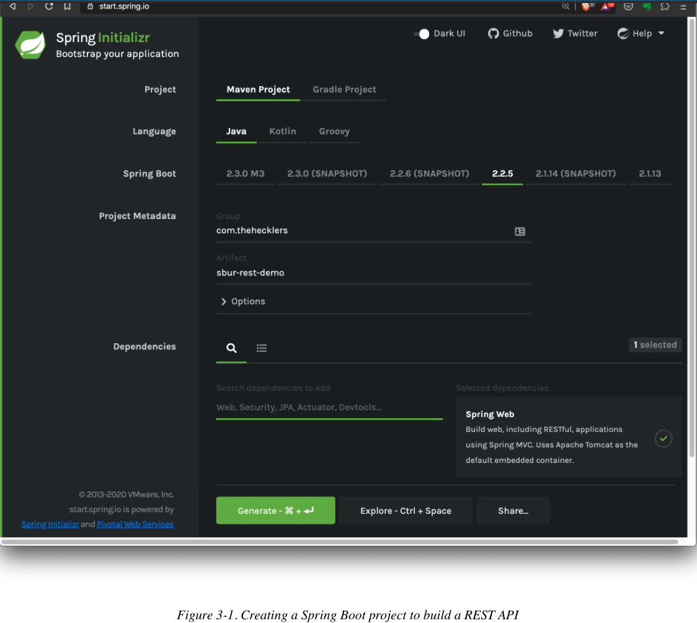
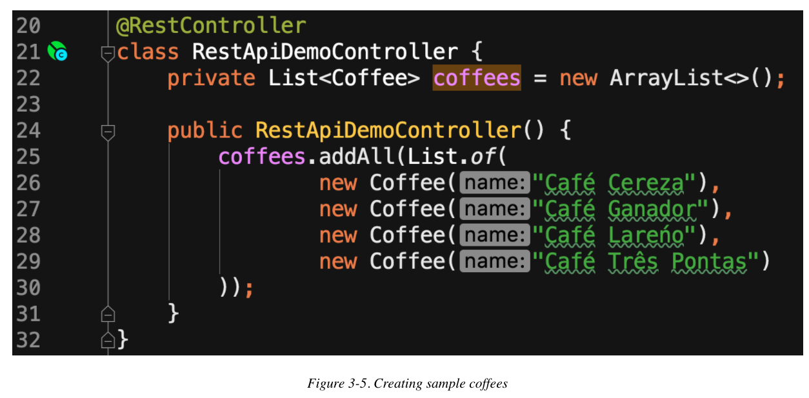
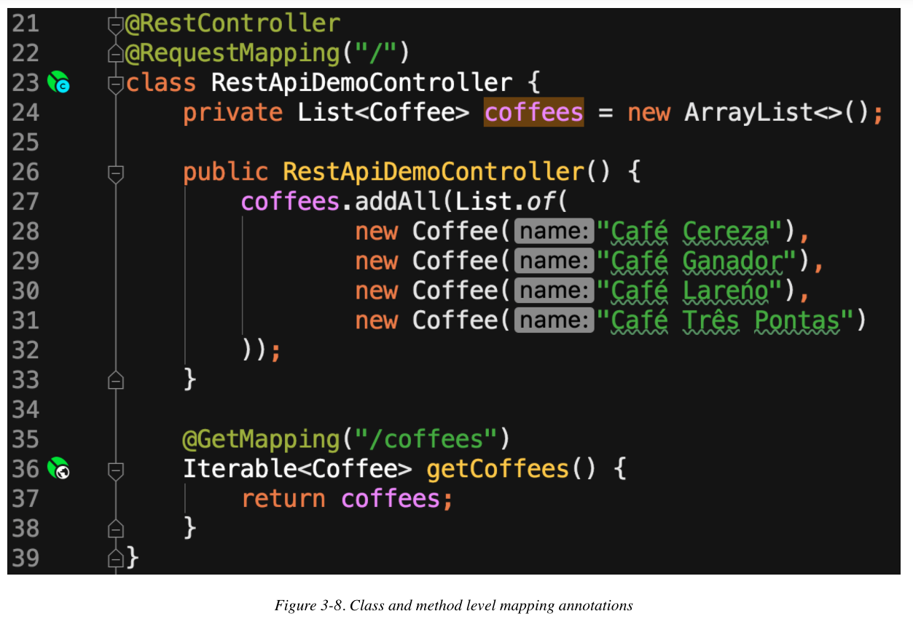
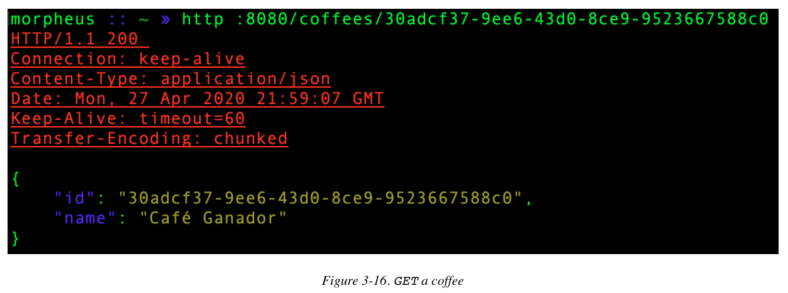
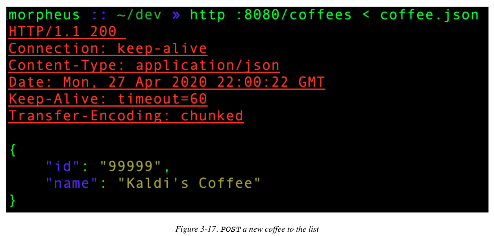
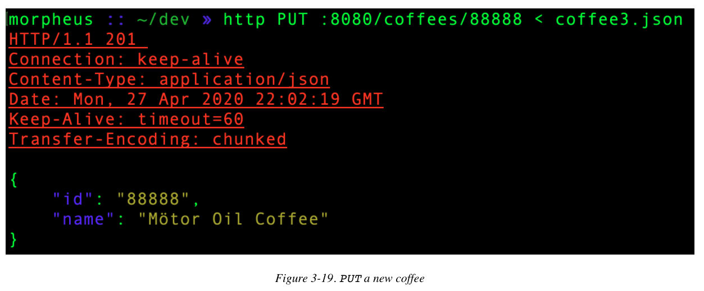
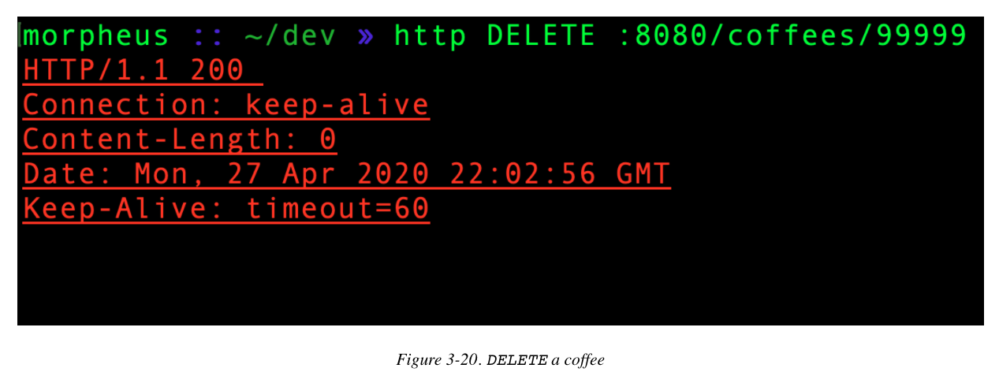

# 3. Creando su primera API REST de Spring Boot

* El cómo y el por qué de las API
* ¿Qué es REST y por qué es importante?
* Tu API, HTTP Verb Style
   * GET-ting
   * POST-ing
   * PUT-ting
   * DELETE-ing
    * Y más
* Confiar pero verificar
* Resumen

En este capítulo, explico y demuestro cómo desarrollar una aplicación de trabajo básica usando Spring Boot. Dado que la mayoría de las aplicaciones implican exponer a los usuarios los recursos de back-end en la nube, generalmente a través de una interfaz de usuario, una interfaz de programación de aplicaciones (API) es un excelente punto de partida tanto para la comprensión como para la practicidad. Empecemos.

## El cómo y el por qué de las API

La era de la aplicación monolítica que lo hace todo ha terminado.

Esto no quiere decir que los monolitos ya no existan, o que todavía no se crearán en los siglos venideros. En diversas circunstancias, una aplicación monolítica que proporciona numerosas capacidades en un paquete todavía tiene sentido, especialmente en entornos en los que:

* el dominio y por lo tanto los límites del dominio son en gran parte desconocidos;

* siempre que las capacidades estén estrechamente acopladas y el rendimiento absoluto de las interacciones del módulo tenga prioridad sobre la flexibilidad;

* los requisitos de escala para todas las capacidades relacionadas son conocidos y consistentes;

* la funcionalidad no es volátil; el cambio es lento, de alcance limitado o ambos

Para todo lo demás, existen microservicios.

Por supuesto, esta es una simplificación excesiva, pero creo que es un resumen útil. Al dividir las capacidades en "fragmentos" más pequeños y cohesivos, podemos desacoplarlos, lo que da como resultado el potencial para sistemas más flexibles y robustos que se pueden implementar más rápidamente y mantener más fácilmente.

En cualquier sistema distribuido, y no se equivoquen, un sistema que comprende microservicios es exactamente eso: la comunicación es clave. Ningún servicio es una isla. Y aunque existen numerosos mecanismos para conectar aplicaciones/microservicios, a menudo comenzamos nuestro viaje emulando el tejido mismo de nuestra vida cotidiana: Internet.

Internet fue construido para la comunicación. De hecho, los diseñadores de su precursora, la Red de Agencias de Proyectos de Investigación Avanzada (ARPANET), anticiparon la necesidad de mantener la comunicación entre sistemas incluso en el caso de una “interrupción significativa”. Es razonable concluir que un enfoque basado en HTTP similar al que usamos para llevar a cabo gran parte de nuestra vida diaria también podría permitirnos crear, recuperar, actualizar y eliminar varios recursos “por cable”.

Por mucho que me guste la historia, no profundizaré en la historia de las API REST más que para decir que Roy Fielding expuso sus principios en su tesis doctoral de 2000, que se basó en el modelo de objetos HTTP de 1994.

## ¿Qué es REST y por qué es importante?

Como se mencionó anteriormente, una API es la especificación/interfaz en la que escribimos los desarrolladores para que nuestro código pueda usar otro código: bibliotecas, otras aplicaciones o servicios. Pero, ¿qué representa REST en REST API?

REST es un acrónimo de *Representational State Transfer*, que es una forma un tanto críptica de decir que cuando una aplicación se comunica con otra, la Aplicación A trae su estado actual consigo; no espera que la Aplicación B mantenga el estado (información actual y acumulativa basada en procesos) entre las llamadas de comunicación. La aplicación A proporciona una representación de su estado relevante con cada solicitud a la aplicación B. Puede ver fácilmente por qué esto aumenta la capacidad de supervivencia y la resistencia, porque si hay un problema de comunicación o la aplicación B se bloquea y se reinicia, no pierde el estado actual de sus interacciones con la Aplicación A; La aplicación A puede simplemente volver a emitir la solicitud y continuar donde se quedaron las dos aplicaciones.

**NOTA**

Este concepto general a menudo se denomina “stateless” applications/services (aplicaciones/servicios "sin estado"), porque cada servicio mantiene su propio estado actual, incluso dentro de una secuencia de interacciones, y no espera que otros lo hagan en su nombre.

## Tu API, HTTP Verb Style

Ahora, sobre esa API REST, a veces llamada API RESTful, que es una versión agradable y relajante de las cosas, ¿no es así?

Hay una serie de verbos HTTP estandarizados y definidos dentro de un puñado de solicitudes de comentarios (RFC) del Grupo de trabajo de ingeniería de Internet (IETF). De estos, un pequeño número se usa generalmente de manera consistente para crear API, y un par más se usa ocasionalmente. Las API REST se basan principalmente en los siguientes verbos HTTP:

* POST
* GET
* PUT
* PATCH
* DELETE

Estos verbos se corresponden con las operaciones típicas que realizamos sobre los recursos: crear (`POST`), leer (`GET`), actualizar (`PUT` y `PATCH`) y eliminar (`DELETE`).

**NOTA**

Es cierto que estoy difuminando un poco las líneas con la ecuación vaga de `PUT` con la actualización de un recurso, y un poco menos equiparando `POST` con la creación de un recurso. Le pediría al lector que me tenga paciencia mientras paso por la implementación y proporciono aclaraciones.

Ocasionalmente, se emplean los siguientes dos verbos:

* OPTIONS
* HEAD

Estos se pueden utilizar para recuperar las opciones de comunicación disponibles para los pares de request/response (solicitud/respuesta) (`OPTIONS`) y recuperar un encabezado de respuesta menos su cuerpo (`HEAD`).

Para este libro, y de hecho para la mayor parte del uso de producción, me centraré en el primer grupo muy utilizado. Para comenzar (sin juego de palabras), creemos un microservicio simple que implemente una API REST muy básica.

#### DE VUELTA A INITIALIZR

Comenzamos como de costumbre con Spring Initializr, como se muestra en la Figura 3-1. Cambié los campos Group y Artifact para reflejar los detalles que uso (no dude en usar su nomenclatura preferida), seleccioné Java 11 en Opciones (opcional, cualquier versión de la lista funcionará bien) y seleccioné solo la dependencia Spring Web. Como se indica en la descripción mostrada, esta dependencia trae consigo varias capacidades, incluyendo la de “[building] web, including RESTful, applications using Spring MVC” (énfasis agregado). Esto es exactamente lo que necesitamos para la tarea en cuestión.

### GET-ting
### POST-ing
### PUT-ting
### DELETE-ing
### Y más
## Confiar pero verificar
## Resumen

