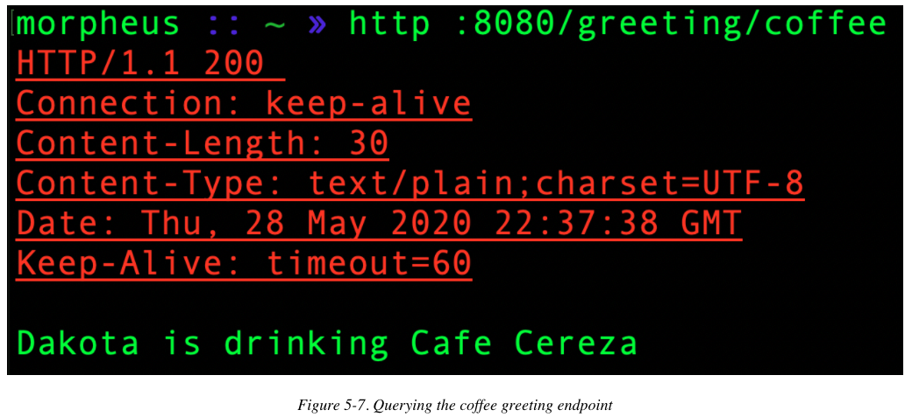
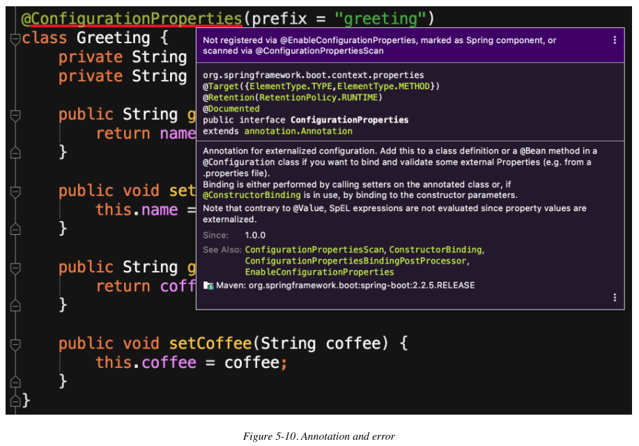
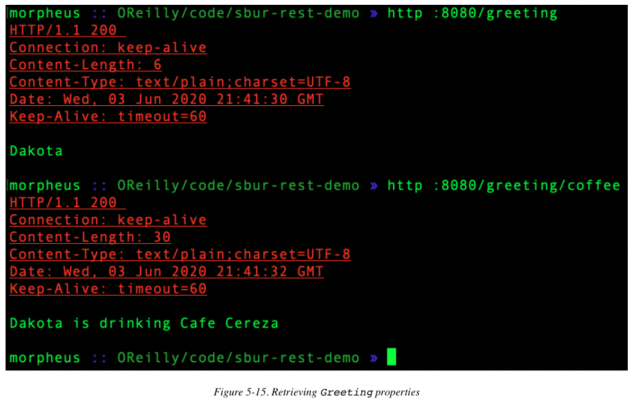

# 5. Configuración e Inspección de su Aplicación Spring Boot

* Configuración de la Aplicación
   * `@Value`
   * `@ConfigurationProperties`
   * Posible opción de "terceros"
* Informe de Configuración Automática(Autoconfiguration report)
* Actuador
   * Hacer que Actuador se abra
   * Ser más consciente del Environmentally Aware(medio ambiente) usando por Actuator
   * Turning Up the Volume on Logging with Actuator (Subir el volumen al iniciar sesión con el Actuador)
* Resumen

Hay muchas cosas que pueden salir mal con cualquier aplicación, y algunas de estas muchas cosas incluso pueden tener soluciones simples. Sin embargo, con la rara excepción de una buena suposición ocasional, uno debe determinar la causa raíz de un problema antes de que sea posible resolverlo realmente.

La depuración de aplicaciones Java o Kotlin, o cualquier otra aplicación, es una habilidad fundamental que todo desarrollador debe aprender muy temprano en su carrera y perfeccionar y expandir. No creo que ese sea el caso universalmente, así que si aún no se ha familiarizado con las capacidades de depuración de su lenguaje y las herramientas de su elección, explore las opciones a su disposición lo antes posible. Realmente es importante en todo lo que desarrolle y puede ahorrarle cantidades excesivas de tiempo.

Dicho esto, depurar el código es solo un nivel para establecer, identificar y aislar los comportamientos manifestados dentro de su aplicación. A medida que las aplicaciones se vuelven más dinámicas y distribuidas, los desarrolladores a menudo necesitan:

* Configurar y reconfigurar aplicaciones de forma dinámica
* Determinar/confirmar la configuración actual y sus orígenes
* Inspeccionar y monitorear el entorno de la aplicación y los indicadores de salud
* Ajuste temporalmente los niveles de registro de aplicaciones en vivo para identificar las causas raíz

En este capítulo, demostraré cómo usar las capacidades de configuración integradas de Spring Boot, su Informe de configuración automática y Spring Boot Actuator para crear, identificar y modificar la configuración del entorno de la aplicación de manera flexible y dinámica.

## Configuración de la Aplicación

Ninguna aplicación es una isla.

La mayoría de las veces, cuando digo eso, es para señalar la obviedad de que, en casi todos los casos, una aplicación no proporciona toda su utilidad sin interacción con otras aplicaciones/servicios. Pero hay otro significado que es igualmente cierto: ninguna aplicación puede ser tan útil sin acceso a su entorno, de una forma u otra. Una aplicación estática e inconfigurable es rígida, inflexible y cojea.

Las aplicaciones Spring Boot proporcionan una variedad de mecanismos poderosos para que los desarrolladores configuren y reconfiguren dinámicamente sus aplicaciones, incluso mientras la aplicación se está ejecutando. Estos mecanismos aprovechan el entorno Spring para administrar las propiedades de configuración de todas las fuentes, incluidas las siguientes:

* Propiedades de configuración global de Spring Boot Developer Tools (devtools) en el directorio `$HOME/.config/spring-boot` cuando devtools está activo

* `@TestPropertySource` anotaciones en pruebas

* Atributo `properties` en las pruebas; disponible en `@SpringBootTest` y las diversas anotaciones de prueba para probar un segmento de aplicación

* Argumentos de la línea de comandos

* Propiedades de `SPRING_APPLICATION_JSON` (JSON en línea incrustado en una variable de entorno o propiedad del sistema)

* Parámetros de inicio de `ServletConfig`

* Parámetros de inicio de `ServletContext`

* Atributos JNDI de ` java:comp/env`

* Propiedades del sistema Java (`System.getProperties()`)

* Variables de entorno del sistema operativo

* Un `RandomValuePropertySource` que tiene propiedades solo al azar. `*`

* Propiedades de la aplicación específicas del perfil fuera del jar empaquetado (`application-{profile}.properties` y variantes de YAML)

* Propiedades de la aplicación específicas del perfil empaquetadas dentro del jar (`application-{profile}.properties` y variantes de YAML)

* Propiedades de la aplicación fuera del jar empaquetado (`application.properties` y variantes de YAML)

* Propiedades de la aplicación empaquetadas dentro del jar (`application.properties` y variantes de YAML)

* Anotaciones `@PropertySource` en clases `@Configuration`; tenga en cuenta que dichas fuentes de propiedades no se agregan al entorno hasta que se actualice el contexto de la aplicación, lo cual es demasiado tarde para configurar ciertas propiedades leídas antes de que comience la actualización, como `logging.*` y `spring.main.*`

* Propiedades predeterminadas especificadas al establecer `SpringApplication.setDefaultProperties`

**NOTA**

Las fuentes de propiedades anteriores se enumeran en orden decreciente de precedencia: las propiedades de fuentes superiores en la lista reemplazan propiedades idénticas de fuentes inferiores. nota al pie: [Orden de precedencia para Spring Boot PropertySources](https://docs.spring.io/spring-boot/docs/current/reference/html/spring-boot-features.html#boot-features-external-config).

Todos estos pueden ser extremadamente útiles, pero elegiré algunos en particular para los escenarios de código de este capítulo:

* Argumentos de la línea de comandos
* Variables de entorno del sistema operativo
* Propiedades de la aplicación empaquetadas dentro del jar (`application.properties` y variantes YAML)

Comencemos con las propiedades definidas en el archivo `application.properties` de la aplicación y avancemos en la cadena alimentaria.

### `@Value`

La anotación `@Value` es quizás el enfoque más sencillo para incorporar los ajustes de configuración en su código. Construido alrededor de la coincidencia de patrones y el Spring Expression Language (SpEL), es simple y poderoso.

Comenzaré definiendo una propiedad única en el archivo application.properties de nuestra aplicación, como se muestra en la Figura 5-1.


Para mostrar cómo utilizar esta propiedad, creo un `@RestController` adicional dentro de la aplicación para manejar tareas relacionadas con los usuarios de la aplicación de saludo, como se muestra en la Figura 5-2.


Tenga en cuenta que la anotación `@Value` se aplica a la variable miembro de nombre y acepta un único parámetro de tipo `String` llamado `value`. Defino el valor usando SpEL, colocando el nombre de la variable (como la expresión a evaluar) entre los delimitadores `${` y `}`. Otra cosa a tener en cuenta: SpEL permite un valor predeterminado después de los dos puntos, en este ejemplo, "Mirage", para los casos en los que la variable no está definida en el entorno de la aplicación.

Al ejecutar la aplicación y consultar el endpoint `/greeting`, la aplicación responde con "Dakota" como se esperaba, como se muestra en la Figura 5-3.


Para verificar que se está evaluando el valor predeterminado, comento la siguiente línea en `application.properties` con un `#` como se muestra a continuación y reinicio la aplicación.

```html
#greeting-name=Dakota
```

La consulta del endpoint `greeting` ahora da como resultado la respuesta que se muestra en la Figura 5-4. Dado que `greeting-name` ya no está definido en ninguna fuente para el entorno de la aplicación, el valor predeterminado de "Mirage" se activa, como se esperaba.


El uso de `@Value` con propiedades propias proporciona otra capacidad útil: el valor de una propiedad se puede derivar/construir utilizando el valor de otra.

Para demostrar cómo funciona el anidamiento de propiedades, necesitaremos al menos dos propiedades. Creo una segunda propiedad `greeting-coffee` en `application.properties`, como en la Figura 5-5.


A continuación, agrego un poco de código a nuestro `GreetingController` para representar un saludo con coffee-fied y un endpoint al que podemos acceder para ver los resultados. Tenga en cuenta que también proporciono un valor predeterminado para el valor del `coffee`, según la Figura 5-6.


Para verificar el resultado correcto, reinicio la aplicación y consulto el nuevo endpoint `/greeting/coffee`, lo que da como resultado lo que se muestra en la Figura 5-7. Tenga en cuenta que, dado que ambas propiedades en cuestión están definidas en `application.properties`, los valores mostrados son coherentes con las definiciones de esos valores.



Como ocurre con todas las cosas en la vida y el desarrollo de software, `@Value` tiene algunas limitaciones. Dado que proporcionamos un valor predeterminado para la propiedad `greeting-coffee`, podemos comentar su definición en `application.properties` y la anotación `@Value` aún procesa correctamente su valor (predeterminado) utilizando la variable de miembro `coffee` dentro de `GreetingController`. Sin embargo, comentar tanto `greeting-name` y `greeting-coffee` en el archivo de propiedades da como resultado que ninguna `Environment` source (fuente de entorno) los defina, lo que da como resultado el error que se muestra en la Figura 5-8 cuando la aplicación intenta inicializar el bean `GreetingController` usando una referencia a (ahora indefinido) `greeting-name` dentro de `greeting-coffee`.


**NOTA**

Se eliminó el rastro de pila completo para mayor brevedad y claridad.

Otra limitación con las propiedades definidas en `application.properties` y utilizadas únicamente a través de `@Value`: el IDE no las reconoce como utilizadas por la aplicación, ya que solo se hace referencia a ellas en el código dentro de las variables `String` delimitadas por comillas; como tal, no existe un vínculo directo con el código. Por supuesto, los desarrolladores pueden verificar visualmente la ortografía correcta de los nombres y el uso de las propiedades, pero esto es completamente manual y, por lo tanto, más propenso a errores.

Como se puede imaginar, un mecanismo seguro de tipos y verificable por herramientas para el uso y la definición de propiedades sería una mejor opción general.

### `@ConfigurationProperties`

Apreciando la flexibilidad de `@Value` pero reconociendo sus deficiencias, el equipo de Spring creó `@ConfigurationProperties`. Con `@ConfigurationProperties`, un desarrollador puede definir propiedades, agrupar propiedades relacionadas y hacer referencia a ellas/usarlas de una manera segura y verificable con herramientas.

Por ejemplo, si una propiedad está definida en el archivo `application.properties` de una aplicación que no se usa en el código, el desarrollador verá el nombre resaltado para marcarlo como una propiedad no utilizada confirmada. De manera similar, si la propiedad se define como una cadena pero está asociada con una variable miembro de tipo diferente, el IDE señalará la falta de coincidencia de tipos. Estas son ayudas valiosas que detectan errores simples pero frecuentes.

Para demostrar cómo poner en funcionamiento `@ConfigurationProperties`, comenzaré por definir un POJO para encapsular las propiedades relacionadas deseadas: en este caso, nuestras propiedades `greeting-name` y `greeting-coffee` a las que se hizo referencia anteriormente. Como se muestra en la Figura 5-9, creo una clase de saludo para contener ambos.


Para registrar `Greeting` para administrar las propiedades de configuración, agrego la anotación `@ConfigurationProperties` que se muestra en la Figura 5-10 y especifico el prefijo que se usará para todas las propiedades del `Greeting`. Esta anotación solo prepara la clase para su uso con propiedades de configuración; También se debe indicar a la aplicación que procese las clases anotadas de tal manera para que las propiedades se incluyan en el entorno de la aplicación. Tenga en cuenta el útil mensaje de error que resulta.



Instruir a la aplicación para que procese las clases `@ConfigurationProperties` y agregue sus propiedades al entorno de la aplicación, en la mayoría de los casos, se logra mejor agregando la anotación `@ConfigurationPropertiesScan` a la clase principal de la aplicación, como se muestra en la Figura 5-11.


**NOTA**

Las excepciones a la regla de tener Boot scan para las clases `@ConfigurationProperties` son si necesita habilitar ciertas clases `@ConfigurationProperties` condicionalmente o si está creando su propia autoconfiguración. En todos los demás casos, sin embargo, `@ConfigurationPropertiesScan` debe usarse para buscar y habilitar las clases `@ConfigurationProperties` de manera similar al mecanismo de escaneo de componentes de Boot.

Para generar metadatos usando el procesador de anotaciones, permitiendo que el IDE conecte los puntos entre las clases `@ConfigurationProperties` y las propiedades relacionadas definidas en el archivo `application.properties`, agrego la siguiente dependencia al archivo de compilación `pom.xml` del proyecto:

```html
<dependency>
    <groupId>org.springframework.boot</groupId>
    <artifactId>spring-boot-configuration-processor</artifactId>
    <optional>true</optional>
</dependency>
```

**NOTA**

Esta dependencia también se puede seleccionar y agregar automáticamente desde Spring Initializr en el momento de la creación del proyecto.

Una vez que se agrega la dependencia del procesador de configuración al archivo de compilación, es necesario actualizar/volver a importar las dependencias y reconstruir el proyecto para aprovecharlas. Para reimportar departamentos, abro el menú Maven en IntelliJ y hago clic en el botón Reimportar en la parte superior izquierda, como se muestra en la Figura 5-12.


Una vez que se actualizan las dependencias, reconstruyo el proyecto desde el IDE para incorporar el procesador de configuración.

Ahora, para definir algunos valores para estas propiedades. Volviendo a `application.properties`, cuando comienzo a escribir el saludo, el IDE muestra de manera útil los nombres de las propiedades que coinciden, como se muestra en la Figura 5-13.


Para usar estas propiedades en lugar de las que estábamos usando antes, se requiere un poco de refactorización.

Puedo eliminar por completo el nombre de las variables miembro `name` y `coffee` de `GreetingController` junto con sus anotaciones `@Value`; en su lugar, creo un memvar para el bean `Greeting` que ahora administra las propiedades `greeting.name` y `greeting.coffee` y lo inyecto en `GreetingController` mediante la inyección del constructor, como se muestra en la Figura 5-14.


Al ejecutar la aplicación y consultar los endpoints `greeting` y `greeting/coffee`, se obtienen los resultados capturados en la Figura 5-15.



### Posible opción de "terceros"

## Informe de Configuración Automática(Autoconfiguration report)

## Actuador

### Hacer que Actuador se abra

### Ser más consciente del Environmentally Aware(medio ambiente) usando por Actuator

### Turning Up the Volume on Logging with Actuator (Subir el volumen al iniciar sesión con el Actuador)

## Resumen
