# 5. Configuración e Inspección de su Aplicación Spring Boot

* Configuración de la Aplicación
   * `@Value`
   * `@ConfigurationProperties`
   * Posible opción de "terceros"
* Informe de Configuración Automática(Autoconfiguration report)
* Actuador
   * Hacer que Actuador se abra
   * Ser más consciente del Environmentally Aware(medio ambiente) usando por Actuator
   * Turning Up the Volume on Logging with Actuator (Subir el volumen al iniciar sesión con el Actuador)
* Resumen

Hay muchas cosas que pueden salir mal con cualquier aplicación, y algunas de estas muchas cosas incluso pueden tener soluciones simples. Sin embargo, con la rara excepción de una buena suposición ocasional, uno debe determinar la causa raíz de un problema antes de que sea posible resolverlo realmente.

La depuración de aplicaciones Java o Kotlin, o cualquier otra aplicación, es una habilidad fundamental que todo desarrollador debe aprender muy temprano en su carrera y perfeccionar y expandir. No creo que ese sea el caso universalmente, así que si aún no se ha familiarizado con las capacidades de depuración de su lenguaje y las herramientas de su elección, explore las opciones a su disposición lo antes posible. Realmente es importante en todo lo que desarrolle y puede ahorrarle cantidades excesivas de tiempo.

Dicho esto, depurar el código es solo un nivel para establecer, identificar y aislar los comportamientos manifestados dentro de su aplicación. A medida que las aplicaciones se vuelven más dinámicas y distribuidas, los desarrolladores a menudo necesitan:

* Configurar y reconfigurar aplicaciones de forma dinámica
* Determinar/confirmar la configuración actual y sus orígenes
* Inspeccionar y monitorear el entorno de la aplicación y los indicadores de salud
* Ajuste temporalmente los niveles de registro de aplicaciones en vivo para identificar las causas raíz

En este capítulo, demostraré cómo usar las capacidades de configuración integradas de Spring Boot, su Informe de configuración automática y Spring Boot Actuator para crear, identificar y modificar la configuración del entorno de la aplicación de manera flexible y dinámica.

## Configuración de la Aplicación

Ninguna aplicación es una isla.

La mayoría de las veces, cuando digo eso, es para señalar la obviedad de que, en casi todos los casos, una aplicación no proporciona toda su utilidad sin interacción con otras aplicaciones/servicios. Pero hay otro significado que es igualmente cierto: ninguna aplicación puede ser tan útil sin acceso a su entorno, de una forma u otra. Una aplicación estática e inconfigurable es rígida, inflexible y cojea.

Las aplicaciones Spring Boot proporcionan una variedad de mecanismos poderosos para que los desarrolladores configuren y reconfiguren dinámicamente sus aplicaciones, incluso mientras la aplicación se está ejecutando. Estos mecanismos aprovechan el entorno Spring para administrar las propiedades de configuración de todas las fuentes, incluidas las siguientes:

* Propiedades de configuración global de Spring Boot Developer Tools (devtools) en el directorio `$HOME/.config/spring-boot` cuando devtools está activo

* `@TestPropertySource` anotaciones en pruebas

* Atributo `properties` en las pruebas; disponible en `@SpringBootTest` y las diversas anotaciones de prueba para probar un segmento de aplicación

* Argumentos de la línea de comandos

* Propiedades de `SPRING_APPLICATION_JSON` (JSON en línea incrustado en una variable de entorno o propiedad del sistema)

* Parámetros de inicio de `ServletConfig`

* Parámetros de inicio de `ServletContext`

* Atributos JNDI de ` java:comp/env`

* Propiedades del sistema Java (`System.getProperties()`)

* Variables de entorno del sistema operativo

* Un `RandomValuePropertySource` que tiene propiedades solo al azar. `*`

* Propiedades de la aplicación específicas del perfil fuera del jar empaquetado (`application-{profile}.properties` y variantes de YAML)

* Propiedades de la aplicación específicas del perfil empaquetadas dentro del jar (`application-{profile}.properties` y variantes de YAML)

* Propiedades de la aplicación fuera del jar empaquetado (`application.properties` y variantes de YAML)

* Propiedades de la aplicación empaquetadas dentro del jar (`application.properties` y variantes de YAML)

* Anotaciones `@PropertySource` en clases `@Configuration`; tenga en cuenta que dichas fuentes de propiedades no se agregan al entorno hasta que se actualice el contexto de la aplicación, lo cual es demasiado tarde para configurar ciertas propiedades leídas antes de que comience la actualización, como `logging.*` y `spring.main.*`

* Propiedades predeterminadas especificadas al establecer `SpringApplication.setDefaultProperties`

**NOTA**

Las fuentes de propiedades anteriores se enumeran en orden decreciente de precedencia: las propiedades de fuentes superiores en la lista reemplazan propiedades idénticas de fuentes inferiores. nota al pie: [Orden de precedencia para Spring Boot PropertySources](https://docs.spring.io/spring-boot/docs/current/reference/html/spring-boot-features.html#boot-features-external-config).

Todos estos pueden ser extremadamente útiles, pero elegiré algunos en particular para los escenarios de código de este capítulo:

* Argumentos de la línea de comandos
* Variables de entorno del sistema operativo
* Propiedades de la aplicación empaquetadas dentro del jar (`application.properties` y variantes YAML)

Comencemos con las propiedades definidas en el archivo `application.properties` de la aplicación y avancemos en la cadena alimentaria.

### `@Value`

La anotación `@Value` es quizás el enfoque más sencillo para incorporar los ajustes de configuración en su código. Construido alrededor de la coincidencia de patrones y el Spring Expression Language (SpEL), es simple y poderoso.

Comenzaré definiendo una propiedad única en el archivo application.properties de nuestra aplicación, como se muestra en la Figura 5-1.


Para mostrar cómo utilizar esta propiedad, creo un `@RestController` adicional dentro de la aplicación para manejar tareas relacionadas con los usuarios de la aplicación de saludo, como se muestra en la Figura 5-2.

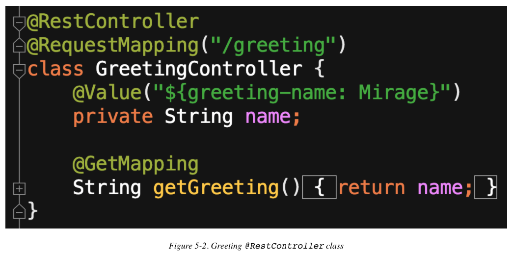

Tenga en cuenta que la anotación `@Value` se aplica a la variable miembro de nombre y acepta un único parámetro de tipo `String` llamado `value`. Defino el valor usando SpEL, colocando el nombre de la variable (como la expresión a evaluar) entre los delimitadores `${` y `}`. Otra cosa a tener en cuenta: SpEL permite un valor predeterminado después de los dos puntos, en este ejemplo, "Mirage", para los casos en los que la variable no está definida en el entorno de la aplicación.

Al ejecutar la aplicación y consultar el endpoint `/greeting`, la aplicación responde con "Dakota" como se esperaba, como se muestra en la Figura 5-3.


Para verificar que se está evaluando el valor predeterminado, comento la siguiente línea en `application.properties` con un `#` como se muestra a continuación y reinicio la aplicación.

```html
#greeting-name=Dakota
```

La consulta del endpoint `greeting` ahora da como resultado la respuesta que se muestra en la Figura 5-4. Dado que `greeting-name` ya no está definido en ninguna fuente para el entorno de la aplicación, el valor predeterminado de "Mirage" se activa, como se esperaba.

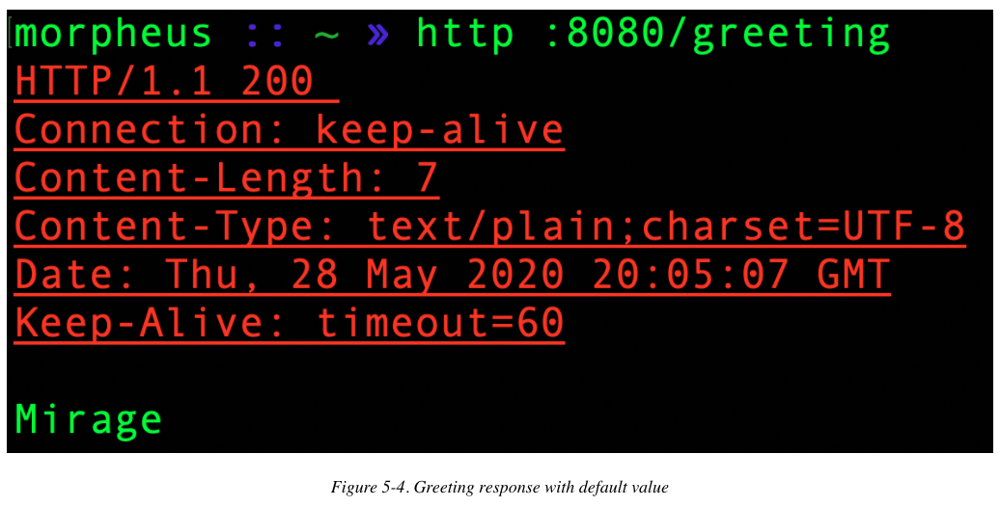

El uso de `@Value` con propiedades propias proporciona otra capacidad útil: el valor de una propiedad se puede derivar/construir utilizando el valor de otra.

Para demostrar cómo funciona el anidamiento de propiedades, necesitaremos al menos dos propiedades. Creo una segunda propiedad `greeting-coffee` en `application.properties`, como en la Figura 5-5.


A continuación, agrego un poco de código a nuestro `GreetingController` para representar un saludo con coffee-fied y un endpoint al que podemos acceder para ver los resultados. Tenga en cuenta que también proporciono un valor predeterminado para el valor del `coffee`, según la Figura 5-6.

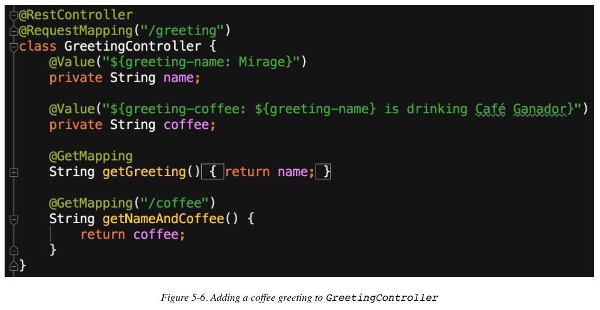

Para verificar el resultado correcto, reinicio la aplicación y consulto el nuevo endpoint `/greeting/coffee`, lo que da como resultado lo que se muestra en la Figura 5-7. Tenga en cuenta que, dado que ambas propiedades en cuestión están definidas en `application.properties`, los valores mostrados son coherentes con las definiciones de esos valores.


Como ocurre con todas las cosas en la vida y el desarrollo de software, `@Value` tiene algunas limitaciones. Dado que proporcionamos un valor predeterminado para la propiedad `greeting-coffee`, podemos comentar su definición en `application.properties` y la anotación `@Value` aún procesa correctamente su valor (predeterminado) utilizando la variable de miembro `coffee` dentro de `GreetingController`. Sin embargo, comentar tanto `greeting-name` y `greeting-coffee` en el archivo de propiedades da como resultado que ninguna `Environment` source (fuente de entorno) los defina, lo que da como resultado el error que se muestra en la Figura 5-8 cuando la aplicación intenta inicializar el bean `GreetingController` usando una referencia a (ahora indefinido) `greeting-name` dentro de `greeting-coffee`.


**NOTA**

Se eliminó el rastro de pila completo para mayor brevedad y claridad.

Otra limitación con las propiedades definidas en `application.properties` y utilizadas únicamente a través de `@Value`: el IDE no las reconoce como utilizadas por la aplicación, ya que solo se hace referencia a ellas en el código dentro de las variables `String` delimitadas por comillas; como tal, no existe un vínculo directo con el código. Por supuesto, los desarrolladores pueden verificar visualmente la ortografía correcta de los nombres y el uso de las propiedades, pero esto es completamente manual y, por lo tanto, más propenso a errores.

Como se puede imaginar, un mecanismo seguro de tipos y verificable por herramientas para el uso y la definición de propiedades sería una mejor opción general.

### `@ConfigurationProperties`

Apreciando la flexibilidad de `@Value` pero reconociendo sus deficiencias, el equipo de Spring creó `@ConfigurationProperties`. Con `@ConfigurationProperties`, un desarrollador puede definir propiedades, agrupar propiedades relacionadas y hacer referencia a ellas/usarlas de una manera segura y verificable con herramientas.

Por ejemplo, si una propiedad está definida en el archivo `application.properties` de una aplicación que no se usa en el código, el desarrollador verá el nombre resaltado para marcarlo como una propiedad no utilizada confirmada. De manera similar, si la propiedad se define como una cadena pero está asociada con una variable miembro de tipo diferente, el IDE señalará la falta de coincidencia de tipos. Estas son ayudas valiosas que detectan errores simples pero frecuentes.

Para demostrar cómo poner en funcionamiento `@ConfigurationProperties`, comenzaré por definir un POJO para encapsular las propiedades relacionadas deseadas: en este caso, nuestras propiedades `greeting-name` y `greeting-coffee` a las que se hizo referencia anteriormente. Como se muestra en la Figura 5-9, creo una clase de saludo para contener ambos.

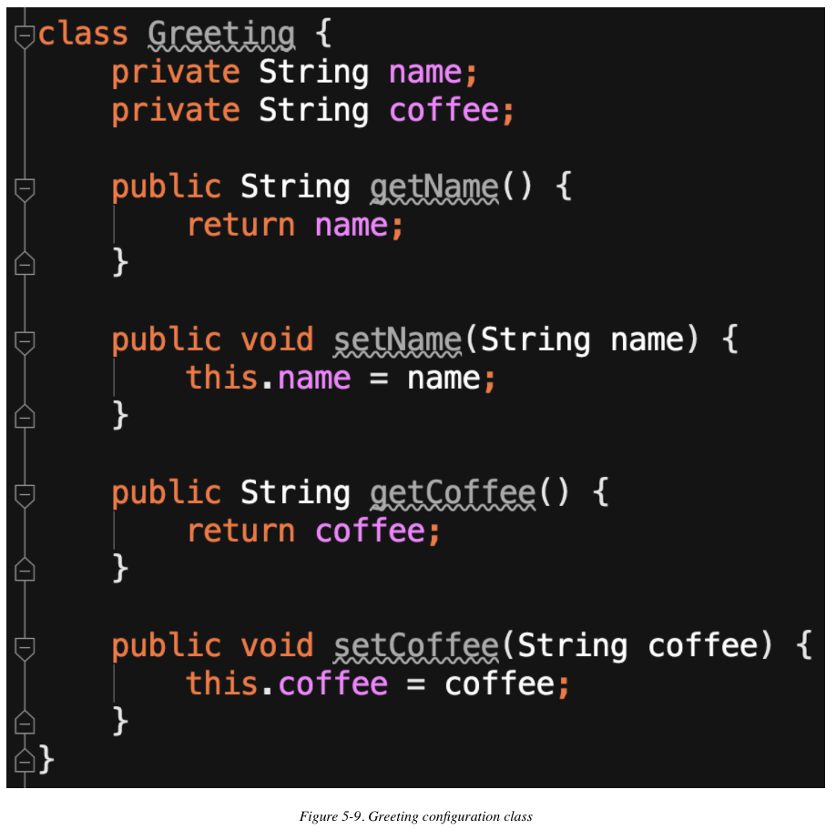

Para registrar `Greeting` para administrar las propiedades de configuración, agrego la anotación `@ConfigurationProperties` que se muestra en la Figura 5-10 y especifico el prefijo que se usará para todas las propiedades del `Greeting`. Esta anotación solo prepara la clase para su uso con propiedades de configuración; También se debe indicar a la aplicación que procese las clases anotadas de tal manera para que las propiedades se incluyan en el entorno de la aplicación. Tenga en cuenta el útil mensaje de error que resulta.


Instruir a la aplicación para que procese las clases `@ConfigurationProperties` y agregue sus propiedades al entorno de la aplicación, en la mayoría de los casos, se logra mejor agregando la anotación `@ConfigurationPropertiesScan` a la clase principal de la aplicación, como se muestra en la Figura 5-11.

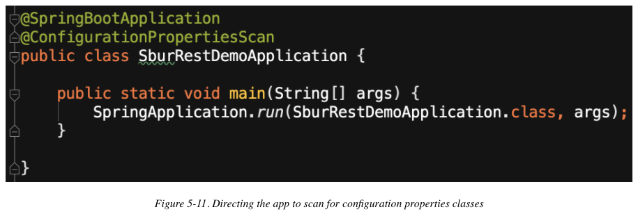

**NOTA**

Las excepciones a la regla de tener Boot scan para las clases `@ConfigurationProperties` son si necesita habilitar ciertas clases `@ConfigurationProperties` condicionalmente o si está creando su propia autoconfiguración. En todos los demás casos, sin embargo, `@ConfigurationPropertiesScan` debe usarse para buscar y habilitar las clases `@ConfigurationProperties` de manera similar al mecanismo de escaneo de componentes de Boot.

Para generar metadatos usando el procesador de anotaciones, permitiendo que el IDE conecte los puntos entre las clases `@ConfigurationProperties` y las propiedades relacionadas definidas en el archivo `application.properties`, agrego la siguiente dependencia al archivo de compilación `pom.xml` del proyecto:

```html
<dependency>
    <groupId>org.springframework.boot</groupId>
    <artifactId>spring-boot-configuration-processor</artifactId>
    <optional>true</optional>
</dependency>
```

**NOTA**

Esta dependencia también se puede seleccionar y agregar automáticamente desde Spring Initializr en el momento de la creación del proyecto.

Una vez que se agrega la dependencia del procesador de configuración al archivo de compilación, es necesario actualizar/volver a importar las dependencias y reconstruir el proyecto para aprovecharlas. Para reimportar departamentos, abro el menú Maven en IntelliJ y hago clic en el botón Reimportar en la parte superior izquierda, como se muestra en la Figura 5-12.

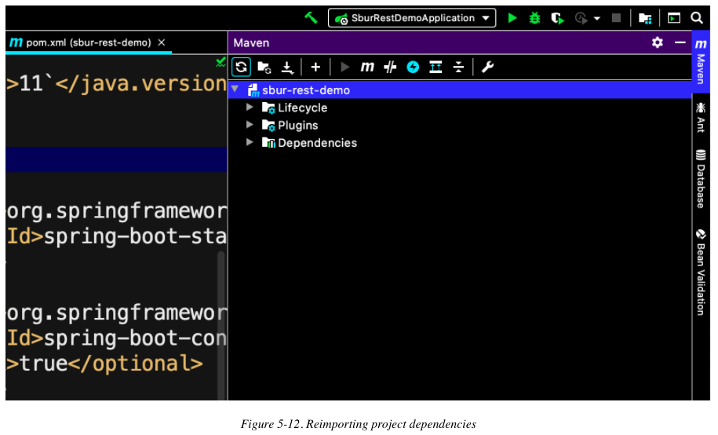

Una vez que se actualizan las dependencias, reconstruyo el proyecto desde el IDE para incorporar el procesador de configuración.

Ahora, para definir algunos valores para estas propiedades. Volviendo a `application.properties`, cuando comienzo a escribir el saludo, el IDE muestra de manera útil los nombres de las propiedades que coinciden, como se muestra en la Figura 5-13.


Para usar estas propiedades en lugar de las que estábamos usando antes, se requiere un poco de refactorización.

Puedo eliminar por completo el nombre de las variables miembro `name` y `coffee` de `GreetingController` junto con sus anotaciones `@Value`; en su lugar, creo un memvar para el bean `Greeting` que ahora administra las propiedades `greeting.name` y `greeting.coffee` y lo inyecto en `GreetingController` mediante la inyección del constructor, como se muestra en la Figura 5-14.

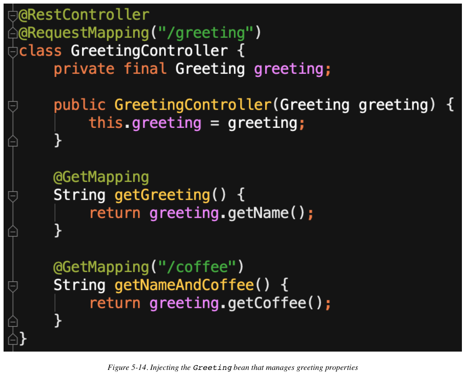

Al ejecutar la aplicación y consultar los endpoints `greeting` y `greeting/coffee`, se obtienen los resultados capturados en la Figura 5-15.


Las propiedades administradas por un bean `@ConfigurationProperties` aún obtienen sus valores del entorno y todas sus fuentes potenciales; lo único significativo que falta en comparación con las propiedades basadas en `@Value` es la capacidad de especificar un valor predeterminado en la variable miembro anotada. Eso es un sacrificio menor de lo que podría parecer a primera vista porque el archivo `application.properties` de la aplicación generalmente sirve como el lugar para definir valores predeterminados razonables para una aplicación. Si hay una necesidad de diferentes valores de propiedad para adaptarse a diferentes entornos de implementación, esos valores específicos del entorno se ingieren en el entorno de la aplicación a través de otras fuentes, p. Ej. variables de entorno o parámetros de la línea de comandos. En resumen, `@ConfigurationProperties` simplemente aplica la mejor práctica para los valores de propiedad predeterminados.

### Posible opción de "terceros"

Una extensión adicional de la ya impresionante utilidad de `@ConfigurationProperties` es la capacidad de "envolver" componentes de terceros e incorporar sus propiedades en el entorno de la aplicación. Para demostrar cómo, creo un POJO para simular un componente que podría incorporarse a la aplicación. Tenga en cuenta que en los casos de uso típicos en los que esta característica es más práctica, se agregaría una dependencia externa al proyecto y se consultaría la documentación del componente para determinar la clase a partir de la cual crear un bean Spring, en lugar de crear uno a mano como lo hago aquí.

En la Figura 5-16, creo el componente de terceros simulado llamado `Droid` con dos propiedades (`id` y `description`) y sus métodos asociados de accessor y mutator (acceso y mutador).

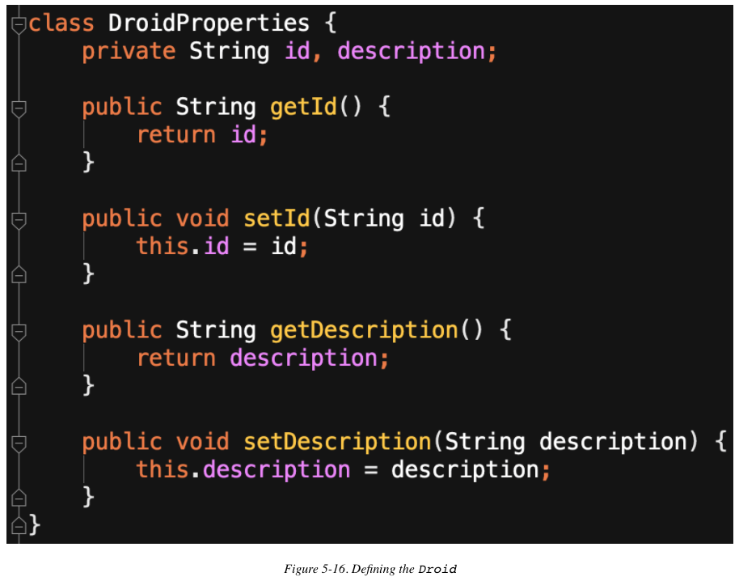

El siguiente paso se realiza de la misma manera que lo haría un verdadero componente de terceros: instanciar el componente como un bean Spring. Los Spring beans se pueden crear a partir de POJO definidos de varias maneras, pero la más apropiada para este caso de uso particular es crear un método anotado en `@Bean` dentro de una clase anotada con `@Configuration`, ya sea directamente o mediante una metaanotación.

Una meta-anotación que incorpora `@Configuration` dentro de su definición es `@SpringBootApplication`, que se encuentra en la clase de aplicación principal. Es por eso que los desarrolladores a menudo colocan los métodos de creación de beans allí.

**NOTA**

Dentro de IntelliJ y la mayoría de los IDE y editores de texto avanzados con soporte sólido de Spring, es posible profundizar en las meta-anotaciones de Spring para explorar las anotaciones anidadas dentro. En IntelliJ, Cmd + LeftMouseClick (en MacOS) expandirá la anotación. `@SpringBootApplication` incluye `@SpringBootConfiguration`, que incluye `@Configuration`, lo que hace solo dos grados de separación de Kevin Bacon.

En la Figura 5-17, demuestro el método de creación de beans y la anotación `@ConfigurationProperties` y el parámetro `prefix` necesarios, lo que indica que `DroidProperties` debe incorporarse dentro del `Environment` bajo el `droide` de agrupación de propiedades de nivel superior.

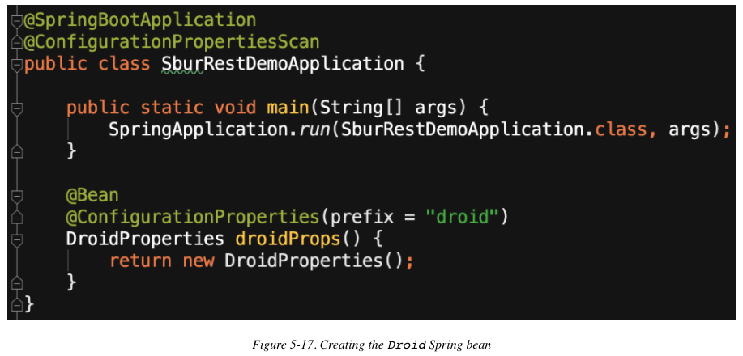

Como antes, es necesario reconstruir el proyecto para que el procesador de configuración detecte las propiedades expuestas por esta nueva fuente de propiedades de configuración. Después de ejecutar una compilación, podemos volver a `application.properties` y ver que ambas propiedades del droide han aparecido ahora completas con información de tipo, como se muestra en la Figura 5-18.


Asigno algunos valores predeterminados a `droid.id` y `droid.description` para usarlos como predeterminados, como se muestra en la Figura 5-19. Este es un buen hábito a adoptar para todas las propiedades del entorno, incluso las obtenidas de terceros.


Para verificar que todo funciona como se esperaba con las propiedades del `Droid`, creo un `@RestController` muy simple con un solo método `@GetMapping`, como se muestra en la Figura 5-20.

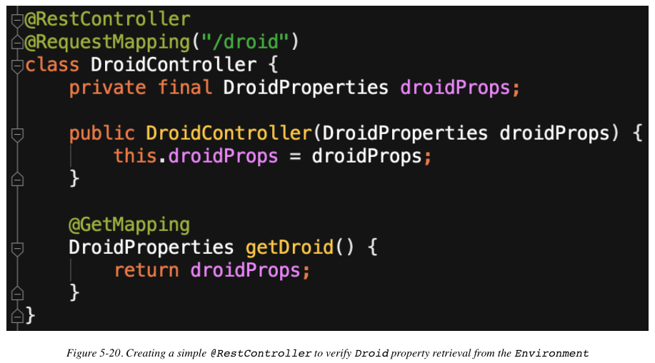

Después de construir y ejecutar el proyecto, consulto el nuevo endpoint `/droid` y confirmo la respuesta apropiada como se indica en la Figura 5-21.

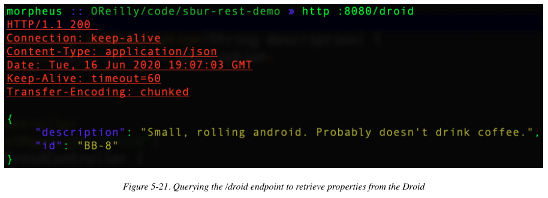

## Informe de Configuración Automática(Autoconfiguration report)

Como se mencionó anteriormente, Boot hace mucho en nombre de los desarrolladores a través de la configuración automática: configurar la aplicación con los beans que necesita para cumplir con las funcionalidades que son parte integrante de las capacidades, dependencias y código elegidos. También se mencionó anteriormente la capacidad de anular cualquier parte de la configuración automática necesaria para implementar la funcionalidad de una manera más específica (para su caso de uso). Pero, ¿cómo se puede ver qué beans se crean, qué beans no se crean y qué condiciones provocaron cualquiera de los resultados?

Es muy sencillo producir el informe de configuración automática utilizando el indicador de depuración de una de varias formas, debido a la flexibilidad de la JVM:

* Ejecutando el archivo jar de la aplicación con la opción `--debug`: `java -jar bootapplication.jar --debug`

* Ejecutando el archivo jar de la aplicación con un parámetro JVM: `java -Ddebug=true -jar bootapplication.jar`

* Añadiendo `debug=true` al archivo `application.properties` de su aplicación

* Ejecutando `export DEBUG=true` en su shell (Linux o Mac) o agregándolo a su entorno Windows, luego ejecute `java -jar bootapplication.jar`

**NOTA**

Cualquier forma de agregar un valor afirmativo para la depuración al entorno de la aplicación, como se discutió anteriormente, proporcionará los mismos resultados. Estas son solo opciones de uso más frecuente.

La sección del informe de configuración automática que enumera las coincidencias positivas (aquellas condiciones que se evaluaron como verdaderas y provocaron que se llevara a cabo una acción) se enumeran dentro de una sección encabezada por "Coincidencias positivas". He copiado el encabezado de la sección aquí, junto con un ejemplo de una coincidencia positiva y su acción de configuración automática resultante:


```sh
============================
CONDITIONS EVALUATION REPORT
============================

Positive matches:
-----------------
   DataSourceAutoConfiguration matched:
      - @ConditionalOnClass found required classes 'javax.sql.DataSource',
      'org.springframework.jdbc.datasource.embedded.EmbeddedDatabaseType'
      (OnClassCondition)
```

Este match en particular demuestra lo que esperábamos que sucediera, aunque siempre es bueno confirmarlo:

* JPA y H2 son dependencias de la aplicación
* JPA trabaja con fuentes de datos SQL
* H2 es una base de datos integrada
* Se encontraron clases que admiten fuentes de datos SQL incrustadas

Como resultado, se invoca `DataSourceAutoConfiguration`.

De manera similar, la sección "Coincidencias negativas" muestra las acciones no realizadas por la configuración automática de Spring Boot y por qué, como se ilustra a continuación:

```sh
Negative matches:
-----------------

   ActiveMQAutoConfiguration:
      Did not match:
         - @ConditionalOnClass did not find required class 'javax.jms.ConnectionFactory'
         (OnClassCondition)
```

En este caso, `ActiveMQAutoConfiguration` no se realizó porque la aplicación no encontró la clase JMS `ConnectionFactory` al iniciar.

Otro dato útil es la sección que enumera las "clases incondicionales", que se crean sin tener que satisfacer ninguna condición. A continuación, enumero uno que es de particular interés dada la sección anterior:

```sh
Unconditional classes:
----------------------

    org.springframework.boot.autoconfigure.context.ConfigurationPropertiesAutoConfiguration
```

Como puede ver, `ConfigurationPropertiesAutoConfiguration` siempre se crea una instancia para administrar cualquier `ConfigurationProperties` creada y referenciada dentro de una aplicación Spring Boot; es parte integral de todas las aplicaciones Spring Boot.

## Actuador

* *Actuador*
   1. Uno que actúa
   específicamente: un dispositivo mecánico para mover o controlar algo

La versión original de Spring Boot Actuator alcanzó la disponibilidad general (GA) en 2014 y fue aclamada por proporcionar información valiosa sobre las aplicaciones de arranque de producción. Al proporcionar capacidades de monitoreo y administración de aplicaciones en ejecución a través de puntos finales HTTP o Java Management Extensions (JMX), Actuator abarca y expone todas las funciones listas para producción de Spring Boot.

Completamente rediseñado con la versión 2.0 de Spring Boot, Actuator ahora aprovecha la biblioteca de instrumentación Micrometer para proporcionar métricas a través de una fachada consistente de numerosos sistemas de monitoreo líderes, similar a cómo opera SLF4J con respecto a varios mecanismos de registro. Esto amplía drásticamente el alcance de las cosas que se pueden integrar, monitorear y exponer a través de Actuator dentro de cualquier aplicación Spring Boot.

Para comenzar con Actuator, agrego otra dependencia a la sección de dependencias `pom.xml` del proyecto actual. Como se muestra en el siguiente fragmento, la dependencia `spring-boot-starter-actuator` proporciona las capacidades necesarias; para hacerlo, trae consigo tanto el Actuador como el Micrómetro, junto con capacidades de autoconfiguración para deslizarse en su lugar dentro de una aplicación Spring Boot con casi ningún esfuerzo.

```html
<dependencies>

    ... (other dependencies omitted for brevity)

    <dependency>
        <groupId>org.springframework.boot</groupId>
        <artifactId>spring-boot-starter-actuator</artifactId>
    </dependency>
</dependencies>
```

Después de actualizar/volver a importar las dependencias una vez más, vuelvo a ejecutar la aplicación. Con la aplicación en ejecución, podemos ver qué información expone Actuator de forma predeterminada al acceder a su endpoint principal. Nuevamente, utilizo HTTPie para lograr esto, como se muestra en la Figura 5-22.


**NOTA**

Toda la información del actuador se agrupa en el endpoint `/actuator` de la aplicación de forma predeterminada, pero esto también se puede configurar.

Esto no parece mucha información para la fanfarria (y la base de fans) que ha provocado Actuator. Pero esta concisión es intencionada.

Actuator tiene acceso y puede exponer una gran cantidad de información sobre aplicaciones en ejecución. Esta información puede ser increíblemente útil para los desarrolladores, el personal operativo y también para las personas nefastas que puedan desear amenazar la seguridad de su aplicación. Siguiendo el objetivo de facto de Spring Security de "seguro por defecto", la autoconfiguración de Actuator expone respuestas de *información-info- y *salud-health* muy limitadas (de hecho, la información predeterminada es un conjunto vacío) que proporcionan un latido de la aplicación y poco más fuera de la caja (OOTB).

Como con la mayoría de las cosas Spring, puede crear algunos mecanismos bastante sofisticados para controlar el acceso a varias fuentes de datos de Actuator, pero también hay opciones rápidas, consistentes y de baja fricción disponibles. Echemos un vistazo a esos ahora.

Es posible configurar fácilmente Actuator a través de propiedades con un conjunto de endpoints incluidos o un conjunto de endpoints excluidos. En aras de la simplicidad, elijo la ruta de inclusión y agrego lo siguiente a `application.properties`:

```html
management.endpoints.web.exposure.include=env, info, health
```

En este ejemplo, ordeno a la aplicación (y Actuator) que expongan solo los endpoints `/actuator/env`, `/actuator/info` y `/actuator/health` (y cualquier punto final subordinado). La Figura 5-23 confirma el resultado esperado al volver a ejecutar la aplicación y consultar su endpoint `/actuator`.

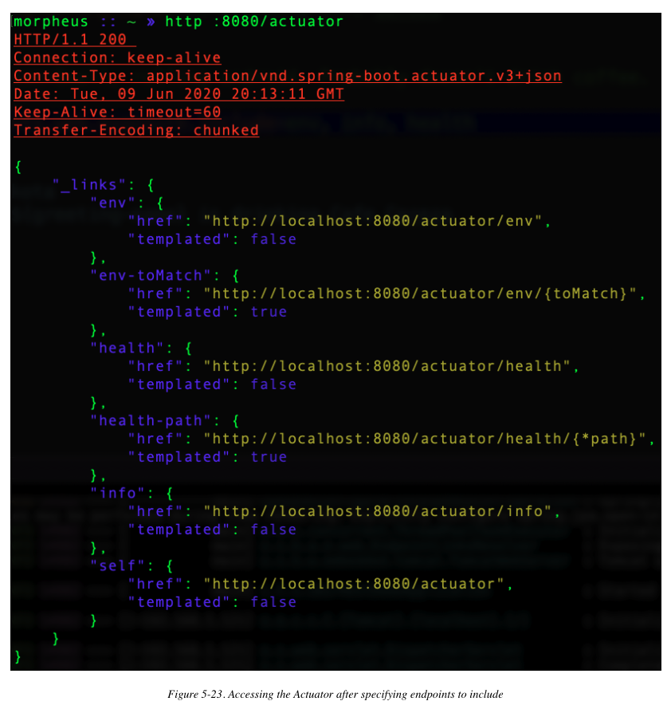

Para demostrar completamente las capacidades OOTB de Actuator, puedo ir un paso más allá y deshabilitar la seguridad por completo solo con fines de demostración mediante el uso de un comodín con la configuración application.properties mencionada anteriormente:

```html
management.endpoints.web.exposure.include=*
```
**DANGER WILL ROBINSON**

Este punto es imposible de exagerar: los mecanismos de seguridad para datos sensibles solo deben desactivarse con fines de demostración o verificación. **NUNCA DESHABILITE LA SEGURIDAD PARA APLICACIONES DE PRODUCCIÓN**.

Para la verificación al iniciar la aplicación, Actuator informa debidamente la cantidad de puntos finales que está exponiendo actualmente y la ruta raíz para llegar a ellos, en este caso, el valor predeterminado de `/actuator`, como se muestra en la Figura 5-24. Este es un recordatorio/advertencia útil para proporcionar una verificación visual rápida de que no se exponen más endpoints de los deseados antes de avanzar la aplicación a una implementación de destino.


Para examinar todas las asignaciones actualmente accesibles a través de Actuator, simplemente consulte la ruta raíz proporcionada del Actuator para obtener una lista completa.

```sh
morpheus :: ~ » http :8080/actuator
HTTP/1.1 200
Connection: keep-alive
Content-Type: application/vnd.spring-boot.actuator.v3+json
Date: Tue, 09 Jun 2020 20:31:30 GMT
Keep-Alive: timeout=60
Transfer-Encoding: chunked

{
    "_links": {
        "beans": {
            "href": "http://localhost:8080/actuator/beans",
            "templated": false
        },
        "caches": {
            "href": "http://localhost:8080/actuator/caches",
            "templated": false
        },
        "caches-cache": {
            "href": "http://localhost:8080/actuator/caches/{cache}",
            "templated": true
        },
        "conditions": {
            "href": "http://localhost:8080/actuator/conditions",
            "templated": false
        },
        "configprops": {
            "href": "http://localhost:8080/actuator/configprops",
            "templated": false
        },
        "env": {
            "href": "http://localhost:8080/actuator/env",
            "templated": false
        },
        "env-toMatch": {
            "href": "http://localhost:8080/actuator/env/{toMatch}",
            "templated": true
        },
        "health": {
            "href": "http://localhost:8080/actuator/health",
            "templated": false
        },
        "health-path": {
            "href": "http://localhost:8080/actuator/health/{*path}",
            "templated": true
        },
        "heapdump": {
            "href": "http://localhost:8080/actuator/heapdump",
            "templated": false
        },
        "info": {
            "href": "http://localhost:8080/actuator/info",
            "templated": false
        },
        "loggers": {
            "href": "http://localhost:8080/actuator/loggers",
            "templated": false
        },
        "loggers-name": {
            "href": "http://localhost:8080/actuator/loggers/{name}",
            "templated": true
        },
        "mappings": {
            "href": "http://localhost:8080/actuator/mappings",
            "templated": false
        },
        "metrics": {
            "href": "http://localhost:8080/actuator/metrics",
            "templated": false
        },
        "metrics-requiredMetricName": {
            "href": "http://localhost:8080/actuator/metrics/{requiredMetricName}",
            "templated": true
        },
        "scheduledtasks": {
            "href": "http://localhost:8080/actuator/scheduledtasks",
            "templated": false
        },
        "self": {
            "href": "http://localhost:8080/actuator",
            "templated": false
        },
        "threaddump": {
            "href": "http://localhost:8080/actuator/threaddump",
            "templated": false
        }
    }
}
```

La lista de puntos finales de Actuator proporciona una buena idea del alcance de la información capturada y expuesta para su examen, pero de particular utilidad para los actores buenos y malos son:

* `/actuator/beans` - todos los Spring beans creados por la aplicación

* `/actuator/conditions` - condiciones que se cumplen (o no) para crear Spring beans; similar al Informe de evaluación de condiciones discutido anteriormente

* `/actuator/configprops` - todas las propiedades del entorno a las que puede acceder la aplicación

* `/actuator/env` - una miríada de aspectos del entorno en el que funciona la aplicación; especialmente útil para ver dónde se origina cada valor de configprop individual

* `/actuator/health` - información de salud(health) (básica o ampliada, según la configuración)

* `/actuator/heapdump` - inicia el volcado de pila para la resolución de problemas y/o análisis

* `/actuator/loggers` - niveles de registro(logging) para cada componente

* `/actuator/mappings` - todos las asignaciones de endpoint y detalles de apoyo 

* `/actuator/metrics` - métricas que la aplicación captura actualmente

* `/actuator/threaddump` - inicia el volcado de hilo para la resolución de problemas y/o análisis

Estos, y todos los endpoints de Actuator preconfigurados restantes, son útiles cuando se necesitan y de fácil acceso para su examen. Sin embargo, al continuar centrándose en el entorno de la aplicación, incluso entre estos endpoints hay los primeros entre los pares. 

### Hacer que Actuador se abra

Como se mencionó, la postura de seguridad predeterminada de Actuator expone intencionalmente solo respuestas de *health* e *info* muy limitadas. De hecho, el endpoint `/actuator/health` proporciona un estado de aplicación bastante utilitario "UP" o "DOWN" listo para usar.

Sin embargo, con la mayoría de las aplicaciones, existen dependencias para las que Actuator rastrea la información de health; simplemente no expone esa información adicional a menos que esté autorizado para hacerlo. Para mostrar información de health ampliada para dependencias preconfiguradas, agrego la siguiente propiedad a application.properties:

```html
management.endpoint.health.show-details=always
```

**NOTA**

Hay tres valores posibles para la propiedad `show-details` del indicador health: `never` (predeterminado), `when_authorized` y `always`. Para este ejemplo, elijo siempre simplemente demostrar lo posible, pero para cada aplicación que se ponga en producción, las opciones correctas serían `never` o `when_authorized` para limitar la visibilidad de la información de salud ampliada de la aplicación.

Al reiniciar la aplicación, se agrega información sobre el estado de los componentes primarios de la aplicación al resumen general del estado de la aplicación al acceder al endpoint `/actuator/health`, según la Figura 5-25.

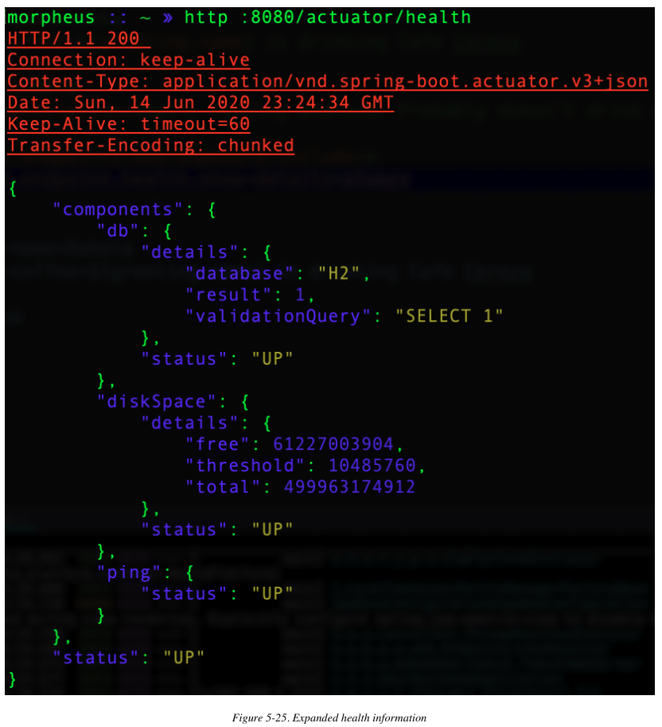

### Ser más consciente del Environmentally Aware(medio ambiente) usando por Actuator

Una enfermedad que a menudo afecta a los desarrolladores, incluida la empresa actual, es la suposición de un conocimiento completo del entorno/estado actual de la aplicación cuando el comportamiento no coincide con las expectativas. Esto no es del todo inesperado, especialmente si uno mismo escribió el código anómalo. Un primer paso relativamente rápido e invaluable es verificar todos los supuestos. ¿Sabes cuál es ese valor? ¿O estás realmente seguro de que lo sabes?

¿Te fijaste?

Especialmente en el código en el que los resultados son impulsados por entradas, este debería ser un punto de partida obligatorio. Actuator ayuda a que esto sea indoloro. Consultar el endpoint `/actuator/env` de la aplicación devuelve toda la información ambiental(environmental); a continuación se muestra la parte de ese resultado que muestra solo las propiedades establecidas en la aplicación hasta este momento.

```sh
{
    "name": "applicationConfig: [classpath:/application.properties]",
    "properties": {
        "droid.description": {
            "origin": "class path resource [application.properties]:5:22",
            "value": "Small, rolling android. Probably doesn't drink coffee."
        },
        "droid.id": {
            "origin": "class path resource [application.properties]:4:13",
            "value": "BB-8"
        },
        "greeting.coffee": {
            "origin": "class path resource [application.properties]:2:17",
            "value": "Dakota is drinking Cafe Cereza"
        },
        "greeting.name": {
            "origin": "class path resource [application.properties]:1:15",
            "value": "Dakota"
        },
        "management.endpoint.health.show-details": {
            "origin": "class path resource [application.properties]:8:41",
            "value": "always"
        },
        "management.endpoints.web.exposure.include": {
            "origin": "class path resource [application.properties]:7:43",
            "value": "*"
        }
    }
}
```

Actuator muestra no solo el valor actual para cada propiedad definida, sino también su fuente, hasta el número de línea y columna donde se define cada valor. Pero, ¿qué sucede si uno o más de esos valores son anulados por otra fuente, p. Ej. una variable de entorno externa o un argumento de línea de comando al ejecutar la aplicación?

Para demostrar un escenario típico de una aplicación vinculada a la producción, ejecuto el paquete mvn clean desde el directorio de la aplicación en la línea de comando, luego ejecuto la aplicación con el siguiente comando:

```sh
java -jar target/sbur-rest-demo-0.0.1-SNAPSHOT.jar --greeting.name=Sertanejo
```

Consultando `/actuator/env` una vez más, observamos que hay una nueva sección para argumentos de línea de comando con una sola entrada para `greeting.name`.

```sh
{
    "name": "commandLineArgs",
    "properties": {
        "greeting.name": {
            "value": "Sertanejo"
        }
    }
}
```

Siguiendo el orden de precedencia para las entradas del `Environment` al que se hizo referencia anteriormente, los argumentos de la línea de comandos deben anular el valor establecido desde `application.properties`. Al consultar el endpoint `/greeting` devuelve "Sertanejo" como se esperaba; consultar `/greeting/coffee` también da como resultado que el valor anulado se incorpore en esa respuesta a través de la expresión SpEL: “Sertanejo is drinking Cafe Cereza”.

Tratar de llegar al fondo del comportamiento errante basado en datos se ha vuelto mucho más simple gracias a Spring Boot Actuator.

### Turning Up the Volume on Logging with Actuator (Subir el volumen al iniciar sesión con el Actuador)

Como muchas otras opciones en el desarrollo y la implementación de software, la elección de los niveles de registro para las aplicaciones de producción implica compensaciones. Optar por más registros da como resultado más trabajo a nivel del sistema y consumo de almacenamiento y la captura de datos más relevantes e irrelevantes. Esto, a su vez, puede hacer que sea más difícil encontrar un tema difícil de alcanzar, como el proverbial "aguja en un pajar".

Como parte de su misión de proporcionar las funciones listas para producción de Boot, Actuator también aborda esto, permitiendo a los desarrolladores establecer un nivel de registro típico como "INFO" para la mayoría o todos los componentes y cambiar ese nivel temporalmente cuando surge un problema crítico ... todo en vivo. , aplicaciones de Spring Boot de producción. El actuador facilita la configuración y el restablecimiento de los niveles de registro con una simple POST al punto final correspondiente. Por ejemplo, la Figura 5-26 muestra el nivel de registro predeterminado para `org.springframework.data.web`.

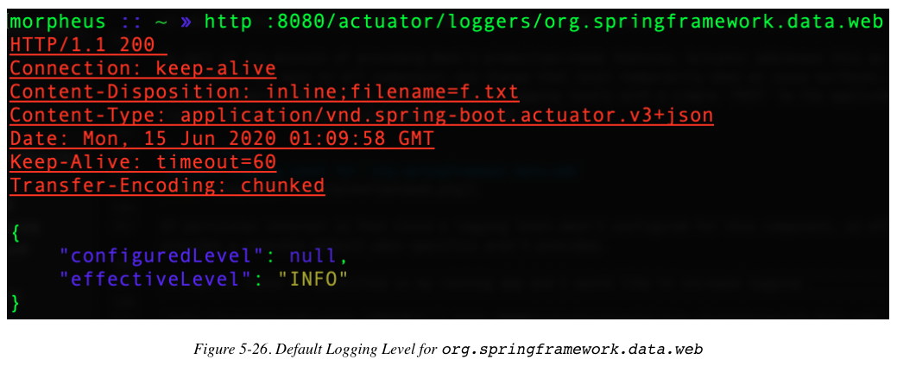

De particular interés es que, dado que no se configuró un nivel de registro para este componente, se utiliza un nivel efectivo de "INFO". Nuevamente, Spring Boot proporciona un valor predeterminado sensato cuando no se proporcionan detalles.

Si me notifican de un problema con una aplicación en ejecución y me gustaría aumentar el registro para ayudar a diagnosticarlo y resolverlo, todo lo que se necesita para hacerlo para un componente en particular es POST un nuevo valor con formato JSON para `configurationLevel` en su endpoint `/actuator/loggers`, como se muestra aquí:

```sh
echo '{"configuredLevel": "TRACE"}' | http :8080/actuator/loggers/org.springframework.data.web
```

Solicitar el nivel de registro ahora devuelve la confirmación de que el registrador para `org.springframework.data.web` ahora está configurado en "TRACE" y proporcionará un registro de diagnóstico intensivo para la aplicación, como se muestra en la Figura 5-27.

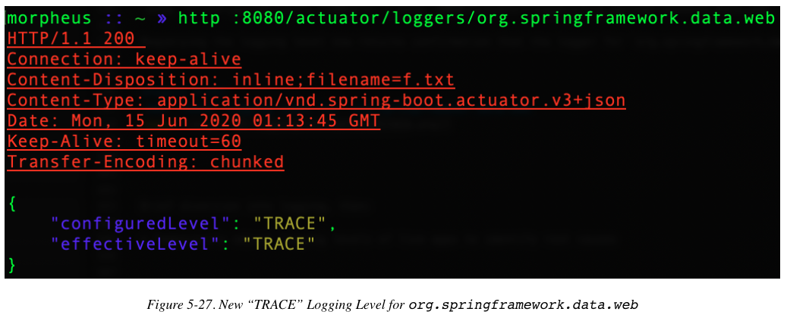

**ADVERTENCIA(WARNING)**

"TRACE" puede ser esencial para identificar un problema difícil de alcanzar, pero es un nivel de registro bastante pesado, que captura información aún más detallada que "DEBUG". El uso en aplicaciones de producción puede proporcionar información esencial, pero tenga en cuenta el impacto.

## Resumen

Es fundamental que un desarrollador tenga herramientas útiles para establecer, identificar y aislar los comportamientos manifestados en las aplicaciones de producción. A medida que las aplicaciones se vuelven más dinámicas y distribuidas, a menudo es necesario:

* Configurar y reconfigurar aplicaciones de forma dinámica

* Determinar/confirmar la configuración actual y sus orígenes

* Inspeccionar y monitorear el entorno de la aplicación y los indicadores de salud

* Ajuste temporalmente los niveles de registro de aplicaciones en vivo para identificar las causas raíz

Este capítulo demostró cómo usar las capacidades de configuración integradas de Spring Boot, su Informe de configuración automática y Spring Boot Actuator para crear, identificar y modificar la configuración del entorno de la aplicación de manera flexible y dinámica.

En el próximo capítulo, profundizaré en los datos: cómo definir su almacenamiento y recuperación utilizando varios estándares de la industria y motores de base de datos líderes y los proyectos e instalaciones de Spring Data que permiten su uso de la manera más eficiente y poderosa posible.


