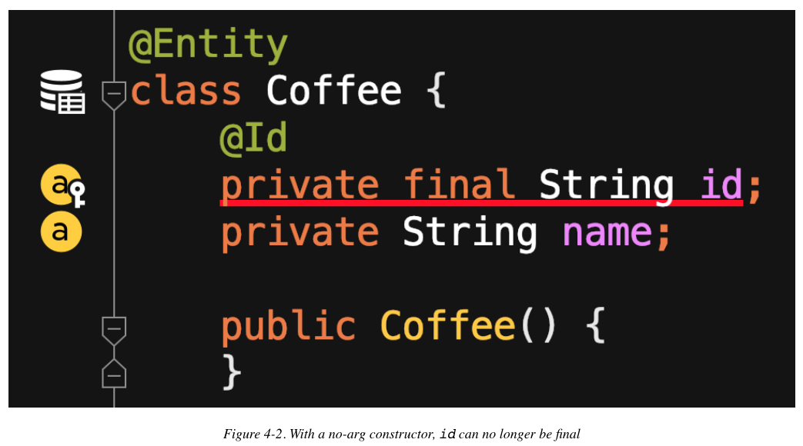
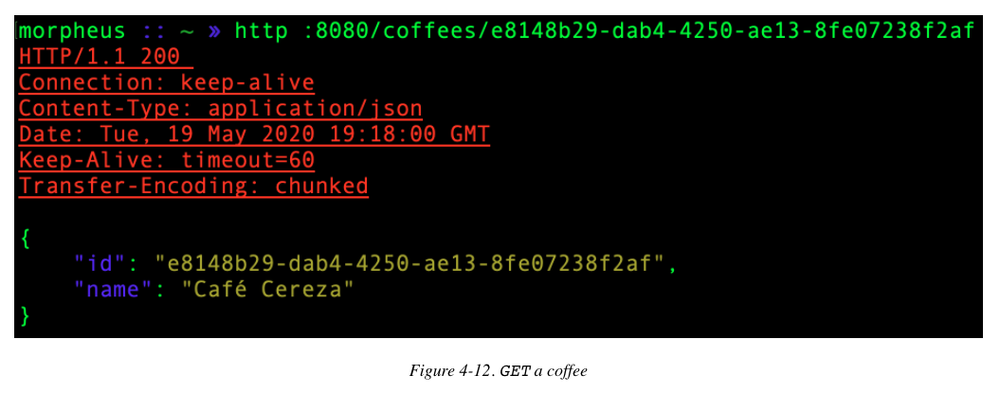

# 4. Agregar Acceso a  Base de Datos a su Aplicación Spring Boot

Como se discutió en el capítulo anterior, las aplicaciones a menudo exponen API sin estado por muy buenas razones. Sin embargo, entre bastidores, muy pocas aplicaciones útiles son completamente efímeras; El estado de algún tipo generalmente se almacena para algo. Por ejemplo, cada solicitud al carrito de compras de una tienda en línea puede incluir su estado, pero una vez que se realiza el pedido, se conservan los datos de ese pedido. Hay muchas formas de hacer esto y muchas formas de compartir o enrutar estos datos, pero invariablemente hay una o más bases de datos involucradas en casi todos los sistemas de tamaño suficiente.

En este capítulo, demostraré cómo agregar acceso a la base de datos a la aplicación Spring Boot creada en el último capítulo. Este capítulo está destinado a ser una breve introducción a las capacidades de datos de Spring Boot, y los capítulos siguientes profundizarán mucho más. Pero en muchos casos, los conceptos básicos que se tratan a continuación aún se aplican bien y brindan una solución completamente suficiente. Vamos a profundizar en.

## Preparación Autoconfig para el Acceso a la Base de Datos

Como se demostró anteriormente, Spring Boot tiene como objetivo simplificar en la mayor medida posible el llamado caso de uso del 80-90%: los patrones de código y proceso que los desarrolladores hacen una y otra vez. Una vez que se identifican los patrones, Spring Boot entra en acción (!) para inicializar los beans requeridos automáticamente, con configuraciones predeterminadas sensibles. Personalizar una capacidad es tan simple como proporcionar uno o más valores de propiedad o crear una versión personalizada de uno o más beans; una vez que autoconfig detecta los cambios, retrocede y sigue las instrucciones del desarrollador. El acceso a la base de datos es un ejemplo perfecto.

## ¿Qué esperamos ganar?

En nuestra aplicación de ejemplo anterior, usé un `ArrayList` para almacenar y mantener nuestra lista de cafés. Este enfoque es lo suficientemente sencillo para una sola aplicación, pero tiene sus inconvenientes.

En primer lugar, no es resiliente en absoluto. Si su aplicación o la plataforma que la ejecuta falla, todos los cambios realizados en la lista mientras la aplicación se estaba ejecutando, ya sea por segundos o meses, desaparecen.

En segundo lugar, no escala. Iniciar otra instancia de la aplicación da como resultado que la segunda instancia (o posterior) de la aplicación tenga su propia lista distinta de cafés que mantiene. Los datos no se comparten entre las múltiples instancias, por lo que los cambios en los cafés hechos por una instancia (cafés nuevos, eliminaciones, actualizaciones) no son visibles para cualquiera que acceda a una instancia de aplicación diferente.

Claramente, esta no es una forma de hacer funcionar un ferrocarril.

Cubriré algunas formas diferentes de resolver completamente estos problemas tan reales en los próximos capítulos. Pero por ahora, establezcamos algunas bases que servirán como pasos útiles en el camino hacia allí.

#### Agregar una Dependencia a Base de Datos

Para acceder a una base de datos desde su aplicación Spring Boot, necesita algunas cosas:

* Una base de datos en ejecución, ya sea iniciada por/incrustada dentro de su aplicación o simplemente accesible a su aplicación

* Controladores de base de datos que permiten el acceso mediante programación, generalmente proporcionados por el proveedor de la base de datos

* Un módulo Spring Data para acceder a la base de datos de destino

Ciertos módulos de Spring Data incluyen los controladores de base de datos apropiados como una única dependencia seleccionable desde dentro de Spring Initializr. En otros casos, como cuando Spring usa la API de persistencia de Java (JPA) para acceder a almacenes de datos compatibles con JPA, es necesario elegir la dependencia de Spring Data JPA y una dependencia para el controlador específico de la base de datos de destino, p. PostgreSQL.

Para dar el primer paso desde las construcciones de memoria a la base de datos persistente, comenzaré agregando dependencias y, por lo tanto, capacidades al archivo de compilación de nuestro proyecto.

H2 es una base de datos rápida escrita completamente en Java que tiene algunas características interesantes y útiles. Por un lado, es compatible con JPA, por lo que podemos conectar nuestra aplicación a él de la misma manera que lo haríamos con cualquier otra base de datos JPA como Microsoft SQL, MySQL, Oracle o PostgreSQL. También tiene modos en memoria y basados en disco. Esto nos permite algunas opciones útiles después de convertir de nuestra `ArrayList` en memoria a una base de datos en memoria: podemos cambiar H2 a persistencia basada en disco o, dado que ahora estamos usando una base de datos JPA, cambiar a una base de datos JPA diferente . Cualquiera de las opciones se vuelve mucho más simple en ese momento.

Para permitir que nuestra aplicación interactúe con la base de datos H2, agregaré las siguientes dos dependencias a la sección `<dependencies>` del `pom.xml` de nuestro proyecto:

```html
<dependency>
    <groupId>org.springframework.boot</groupId>
    <artifactId>spring-boot-starter-data-jpa</artifactId>
</dependency>
<dependency>
    <groupId>com.h2database</groupId>
    <artifactId>h2</artifactId>
    <scope>runtime</scope>
</dependency>
```


### Agregar una dependencia de base de datos

### Agregar código

## Guardar y recuperar datos

## Un poco de pulido

## Resumen








